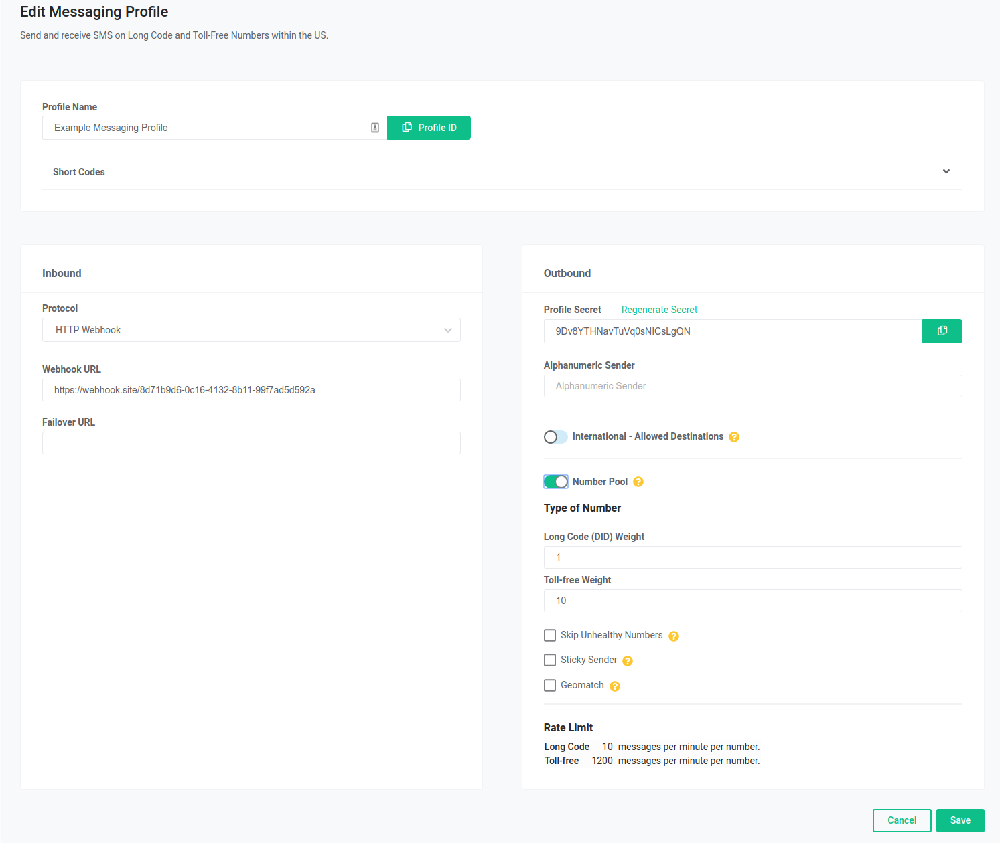

Number Pooling | Telnyx Help Center

[Skip to main content](#main-content)

# Number Pooling

A description of the Number Pooling feature with Telnyx messaging services along with how to enable and use it.

Written by Dillin

June 6, 2024

Table of contents

# What is Number Pooling?

Number Pooling allows the automatic selection of the originating numbers in a message request from a pool of all numbers assigned to a given messaging profile.

Number pooling maintains a balance across all numbers associated with a messaging profile to ensure high deliverability with all carriers.

This particular feature helps maintain the health of numbers when being sent to their destination by the respective carriers. These days a lot of vendors have put stricter regulations on SMS in an effort to combat what they classify as spam. One of these regulations is maximum throughput.

**Maximum Throughput** - There is a limit of **6 SMS per minute per virtual number** for SMS sent from a long code due to local carriers regulations. If you send messages more quickly, the message(s) will be rejected. If you require a higher throughput, you can purchase more numbers and spread your traffic across your numbers. E.g. 10 numbers = 10 SMS per second. This does not apply to messages sent from a short code or Toll-free number.  
​

## **How to enable the feature** :

* Navigate to the messaging section of your portal.
* Click the edit icon on your chosen messaging profile.
* Click on the number pooling to enable the feature.

To send a message using number pooling, see [our developer documentation](https://developers.telnyx.com/api/messaging/send-message).

For advanced number pooling options, see below:

​**Weights** - This is the ratio of toll free vs long codes that are chosen when sending messages. The ratio will determine how much more often a toll free number will be chosen as compared to a long code number.  
​  
Example:

* Let's say we have 2 Toll Free numbers and 5 Long Code numbers assigned to a messaging profile with the feature enabled.
* The Long Code weight is 1 and Toll Free weight is 10.
* If we send 1000 messages, then we can expect each long code number to be selected around 40 times, and each toll free to be selected around 400 times (10 times more often).
* In practice the frequencies will differ a little due to the distributed nature of the feature and maintaining number health.

**Skip Unhealthy Numbers** - When enabled, all unhealthy numbers will be automatically removed from the pool to prevent them from being chosen when sending outbound messages.   
​  
Health metrics per number are calculated on a regular basis, taking into account the deliverability rate and the amount of messages marked as spam by upstream carriers. If deliverability is below 25% or spam detection is over 75% then numbers will be considered unhealthy.  
​

**Sticky Sender** - When enabled the number pool will remember which originating number was last used to send a message to the given destination number and will try to use the same originating number for all future communications with this destination.

​**Geomatch** - When enabled messages are automatically sent from a number with the same local area code as the recipient, if available in the Number Pool.

Example:

* If I try to send a message to a number with the area code 312 and I happen to have a number within the pool that is also a 312 number, that number will be chosen as the originating number.
* If I don’t have a 312 number in my pool it will automatically default to picking a random healthy number.

Note: Geomatch currently only matches US area codes. It does not currently support matching based on country codes.

---

Related Articles

[Rate Limits for Messaging](https://support.telnyx.com/en/articles/96934-rate-limits-for-messaging)[Global Number Types](https://support.telnyx.com/en/articles/1458084-global-number-types)[Telnyx Messaging Error Codes](https://support.telnyx.com/en/articles/6505121-telnyx-messaging-error-codes)[Toll-Free Opt-Out Words](https://support.telnyx.com/en/articles/6989758-toll-free-opt-out-words)[SMS for Ported In Phone Numbers](https://support.telnyx.com/en/articles/7183887-sms-for-ported-in-phone-numbers)

Did this answer your question?

😞😐😃

Table of contents
