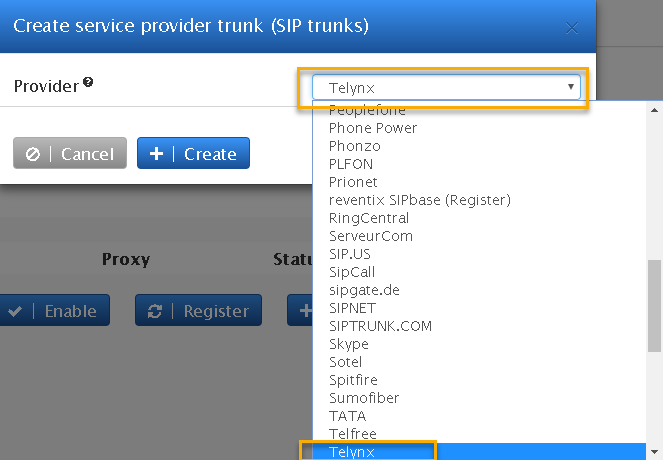
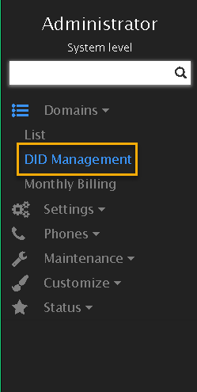
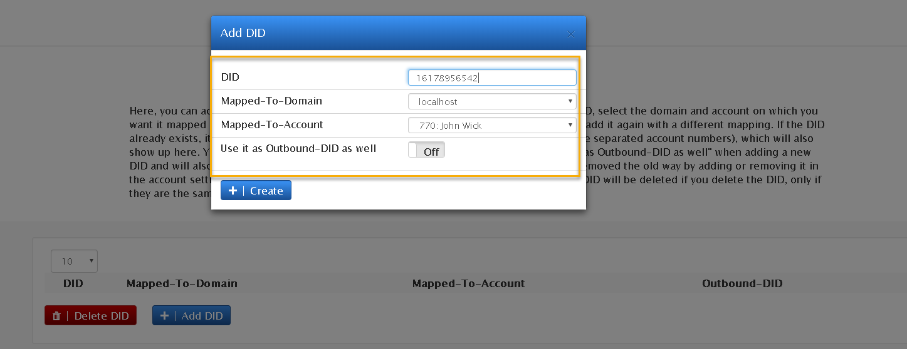

# Vodia: Multi-Tenant PBX Setup

Configure Vodia Multi-Tenant PBX with Credentials - It's easy and fast, get started today. See Telnyx guidance and requirements.

C

[Jump to Instructions](#h_4ff0450d5f)

Vodia PBX is designed with flexibility and convenience in mind. It offers both CPE as well as hosted deployments. This flexibility and convenience can be seen in the platform as well as in the phones and the [SIP trunks](https://telnyx.com/products/sip-trunks). This **IP-PBX** can run on any major platform **Windows, Linux or MAC OS**. Vodia support **all SIP phones** out there with automatic provisioning for the mainstream phones like [Polycom](https://www.poly.com/us/en), [Snom](https://www.snomamericas.com/), [Cisco](https://www.cisco.com/), [Grandstream](https://www.grandstream.com/), Yealink and [more](https://web.vodia.com/supported-phones).

Additional resources:

* [Vodia documentation](https://doc.vodia.com/)
* [Supported phones](https://web.vodia.com/supported-phones)
* [Vodia forums](https://forum.vodia.com/)
* [Vodia support](https://vodia.zammad.com/#login) (Requires login)
* [Vodia portal login](https://portal.vodia.com/)

---

## Instructions for configuring the Vodia Multi-Tenant PBX

In this activity you will:

1. [Create a SIP trunk](#h_3d1db149ad)
2. [Configure inbound routing](#h_a091f19d46)

**Pre-requisites:**

* Ensure that your [Telnyx Mission Command Portal is configured properly](https://support.telnyx.com/en/articles/1176636-get-started-with-a-mission-control-account)
* [Create a credentials-based connection](https://portal.telnyx.com/#/app/connections) on your Telnyx Mission Control Portal
* RECOMMENDED: [Enable TLS to encrypt your traffic](https://support.telnyx.com/en/articles/1130711-does-telnyx-encrypt-communication)
* [Download](https://web.vodia.com/) and [install](https://doc.vodia.com/docs/software) Vodia

**Video Walkthrough**

Setting up your Telnyx SIP portal account so you can make and receive calls:

|  |
| --- |
| ***Note:*** *Video walkthrough for Vodia PBX/Telnyx configuration coming soon. Check back as we update our docs.* |

## 1. Create a SIP trunk

In this section, you'll configure a SIP trunk between your Vodia IP phone and your Telnyx account.

1. Log into Vodia PBX, navigate to your Domain, and, from the left-hand navigation choose **TRUNKS > VoIP Providers.**
2. Click on **Add.**
3. From the **Provider** dropdown, select *Telnyx*.

   
4. When asked, enter your Telnyx username and password.

   
5. Click **Create**.

|  |
| --- |
| ***Note:*** *Because Vodia PBX has a built-in Telnyx template, you won't need to enter certain details such as the SIP outbound proxy or trunk headers configuration. Vodia also automatically creates a dial plan for the domain, so there is no need for you to create a dial plan unless you plan to edit it.*  [Current Trunks edit portal.](https://telnyx-48416ce2297b.intercom-attachments-1.com/i/o/137498124/586f94eb8b37105ae16a52e1/trunk200ok_1.png?expires=1783506600&signature=14a209f56dda924c34ce4c5160dc0c59a912aae6e98ccb4ce2149b0b68b356e2&req=dSMgEsB2nINbFb4f3HP0gBviIIRTeR3JF9st5r6NOxnD6k7L790NSI6t1fjm%0Akic%3D%0A) |

[Back to Top](#h_4ff0450d5f)

## 2. Configure inbound routing

In this section, you will route your Telnyx phone number(s) into the Vodia PBX.

1. Navigate to your registered Telynx trunk, and scroll down to **Routing/Redirection.**
2. Vodia supports the following inbound methods:

   1. Send all to the destination request URL
   2. Send all calls to a specific account
   3. Send to a 10 Digit DID
   4. Match extension after a prefix
   5. Use a list of expression
      ​

   For this exercise, we are going choose "Send all calls to a specific account" When you call into the system all calls will go the specified extension.

   
3. If you have multiple Telnyx phone numbers you would like to route into the Vodia PBX, make sure you're in Admin mode in your Vodia PBX and navigate to DID management.

   
4. The DID management will help you configure multiple DIDs by assigning them to specific extensions the system.

   
5. Navigate to your Telnyx trunk from your Vodia PBX system, scroll down to **Routing/Redirection** and choose *Send all to the destination request URL*.

That's it, you've now completed the configuration of Zoiper 5 and can now make and receive calls by using Telnyx as the SIP provider.
​

[Back to Top](#h_4ff0450d5f)

---

## Additional Resources

Review our [getting started with guide](https://support.telnyx.com/en/articles/1176636-get-started-with-a-mission-control-account) to make sure your Telnyx Mission Control Portal account is setup correctly!

Additionally, check out:

* [Vodia documentation](https://doc.vodia.com/)
* [Supported phones](https://web.vodia.com/supported-phones)
* [Vodia forums](https://forum.vodia.com/)
* [Vodia support](https://vodia.zammad.com/#login) (Requires login)
* [Vodia portal login](https://portal.vodia.com/)

---

Related Articles

[Configuring an Elastix 4 PBX IP Trunk](https://support.telnyx.com/en/articles/1130622-configuring-an-elastix-4-pbx-ip-trunk)[How to configure a Thirdlane PBX](https://support.telnyx.com/en/articles/1130631-how-to-configure-a-thirdlane-pbx)[Configuring an Elastix 4 PBX Trunk](https://support.telnyx.com/en/articles/1130654-configuring-an-elastix-4-pbx-trunk)[Positron IP PBX](https://support.telnyx.com/en/articles/5790910-positron-ip-pbx)[ScopTEL IP PBX](https://support.telnyx.com/en/articles/5803103-scoptel-ip-pbx)

Did this answer your question?

😞😐😃
