FusionPBX: Telnyx Credentials | Telnyx Help Center

[Skip to main content](#main-content)

# FusionPBX: Telnyx Credentials

Configure FusionPBX 4.4 Trunk credentials with Telnyx - It's fast and easy.

C

Written by Customer Success

January 10, 2024

Table of contents

[Jump to Instructions](#h_cf4a5ee2e4)

[FusionPBX](https://www.fusionpbx.com/) can be used as a highly available single or domain based multi-tenant PBX, carrier grade switch, call center server, fax server, voip server, voicemail server, conference server, voice application server, appliance framework and more. FreeSWITCH™ is a highly scalable, multi-threaded, multi-platform communication platform. This article guides you on how to configure this PBX for making and receiving calls over the internet through a next generation carrier like Telnyx!

Additional resources:

* [FusionPBX documentation](https://docs.fusionpbx.com/en/latest/)
* [Quick install guide](https://docs.fusionpbx.com/en/latest/getting_started/quick_install.html)
* [Install scripts](https://www.fusionpbx.com/download.php)
* [FusionPBX support](https://www.fusionpbx.com/support)

---

# Instructions for configuring a credentials trunk between FusionPBX and Telnyx

In this activity you will:

1. (OPTIONAL BUT RECOMMENDED) [Install a virtual machine](#h_aa5ccbd9b1)
2. [Install FusionPBX](#install-fusionpbx)
3. [Configure a FusionPBX trunk](#h_9f440cf44c)
4. [Create your extensions](#h_183746c581)
5. [Configure inbound routing](#h_ab0b9ab2d7)
6. [Configure outbound routing](#h_9cefe9bc2a)
7. [Register your extension with a device](#h_eaf6abb3b5)

**Pre-requisites:**

* Ensure that your [Telnyx Mission Command Portal is configured properly](https://support.telnyx.com/en/articles/1176636-get-started-with-a-mission-control-account)

  + This includes creating a [credentials-based connection](https://portal.telnyx.com/#/app/connections) on your Telnyx Mission Control Portal account, assigned this connection to a DID and outbound profile in order to make and receive calls
* RECOMMENDED: [Enable TLS to encrypt your traffic](https://support.telnyx.com/en/articles/1130711-does-telnyx-encrypt-communication)
* [Download](https://www.fusionpbx.com/download) and [install](https://docs.fusionpbx.com/en/latest/getting_started/quick_install.html) FusionPBX
* (RECOMMENDED) We recommend using Debian as the operating system version that should be running FusionPBX. The current Debian version that we tested FusionPBX on was Debian-9.9.  
  ​   
  There are many applications that can be used to set up a Debian Operating System on your computer. In this article we use a program called [VirtualBOX VM](https://www.virtualbox.org/) to set up a Debian Virtual Machine. You can follow [these steps](#h_aa5ccbd9b1) to do so. If you don't want to use a Virtual Machine you can skip these steps and [go straight installation of the FusionPBX.](#install-fusionpbx)

**Video Walkthrough**

Setting up your Telnyx SIP portal account so you can make and receive calls:

Install FusionPBX (From FusionPBX)  
​

|  |
| --- |
| ***Note:*** *Video walkthrough for FusionPBX/Telnyx configuration coming soon. Check back as we update our docs.* |

## 1. (OPTIONAL BUT RECOMMENDED) Install a virtual machine

You only need to complete this section if you plan to run your FusionPBX on a virtual machine. If you don't, you can skip to [section 2](#install-fusionpbx).

1. ### **Download and install the [Debian network installer disk image](https://www.debian.org/) and run it.**
2. ### **Click on the New icon in the VirtualBox menu bar.**
3. ### **This will start the New Virtual Machine Wizard. The first screen is just a welcome screen so click Continue to proceed.**
4. ### **On the Name and operating system screen, provide the following:**

   1. **Name:** You can give this any name you like
   2. **Operating System:** *Linux*
   3. **Version:** *Debian (64 bit)*

      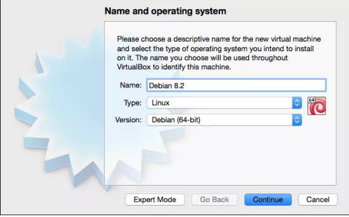
5. ### **Click Continue.**
6. ### **On the Memory size screen, you can just use the default setting for the amount of base memory.**

   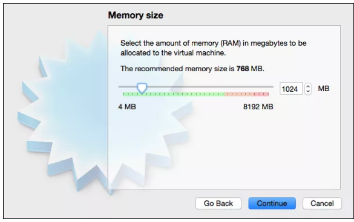
7. ### **Click Continue.**
8. ### **On the Hard disk screen, you'll create a new virtual hard disk to use as your VM file system. Select Create a virtual hard disk now.**

   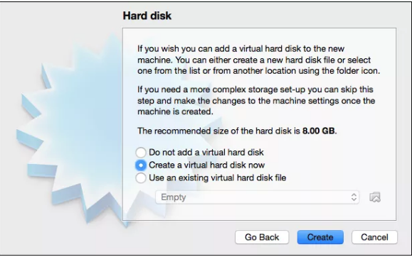
9. ### **Click "Create".**
10. ### **In the next screen, you'll specify the format for the virtual hard disk. Just use the default settings here: the native VirtualBox disk image (VDI) format.**
11. ### **Click "Continue".**
12. ### **On the "Storage on physical hard disk" screen, you'll choose how your virtual hard disk is sized. The default option is is "dynamically allocated", and this is the option we recommend.**

    
13. ### **Finally, on the "File location and size" screen, choose the location and maximum size of your virtual machine disk. You can just use the defaults here, unless you require anything specific.**

    
14. ### **Click "Create". Welcome to your virtual machine!**

    
15. ### **Click on the "Settings" gear at the top left of your new VM and find the "Storage" option in the left-hand navigation.**
16. ### **Select the Debian file under the "Controller: IDE".**

    
17. ### **You'll see that the network ISO image is configured for your virtual machine and you can now start it. It will boot, and begin the Debian Linux installation process on the VM.**
18. ### **After this completes, you can go to your VirtualBox homepage and hit the power "button" on the page. This will power it on and allow you to specify your desired configurations, such as preferred language etc. and once complete, you can install your FusionPBX.**

[Back to Top](#h_cf4a5ee2e4)

## 2. Install FusionPBX

FusionPBX can be installed on several different operating systems however we recommend using Debian. If you are installing Debian from scratch it will have prompted you during the installation phase to have created a root password. This will be the password you will enter when you run the command *su root* in the terminal.

1. ### **Visit this website that FusionPBX recommends for following the [install script](http://docs.fusionpbx.com/en/latest/getting_started/quick_install.html) as it is much simpler and faster than previous ways.**
2. ### **Run the following commands as root. This will run a scrip that installs FusionPBX, FreeSWITCH release package and its dependencies, iptables, Fail2ban, NGINX, PHP-FPM, and PostgreSQL.**

   ```
   #upgrade the packages  
   apt-get update && apt-get upgrade -y  
     
   #install packages  
   apt-get install -y git lsb-release  
     
   #get the install script  
   cd /usr/src && git clone https://github.com/fusionpbx/fusionpbx-install.sh.git  
     
   #change the working directory  
   cd /usr/src/fusionpbx-install.sh/debian
   ```
3. ### **At the end of the install script you will be instructed to go to the IP address of the server in your web browser to finish the install in the FusionPBX GUI.**

   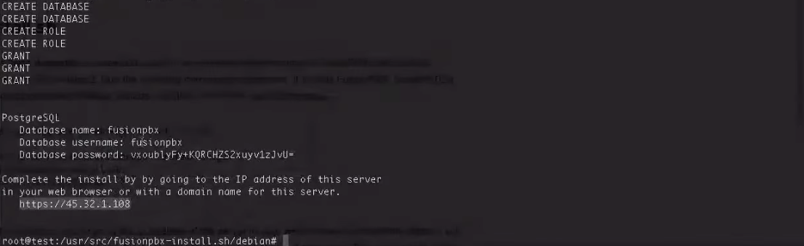
4. ### **Once you have opened a browser with the URL the terminal gave you, you should see a GUI where you will go on to configure FusionPBX.**
5. ### **Choose your language and click "Next".**

   
6. ### **Your event socket settings will be automatically detected. Click "Next".**

   
7. ### **Here you will need to enter a username and password as your login credentials for FusionPBX.**

   
8. ### **Any writing in bold indicates that you *must* fill it in. At this point you will need to go back to the terminal and grab the details you would have seen, just above the server IP, that relate to the database username and password.**

   
9. ### **Click "Next".**
10. ### **You'll be brought back to the login page where you will sign in with the username and password from step 7.**

    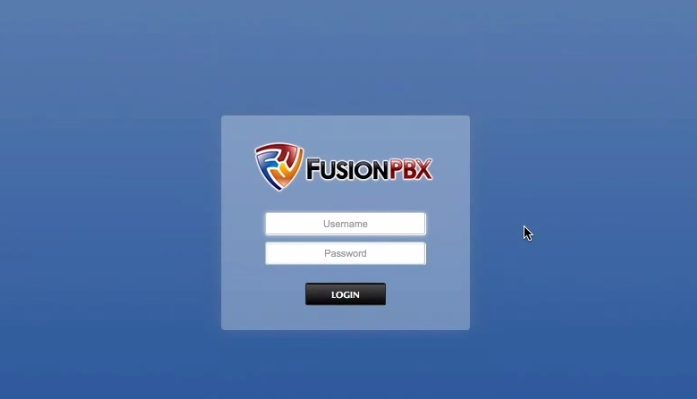

[Back to Top](#h_cf4a5ee2e4)

## 3. Configure a FusionPBX trunk

Once you have the installation of your FusionPBX set up, It is now time to configure your PBX so that you can make and receive calls through Telnyx!

1. ### **Go to the "Advanced" header and to "Upgrade" in the drop down list.**
2. ### **Tick "App Defaults" and press the "Execute" button on the bottom-right.**

   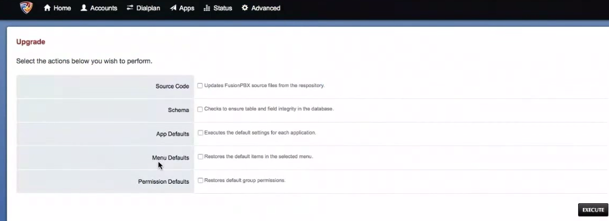
3. ### **Go to the "Accounts" header, select "Gateway", and provide the following details**

   1. **Gateway**: *Telnyx*
   2. **Username**: The username from your Telnyx credentials based connection.
   3. **Password**: The password from your Telnyx credentials based connection.
   4. **From User**: The username from your Telnyx credentials based connection.
   5. **From Domain**: *sip.telnyx.com*
   6. **Proxy**: *sip.telnyx.com*

      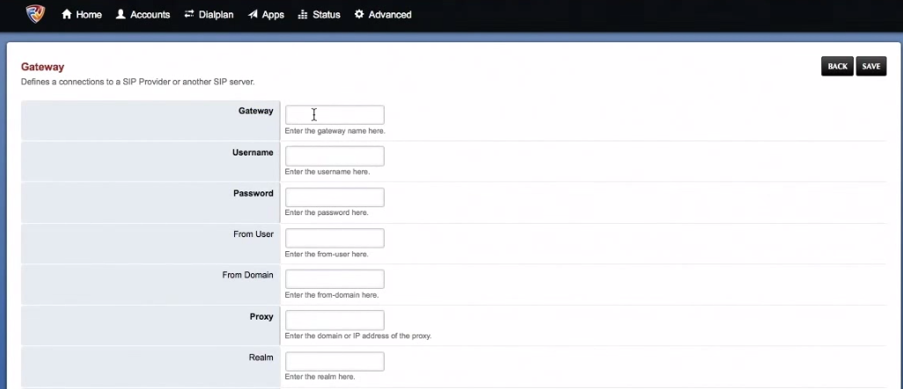
4. ### **Click "Save". You'll be taken to a screen where you'll see that FusionPBX is now registered with Telnyx.**

   

[Back to Top](#h_cf4a5ee2e4)

## 4. Create your extensions

1. ### **Now go to the "Accounts" header and select "Extensions".**
2. ### **Click the "Add" button to add an extension. The following image shows an example of what they should look like.**

   Note: The Telnyx support portal automatically shrinks images, so if you have trouble seeing it, right-click on the image and select Open Image in New Tab to view it in full size.   
   ​

   
3. ### **Once you've created an extension, you can click into it and change the password that was given to you if you'd like to.**

   Note: Depending on your phone configuration, you may also wish to configure an outbound caller ID. You can apply this via the "Outbound Caller ID Number" field. For more information on the fields below, please visit [FusionPBX's extensions documentation](https://docs.fusionpbx.com/en/latest/accounts/extensions.html).  
   ​  
   ​*Before configuring an outbound caller ID, you should be aware of some of the naming conventions standard for caller ID creation:*

   * #### **Your outbound Caller ID Name should be in "capital letters". This will appears more clearly/visible on some devices.**
   * #### **You "must NOT use any special characters", as they will not be displayed.**
   * #### **Some of regular "Canadian providers will not show more than 15 characters". We suggest shrinking or adapt your caller ID.**
   * #### **"Spaces are allowed" in a caller id name.**
   * #### **Be familiar with [Telnyx's caller ID number policy](https://support.telnyx.com/en/articles/3546251-caller-id-number-policy).**

     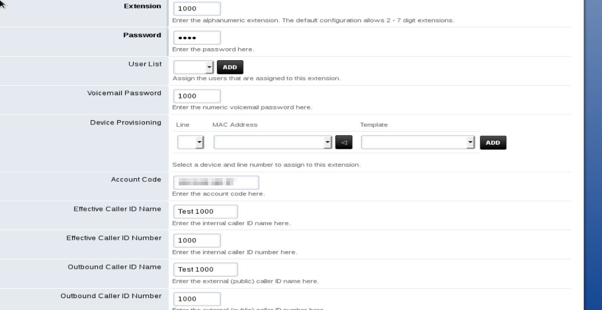
4. #### Click "**Save"**.
5. #### Go to the "**Dialplan"** header and select "**Destinations"**.
6. #### Click the "**Add"** button to add your destinations.

   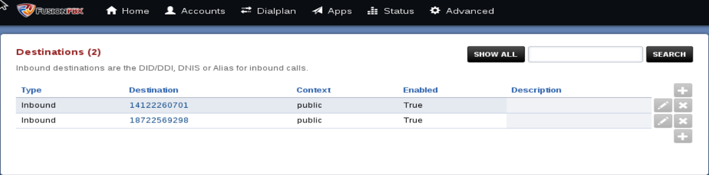

   1. You'll want to add in a number that you purchased on your Portal account to "**Destination"** - Make sure to add a *+1* in front of the number.
   2. Then for "**Actions"**, select an extension you created from the drop-down list.

      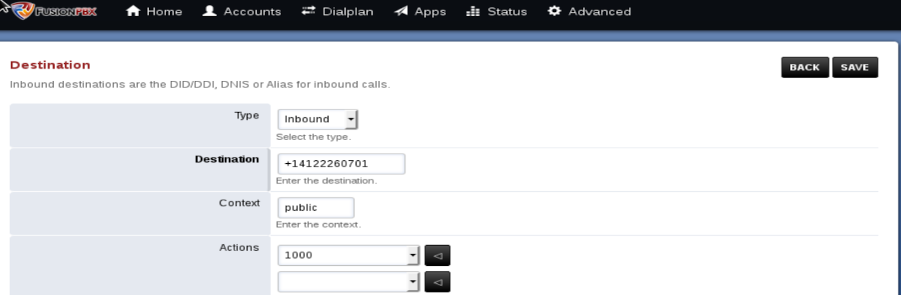
7. #### Click "**Save"**.

[Back to Top](#h_cf4a5ee2e4)

## 5. Configure inbound routing

In this step, you will configure an inbound calling route pattern that CompletePBX will require in order for you to receive inbound calls from your DID. Each DID will need to be associated with an inbound route. Multiple DIDs can be associated with the same route, but any single DID can only be associated with a single route.

1. Go to the **Dialplan** header and select **Inbound routes**. Your inbound routes should be added automatically that relate to your destinations you created.

   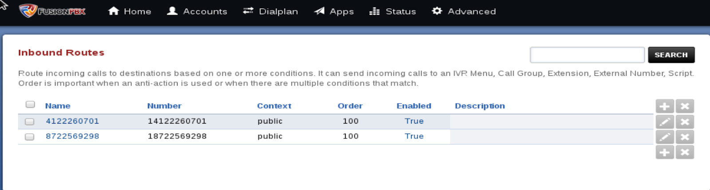
2. When you click on any of the numbers you created as inbound routes you will see a dialplan like the picture that follows. (You will need to make sure that your number format is set to E164 on your connection you created in your Mission Control Portal.)

   

[Back to Top](#h_cf4a5ee2e4)

## 6. Configure outbound routing

In this step, you will configure an outbound calling route pattern that CompletePBX will use as a template, or set of rules, to follow for outbound calls associated with the route.

1. Go to the **Dialplan** header and select **Outbound routes**.
2. Click the **Add** button to create your different outbound routes.

   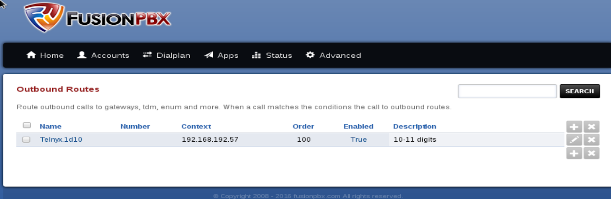
3. Create your outbound route using the following parameters:

   1. **Gateway**: Select *Telnyx*
   2. **Dialplan Expression**: Select the region you want to configure the dialplan expression for. i.e.: *North America*

      
4. Click **Save**.

[Back to Top](#h_cf4a5ee2e4)

## 7. Register your extensions with a device

1. Go to the **Status** header and select **Registrations**. At this point you will need to register the extensions you created with whatever device you choose.   
   ​  
   In this example, we used [Zoiper](https://support.telnyx.com/en/articles/6133517-zoiper-communicator) and Xlite softphone to register these extensions.
2. All your registered devices will show up on the registration’s page.

   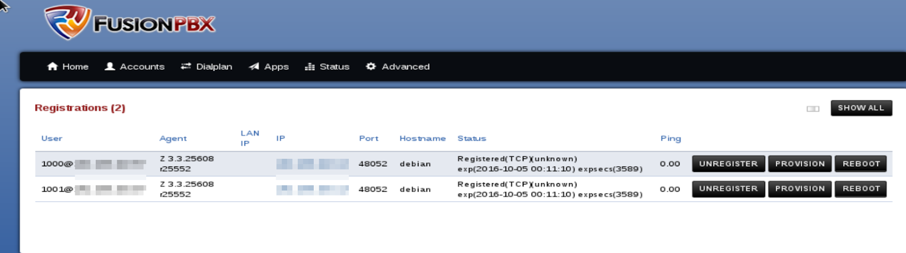

Both extensions are registered with the servers IP address so they can now make and receive calls internally via calling 1000 or 1001. Your inbound and outbound routes are set and you will be able to make and receive calls externally also.

That's it, you've now completed the configuration of FusionPBX and can now make and receive calls by using Telnyx as the SIP provider.

[Back to Top](#h_cf4a5ee2e4)

---

## Additional Resources

Review our [getting started with guide](https://support.telnyx.com/en/articles/1176636-get-started-with-a-mission-control-account) to make sure your Telnyx Mission Control Portal account is setup correctly!

Additionally, check out:

* [FusionPBX documentation](https://docs.fusionpbx.com/en/latest/)
* [Quick install guide](https://docs.fusionpbx.com/en/latest/getting_started/quick_install.html)
* [Install scripts](https://www.fusionpbx.com/download.php)
* [FusionPBX support](https://www.fusionpbx.com/support)

---

---

Related Articles

[FreePBX Trunk Settings With Telnyx](https://support.telnyx.com/en/articles/1130620-freepbx-trunk-settings-with-telnyx)[Configuring a FreePBX V13 Credentials Trunk](https://support.telnyx.com/en/articles/1130648-configuring-a-freepbx-v13-credentials-trunk)[FreePBX V13: PJSIP Credentials](https://support.telnyx.com/en/articles/1277754-freepbx-v13-pjsip-credentials)[FreePBX V14: Credentials - ChanSIP](https://support.telnyx.com/en/articles/3284752-freepbx-v14-credentials-chansip)[FreePBX V15: Credentials - PJSIP](https://support.telnyx.com/en/articles/5619597-freepbx-v15-credentials-pjsip)

Did this answer your question?

😞😐😃

Table of contents
