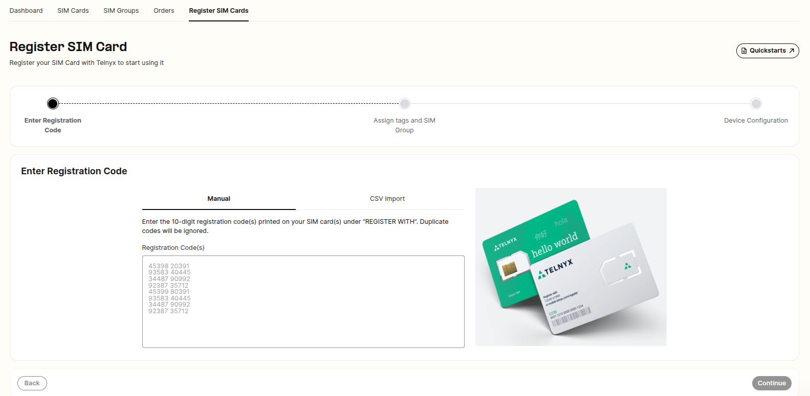

# How to set up a Telnyx SIM Card

A quickstart guide that includes step by step instructions on how to set up the Telnyx SIM. See Telnyx guidance and requirements.

## Step by Step to Setting up a Telnyx SIM

You can order your Telnyx SIM [here](https://telnyx.com/sign-up). Once you have ordered your SIM card, please allow 3-5 business days for delivery.

## After receiving your SIM card

Once you have received your SIM card, follow these simple steps below to register and set up your SIM card to start using data.

1. Go to our [SIM registration page](https://portal.telnyx.com/#/app/wireless/register-sims).

   

2. Type in the 10-digit registration code located on your SIM card.
3. Click Register SIM.
4. Now let's set up your device. Insert the SIM card into your device and configure the APN to the following:
            Name: Telnyx
            APN: data00.telnyx
            Leave all other fields unmodified even if it's blank and save this new APN.
5. Finally, enable data roaming on your device and you are good to go!

​**Some devices may require you to reboot in order for the changes to take effect.**

---

Related Articles

[Adding the Telnyx SIM APN to your device](https://support.telnyx.com/en/articles/3269973-adding-the-telnyx-sim-apn-to-your-device)[SIM Setup and Configuration](https://support.telnyx.com/en/articles/4298710-sim-setup-and-configuration)[SIM Connectivity Logs](https://support.telnyx.com/en/articles/5666594-sim-connectivity-logs)[Using Telnyx SIM with Ubiquiti UniFi LTE Pro](https://support.telnyx.com/en/articles/10164784-using-telnyx-sim-with-ubiquiti-unifi-lte-pro)[Using Telnyx SIM with InRouter300 Series Cellular Routers](https://support.telnyx.com/en/articles/10511105-using-telnyx-sim-with-inrouter300-series-cellular-routers)

Did this answer your question?

😞😐😃
