Elastix 5: FQDN Trunk Setup | Telnyx Help Center

[Skip to main content](#main-content)

# Elastix 5: FQDN Trunk Setup

Here we will explain how you can configure an Elastix 5 PBX IP FQDN trunk with Telnyx.

C

Written by Customer Success

December 13, 2023

Table of contents

[Jump to Instructions](#h_e6b8065902)

[Elastix 5](https://www.3cx.com/) is a **high-performance turnkey PBX** that’s easy to install and manage. Powered by 3CX you get a complete unified communications solution with softphones included for Android, iOS, Windows and Mac as well as a web-client. Supported IP Phones, Trunks and gateways are all automatically configured with inbuilt templates. You also get integrated WebRTC video conferencing for free. Available on-premise on Windows, Linux, Raspberry Pi or in the Cloud.

Additional documentation:

* [Elastix admin guide](https://www.3cx.com/docs/manual/)
* [Elastix user guide](https://www.3cx.com/user-manual/)
* [Elastix support](https://www.3cx.com/support/)

---

# Instructions for Configuring Elastix

In this activity you will:

1. [Complete first-time setup of Elastix](#h_5037c11b48)
2. [Create a Telnyx SIP trunk](#h_4a4a6e17c2)
3. [Create inbound rules](#h_761fbb899f)
4. [Create outbound rules](#h_c4c08a313b)

**Pre-requisites**

* Ensure that your [Telnyx Mission Command Portal is configured properly](https://support.telnyx.com/en/articles/1176636-get-started-with-a-mission-control-account)
* [Purchase a DID](https://portal.telnyx.com/#/app/numbers/search-numbers)
* [Set up your Telnyx SIP connection](https://portal.telnyx.com/#/app/connections)
* [Provision your number](https://portal.telnyx.com/#/app/numbers/my-numbers) (Assign it to a SIP connection)
* [Create an outbound voice profile](https://portal.telnyx.com/#/app/outbound)
* Create an [IP or FQDN connection](https://portal.telnyx.com/#/app/connections) on your Telnyx Mission Control Portal
* RECOMMENDED: [Enable TLS to encrypt your traffic](https://support.telnyx.com/en/articles/1130711-does-telnyx-encrypt-communication)
* [Download](https://www.3cx.com/community/threads/elastix-2-0-0-57-iso-download.112659/) and [install](https://www.3cx.com/community/threads/elastix-2-0-0-57-iso-download.112659/) Elastix

  + You'll need an [Elastix license key](https://www.3cx.com/phone-system/download-phone-system/)
  + Take note of any username/password combination you set during this activity. You'll need them at a later stage.

**Video walkthrough**

Setting up your Telnyx SIP portal account so you can make and receive calls:

|  |
| --- |
| ***Note:*** *Video walkthrough for Elastix/Telnyx configuration coming soon. Check back as we update our docs.* |

## 1. Complete first-time setup of Elastix

In this section, we will complete installation and initial setup of your Elastix 5 service.

1. ### **Once the installation has finished, you'll be prompted to choose either running the tool from the "web browser" or from the "command line". We recommend the web browser. There is a "URL" provided which you will need to use to access the graphical user interface in order to configure Elastix 5.**

   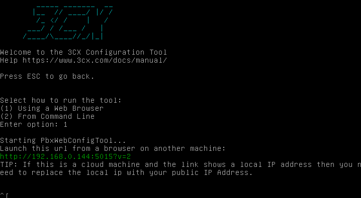
2. ### **Once you've acquired the key, proceed to creating a new install and click "Next".**

   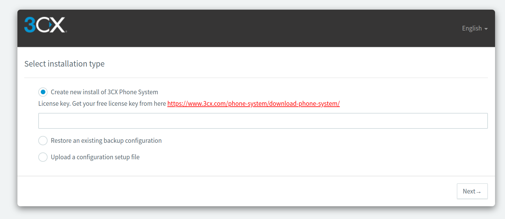
3. ### **Your public IP address will automatically be detected next and you can choose to either go with the one that was detected or enter an IP address in manually. Once you've done this, click "Next".**
4. ### **Choose whether your IP address is "static" or "dynamic". Click "next".**

   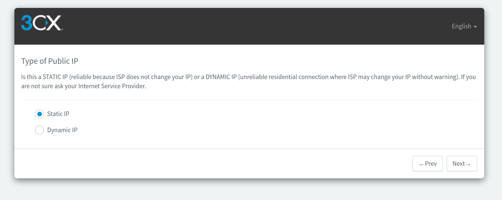
5. ### **Select the ports required for 3CX Management console. They automatically populate default values for you but you can choose your own.**

   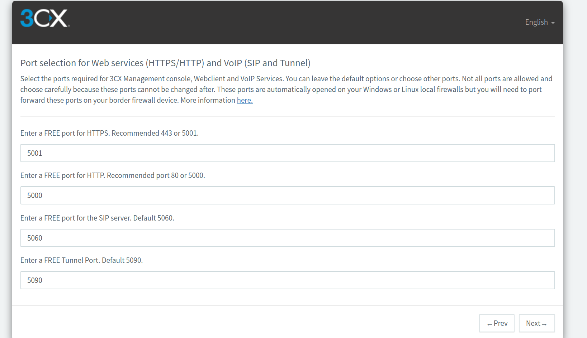

   ###
6. ### **Proceed to select the default network adapter.**

   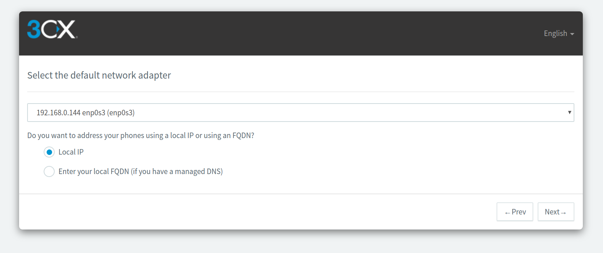
7. ### **Your FQDN and certificates will now be generated.**

   
8. ### **Select how many digits your extensions should have.**

   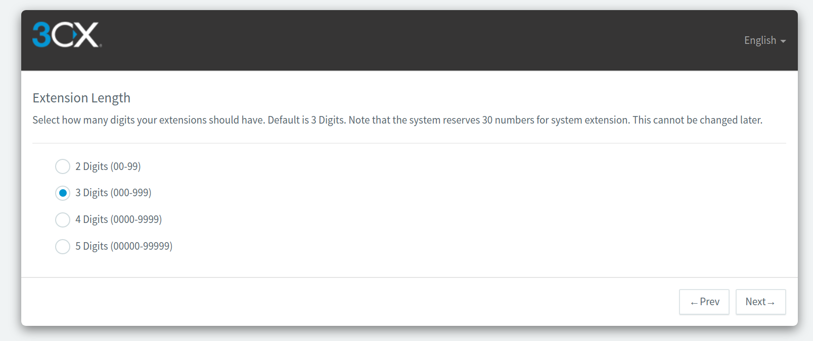
9. ### **Enter an Email for important system notifications.**

   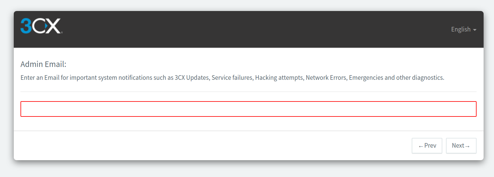
10. ### **Select Country and Time Zone.**

    
11. ### **Create an Operator Extension.**

    
12. ### **As an additional security measure, you can specify to which countries calls can be made.**

    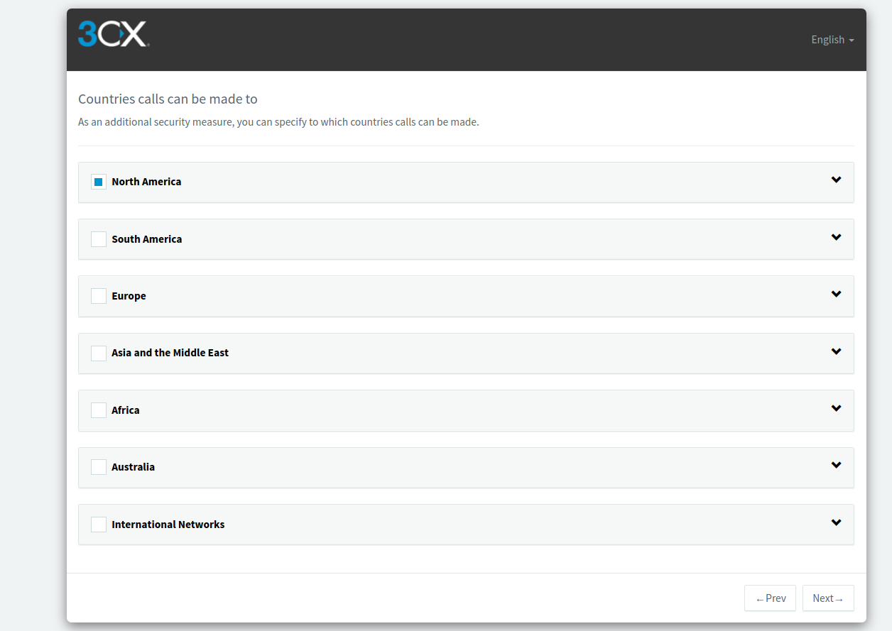
13. ### **Select your preferred language.**

    
14. ### **At this point the PBX basic settings are now fully configured and you'll be shown a "congratulations" page upon successfully completing the steps. Make sure you note the details that are provided but a copy of the details are also sent to the admin email you specified on a previous step.**
15. ### **Use the FQDN or your public IP address URL in order to access the PBX interface. If the PBX is on your local LAN, and your router has a firewall, ensure to apply port forwarding to the ports you specified in step 3 - otherwise the interface may not resolve for you.**
16. ### **Log in with the "username" and "password" you created.**

    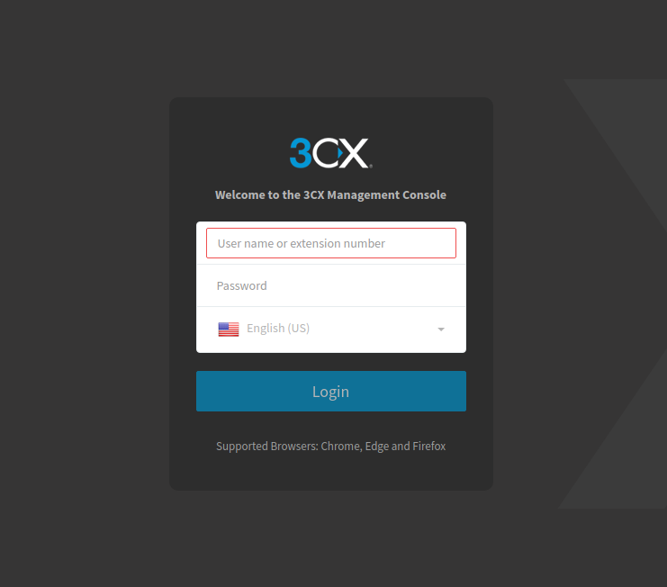
17. ### **You'll be brought the the dashboard now.**

    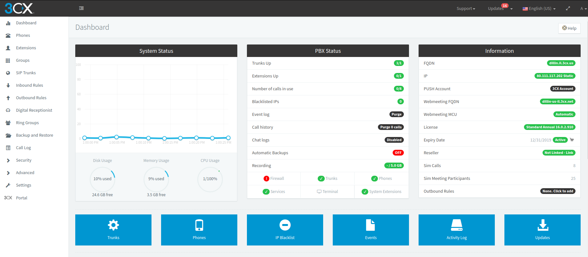
18. ### **Go to "Settings > Network to confirm your network settings":**
19. ### **On the "Ports" Tab set:**

    1. **SIP Port:** *5060*
20. ### **On the "Public IP" Tab: Find the "External IP Configuration" section and double check your Public IP is correct and that you have selected the proper Network card I**nterface.

    #### **Note** : Please make sure that connection IP on the Telnyx Mission Control Portal and Static Public IP are the same. You can also use the FQDN for inbound calls and the IP for outbound calls.

[Back to Top](#h_e6b8065902)

## 2. Create a Telnyx SIP trunk

In this section, you will create a [SIP trunk](https://telnyx.com/products/sip-trunks) between Elastix and Telnyx.

1. ### **From the left-hand navigation, click on "SIP Trunks".**
2. ### **Click "+ Add SIP Trunk" near the top of the screen.**
3. ### **A new pop up will be opened. You need to enter/select all the required details :**

   1. **Select Country:** *Worldwide*
   2. **Select Provider in your Country:** *Telnyx LLC*
   3. **Main Trunk No:** Enter the number which you have purchased on your Telnyx Mission Control Portal as part of your [pre-requisite activities](#h_c31bbc2660).

      
4. ### **After entering the details, Click on "OK".**
5. ### **This will open the trunk configuration window.**
6. ### **Click on the "General" tab and start at the "Trunk Details" section. Provide the following information:**

   1. **Enter name of Trunk:** *Telnyx LLC*
   2. **Registrar/Server/Gateway Hostname or IP:** *sip-anycast1.telnyx.com:5060* or *sip.telnyx.com:5060*
   3. **Outbound Proxy:** *sip.telnyx.com*
   4. **Number of SIM Calls:** <set your preferred amount of simultaneous calls>

      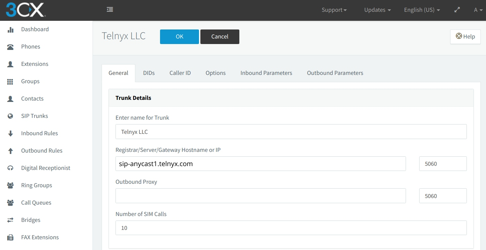
7. ### **Find the "Authentication" section and provide the following information:**

   1. **Type of Authentication:** Do not require - IP Based
   2. **Authentication ID (aka SIP user ID):** Enter the number you purchased on your Telnyx Mission Control Portal as part of your [pre-requisite activities](#h_c31bbc2660).
   3. **Authentication Password:** Leave blank

      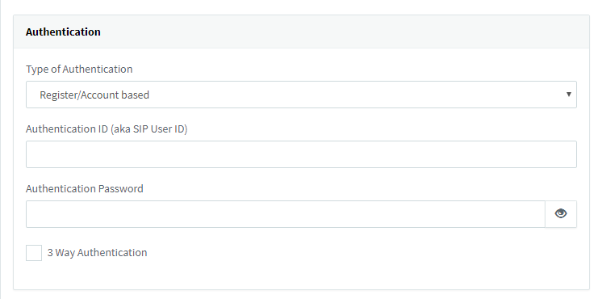
8. ### **Now find the "Route calls to" section and provide the following information:**

   1. **Main Trunk number:** By default number will be shown. You need cross-verify with the number which you have purchased on telnyx portal
   2. **Destination for calls during the office hours :** Based on your requirement
   3. **Destination for calls outside the office hours:** Based on your requirement

      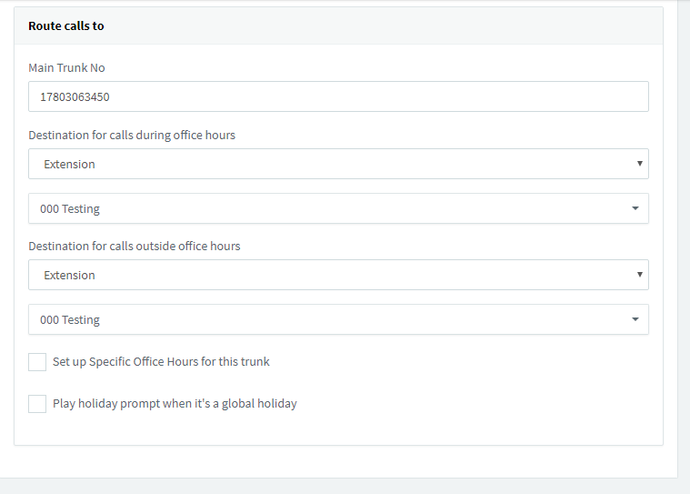
9. ### **Click on the "Options" tab and provide the following information:**

   1. **Require registration for:** *Do not require*
   2. Remove the *GSM-FR* from **Assigned Codecs**
10. ### **Click "Apply".**
11. ### **Click on the "Outbound Parameters" tab.**
12. ### **Find the "SIP Field" section and provide the following information:**

    1. **Contact User Part:** *Custom Field* (Leave the custom value blank)

       
13. ### **Click "Apply".**
14. ### **Click "OK" at the top of the page.**
15. ### **If all the fields are entered correctly the IP trunk will now be live. We can now proceed to our inbound and outbound rules.**

    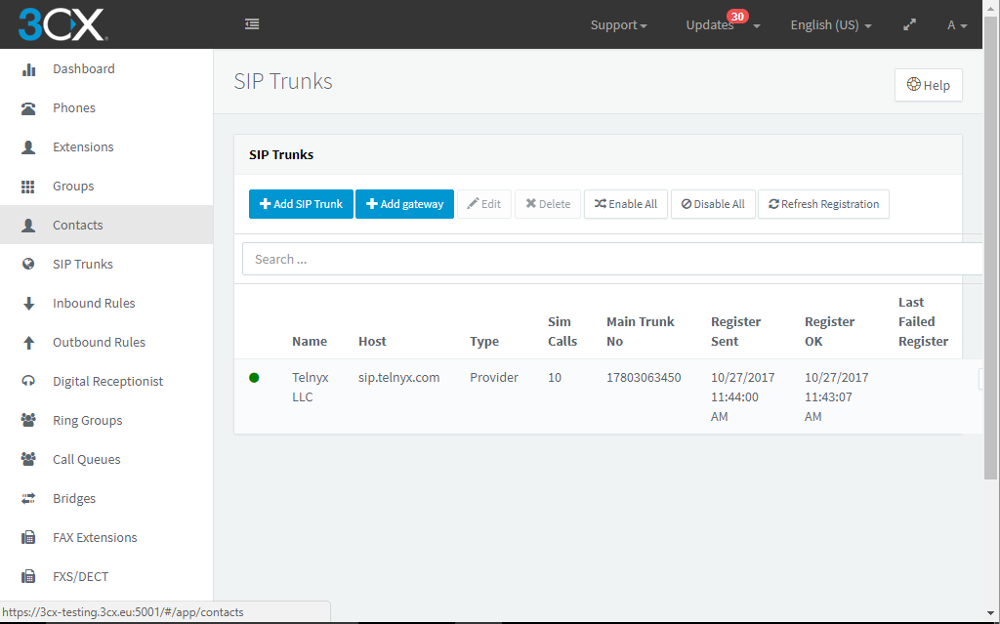

[Back to Top](#h_e6b8065902)

## 3. Create inbound rules

In this section, we'll create inbound rules to manage your incoming calls.

1. From the left-hand navigation, click **Inbound Rules**.
2. Click on "**+Add DID Rule**" near the top of the screen.
3. In the **General** section, provide the following information:

   1. **Name:** give your outbound rule a name that makes sense for your inbound rule.
   2. **DID/DDI:** One of the DIDs you provisioned from Telnyx as part of your [pre-requisite activities](https://support.telnyx.com/en/articles/3284164-elastix-5-credentials-trunk#h_566f57a59c)

      
4. In the **Route calls to** section, provide the following information:

   1. **Main Trunk number:** By default number will be shown. You need cross-verify with the number which you have purchased on telnyx portal
   2. **Destination for calls during the office hours :** Based on your requirement
   3. **Destination for calls outside the office hours:** Based on your requirement

      

[Back to Top](#h_e6b8065902)

## 4. Create outbound rules

In this section, we'll create outbound rules to manage your outgoing calls.

1. From the left-hand navigation, click **Outbound Rules**.
2. Click on **+Add** near the top of the screen.
3. In the **General** section, provide the following information:

   1. **Rule Name:** Enter anything that makes sense for your rule

      
4. In the **Apply this rule to these calls** section, provide the following information:

   1. **Calls to numbers starting with prefix:** Leave empty
   2. **Calls from extension(s):** Provide your extension numbers. We used *000* as an example here.
   3. **Calls to numbers with a length of:** Leave empty

      
5. In the **Make outbound calls on** section, we will be configuring routes for your calls. We can configure up to 3. The first will be your primary call route and the second and third will be used as backup.For each route, digits can be stripped or added. Strip Digits 0 on Route 1 and Strip Digits 1 digit for remaining 2 routes.  
   ​  
   This is also one of the many ways an **outbound caller ID** can be applied within 3CX. If you choose to apply an outbound caller ID on your Outbound Route, it will be applied to all calls that proceed through this route.

   

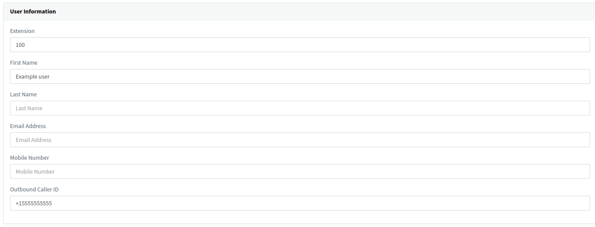

|  |
| --- |
| ***Note:*** *Before configuring an outbound caller ID, you should be aware of some of the naming conventions standard for caller ID creation:*  * *Your outbound Caller ID Name should be in **capital letters**. This will appears more clearly/visible on some devices.* * *You **must NOT use any special characters**, as they will not be displayed.* * *Some of regular **Canadian providers will not show more than 15 characters**. We suggest shrinking or adapt your caller ID.* * ***Spaces are allowed*** *in a caller id name.* * *Be familiar with [Telnyx's caller ID number policy](https://support.telnyx.com/en/articles/3546251-caller-id-number-policy)*  *If you choose not to add an outbound caller ID on your outbound route, you can instead apply it for each user or extension.* |

After completing the configuration, click **OK**.

That's it, you've now completed the configuration of Elastix 5 Credentials Trunk and can now make and receive calls by using Telnyx as your SIP provider!

[Back to Top](#h_e6b8065902)

---

## Additional Resources

Review our [getting started with guide](https://support.telnyx.com/en/articles/1176636-get-started-with-a-mission-control-account) to make sure your Telnyx Mission Control Portal account is set up correctly.

Additionally, you can check out:

* [Elastix admin guide](https://www.3cx.com/docs/manual/)
* [Elastix user guide](https://www.3cx.com/user-manual/)
* [Elastix support](https://www.3cx.com/support/)

---

Related Articles

[Configuring an Elastix 4 PBX IP Trunk](https://support.telnyx.com/en/articles/1130622-configuring-an-elastix-4-pbx-ip-trunk)[Configuring a FreePBX V13 Credentials Trunk](https://support.telnyx.com/en/articles/1130648-configuring-a-freepbx-v13-credentials-trunk)[Elastix 5: Credentials Trunk](https://support.telnyx.com/en/articles/3284164-elastix-5-credentials-trunk)[FreePBX V15 IP Trunk - ChanSIP Tutorial](https://support.telnyx.com/en/articles/5467232-freepbx-v15-ip-trunk-chansip-tutorial)[FreePBX V15: IP Trunk - PJSIP](https://support.telnyx.com/en/articles/5619595-freepbx-v15-ip-trunk-pjsip)

Did this answer your question?

😞😐😃

Table of contents
