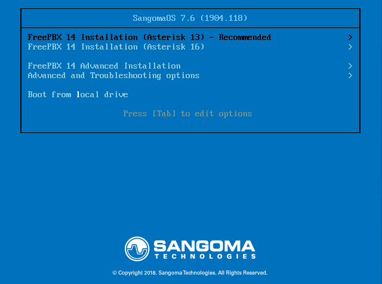
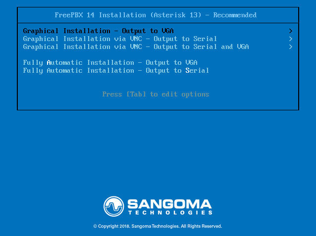
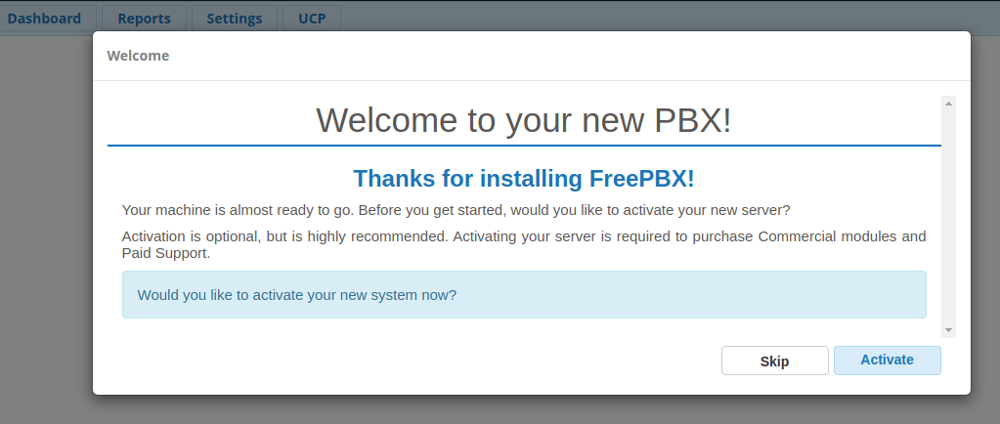
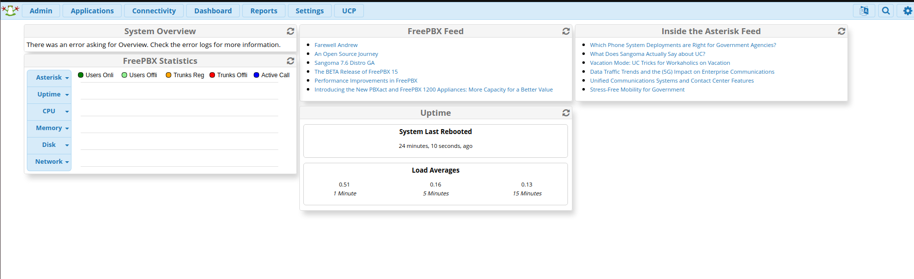
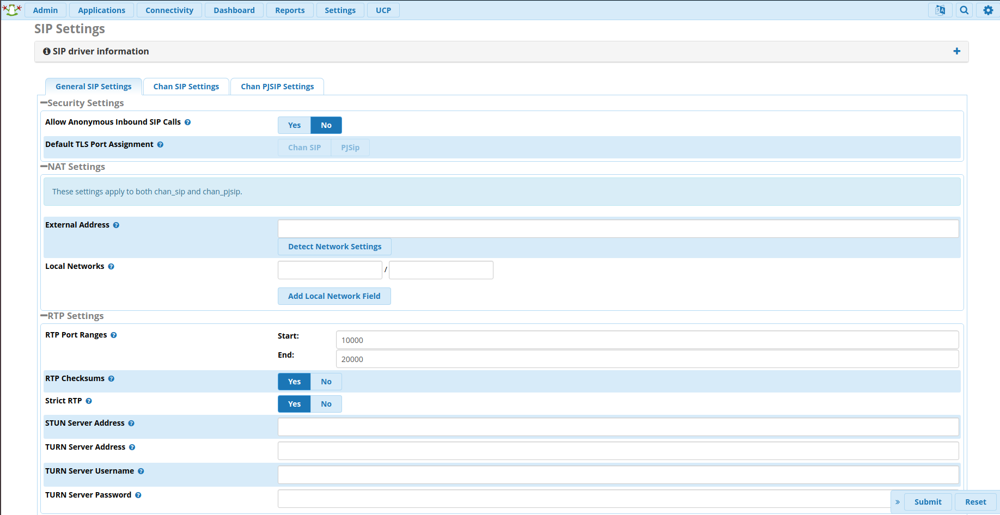
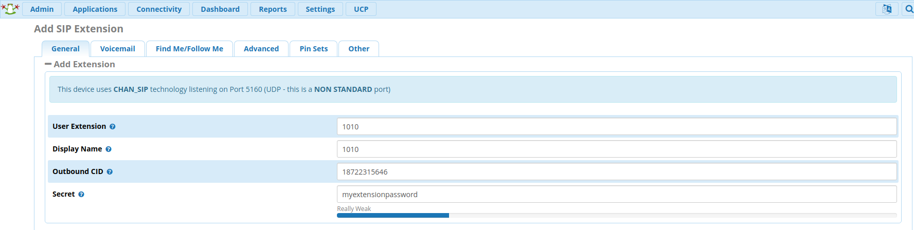
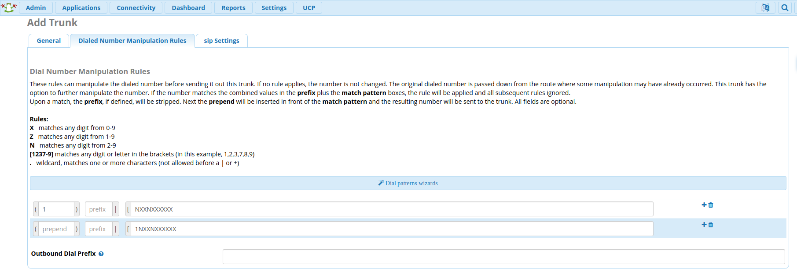
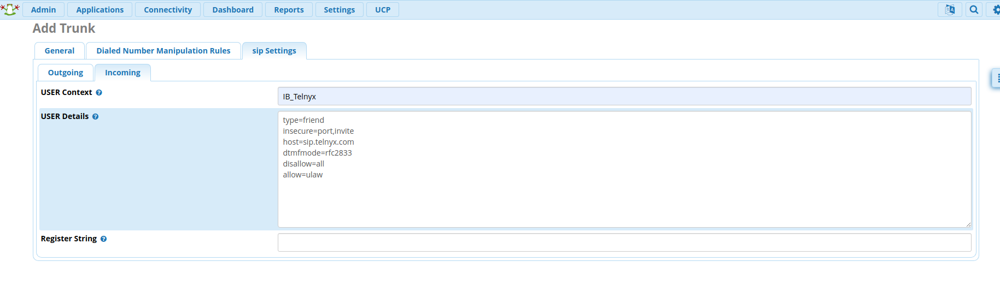
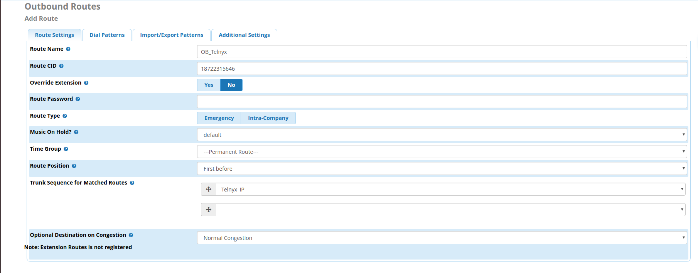

FreePBX V14: IP Trunk - ChanSIP | Telnyx Help Center

[Skip to main content](#main-content)

# FreePBX V14: IP Trunk - ChanSIP

Learn how to configure a FreePBX V14 IP trunk with Telnyx. Get started now.

C

Written by Customer Success

January 10, 2024

Table of contents

[Jump to Instructions](#h_e1fc150ffb)

[FreePBX](https://www.freepbx.org/) is a web-based open source GUI (graphical user interface) that controls and manages Asterisk (PBX), an open source communication server. FreePBX is licensed under the GNU General Public License (GPL), an open source license. FreePBX can be installed manually or as part of the pre-configured FreePBX Distro that includes the system OS, Asterisk, FreePBX GUI and assorted dependencies.

|  |
| --- |
| ***Note:*** *We suggest using PJSIP as an upgrade from Chan\_SIP, as Chan\_SIP is outdated, and the majority of users are moving to PJSIP which provides a number of more future proof options, and is still actively being improved by the community. You can find out more about PJSIP [here](https://www.pjsip.org/about.htm).* |

Additional documentation and resoruces:

* [FreePBX support](https://www.freepbx.org/support/)
* [FreePBX documentation](https://wiki.freepbx.org/#all-updates)

---

# Instructions for Configuring a FreePBX V15 IP Trunk

In this activity you will:

1. [Install your FreePBX V14](#h_496eea7cb1)
2. [Configure basic settings for your FreePBX](#h_038150c937)
3. [Configure SIP settings for your FreePBX](#h_0d1f8821d6)
4. [Configure extensions for your FreePBX](#h_70fac506bb)
5. [Configure a trunk for your FreePBX](#h_c6f1eb51f3)
6. [Configure outbound and inbound settings for your FreePBX](#h_e397d5e777)
7. [Configure outbound routing](#h_ebaba3c3ee)
8. [Configure inbound routing](#h_f5fb05f398)

**Pre-requisites**

* [Download](https://www.freepbx.org/downloads/) and [install](https://sangomakb.atlassian.net/wiki/spaces/PP/pages/10682958/PBX+Platforms+Home) FreePBX V14
* [Configure your Telnyx Mission Control Portal](https://support.telnyx.com/en/articles/1176636-get-started-with-a-mission-control-account)
* [Set up an IP connection on your Telnyx Mission Control Portal](https://portal.telnyx.com/#/app/connections)
* RECOMMENDED: [Enable TLS to encrypt your traffic](https://support.telnyx.com/en/articles/1130711-does-telnyx-encrypt-communication)

**Video Walkthrough**

Setting up your Telnyx SIP portal account so you can make and receive calls:

|  |
| --- |
| ***Note:*** *Video walkthrough for FreePBX/Telnyx configuration coming soon. Check back as we update our docs.* |

## 1. Install your FreePBX V14

In this section, you'll go through the steps you need to follow to install FreePBX.

1. ### **Once you load the ISO onto your server or virtual machine, you'll have a few options to select for installation. We'll be doing a full install via asterisk 16.**

   
2. ### **You'll be prompted for your preferred video method you want to install.**

   
3. ### **The installer will now start.**

   
4. ### **The installer will start but you will see it shows the root password is not set. You will need to click on the root password box to set your root password. The installation process can not complete until this is done.**

   
5. ### **Type in your root password and confirm it a second time and click on the Done option in the top left screen.**

   
6. ### **At this time the FreePBX package itself can take 15 or more minutes to install and does requires access to the internet so depending on your internet speeds it can take awhile to install so be patient.**

   
7. ### **Once the install has 100% completed it will give you a reboot option as shown below. Click on reboot your your system is now installed.**

   
8. ### **Once the process is complete, you'll reach the Linux console/command prompt login. You can log in here using the username "root" without quotes, and the Root password you selected earlier.**

   
9. ### **After you log in, you should see the IP address of your PBX as shown below. Take note of this IP address as you will need it in the next step.**

   
10. ### **Enter the IP address of the new PBX into your web browser. The first time you do so, you'll be asked to create the "admin username" and the "admin password". That username and password will be used in the future to access the FreePBX configuration screen.**

    #### Note: These passwords do not change the Root password! They are only used for access to the FreePBX web interface.

    
11. ### **Once submitted you can log in to the admin panel with the username and password set up on the step above.**

[Back to Top](#h_e1fc150ffb)

## 2. Configuring basic settings for your FreePBX

In this step, you'll configure your FreePBX V15 and connect it to Telnyx. To begin, notice that the main FreePBX screen will offer you four options:

* **FreePBX Administration** will allow you to configure your PBX. Use the admin username and admin password you configured in the step above to login. This section is what most people refer to as "FreePBX."
* **User Control Panel** is where a user can log in to make web calls, set up their phone buttons, view voicemails, send and receive faxes, use SMS & XMPP messaging, view conferences, and more, depending on what you have enabled for the user.
* **Operator Panel** is a screen that allows an operator to control calls
* **Get Support** takes you to a web page about various official support options for FreePBX.

1. ### **Once you've created your account, you'll be brought to the dashboard. Select "FreePBX Administration" and enter your username and password.**
2. ### **Follow the process to activate your FreePBX V15.**

   
3. ### **Select your default locales.**

   
4. ### **You'll be presented with some firewall details and other suggestions. You are welcome to set this up based on your requirements.**
5. ### **Once you're back at the dashboard, you'll see more detail.**

   

[Back to Top](#h_e1fc150ffb)

## 3. Configuring SIP settings for your FreePBX

At this point you can now work on confirming network settings and configuring your [SIP trunks](https://telnyx.com/products/sip-trunks) and extensions.

1. Make your way to **Settings -> Asterisk SIP Settings** in order to confirm your **network settings**.
2. You'll want to ensure you populate the **external** and **local** network addresses under **General SIP Settings** and **Chan SIP Settings**.
3. Click **Submit** and then **Apply Config.**

   

[Back to Top](#h_e1fc150ffb)

## 4. Configure Extensions for your Free PBX

In this section, you'll configure all your PJSIP extensions.

1. Make your way to **Applications -> Extensions -> Add Extension -> Add New Chan SIP Extension.** The **Outbound CID** is the [number you purchased](https://portal.telnyx.com/#/app/numbers/my-numbers) from your Telnyx Mission Control Portal. The extensions secret may need to be populated under the **Other** tab.  
   ​  
   ​***Note*** *that if you do not set an Outbound CID for your extension, you will need to enable this on your trunk.*  
   ​  
   ​***Note*** *that this device uses CHAN\_SIP technology listening on Port 5160 (UDP - this is a NON STANDARD port).*

   
2. Click **Submit** and **Apply Config.**

For testing purposes, you can now use your SIP client to register with FreePBX using the username, password/secret and local IP address of your FreePBX.

[Back to Top](#h_e1fc150ffb)

## 5. Configure a Trunk for your FreePBX

1. Make your way to **Connectivity -> Trunks -> Add Trunk -> Add New Chan SIP Trunk.** You'll now be located in the **General** tab.
2. Enter a Trunk name, your Outbound CID and the maximum channels you'd like for this trunk.

   

   ***Note****: If you choose not to set an Outbound CID on your trunk, then you must set an Outbound CID on each relevant extension. If you do not set a caller ID on either the trunk or each extension, then your calls will reach our SIP proxy without a valid caller ID. You may instead choose to enable a Caller ID Override in your SIP Connection’s Outbound Options from within the Telnyx Portal. Please review our [caller ID number policy](https://support.telnyx.com/en/articles/3546251-caller-id-number-policy) for accepted formats.*  
   ​
3. Proceed to the **Dialed Number Manipulation Rules** tab. Depending on your use case, we've provided a simple dial pattern US numbers below.

   

   **For US numbers:**

   1. prepend:*1*; match pattern: *NXXNXXXXXX*
   2. prepend: blank; match pattern: *1NXXNXXXXXX*

   **International:**

   1. prepend: Country Dialing prefix; match pattern: *NXXNXXXXXX*
   2. prepend:blank; match pattern: (Country Dialing prefix)*NXXNXXXXXX*

[Back to Top](#h_e1fc150ffb)

## 6. Configure Outbound and Inbound Settings for your FreePBX

1. Still in the **Add Trunk** configuration tool, Click on the **SIP Settings** tab and click on the **Outgoing** sub-tab. Make sure to specify:

   1. **type:** *friend*
   2. **qualify:** *yes*
   3. **insecure:** *port,invite*
   4. **host:** *sip.telnyx.com*
   5. **fromdomain:** *sip.telnyx.com*
   6. **disallow:** *all*
   7. **allow:** *ulaw*

      
2. Now click on the **Incoming** sub-tab. Make sure to specify:

   1. **type:** *friend*
   2. **insecure:** *port,invite*
   3. **host:** *sip.telnyx.com*
   4. **dtmfmode:** *rfc2833*
   5. **disallow:** *all*
   6. **allow:** *ulaw*

      

[Back to Top](#h_e1fc150ffb)

## 7. Configure outbound routing

1. Make your way to **Connectivity > Outbound Routes > Add Outbound Route.**
2. Enter the route name, route CID and specify the Telnyx\_IP trunk for this outbound route.

   
3. Click **Submit** and **Apply Config**.

[Back to Top](#h_e1fc150ffb)

## 8. Configure inbound routing

1. Make your way to **Connectivity -> Inbound Routes -> Add Inbound Route.**
2. Enter the route name description, DID associated with this route and specify the extension that should be associated when calls are received to the DID.
3. Click **Submit** and **Apply Config**.

|  |
| --- |
| ***Note:*** *By default, when creating a SIP Connection in the Telnyx Mission Control Portal, the number formats for the ANI and DNIS will be set to E.164. This means Telnyx will send the dialled number in the SIP INVITE to your FreePBX system with 11 digits. As the [DID number](https://telnyx.com/resources/sip-did) above is in 11 digit format, the call will be accepted and routed to the extension. However, you can control the number formats as you desire and can read more about it* [here](https://support.telnyx.com/en/articles/1130706-sip-connection-number-formats). |

That's it, you've now completed the configuration of FreePBX V14 IP Trunk and can now make and receive calls by using Telnyx as your SIP provider!

[Back to Top](#h_e1fc150ffb)

---

## Additional Resources

Review our [getting started with guide](https://support.telnyx.com/en/articles/1176636-get-started-with-a-mission-control-account) to make sure your Telnyx Mission Control Portal account is setup correctly!

Additionally, check out:

* FreePBX's [help section](https://www.freepbx.org/support/) for community or paid support
* [FreePBX support](https://www.freepbx.org/support/)
* [FreePBX documentation](https://wiki.freepbx.org/#all-updates)

---

---

Related Articles

[FreePBX Trunk Settings With Telnyx](https://support.telnyx.com/en/articles/1130620-freepbx-trunk-settings-with-telnyx)[Configuring a FreePBX V13 Credentials Trunk](https://support.telnyx.com/en/articles/1130648-configuring-a-freepbx-v13-credentials-trunk)[FreePBX V14: Credentials - ChanSIP](https://support.telnyx.com/en/articles/3284752-freepbx-v14-credentials-chansip)[FreePBX V15 IP Trunk - ChanSIP Tutorial](https://support.telnyx.com/en/articles/5467232-freepbx-v15-ip-trunk-chansip-tutorial)[FreePBX V15: IP Trunk - PJSIP](https://support.telnyx.com/en/articles/5619595-freepbx-v15-ip-trunk-pjsip)

Did this answer your question?

😞😐😃

Table of contents
