SIM Data Limits & Notifications | Telnyx Help Center

[Skip to main content](#main-content)

# SIM Data Limits & Notifications

In this article, we will explain how you can set up data limits for your SIM groups and SIM cards and receive notifications.

Written by Telnyx Engineering

May 20, 2026

Table of contents

# **Data Limit on SIM**

Worried about potential bill shock from accruing considerable data usage with your Telnyx SIM card? Enable data limits and set an upper limit for the amount of data that your SIM cards can use. With this, you can limit the amount of data that you consume via the Telnyx API.

When your consumption reaches 80% of the limit, the organization owner of your account will receive an email alert letting them know. When the data limit is reached another email alert will be sent and the related SIMs will be disabled to avoid any more data consumption.

There are 2 types of data limits, one on the SIM Group level and one on the SIM Card level.

## SIM Group Data Limits

SIM group data limits apply to a particular group which can contain multiple SIMs

Log into <https://portal.telnyx.com/#/wireless/sim-groups> with your account information.

Click on a SIM Group to drill in and scroll to the data section.

Click on "Custom," and input your preferred data limit.

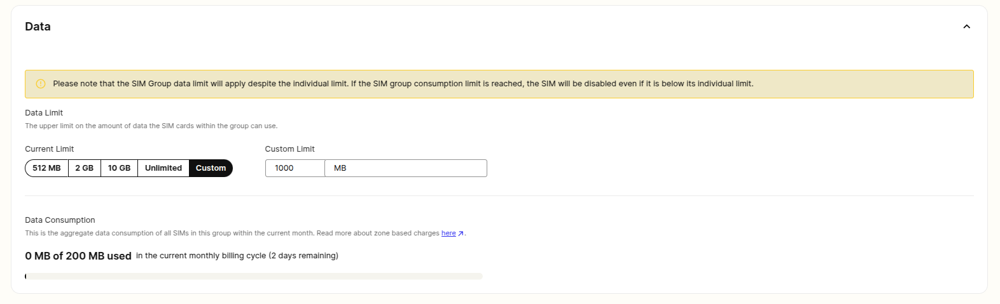

## Individual SIM Card Data Limits

Log into <https://portal.telnyx.com/#/wireless/sim-cards> with your account information.

Click on a SIM Card to drill in and scroll to the data section.

Click on "Custom," and input your preferred data limit.

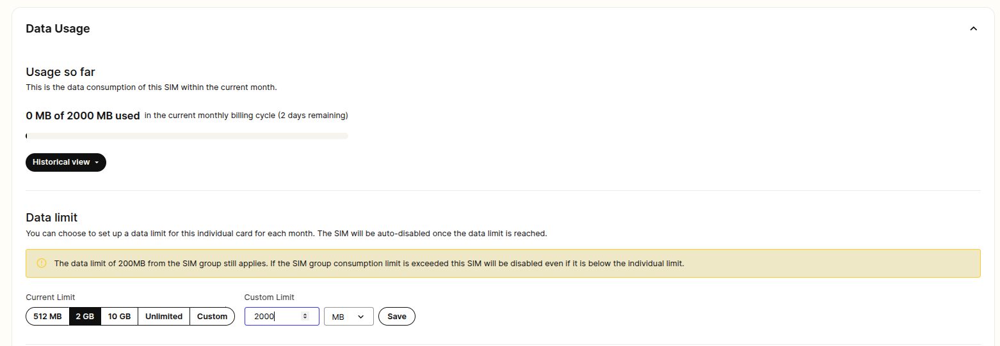

---

## SIM Card Data Limit Notification

This guide outlines how to configure custom alerts for data consumption on individual SIM cards. Users can establish a **Usage Notification Threshold** to set data limits. Upon reaching these limits, notifications are sent according to the user's chosen notification profile.

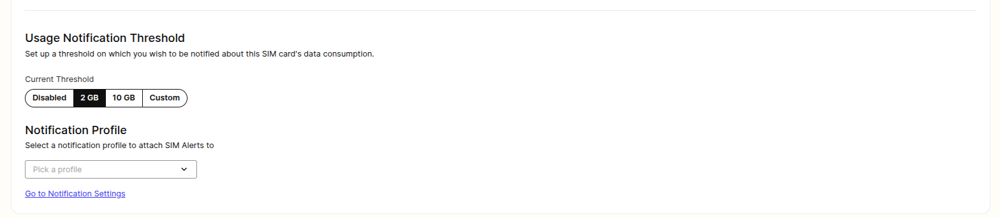

### **Step 1: Establishing a Notification Profile**

First, navigate to the notifications setup page at [Telnyx Notification](https://portal.telnyx.com/#/advanced-features/notifications) Setup to configure your notification preferences.

Start by defining a notification profile

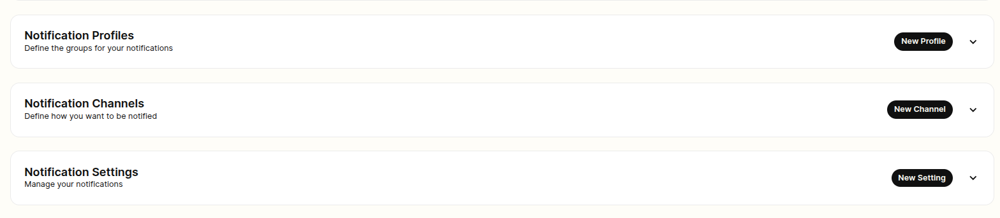

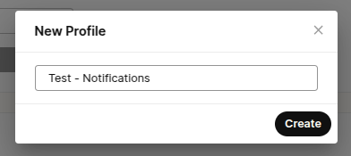

### **Step 2: Selecting a Notification Channel**

* After creating your notification profile, it's time to decide how you wish to be notified. You can create a notification channel and choose from the following options:

  + SMS
  + Voice
  + Email
  + Webhook

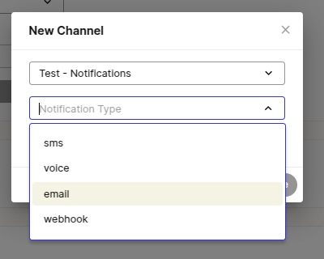

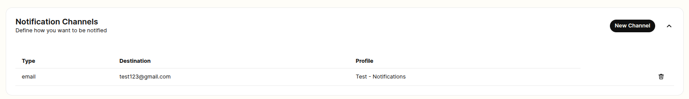

### **Step 3: Configuring Notification Settings**

* With your notification channel in place, proceed to configure the notification settings. Ensure you select "Data Usage Notifications" as your preferred notification type.

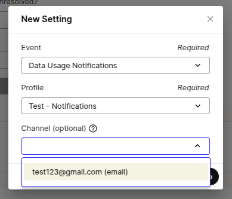

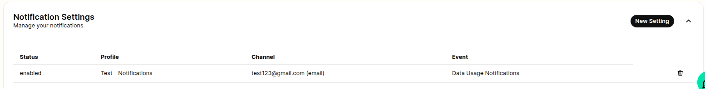

​**Step 4: Linking Notification Profile to SIM Card**

* Now that your notification profile is configured, assign it to the "Usage Notification Threshold" section for your SIM card. This links the data usage alerts directly to your SIM card settings.

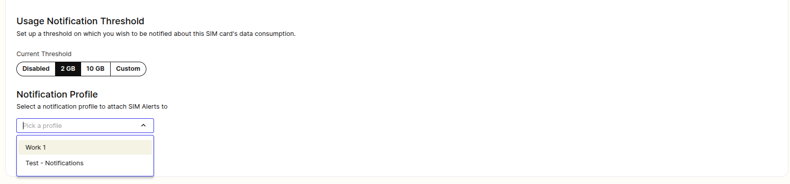

​

### **Receiving Notifications**

* Once all settings are configured, you will receive an alert from portal@telnyx.com when your data usage reaches the predefined threshold. This notification is a confirmation that your data limit has been met.  
  ​

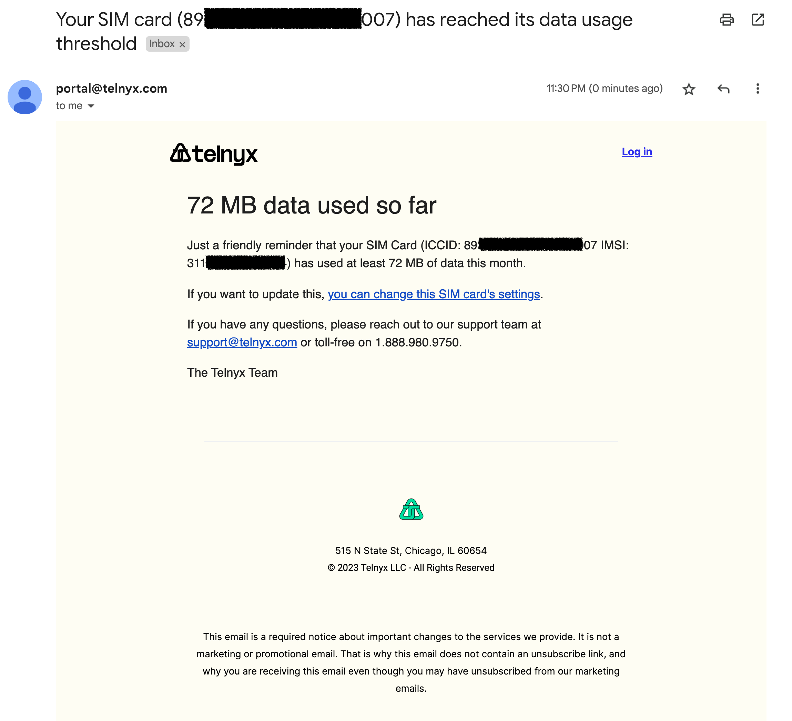

​  
​  
​  
​  
​

---

Related Articles

[How to set up a Telnyx SIM Card](https://support.telnyx.com/en/articles/3269600-how-to-set-up-a-telnyx-sim-card)[Telnyx Global SIMs FAQs](https://support.telnyx.com/en/articles/3270136-telnyx-global-sims-faqs)[SIM Setup and Configuration](https://support.telnyx.com/en/articles/4298710-sim-setup-and-configuration)[SIM Connectivity Logs](https://support.telnyx.com/en/articles/5666594-sim-connectivity-logs)[SIM Card Actions](https://support.telnyx.com/en/articles/5812328-sim-card-actions)

Did this answer your question?

😞😐😃

Table of contents
