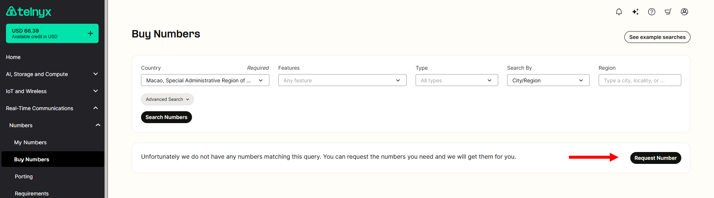
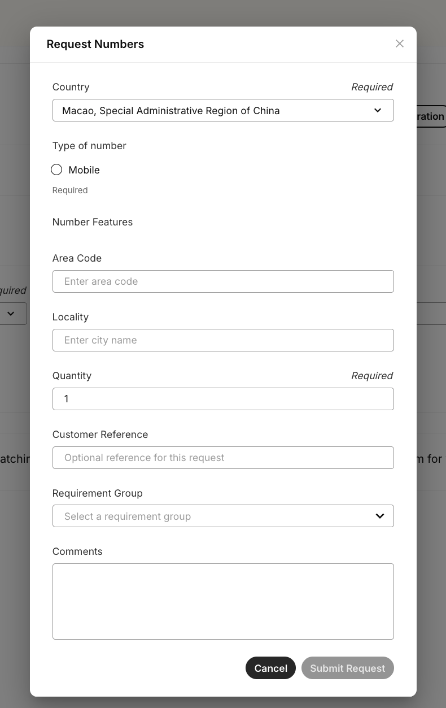

# Requesting Numbers

This article explains the process for requesting numbers of all kinds which may be unavailable to purchase from the… See Telnyx guidance and requirements.

At Telnyx, we understand that some numbers may not always be available at the time you make your search, we're always looking to keep our inventory up to date from local numbers in rural rate centers to global numbers in multiple different countries worldwide.

We also offer contiguous blocks! We typically sell blocks in the following increments: 10, 25, 50, 100.

If you haven't seen how easy it is to purchase numbers through your Mission Control Portal account, check out this [article](https://support.telnyx.com/en/articles/4380325-search-and-buy-numbers)!

#

## **Requesting Numbers (DID's)**

---

In the event that no phone number results are returned from your search request, you will have the option to submit a direct DID request from your account.

When you click "Request Number", a form will pop up. Please fill out the form and specify the phone numbers you would like to purchase. Our Number Operations team will use these details as they try to acquire the phone numbers on your behalf.

By submitting this form, you have created an "Advanced Order". Each Advanced Order will have its own unique ID for tracking. You can view your account's Advanced Orders [via the portal](https://portal.telnyx.com/#/numbers/advanced-orders) or via [the Advanced Order API](https://developers.telnyx.com/docs/numbers/phone-numbers/advanced-orders) directly.

Our Number Operations team will review your request within 3-5 business days. They will attempt to acquire the phone number(s) you requested. These requests are best effort, and Telnyx cannot guarantee that they will be able to fulfill it.

If the Number Operations team can fulfill your request, they’ll place a number order for the requested phone numbers on your account. If regulatory requirements apply, the order will remain in a “pending” state until you provide the required information. In other words, a successful advanced order confirms that the order was placed, but it won’t be completed until all regulatory requirements are met.

---

## FAQ

**Q: I want to receive notifications for my advanced orders. Is that possible?**

A: Absolutely. You can set up webhook and/or email notifications for advanced order events. Check out the ["Notifications" section of our developer guide](https://developers.telnyx.com/docs/numbers/phone-numbers/advanced-orders#notifications) and our [notification settings support article](https://support.telnyx.com/en/articles/4277896-notification-settings) for more details.

**Q: Why am I being asked for regulatory requirements? How do I provide those?**

A: In some cases, the Number Operations team needs your regulatory requirements in advance to secure the phone numbers you’ve requested. To provide regulatory requirements (1) create [a requirement group](https://portal.telnyx.com/#/numbers/requirements/requirement-groups) for the phone numbers you are requesting, (2) fill in the requirement group, and (3) [update your Advanced Order](https://portal.telnyx.com/#/numbers/advanced-orders) with that requirement group.

​
​

---

Related Articles

[E911 Setup Guide](https://support.telnyx.com/en/articles/1130683-e911-setup-guide)[My Numbers Page](https://support.telnyx.com/en/articles/4349113-my-numbers-page)[Search and Buy Numbers](https://support.telnyx.com/en/articles/4380325-search-and-buy-numbers)[International Number Requirements Tool](https://support.telnyx.com/en/articles/7003167-international-number-requirements-tool)[Numbering Team Best Practices](https://support.telnyx.com/en/articles/7205411-numbering-team-best-practices)

Did this answer your question?

😞😐😃
