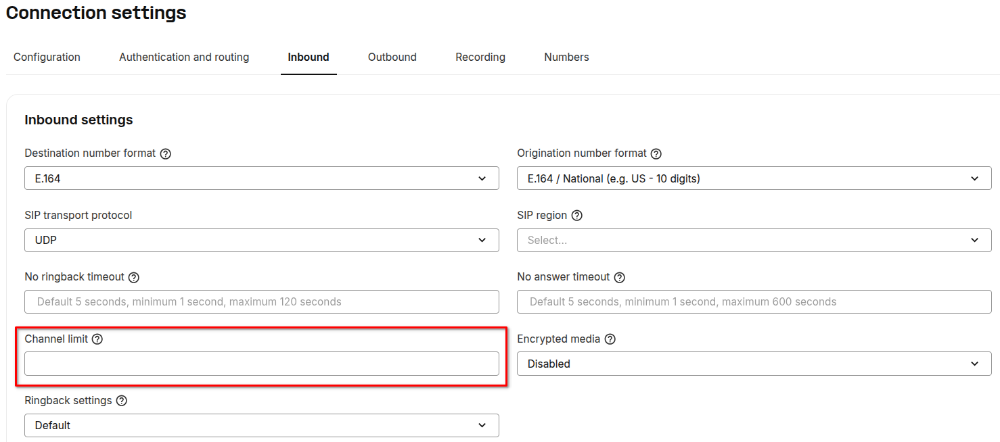
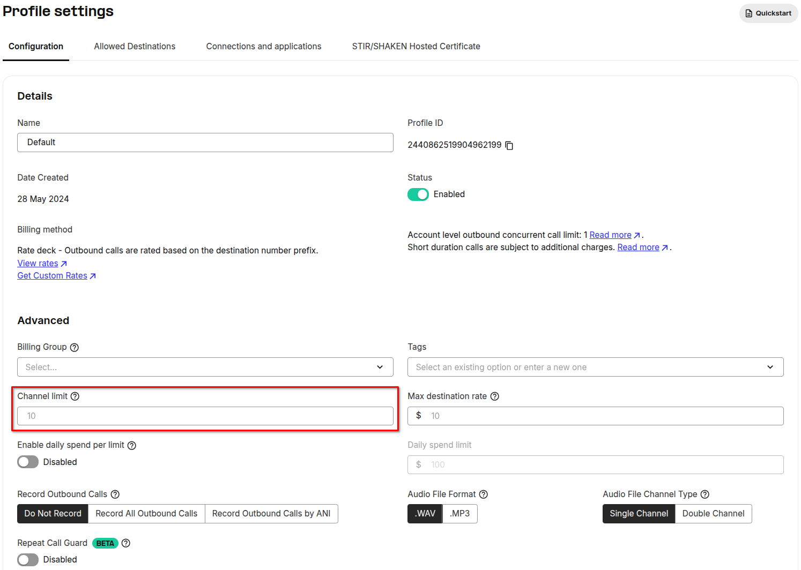
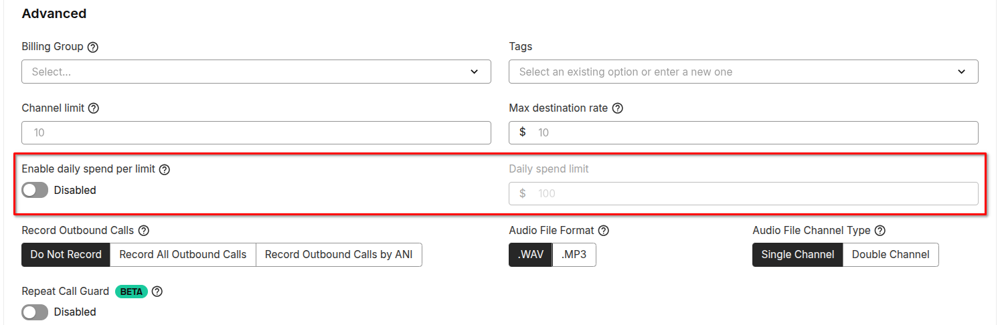
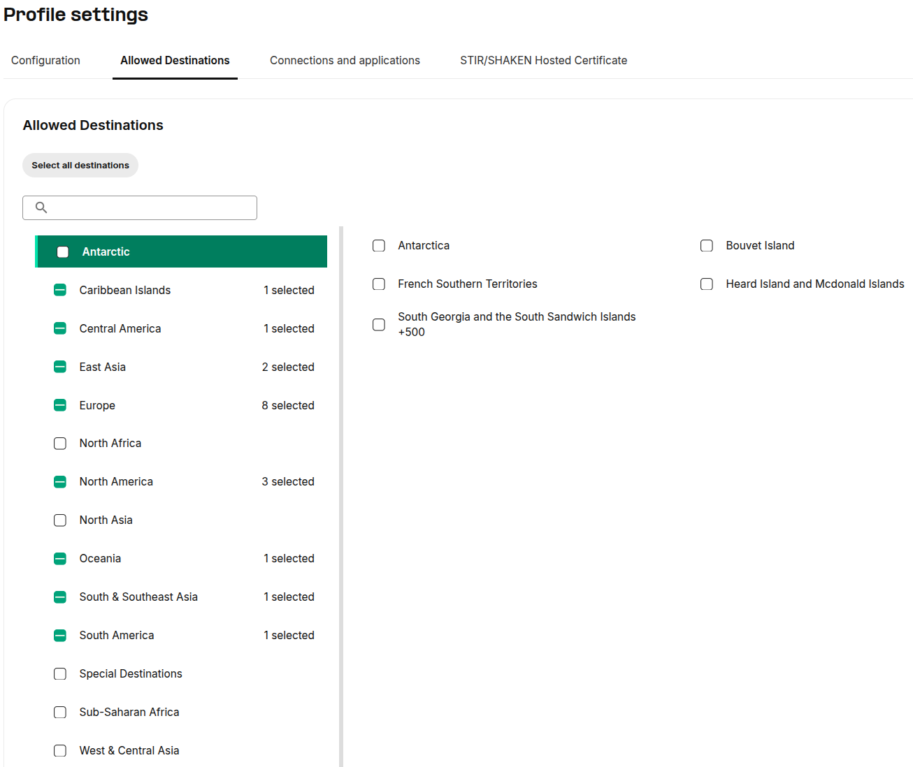
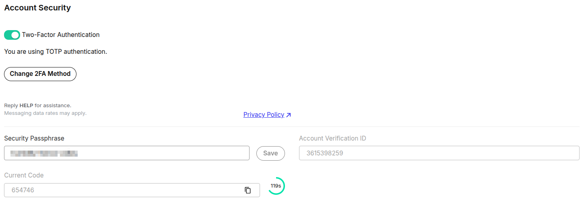
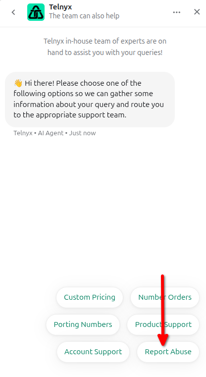

# Prevent Telnyx Account Fraud

In this article we will explain how to setup your account to prevent fraud. See Telnyx guidance and requirements.

## **How does Telnyx help prevent/minimize fraud?**

To prevent fraud, we suggest starting with the basics so you can ensure a number of measures to protect your account.

1. Secure your account passwords.
2. Review access logs on a regular basis.
3. Restrict web access to your PBX/VoIP system.

On the Telnyx Mission Control Portal, we take one step further and provide you with the ability to apply channel limit settings on your [connections](https://portal.telnyx.com/#/voice/connections) and [outbound profiles](https://portal.telnyx.com/#/outbound-profiles) settings.
​
​**Connections**
​
​*Inbound Settings:*

You can use a [Tech Prefix](https://support.telnyx.com/en/articles/2602782-ip-authentication-with-tech-prefix) on your connection in order to segment traffic if you use the same IP address for multiple clients.
​
Using multiple outbound profiles for each connection can allow you to have more granular control for the subsequent [outbound profile](https://portal.telnyx.com/#/outbound-profiles) settings.
​
​*Outbound Settings:*

## **Outbound Profiles**

Not only do we have channel limits but we have further settings on the outbound profile. Depending on the service plan you use, you'll see a ***max daily spend limit***, a ***max destination rate limit*** and the ability to ***blacklist certain countries***along with setting how many ***concurrent calls*** can be active at any time.

And for international service plans, you'll see the ability to allow or disallow regions or certain countries within those regions.​

---

## **Best Practice that helps to secure your Telnyx Account.**

* **Update password**

  Updating your Telnyx account password every 30,60 or 90 days helps you secure your account in case of any password leaks. This practice is also important as it restricts access to Telnyx portal for former employees. The employees within a company are not static, but always fluctuating. Some employees will leave the company, and new ones will take their place. Forcing password changes can ensure that former employees can no longer still access company systems.

* **Rotate API Keys**

  Rotating your API keys means, deleting the old keys and generating new keys if you are extensively using our endpoints. This is more of an issue where one API key may be shared by multiple applications or teams. Just like password change, policy organizations should also implement API key update policy where the old (existing) API key should be purged and a new key should be generated as it's free of cost.
* **Update SIP Connections credentials**

  The connection credentials should be updated similarly to periodic portal password updates. This could be a tedious task in case of updating passwords for many credential-based connections, however, this can be automated by updating the connection settings via API requests.
* **Review your Notification settings for Suspicious Outbound Voice Traffic**

  If our system detects any unusual outbound voice traffic patterns, you’ll receive an email notification immediately, enabling you to take swift action to secure your account. Below are examples of patterns that we look for:

  + Multiple calls either concurrently or in quick succession to the same destination prefix
  + Multiple on-going calls to the same high-cost destination
  + Multiple long-lived concurrent calls

  Make sure your notifications settings are correctly setup so that they are sent to the appropriate email addresses. [Here's a guide](https://support.telnyx.com/en/articles/4277896-notification-settings) on how to configure the notifications for your account.

* **Set 2FA Authentication**

  2FA is essential to web security because it immediately neutralizes the risks associated with compromised passwords. If a password is hacked, guessed, or even phished, that’s no longer enough to give an intruder access: without approval at the second factor, a password alone is useless.

  2FA also does something that’s key to maintaining a strong security posture: it actively involves users in the process of remaining secure and creates an environment where users are knowledgeable participants in their own digital safety.

  2FA can be enabled on your account [here](https://portal.telnyx.com/#/account/my-account/security).

## **How do I report abuse for Telnyx numbers?**

You can report abuse to us via our website form [here](https://telnyx.com/report-abuse), by emailing **[abuse@telnyx.com](mailto:abuse@telnyx.com)** or through our chat widget:

## **What about spoofing, robocalling and STIR/SHAKEN?**

* <https://telnyx.com/resources/what-is-spoofing-and-why-does-it-matter>
* <https://telnyx.com/resources/shaken-stir-explained>

## **What else is Telnyx doing?**

Our [resource center](https://telnyx.com/resources) covers more detail about latest trends and topics.
​
Here is some further recommended reading below:
​
​<https://telnyx.com/resources/how-telnyx-shuts-down-call-fraud-phone-scams>
​
​<https://telnyx.com/resources/how-to-improve-fraud-protection-in-the-mission-control-portal>
​
​
​

---

Related Articles

[How to Sign Up for a Telnyx account](https://support.telnyx.com/en/articles/5295540-how-to-sign-up-for-a-telnyx-account)[Telnyx Verify: 2FA made easy](https://support.telnyx.com/en/articles/5701653-telnyx-verify-2fa-made-easy)[Bring Campaigns to Telnyx](https://support.telnyx.com/en/articles/6339158-bring-campaigns-to-telnyx)[Chiro8000 and Telnyx Integration](https://support.telnyx.com/en/articles/7885470-chiro8000-and-telnyx-integration)[Telnyx + Vapi Integration](https://support.telnyx.com/en/articles/12538402-telnyx-vapi-integration)

Did this answer your question?

😞😐😃
