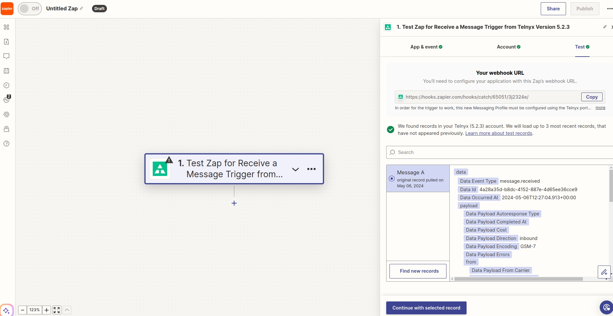
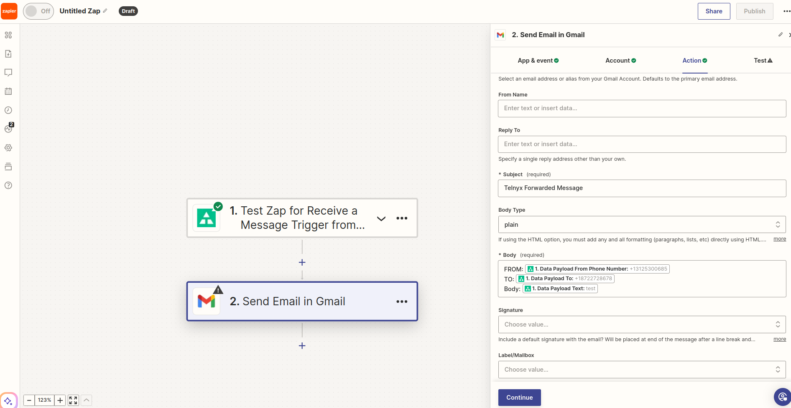
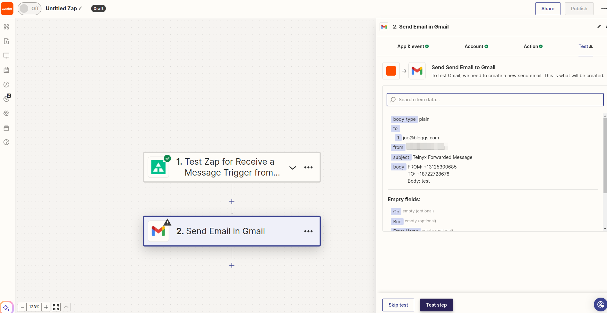
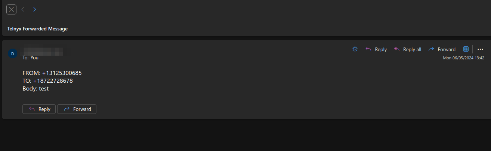
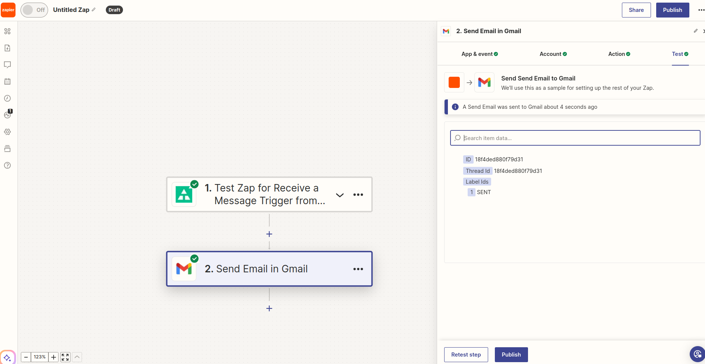

Zapier: Forward Texts to Email | Telnyx Help Center

[Skip to main content](#main-content)

# Zapier: Forward Texts to Email

In this article we will discuss how to set up text message forwarding to your inbox.

C

Written by Customer Success

May 25, 2024

Table of contents

[Jump to Instructions](#h_bc3d87c409)

We all use a lot of apps just to communicate with one another. [Zapier](https://zapier.com) connects 5,000+ apps so the conversations flow automatically. In this article you'll learn how to forward inbound text messages to your email account.

**Additional resources:**

* [Zapier Help Center](https://help.zapier.com/hc/en-us)
* [Zapier Community](https://community.zapier.com/)
* [Zapier University](https://learn.zapier.com/)

---

**IMPORTANT**: We apologise for any inconvenience, the steps outlined in this article do not currently function. Telnyx is aware that the Zap for "Receive a Message" is outdated and working on fixing it again.

# Get set up with the Telnyx Integration on Zapier

**Prerequisites**

* **Zapier**

  + Make sure that you’ve [signed up for a Zapier account](https://zapier.com/sign-up).
  + Follow this [link](https://zapier.com/apps/telnyx/integrations) to find the Telnyx Zapier integration and click the connect button to get started.
* **Telnyx Mission Control Portal**

  + Make sure you have [bought at least one phone number](https://support.telnyx.com/en/articles/4380325-search-and-buy-numbers) that is messaging enabled.
  + Make sure you've created a [messaging profile](https://support.telnyx.com/en/articles/3562059-setting-up-a-messaging-profile) and assigned it to the number you have purchased.
  + Make sure you've created an [API V2 Key.](https://support.telnyx.com/en/articles/4305158-api-keys-and-how-to-use-them)

## **1. Making your first Zap**

Let’s go ahead and make your first Zap!

1. Make sure you’re at the Zapier [homepage](https://zapier.com/app/dashboard).
2. In the top right corner, click the **Make a Zap!** button and configure the following:

   1. **Trigger app:** *Telnyx*.

      1. If Telnyx is not already in your list of triggers, you can search for it.
   2. **Choose Trigger Event:** Select *Receive a Message*.
   3. Click **Continue**.
   4. **Choose Account:** Select the account you’d like to use for receiving messages.

      1. Allow Zapier to access your Telnyx Account.
      2. Input your Telnyx API V2 Key.
   5. Click **Continue.**
3. Copy the **webhook url** that Zapier will provide and assign it to your Telnyx Messaging Profile you created in your Telnyx account.

   1. 
   2. 
4. Click **Test Trigger** to test your connection and pull in a sample inbound message webhook to set up the action stage.

   1. You should send a test message to your Telnyx number in order for the sample inbound message to reach your Zapier Webhook.
   2. If successful, Zapier will display the inbound message record as seen below.
   3. 
   4. Click **Continue with selected record**

      1. See [section 2](#h_ae2f30fc8a) for this part of the configuration.

[Back to Top](#h_bc3d87c409)

## 2. Integrate your Zap with your Email

Here you can search for your email provider, for example, Gmail.

1. Choose the *Send an email* action.
2. Click **Continue**.

   1. 
3. Choose an existing gmail account, or follow the directions to link a new account
4. Enter the email where you’d like to receive copies of your inbound messages.
5. Add Cc or Bcc as you wish
6. Choose your email address as the **To** address
7. For **Subject**, enter something unique (you most likely will want to filter this subject out from your inbox)
8. In the body enter something like this

   1. **From:** FROM\_PHONE\_NUMBER\_ZAPIER\_VARIABLE
   2. **To:** TO\_PHONE\_NUMBER\_ZAPIER\_VARIABLE
   3. **Body:** TEXT\_ZAPIER\_VARIABLE
   4. 
9. Click **Continue.**

   1. 
   2. Review the data and then click **Test Step**.

[Back to Top](#h_bc3d87c409)

## 3. Test your Zap

If the test step was successful, you should have received the email with the message contents.

At this point you can click **Publish** to turn on the Zap.

You've now set up a quick way to forward inbound messages from your Telnyx number to your real number.

[Back to Top](#h_bc3d87c409)

---

**Additional Resources**

Review our [getting started with guide](https://support.telnyx.com/en/articles/1176636-get-started-with-a-mission-control-account) to make sure your Telnyx Mission Control Portal account is set up correctly.

Additionally, you can check out:

* [Zapier Help Center](https://help.zapier.com/hc/en-us)
* [Zapier Community](https://community.zapier.com/)
* [Zapier University](https://learn.zapier.com/)

---

Related Articles

[Call Forwarding](https://support.telnyx.com/en/articles/1130657-call-forwarding)[Forwarding SMS to Your Mobile Number](https://support.telnyx.com/en/articles/3231942-forwarding-sms-to-your-mobile-number)[Automated Replies for Messages using Zapier](https://support.telnyx.com/en/articles/3232529-automated-replies-for-messages-using-zapier)[Textable Setup Guide](https://support.telnyx.com/en/articles/3685327-textable-setup-guide)[Receiving SMS on your Telnyx number](https://support.telnyx.com/en/articles/4348981-receiving-sms-on-your-telnyx-number)

Did this answer your question?

😞😐😃

Table of contents
