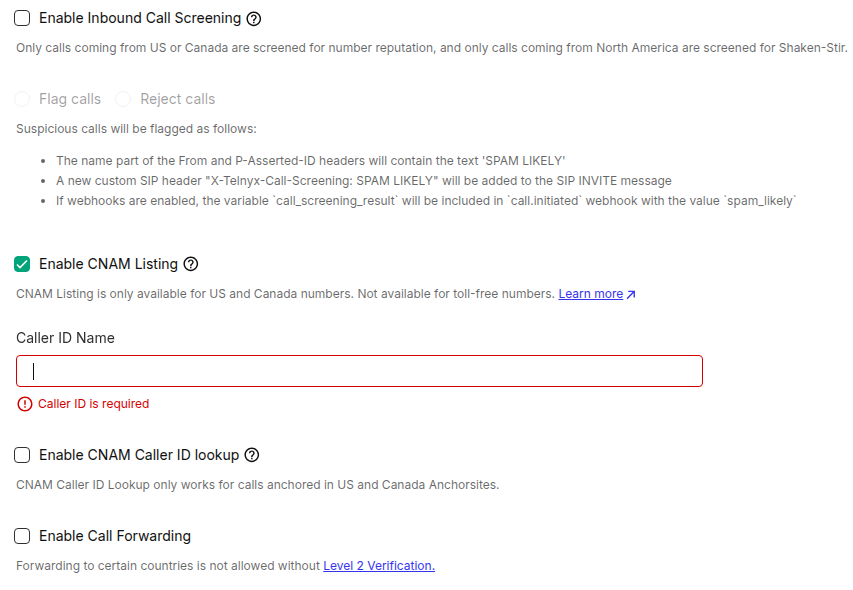

Telnyx - How to Handle Spam Scam Likely | Telnyx Help Center

[Skip to main content](#main-content)

# Telnyx - How to Handle Spam Scam Likely

We will explain the spam likely flag and what to do in case your number has been flagged.

Written by Dillin

January 29, 2026

Table of contents

# Telnyx - How to Handle Spam Likely

## Steps to follow to mitigate a "Spam or Scam Likely" flag on your phone number

If your phone number has been flagged as "Spam Likely" then:

1. Register your phone number with the FCR at <https://www.freecallerregistry.com/fcr/>.
2. Add CNAM by going to Mission Control Portal into the Real-Time Communications -> Numbers -> ["Manage Numbers"](https://portal.telnyx.com/#/numbers/my-numbers) section, find the "spam likely" phone number and click the pencil icon for advanced settings. Once in the advanced settings you can enable CNAM Listing and add a custom name under Voice tab. CNAM is not applicable for toll-free numbers. Having CNAM information is important to the engines that analyze and identify phone numbers as "spam likely".

   
3. Be patient, start to make calls, and wait for numbers to be aged. Time for aging can vary by carrier depending on which carrier is marking the number as "spam likely". There is currently not a rule of thumb for aging length for "spam likely" numbers but 1 week of healthy calls has been enough in certain cases in the past for a number to heal its "spam likely" status. Making unsolicited calls is how numbers get flagged as "spam likely" to begin with.
4. Lastly, you can push to the specific carrier that is flagging your calls. This page has a very complete set of contact information or forms to submit to each different terminating carrier:

   <https://www.ustelecom.org/the-industry-traceback-group-itg/call-labeling-and-blocking-points-of-contact/>

## **US Carrier Call Blocking**

Telnyx has become aware that major carriers in the US industry are actively flagging/blocking calls to their subscribers devices due to them deeming the calls as potentially fraudulent, where end users may see "**Fraud Risk**", "**Spam Risk**", "**Potential Spam**", "**Robocaller**", "**Scam Likely**" and other names which their carriers are prepending onto your caller IDs.

We are seeing that high volume calls from non-rotated caller IDs are experiencing a higher amount of user busy responses in the form of a *SIP 480/486 Busy Here.*

In some cases, it's also being reported that the carriers of the destinations are using services that are categorising calls as "Potential Spam" on the user's devices.

## **SIP 608 Rejected**

SIP Code 608 is a specific status code used in the Session Initiation Protocol (SIP) to indicate that the terminating carrier has blocked a call due to suspected fraud, preventing it from reaching the intended end user. Here are some important points to know about this code:

1. **Not Used by All Carriers:** It's important to note that the 608 code is not universally used by all carriers. However, it has been observed to be used by major wireless carriers but this means other 6XX errors may appear as well.
2. **Under FCC Review:** The 608 code is currently under review by the Federal Communications Commission (FCC). As part of their ongoing efforts to improve call labelling and blocking practices, the FCC may introduce a 603+ variance in the future, potentially replacing the existing 608 code.
3. **Signifies Call Blocking:** When you encounter a SIP Code 608, it signifies that the call you initiated was blocked by the terminating carrier, and therefore, it did not reach the intended recipient. This code indicates that the call was rejected before it reached its destination because the terminating provider believes that call is suspected fraud.
4. **Suspicious Traffic and Corrective Measures:** Receiving multiple instances of SIP Code 608 suggests that there may be something suspicious about the traffic associated with your communications that needs to be corrected. It's crucial to take corrective actions promptly. Here are two recommended steps to address this issue:

## **What To Do?**

We also understand that there are many valid & legitimate use cases, where there is a necessity for high volume calls (e.g. alerts, appointment reminders, etc.) Providers and their analytics partners have established mechanisms for callers to seek redress to fix any inadvertent call labeling or blocking concerns, as well as to register their numbers in the first instance.

The first step is to register with the Free Caller Registry. Several carriers use that to pull company information for phone numbers so having your numbers registered here will help lower the chances of terminating carriers flagging your numbers for spam.

<https://www.freecallerregistry.com>  
​

Next step is to push to the specific carrier that is flagging your calls. This page has a very complete set of contact information or forms to submit to each different terminating carrier.

<https://www.ustelecom.org/the-industry-traceback-group-itg/call-labeling-and-blocking-points-of-contact/>  
​

## **STIR/SHAKEN Details**

We are committed to combating spoofing and illegal robocalling through implementing the industry-wide STIR/SHAKEN solution, in an effort to play our part in reducing these illegal occurrences. You can read more about our three-part [articles](https://telnyx.com/resources/shaken-stir-explained) where we discuss the implementation in detail.

---

Related Articles

[SIP Trunking - Methods/Requests & Responses](https://support.telnyx.com/en/articles/4304898-sip-trunking-methods-requests-responses)[Telnyx SIP Response Codes](https://support.telnyx.com/en/articles/4409457-telnyx-sip-response-codes)[PSTN Replacement / Local Calling with Telnyx](https://support.telnyx.com/en/articles/6622229-pstn-replacement-local-calling-with-telnyx)[Inbound Call Screening](https://support.telnyx.com/en/articles/8037040-inbound-call-screening)[Understanding SIP 603+ carrier rejections](https://support.telnyx.com/en/articles/15395095-understanding-sip-603-carrier-rejections)

Did this answer your question?

😞😐😃

Table of contents
