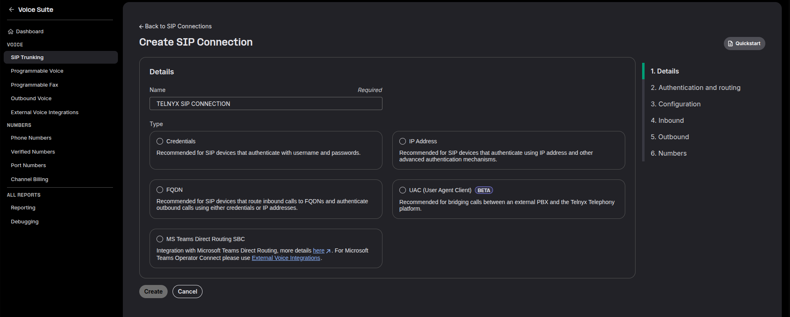
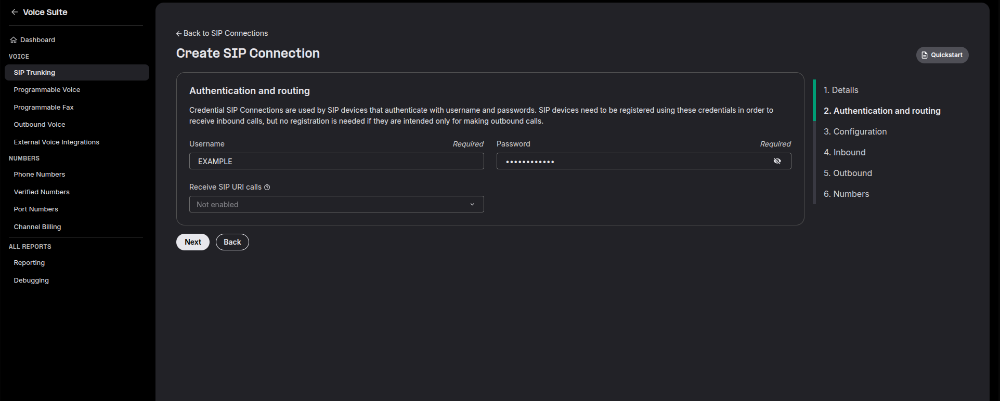
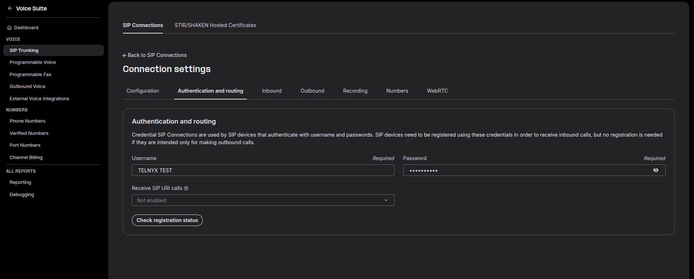
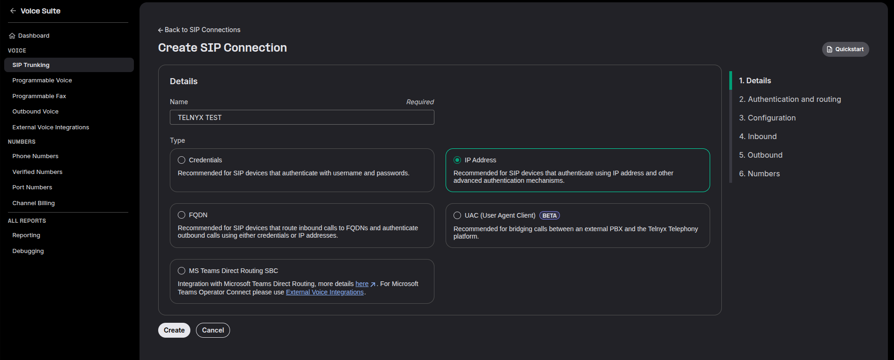
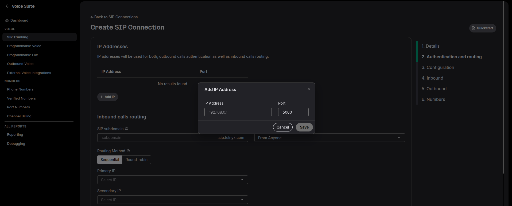
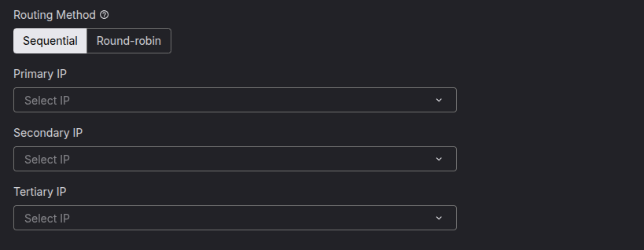
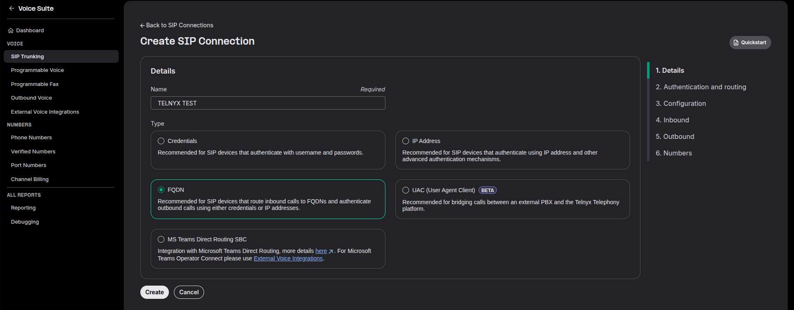
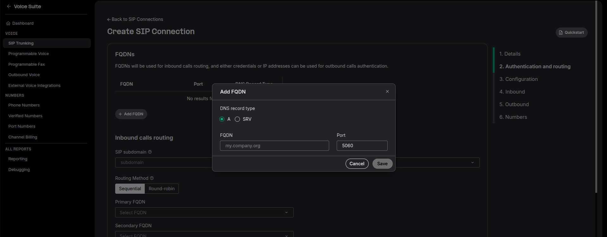
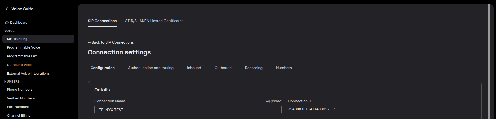
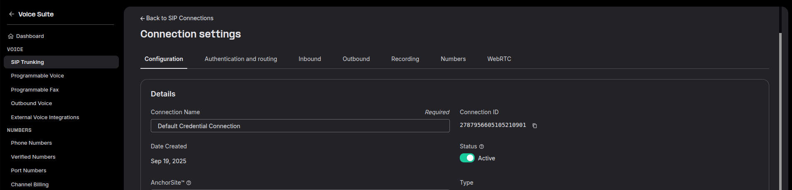

SIP Connection: Types | Telnyx Help Center

[Skip to main content](#main-content)

# SIP Connection: Types

This article explains the different types of SIP Connections available in the Mission Control Portal.

Written by Dillin

May 20, 2026

Table of contents

# What are the Sip Connection Types?

We offer four different authentication types to register your switch to ours. This article will show you how to configure these types within the Mission Control Portal and explain the various settings that SIP Connections have. (Details on setting up MS Teams SBC can be found here: [https://support.telnyx.com/en/articles/5253876-ms-teams-telnyx-pstn](https://support.telnyx.com/en/articles/5253876-configuring-telnyx-with-microsoft-teams-direct-routing))

***Call Control:*** If you are looking to setup a programmable voice connection/application, this can be done in the programmable voice section of the Portal. Click the button below to go there.

[Portal - Programmable Voice](https://portal.telnyx.com/#/voice/connections)

[Call Control Documentation](https://developers.telnyx.com/docs/voice/programmable-voice/voice-api-fundamentals)

## SIP Connection Registration Types Explained

Deciding on what registration type to use depends on your use case. As a rule of thumb, a **credential-based** **connection** is used if you have a **dynamic public IP address**. If you have a **static IP address**, then you can use an **IP-based connection** instead.

Below are guides on how to setup the following connection types:

* Credential-based Authentication
* IP-based Authentication
* FDQN-based Authentication

## Credentials Connection Setup

### 1. Click Create SIP Connection at the SIP Connection Tab in the Portal.

### 2. Enter the name you wish to have for your connection.

### 3. Select Credentials as the Connection Type

A username and password will automatically be generated but you can change the credentials via the Authentication & Routing Configuration section within the SIP connection's settings. It is **highly recommended** that you choose a **strong password**.

### 4. Click next or your user details will not be saved

**Note:** *Once your **Credential Connection** is created, you can display the username and password by going into your SIP Connection > Authentication and routing*

## IP Address Connection Setup

### 1. Click Create SIP Connection at the SIP Connection Tab in the Portal.

### **2. Enter the name you wish to have for your connection.**

### 3. Select IP Address as the Connection Type

Enter an IP address and port via the IP addresses section within the SIP connections settings and click **Add** IP address**.**

You can add multiple IP addresses and select the order of preference. There are two routing methods to choose from; **Sequential** and **Round Robin**.

**Note:** If you do not have a static IP address, it will change and you will be unable to receive or make calls.

## FQDN Connection Setup

### 1. Click Create SIP Connection at the SIP Connection Tab in the Portal.

### **2. Enter the name you wish to have for your connection.**

### **3. Select FQDN as the Connection Type**

This connection type is slightly different as it has an inbound setting and an outbound setting.

In the **Next step**, clic on add FQDN, choose your **FQDN** type (for most users this will be **A**) and enter your **Fully Qualified Domain Name** in the input box. Click **Save** to add the address.

In the **outbound calls authentication**, choose either **Credentials** or **IP Address**, and configure using the guides above.

**Note:** *You can assign multiple FQDN addresses on the Inbound section and multiple IP addresses on the Outbound section to a single FQDN registered connection. You can change the routing priority and routing method in the connection settings.*

## Where can I find the connection id?

Once a connection is created, you can find the unique connection id just below the settings sub tab of the SIP Connection as seen below:

Take a look at our [SIP Connections API](https://developers.telnyx.com/docs/voice/sip-trunking/configuration-guides/index#sip-trunking-configuration-guides) if you want to programmatically update the SIP Connection settings.

## How do I deactivate or disable my SIP Connection?

To deactivate or disable your SIP Connection visit the SIP Connections page, select edit on your desired SIP Connection, and click the toggle under the "status" option. This will deactivate the SIP Connection which will mean inbound calls and outbound calls will not be processed. See this image below for reference.

---

Related Articles

[SIP Connection Failover Guide (IP/FQDN-Based)](https://support.telnyx.com/en/articles/1176364-sip-connection-failover-guide-ip-fqdn-based)[SIP Connection: Settings](https://support.telnyx.com/en/articles/4351104-sip-connection-settings)[SIP Registration](https://support.telnyx.com/en/articles/4363904-sip-registration)[Guide to SIP AnchorSite® Settings](https://support.telnyx.com/en/articles/5271423-guide-to-sip-anchorsite-settings)[Yeastar S-Series: Telnyx SIP](https://support.telnyx.com/en/articles/5748952-yeastar-s-series-telnyx-sip)

Did this answer your question?

😞😐😃

Table of contents
