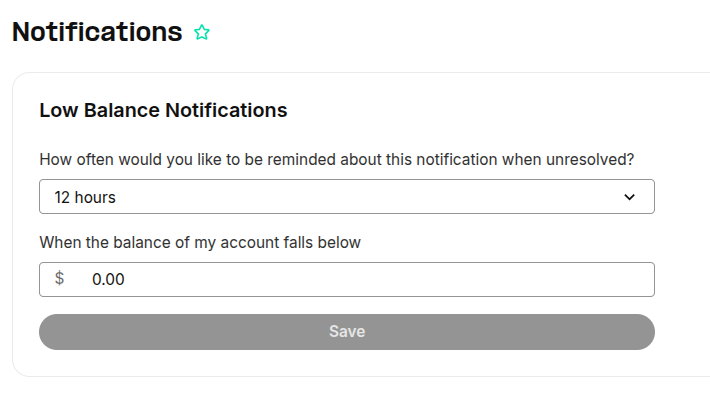
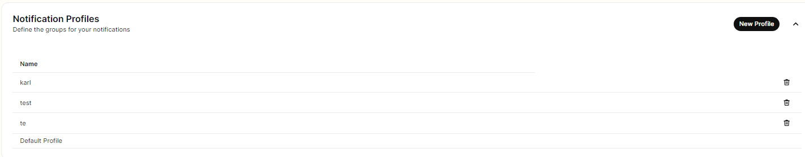
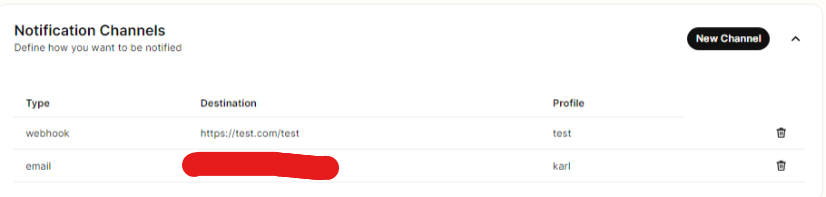
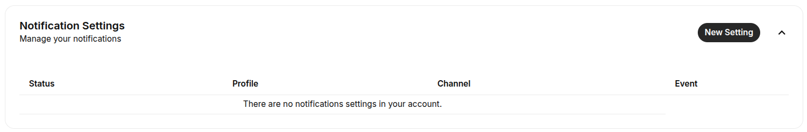

# Notification Settings

This article details the functionalities of the notification settings in your Telnyx Mission Control… See Telnyx guidance and requirements.


## **Overview of Notification Settings**

In recent times we've introduced more functionality related to the notification settings in your Mission Control Portal. Typically, this section is only configurable by account organization owners.
​
Below will detail each section of the Notification Settings and how you can set it up.

## **Configuring Notification Settings**

The **[Notifications](https://portal.telnyx.com/#/app/advanced-features/notifications)** Settings can be found under the **Account Settings > Advanced Settings** section,in the left hand side of your Portal. The below button will take you straight to notifications either.

[Notifications](https://portal.telnyx.com/#/app/advanced-features/notifications)


## **Types of Notifications**

There are two types of notifications in your Mission Control Portal:

## **1. Low Balance Notifications**



This section is for Low Balance Notifications, where you can choose how often you would like to be reminded about this notification when unresolved, and also the amount of balance that would be needed to trigger the notification. Changes here will be auto-saved and automatic emails are sent to the account owner's email address.

## **2. Event Notifications**

This section is used to configure and customize notifications for events related to your account. Support events are:

1. **Send Newly Available Invoice** - a new invoice is available in the portal. Currently, only email notifications are supported for newly available invoices.
2. **When a Number Order Completes** - a number order you submitted has completed (either in a success, failure, or partial success). Currently, only webhook notifications are supported for completed number order events.
3. **Low Available Credit** - sent when the available credit is below the configured threshold. This is the same notification as the Low Balance Notification but here you can configure other channels in case you need to send the low balance notification to several people or through several channels.
4. **Port In Notification** - Telnyx has received a port in request from your account, you'll also get updates on the process.
5. **Port Out Notification** - Telnyx has [received a port-out notification](https://support.telnyx.com/en/articles/2030667-i-received-a-port-out-notification) for a number on your account.
6. **SIM Card Status Change** - each time one of your SIM cards changes status, a notification will be triggered.
7. **Data Usage Notification** - sent when a SIM reaches the usage threshold set for data usage notifications.
8. **Suspicious Outbound Voice Traffic -** If our system detects any unusual outbound voice traffic patterns, you’ll receive an email notification immediately, enabling you to take swift action to secure your account. Below are examples of patterns that we look for:

   * Multiple calls either concurrently or in quick succession to the same destination prefix
   * Multiple on-going calls to the same high-cost destination
   * Multiple long-lived concurrent calls

## **Notification Setup**

Here we will go through step by step how to setup your Notification settings.

**1. Notification Profiles**

* This is where you define the groups for your notifications and select which profile you want to be notified. In order to create a new profile just click **New Profile** and enter the name you wish to call the new profile. You can view and manage your Notification Profiles in the drop-down beside new profile.
  ​
  ​

  

**2. Notification Channels**

* Here you can define how you want to be notified either through either SMS, Voice, Email or Webhook. In order to setup a new channel just click **New Channel,** then select which Notification Profile you want to be notified, how you you want to be notified (SMS, Voice etc.) and to what destination ( DID, example.org etc.). You can view and manage your Notification Channels in the drop-down beside new channels.



## 3. **Notification Settings**

* Lastly we have Notification Settings, where you can mange your notifications and select which **events** you want to be notified about and to which Notifications Profile. In order to create new settings just click on **New Settings,** where you will select what event you want to be notified about and to which Notifications Profile. You can view and manage your Notification Settings in the drop-down beside new settings.




---

## **4. Webhook Examples**

Number Order Complete

```
{
    "data": {
        "event_type": "number_order.complete",
        "id": "da5ddb44-4eda-45f0-b8a7-913a4092eccc",
        "occurred_at": "2024-09-13T09:12:21.140324Z",
        "payload": {
            "billing_group_id": null,
            "connection_id": null,
            "created_at": "2024-09-13T09:12:19.728170+00:00",
            "customer_reference": null,
            "id": "e3dcb7d4-4f0b-4800-bd9f-b04cc684a82f",
            "messaging_profile_id": null,
            "phone_numbers": [
                {
                    "bundle_id": null,
                    "country_code": "US",
                    "id": "5fd37101-437d-4138-9a09-98c13bd9d73f",
                    "phone_number": "+1312XXXXXXX",
                    "phone_number_type": "local",
                    "record_type": "number_order_phone_number",
                    "regulatory_requirements": [],
                    "requirements_met": true,
                    "requirements_status": "approved",
                    "status": "success"
                }
            ],
            "phone_numbers_count": 1,
            "record_type": "number_order",
            "requirements_met": true,
            "status": "success",
            "sub_number_orders_ids": [
                "1ae729ee-6e07-43db-bb05-d3077ba6b85e"
            ],
            "updated_at": "2024-09-13T09:12:19.728170+00:00"
        },
        "record_type": "event"
    },
    "meta": {
        "attempt": 1,
        "delivered_to": "https://128e-93-107-73-249.ngrok-free.app"
    }
}
```

---

Related Articles

[E911 Setup Guide](https://support.telnyx.com/en/articles/1130683-e911-setup-guide)[SIM Reporting & Analytics](https://support.telnyx.com/en/articles/3679913-sim-reporting-analytics)[Billing Setup & Billing Groups](https://support.telnyx.com/en/articles/4280500-billing-setup-billing-groups)[How to Leverage Webhooks](https://support.telnyx.com/en/articles/4334722-how-to-leverage-webhooks)[Configuring Call Control/TeXML Applications - Voice API](https://support.telnyx.com/en/articles/4374050-configuring-call-control-texml-applications-voice-api)

Did this answer your question?

😞😐😃
