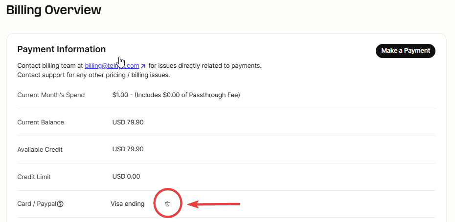
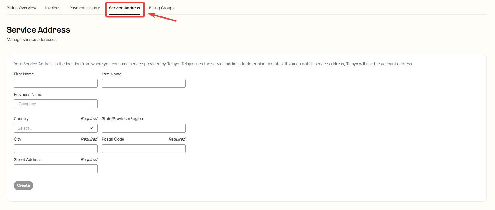
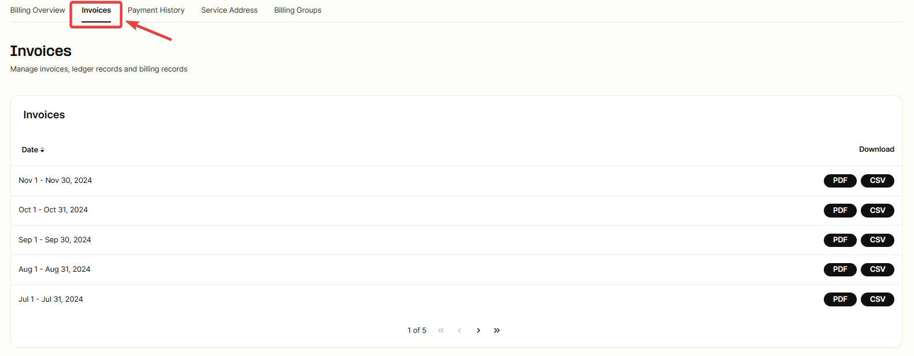
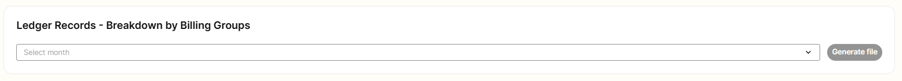
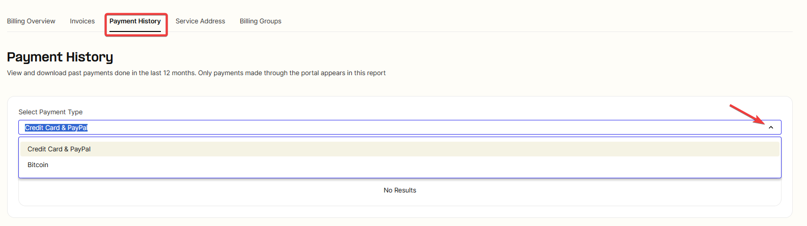
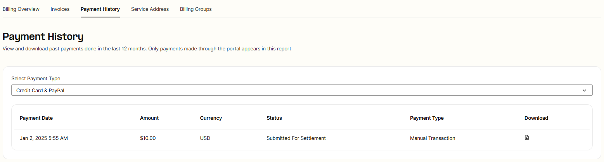

Billing Setup & Billing Groups | Telnyx Help Center

[Skip to main content](#main-content)

# Billing Setup & Billing Groups

This article details the functionalities of the Billing and Billing Groups settings in your Telnyx Mission Control Portal

Written by Alex Conroy

January 2, 2025

Table of contents

The Mission Control Portal offers various functionalities to help keep track of billing information. This article will elaborate on how to make use of the Billing and Billing Groups sections of the portal.

# **Video Walk-through for Billing & Billing Groups**

Coming soon! This walk-through will demonstrate setting up your Billing & Billing Groups tab.

## **Configuration of Billing & Billing Groups**

You can find both in [Billing Overview](https://portal.telnyx.com/#/billing/payment) found in the top right-hand corner of your portal, in the drop-down menu. Billing Groups can be found next to Billing in the navigation bar at the top of this section.

## **Billing Section**

The portal's [Billing section](https://portal.telnyx.com/#/app/billing/payment) is where you will primarily manage your balance, payment method, auto-recharge preferences, and access your invoices.

## **Payment Information**

Here you can view your current balance and add a payment method to set up for recurring payments. PO Boxes are unsupported when you save a billing address for a payment method.

Simply click **Make Payment** in the bottom right and fill out the required information.

---

## **What is Scheduled Payment?**

When you activate scheduled payments using the toggle feature, you can specify a payment amount, choose a payment method, and select a preferred day each month for Telnyx to automatically process the payment. This convenient option ensures your account balance is topped up without the need for manual intervention and helps avoid disruption to your services in case of potential negative balance.

---

## **What payment methods do you cover or have available?**

We provided a reference screenshot below where you can select the method or mode of payment.

Telnyx allows of customers to make payments with:

* Credit Card
* Paypal
* Bitcoin
* [ACH Direct Debit](https://support.telnyx.com/en/articles/7045419-ach-direct-debit-payment-method)

Your last payment method will be saved for future payments. Once you have a saved payment method you will get the option to delete your current payment method.

You will receive a payment receipt PDF upon successful transactions via Credit Card, PayPal, Bitcoin, or ACH done through either manual top-up or auto-recharge.

In the event of a failed transaction attempt, you will be automatically alerted via email to ensure you are promptly notified.

Please note the following:

## **Top Up Limits**

New users can make payments up to $100 on **day one** of account creation. That limit increases by $50/day and applies as a whole across any payment method you use. If you would like this limit to be removed, please request [Level 2 Verification](https://portal.telnyx.com/#/account/my-account/verifications).

## **Payment Method Restrictions**

1. **Attention: Your Mission Control Account is Under Review**

   1. New accounts are subject to a payment method review once a payment method is added. This review can take up to 48 hours, excluding weekends.
   2. Once the review is successful you will receive an email with the following subject - **Attention: Payment Method Allowed**
   3. If your payment method review is unsuccessful, you will receive an email **Attention: Suspension of Your Credit Card and PayPal Payment Methods**

      1. Please contact [support@telnyx.com](mailto:support@telnyx.com) for a further review in these circumstances.
      2. This may require further [KYC](https://support.telnyx.com/en/articles/5295540-how-to-sign-up-for-a-telnyx-account#h_2d0ddcbae2) details.
2. Please note the billing address you provide must match the country of the phone number you used to verify your account. This restriction can be removed if your account is Level 2 verified. Find out how to apply for Level 2 verification [here](https://support.telnyx.com/en/articles/1130595-account-verification).

## **PayPal Fees**

Starting July 3rd 2023, a 3% transaction fee applicable on PayPal payments for customers who have access to ACH payments.

## Auto Recharge Limits

When auto-recharge is triggered, we will always charge your saved payment method an amount that brings your balance up to the **Threshold + Recharge** amount.

This may cause significantly higher charges than your set recharge amount if your balance falls far below your set threshold due to monthly charges.

Auto-recharge is limited to 10 times in a 24-hour period. You will experience service disruption if 10 recharges of your recharge amount cannot cover a day of usage. This limitation cannot be removed.

Please ensure you set up [notifications](https://portal.telnyx.com/#/advanced-features/notifications) so you can promptly make payments manually.

The auto-recharge threshold is based on your available credit. Once the available credit reaches the threshold amount set the auto-recharge is triggered.

## **Replacing Saved Payment method**

We only save one payment method, so if you want to change your credit card you will need to first delete your current one by clicking on the trash icon next to your current payment method.

Once deleted you can add a new payment method by making a payment following the steps at the beginning of this article. It's also worth noting that the minimum payment is of $10 USD.

To delete a saved ACH payment method, you can click on the trash can icon to the right of the listed bank account.  
​

Your Service Address is the location from where you consume service provided by Telnyx. Telnyx uses the service address to determine tax rates. If you do not fill service address, Telnyx will use the billing address.

---

## **Invoices**

Below payment information, you'll find **[Invoices](https://portal.telnyx.com/#/billing/invoices).** Here you can download and view your invoices for past months.

Invoices for the previous month will appear during the **first few days of the new month**.

These can also be sorted by their **status (Paid, Unpaid)**  
​

Within the invoice section you can also generate Ledger & Billing Records for past months which will show your usage and payments broken down by your **Billing Groups or Managed Accounts.**

### Ledger Records - Breakdown by Billing Groups

### Billing Records - Breakdown by Managed Accounts

---

## **Payment History**

The [Payment History](https://portal.telnyx.com/#/billing/history) page allows you to view payments made in the last 12 months on the portal, along with an option to download payment receipts.

You can select the payment type that was used to individually see your credit card receipts, paypal receipts or bitcoin receipts.

---

## Service Address

Your Service Address is the location from where you consume service provided by Telnyx. Telnyx uses the service address to determine tax rates. If you do not fill service address, Telnyx will use the account address. Read more about it [here](https://support.telnyx.com/en/articles/6420959-sales-gst-and-telecommunication-taxes).

---

## **Billing Groups**

The Telnyx Mission Control Portal gives you the ability to create and assign Billing groups. Billing groups let you categorize usage reports and end-of-month invoice records. A Billing Group can be assigned to **Numbers** and **Outbound Profiles**.

## **Creating a Billing Group**

To create a billing group, enter the desired name of the group and click create. You can delete created Billing groups in the section below creation.

## Assigning Billing Groups

To add a Billing group to a **number** select the **billing group option** on your number and select the group you'd like to associate with the number.

Adding a Billing Group to an **Outbound Profile** can be done in the **Advanced Settings** of your Outbound Voice Profile.

You can see more details in our resource center [here](https://telnyx.com/release-notes/new-feature-release-billing-groups).

---

Related Articles

[E911 Setup Guide](https://support.telnyx.com/en/articles/1130683-e911-setup-guide)[Notification Settings](https://support.telnyx.com/en/articles/4277896-notification-settings)[Sansay: SBC VSXi Setup](https://support.telnyx.com/en/articles/4301888-sansay-sbc-vsxi-setup)[Grandstream HT802: Telnyx Setup](https://support.telnyx.com/en/articles/5725071-grandstream-ht802-telnyx-setup)[Invoice Overview](https://support.telnyx.com/en/articles/6987563-invoice-overview)

Did this answer your question?

😞😐😃

Table of contents
