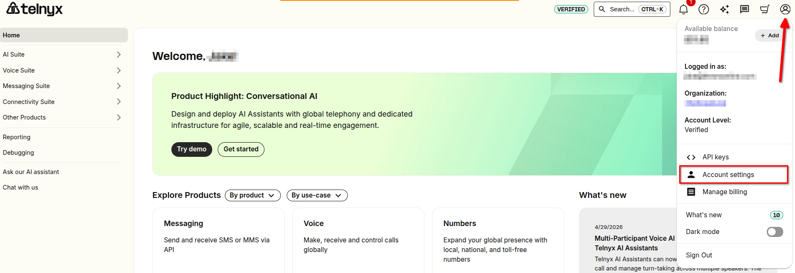
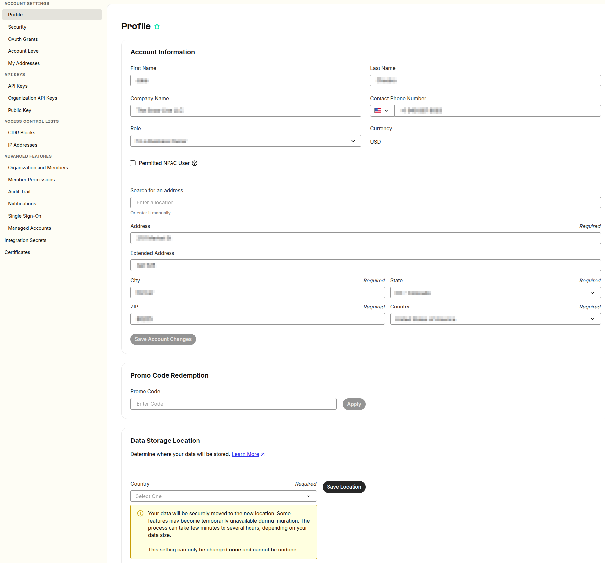
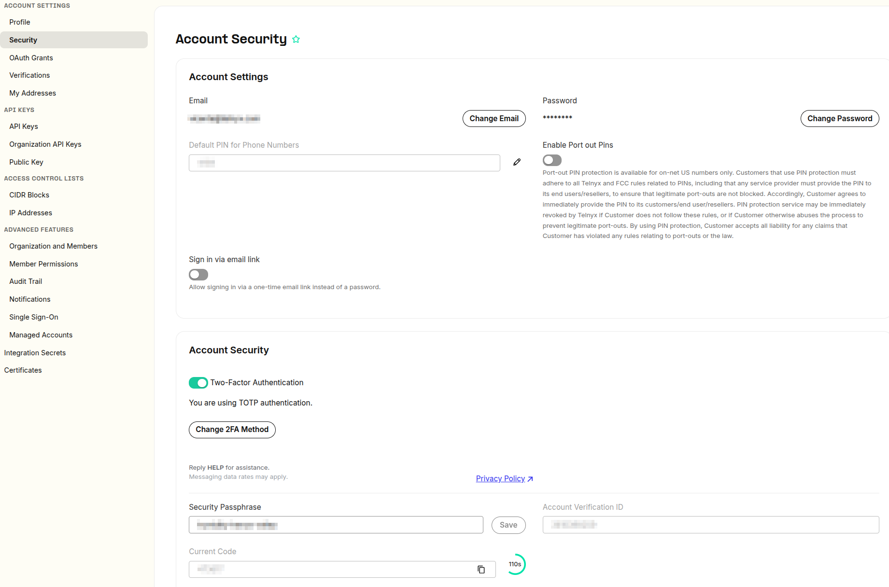

How to setup your Account Settings | Telnyx Help Center

[Skip to main content](#main-content)

# How to setup your Account Settings

This article entails the in-depth setup of Account settings on your Mission Control Portal

Written by Ruchita Jain

May 1, 2026

Table of contents

This article describes the "**Account**" section where you can set up your account information, redeem your promo code or setup your account with 2FA to avoid any security violations.

## **Configuring Your Account Settings**

The [Account](https://portal.telnyx.com/#/account/general) section is located under profile icon on the top right hand corner of your account. When you click on the top right corner, there will be drop down menu and one of the options will be "Account Settings".   
​  
Click on this button below and it will directly get you to the Account Profile page.

[Account](https://portal.telnyx.com/#/account/general)

## **Step by Step Guide to Account**

## **1. Account information**

This section allows you to enter in your personal details and helps in situations where you require account verification or when our support team need to contact you.

### **Promo code Redemption**

From time to time, Telnyx may issue promo codes and it is within this section that you can redeem them.

### Data Storage Location

Choose where to store data to comply with its regulations and laws.

The current available options are:

* United States
* Germany
* Australia

This setting can only be changed **once**, at which point we will begin migrating your data to the new region.

Learn more [here](https://telnyx.com/data-privacy).

## **2. Access Control IPs**

Add your list of SIP Signals or media IP's that originate traffic to our network, this prevents your SIP traffic from being blocked as part of any actions we take to secure our network.

## **3. Security**

In this section, you have the ability to edit your email, password and set up two factor authentication, among other things.  
​

Each feature is detailed below:

### **Email**

**I want to change my account email address.**

If you ever want to change your account email address, this is the right field to do that. You will need to provide the current password.

### **Password**

**I want to change my account password.**

Update this field if you ever need to change your password, alternatively you can visit our [password reset](https://portal.telnyx.com/#/login/password-reset) page where you can send yourself a password email reset notification and follow the steps outlined.

### **Sign in via email link**

This allows you to log into your Telnyx account via a one-time link sent to your email instead of a password.

### **Two-Factor Authentication (2FA)**

You can setup your two-factor authentication either by using [TOTP](https://telnyx.com/resources/totp-meaning) app or sending a code to your phone number. This adds an extra layer of security to your account. Click on this [link](https://support.telnyx.com/en/articles/3739748-2fa-totp-setup) to get more information.

### **Security Paraphrase**

You can setup your personal paraphrase. The purpose of security paraphrase is to verify your account when you reach out to support, especially for any changes that need to be made. For example, if you want to cancel your account, you will be requested to verify your security paraphrase.

### **Account Verification ID**

This is your account verification id number, another option to use when reaching out to support.

### **Numeric Security Codes**

These codes are ephemeral and rotate every 3 minutes, also another option to use when reaching out to support.

##

---

Related Articles

[What is my SIP Account Connection password?](https://support.telnyx.com/en/articles/1130713-what-is-my-sip-account-connection-password)[Configuring Call Control/TeXML Applications - Voice API](https://support.telnyx.com/en/articles/4374050-configuring-call-control-texml-applications-voice-api)[How to Sign Up for a Telnyx account](https://support.telnyx.com/en/articles/5295540-how-to-sign-up-for-a-telnyx-account)[Zoiper 5 Pro: Telnyx Setup](https://support.telnyx.com/en/articles/5717957-zoiper-5-pro-telnyx-setup)[Grandstream HT802: Telnyx Setup](https://support.telnyx.com/en/articles/5725071-grandstream-ht802-telnyx-setup)

Did this answer your question?

😞😐😃

Table of contents
