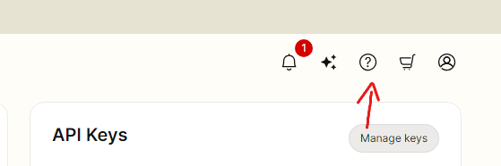
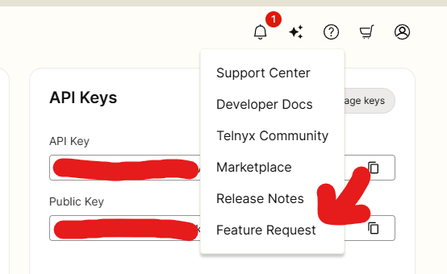
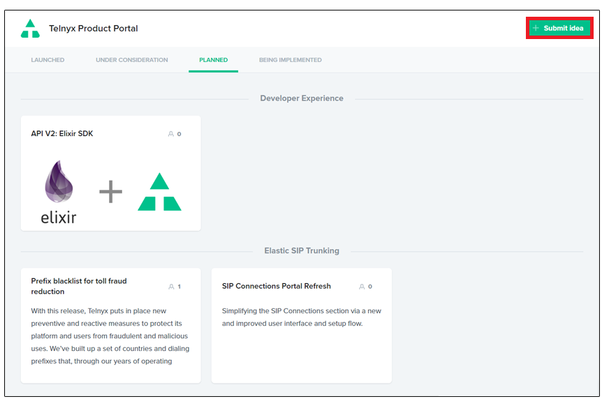
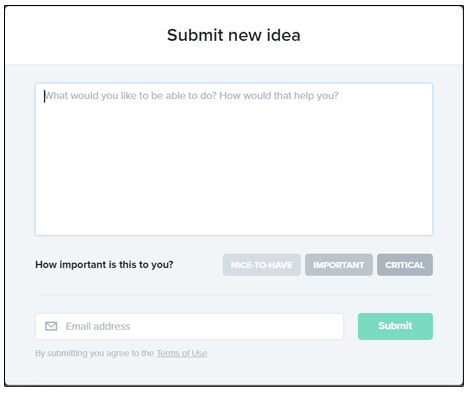

Feature Requests | Telnyx Help Center

[Skip to main content](#main-content)

# Feature Requests

This article explains how to submit a feature request within the Mission Control Portal.

Written by Dillin

December 26, 2024

Table of contents

A feature request allows users to request helpful features that are not currently supported in the Mission Control Portal.

# **Video Walkthrough for Feature Requests**

#### **How to submit a Feature Request** **To begin, you'll need to access the Telnyx Portal by visiting portal.telnyx.com and logging into your account.**

Once logged in, follow these steps:

1. Locate the question mark (?) icon in the far-right corner of the portal's top navigation bar.
2. Click on the question mark icon to open the drop-down menu.
3. Select "Feature Request" from the menu options.

   

   

3. Click **submit idea** in the top right corner of the page.

*You can also view **planned** features, features **being implemented** and features **under consideration** on this page.*

*Clicking into these features will allow you to select one of three options; **Nice-to-have**, **Important** and **Critical**.*

4. Enter the following details into the form and click **submit to create your feature request.**

* Feature Request
* Importance of Feature
* Email Address

That's it! You'll be notified VIA the email entered if any further developments are made with your feature request. Thank you for helping us improve our ever-expanding feature set!

## **Special Note**

From time to time, our users may also provide improvement suggestions via chat or email. Know that Telnyx has in place a tight feedback loop, where our support team can tag your case as a feature request, allowing our product managers to be notified internally on your suggestions. This allows them the ability to review your case and potentially have the improvement included on our public product board!

---

Related Articles

[Account Verification](https://support.telnyx.com/en/articles/1130595-account-verification)[E911 Setup Guide](https://support.telnyx.com/en/articles/1130683-e911-setup-guide)[Requesting Numbers](https://support.telnyx.com/en/articles/3562148-requesting-numbers)[Bug Reports Guide](https://support.telnyx.com/en/articles/4283906-bug-reports-guide)[Grandstream HT802: Telnyx Setup](https://support.telnyx.com/en/articles/5725071-grandstream-ht802-telnyx-setup)

Did this answer your question?

😞😐😃

Table of contents
