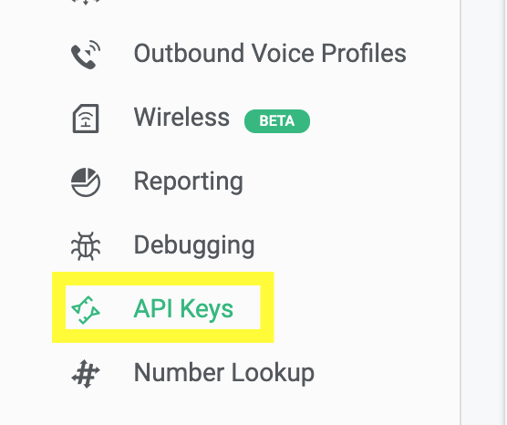
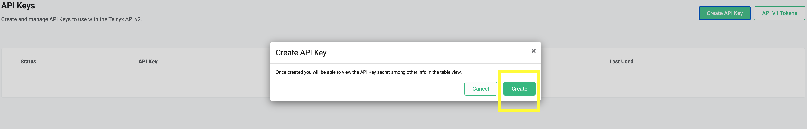

# SMS Setup with POSTMAN

This article gives an overview of how you can get started with Telnyx SMS… See Telnyx guidance and requirements.


Make sure you've configured your account, such as purchasing a number, creating a messaging profile, and associating that messaging profile with that number.
​
More details for [sending SMS using POSTMAN here](https://developers.telnyx.com/docs/messaging/messages/mission-control-portal-set-up) and for [specific error codes](https://developers.telnyx.com/api/errors) here.
​
POSTMAN is a RESTful HTTP client and can be downloaded from here: <https://www.postman.com/downloads/>
​
​


## **Sending SMS Via API v1**

At this stage, you are ready to send SMS.

1. Open up, [Postman](https://www.postman.com/postman). "POST" to "<https://sms.telnyx.com/messages>"
2. In "Headers", set your "x-profile-secret" to the secret under your Messaging Profile.
3. In the "Body", you can paste in the following:

```
{
"from": "+1[your messaging-enabled number]",
"to": "+1[intended recipient]",
"body": "Hello World"
}
```

## **Video demo showing sending SMS via Postman using API v1**

Yay! You have sent your first SMS using API V1.


## **Sending SMS Via API V2**

Open up, Postman. "POST" to "<https://api.telnyx.com/v2/messages>"

Now you need to generate API V2 secret Key

For using API V2 to send out SMS, you need to generate V2 key here in the [API Keys Section](https://portal.telnyx.com/#/app/api-keys)



* Click on create API key on top



* This will be the new API v2 key that will be used while sending SMS


* In the Postman "Headers", set your "Authorization" to the API v2 secret key and the Key should be preceded with "Bearer".


* In the "Body", you can paste in the following:

```
{
"from": "+1[your messaging-enabled number]",
"to": "+1[intended recipient]",
"text": "Hello World"
}
```

## **Video demo showing sending SMS via Postman using API V2**

Kudos! now you know how to send SMS using API V2
​


---

Related Articles

[MMS Sending and Receiving](https://support.telnyx.com/en/articles/3102823-mms-sending-and-receiving)[Sending Alphanumeric SMS - Sender ID](https://support.telnyx.com/en/articles/4371498-sending-alphanumeric-sms-sender-id)[Telnyx Verify: 2FA made easy](https://support.telnyx.com/en/articles/5701653-telnyx-verify-2fa-made-easy)[Update Webhook Sign Key Guide](https://support.telnyx.com/en/articles/8370064-update-webhook-sign-key-guide)[Bot-to-Bot Support API: Ask Telnyx Knowledge Agent](https://support.telnyx.com/en/articles/15455646-bot-to-bot-support-api-ask-telnyx-knowledge-agent)

Did this answer your question?

😞😐😃
