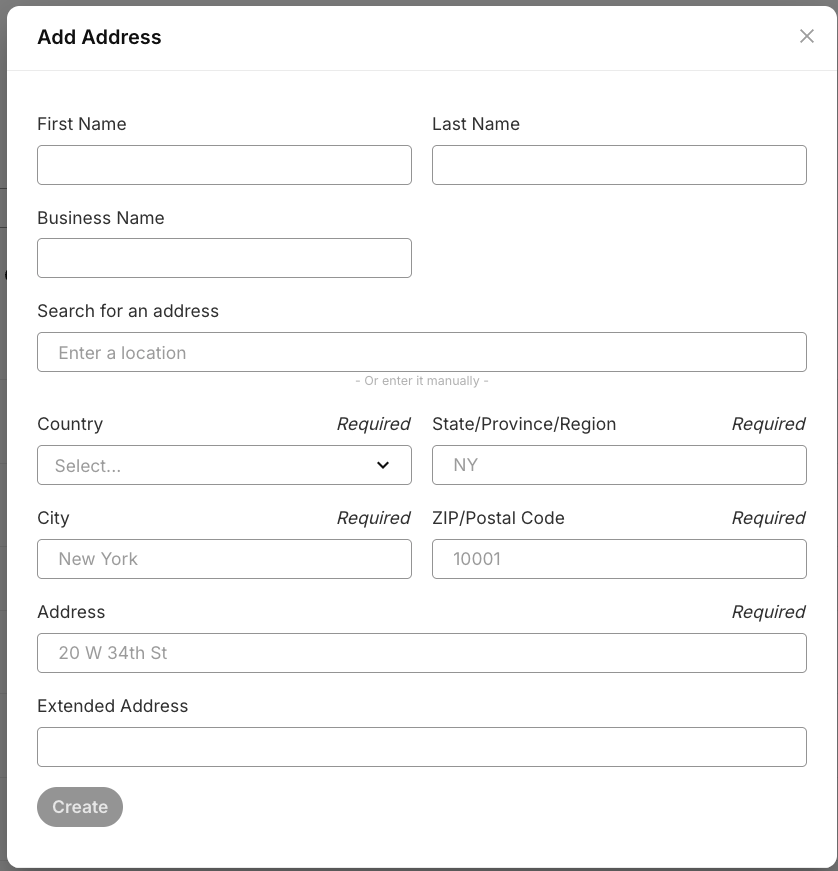
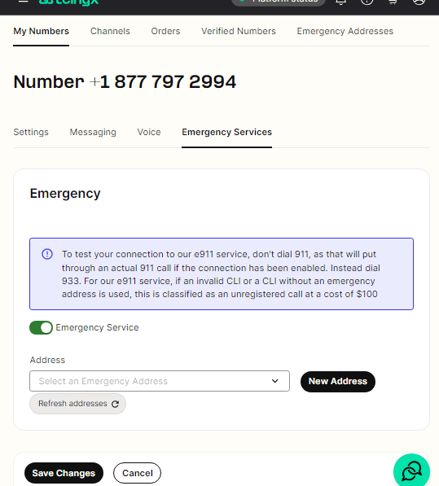

# Addresses Overview

This article will explain the "Addresses" section of your portal account and it's… See Telnyx guidance and requirements.

The Address section of your Telnyx portal account will contain the addresses you will use for E911 emergency services, and for number ordering regulatory requirements.

## **Step by Step Guide to Addresses**

To find the [Addresses](https://portal.telnyx.com/#/numbers/emergency-addresses) section, click on "Numbers" in the navigation bar on the left side of the page. Then select "Compliance" from the dropdown options in the navigation bar . From there, you should see a tab called "Emergency Addresses" at the top of the page in the portal.

When you first visit this page you will not have any addresses added, so you can hit the "Add Address" button on the top right. From there, you will be prompted to enter your address details. You will have a choice of two methods to enter your address, you can manually enter all the address details or you can use the built-in address search feature that will allow you to enter some partial details and find your desired address from the options we return to you.

Once the address entry has been created you should see it added to the list of addresses on the same page. This list can be filtered to help you locate specific addresses you may have added. Addresses can also be deleted from this list if necessary. Please note, if you delete an address that is associated with a DID for e911 emergency services then that DID will no longer be viable for e911 services.

To activate E911 services on a DID number with one of your added addresses, navigate to the "[Numbers](https://portal.telnyx.com/#/app/numbers/my-numbers)" section of your account, find your desired DID, and then enter the settings of that number. Once there, you will see an "Emergency" tab, you can then activate Emergency services by clicking the check-box, you will then be prompted to select your desired address from the dropdown menu or you may enter a new address from here also.

---

Related Articles

[Register E911 addresses](https://support.telnyx.com/en/articles/1130647-register-e911-addresses)[E911 Setup Guide](https://support.telnyx.com/en/articles/1130683-e911-setup-guide)[How do I test E911 service?](https://support.telnyx.com/en/articles/1130709-how-do-i-test-e911-service)[How To Setup A DID to SIP Connection](https://support.telnyx.com/en/articles/1177115-how-to-setup-a-did-to-sip-connection)[My Numbers Page](https://support.telnyx.com/en/articles/4349113-my-numbers-page)

Did this answer your question?

😞😐😃
