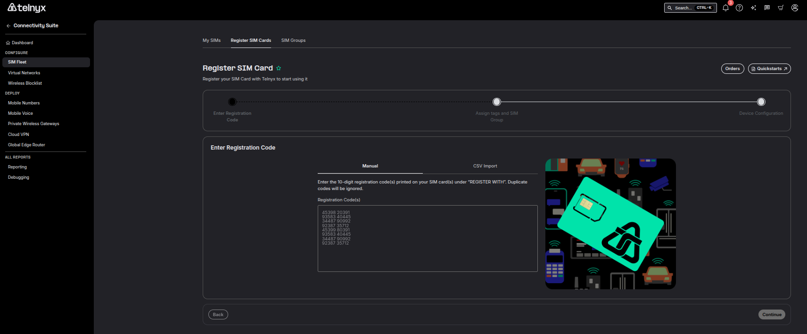

SIM Setup and Configuration | Telnyx Help Center

[Skip to main content](#main-content)

# SIM Setup and Configuration

This article will explain how to order a Telnyx SIM card and help with the configuration/setup process.

Written by David

April 30, 2026

Table of contents

# Ordering and Configuring Telnyx Wireless SIM Cards

Our Wireless SIM cards allow your business to build and scale Internet of Things devices on a [private LTE](https://telnyx.com/resources/private-lte-architecture) network.

## Ordering your SIM Card

In your portal, navigate to the "Wireless" section to order a SIM. Note that it may take some time for your SIM card to arrive. Please reach out to [support@telnyx.com](mailto:support@telnyx.com) or our online chat to inquire about your order.

## Configuring Your SIM Card

## Registration

**NOTE:** You need a minimum of $2 USD in your balance before registering new SIM cards.

Once again, in your portal navigate to the "Wireless" section. From there, select the "Register SIM Cards" section. Enter the 10-digit registration code located on your SIM card. You can add multiple registration codes at once separating each by a comma. If you wish to designate the cards with a specific tag or assign your [SIM card(s)](https://telnyx.com/products/iot-sim-card) to a specific group, you may do that here as well. For example:



​

Finish the registration process by clicking "Register SIM". Note, this can also be done programmatically:

```
curl --request POST \  
  --url https://api.telnyx.com/v2/actions/register/sim_cards \  
  --header 'Authorization: Bearer <token>' \  
  --header 'Content-Type: application/json' \  
  --data '  
{  
  "registration_codes": [  
    "0000000001",  
    "0000000002",  
    "0000000003"  
  ],  
  "sim_card_group_id": "6a09cdc3-8948-47f0-aa62-74ac943d6c58",  
  "tags": [  
    "personal",  
    "customers",  
    "active-customers"  
  ],  
  "status": "enabled"  
}  
'
```

See our [API Reference](https://developers.telnyx.com/api-reference/sim-cards/register-sim-cards) for more information.

## Device Configuration

Insert your [SIM card](https://telnyx.com/products/iot-sim-card) into the device. Now, you will need to configure the APN. Note the following:

* APN Settings on Android Devices: Settings > Connections > Mobile Networks > Access Point Names > Add.
* APN Settings on iOS Devices: Settings > Cellular > Mobile Data > APN.

Once you have a new APN up, enter the following:

* Name: Telnyx
* APN: data00.telnyx
* Leave all other fields unmodified even if it's blank and save this new APN.

**IMPORTANT:** Make sure you enable data roaming on your device and you are good to go. (Note, some devices may require you to reboot in order for the changes to take effect)

**ALSO IMPORTANT:** Someproviders no longer allow "first time registrations" to occur via 2G or 3G connections. Please make sure to complete the initial registration via 4G/LTE (After that, the SIM will be usable via 2G and 2G/3G)

---

Related Articles

[How to set up a Telnyx SIM Card](https://support.telnyx.com/en/articles/3269600-how-to-set-up-a-telnyx-sim-card)[Adding the Telnyx SIM APN to your device](https://support.telnyx.com/en/articles/3269973-adding-the-telnyx-sim-apn-to-your-device)[SIM Connectivity Logs](https://support.telnyx.com/en/articles/5666594-sim-connectivity-logs)[Using Telnyx SIM with Ubiquiti UniFi LTE Pro](https://support.telnyx.com/en/articles/10164784-using-telnyx-sim-with-ubiquiti-unifi-lte-pro)[Using Telnyx SIM with InRouter300 Series Cellular Routers](https://support.telnyx.com/en/articles/10511105-using-telnyx-sim-with-inrouter300-series-cellular-routers)

Did this answer your question?

😞😐😃

Table of contents
