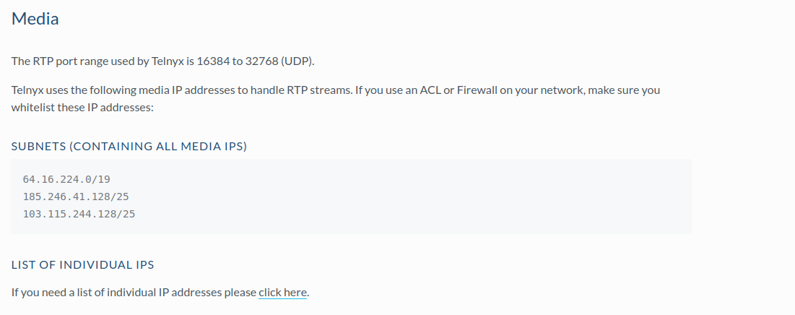

Sansay: SBC VSXi Setup | Telnyx Help Center

[Skip to main content](#main-content)

# Sansay: SBC VSXi Setup

In this article we will walk you through configuring a Sansay SBC with the Telnyx Mission Control Portal.

C

Written by Customer Success

February 1, 2024

Table of contents

[Jump to Instructions](#h_510f58a23f)

The [Sansay](https://www.sansay.com/) [VSXi session controller](https://www.sansay.com/products/vsxi/) is a high-performance software-based SBC that provides critical functions for communications service providers, including security and DDoS protection, network address translation, protocol interworking and traffic management. The VSXi selects optimal routes for voice communications traffic and assures effective interworking with outside networks. For subscriber-facing traffic management, the session controller provides packet-header manipulation and digit mapping for automatic number identification (ANI) and dialed number identification services (DNIS) manipulation. It is currently the highest performing session control platform on the market.

Additional resources:

* [VSXi datasheet](https://www.sansay.com/wp-content/uploads/2013/05/Sansay_VSXi_Session-Controller_9_2013.pdf) (pdf download)
* [Contact Sansay](https://www.sansay.com/contact-us/)
* [VSXi REST API](https://support.sansay.com/t/36d6tz/vsxi-rest-api)
* [VSXi knowledgebase](https://www.sinsay.com/sq/en/faq) (note that you must be logged into your Sansay account in order to view knowledge articles other than the API)

---

# Instructions for Configuring Sansay SBC's VSXi Session Controller

In this activity you will:

1. [Create resources](#h_df81962aaf)
2. [Define resource settings for your inbound trunk](#h_5d34edc0ba)
3. [Define resource settings for your outbound trunk](#h_e548b0eff9)

## Pre-requisites

* Ensure that your [Telnyx Mission Command Portal is configured properly](https://support.telnyx.com/en/articles/1176636-get-started-with-a-mission-control-account)
* RECOMMENDED: [Enable TLS to encrypt your traffic](https://support.telnyx.com/en/articles/1130711-does-telnyx-encrypt-communication)
* Set up your Sansay SBC with your IP-PBX and have one or more clients configured and running calls between them

## Setting up your Telnyx SIP portal account so you can make and receive calls:

|  |
| --- |
| ***Note:*** *Video walkthrough for Sansay SBC/Telnyx configuration coming soon. Check back as we update our docs.* |

## 1. Create Resources

1. Log into your Sansay portal and select **Resources** from the navigation.
2. Create two new resources, one for your inbound trunk, and one for an outbound trunk.

[Back to Top](#h_510f58a23f)

## 2. Define resource settings for your inbound trunk

In this section, you'll configure the SIP server information for inbound trunks.

1. For the first trunk, provide the following settings:

   1. **Resource Type:** *Inbound*
   2. **Resource Type:** *Peering*
   3. **Protocol:** *SIP*
   4. **SIP Profile:** *SIP\_Peering:0*  
      ​

   Under **General Info**

   1. **[SIP Trunk](https://telnyx.com/products/sip-trunks) ID:** *1000*
   2. **Trunk name:** *Telnyx Inbound*
   3. **Company Name:** *Telnyx*
   4. **Route Table: *:****0*
   5. **Remote Port:** *5060*
   6. **Service Port:** *SIP Public Default 1:1*
   7. **Aggregate Capacity:** *1200*
   8. **Average CPS Limit:** *500*
   9. **Authorized RPS:** *500*
   10. **Unauthorized RPS:** *500*
   11. **Group Policy:** *Round Robin*
   12. **Digit Mapping Table:** *no-translation:0*
   13. **Min Call Duration:** *0*
   14. **Max Call Duration:** *43200*
   15. **RTP TOS:** *B8*
   16. **Direction:** *Both*
   17. **Service State:** *inservice*
   18. **Allow Direct Media:** *No*
   19. **No Answer Timeout:** *120*
   20. **No Ring Timeout:** *30*
   21. **Option Poll:** *Disable*
   22. **Cause Code Profile:** *Default:0*
   23. **Stop Route Profile:** *Default:0*
   24. **PAI:** *Disable*

   Under **Digit Translation & RN Handling**

   1. **Ingress & Egress**: can be set to *all*
   2. **Outbound ANI:** *pass*
   3. **Tech Prefix:** *default*

   Under **Codec Info:**

   1. **Policy:** *enforced*
   2. **Codec 1:** *g711u64k*
   3. **Codec 2:** *None*
   4. **Codec 3:** *None*
   5. **Codec 4:** *None*
   6. **Codec 5:** *None*
   7. **Codec 6:** *None*
   8. **Codec 7:** *None*
   9. **Codec 8:** *None*

   Under **Fqdns Info:**

   1. Depending on which of our SIP Proxies and media servers you interact with, based on your location, we recommend reviewing our [signalling IP addresses](https://sip.telnyx.com/#signaling-addresses) & [media IP addresses](https://sip.telnyx.com/#media) articles.  
      ​  
      Signalling IPs:

      

      Media IP's:

      
2. Click **save as** & then **submit**. Now we can work on the outbound trunk.

[Back to Top](#h_510f58a23f)

## 3. Define resource settings for your outbound trunk

In this section, you'll configure the SIP server information for outbound trunks.

1. Provide the following settings for your outbound trunk:

   1. **Resource Type:** *Outbound*
   2. **Resource Type:** *Peering*
   3. **Protocol:** *SIP*
   4. **SIP Profile:** *SIP\_Peering:0*  
      ​

   Under **General Info**

   1. **SIP Trunk ID:** *1001*
   2. **Trunk name:** *Telnyx Outbound*
   3. **Company Name:** *Telnyx*
   4. **Route Table: *:****0*
   5. **Remote Port:** *5060*
   6. **Service Port:** *SIP Public Default 1:1*
   7. **Aggregate Capacity:** *1200*
   8. **Average CPS Limit:** *500*
   9. **Authorized RPS:** *500*
   10. **Unauthorized RPS:** *500*
   11. **Group Policy:** *Round Robin*
   12. **Digit Mapping Table:** *no-translation:0*
   13. **Min Call Duration:** *0*
   14. **Max Call Duration:** *43200*
   15. **RTP TOS:** *B8*
   16. **Direction:** *Both*
   17. **Service State:** *inservice*
   18. **Allow Direct Media:** *No*
   19. **No Answer Timeout:** *120*
   20. **No Ring Timeout:** *30*
   21. **Option Poll:** *Disable*
   22. **Cause Code Profile:** *Default:0*
   23. **Stop Route Profile:** *Default:0*
   24. **PAI:** *Disable*

   Under **Digit Translation & RN Handling**

   1. **Ingress & Egress**: can be set to *all*
   2. **Outbound ANI:** *pass*
   3. **Tech Prefix:** *default*

   Under **Codec Info:**

   1. **Policy:** *enforced*
   2. **Codec 1:** *g711u64k*
   3. **Codec 2:** *None*
   4. **Codec 3:** *None*
   5. **Codec 4:** *None*
   6. **Codec 5:** *None*
   7. **Codec 6:** *None*
   8. **Codec 7:** *None*
   9. **Codec 8:** *None*

   Under **Fqdns Info:**

   1. Depending on which of our SIP Proxies and media servers you interact with, based on your location, we recommend reviewing our [signalling IP addresses](https://sip.telnyx.com/#signaling-addresses) & [media IP addresses](https://sip.telnyx.com/#media) articles.  
      ​  
      Signalling IPs

      

      Media IPs

      
2. Click **Save as & submit** to create your trunk. This will push the configuration to Sansay.

That's it! You've now configured resources for your inbound and outbound trunks.

[Back to Top](#h_510f58a23f)

---

## Additional Resources

Review our [getting started with guide](https://support.telnyx.com/en/articles/1176636-get-started-with-a-mission-control-account) to make sure your Telnyx Mission Control Portal account is setup correctly!

Additionally, check out:

* [VSXi datasheet](https://www.sansay.com/wp-content/uploads/2013/05/Sansay_VSXi_Session-Controller_9_2013.pdf) (pdf download)
* [Contact Sansay](https://www.sansay.com/contact-us/)
* [VSXi REST API](https://support.sansay.com/t/36d6tz/vsxi-rest-api)
* [VSXi knowledgebase](https://www.sinsay.com/sq/en/faq) (note that you must be logged into your Sansay account in order to view knowledge articles other than the API.

---

Related Articles

[Configuring a Cisco CUBE/CUCM IP Trunk](https://support.telnyx.com/en/articles/1130606-configuring-a-cisco-cube-cucm-ip-trunk)[Cisco: Configure a Cisco CME IP Trunk](https://support.telnyx.com/en/articles/1130612-cisco-configure-a-cisco-cme-ip-trunk)[How to configure a Thirdlane PBX](https://support.telnyx.com/en/articles/1130631-how-to-configure-a-thirdlane-pbx)[Configuring a Cisco CUBE/CUCM SIP Trunk](https://support.telnyx.com/en/articles/1130673-configuring-a-cisco-cube-cucm-sip-trunk)[How to configure Yeastar P-series](https://support.telnyx.com/en/articles/13375115-how-to-configure-yeastar-p-series)

Did this answer your question?

😞😐😃

Table of contents
