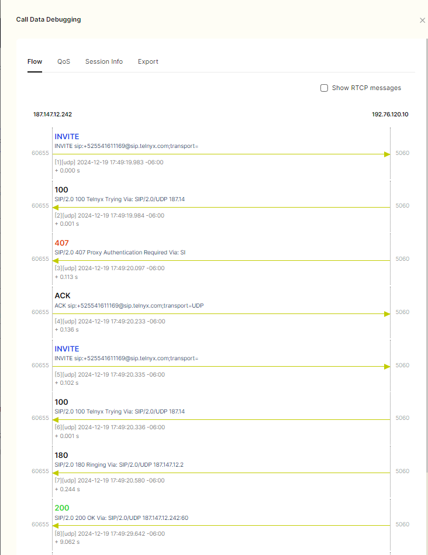
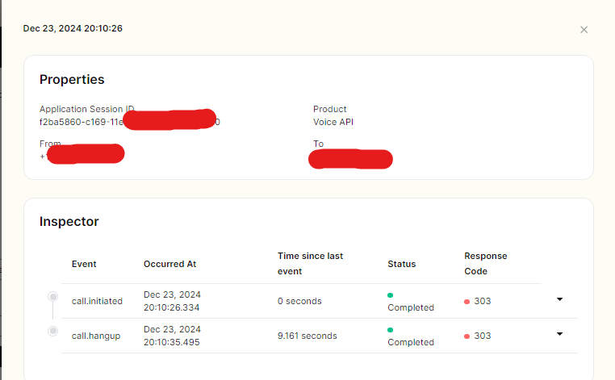
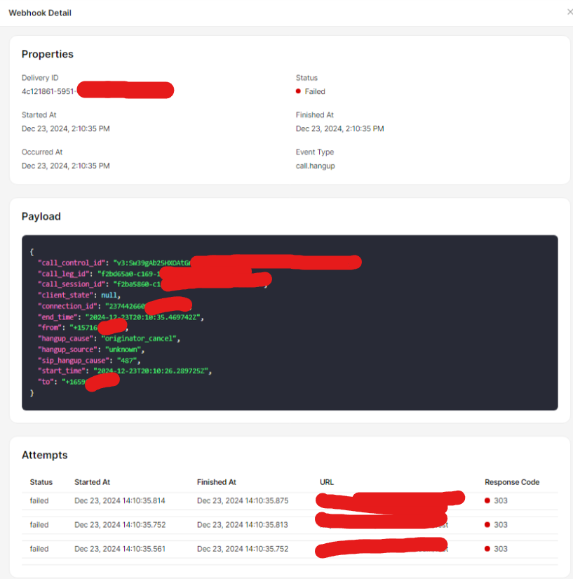
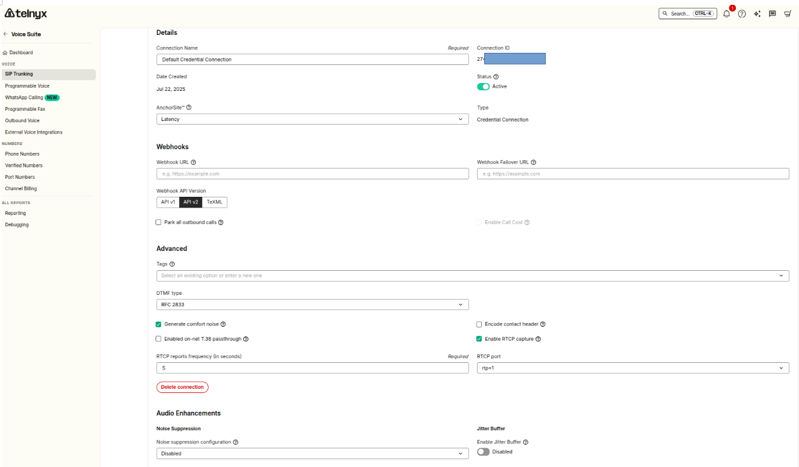
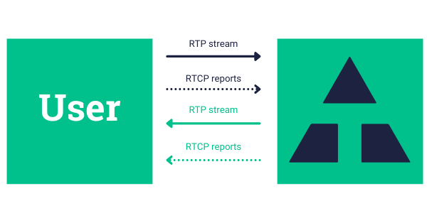
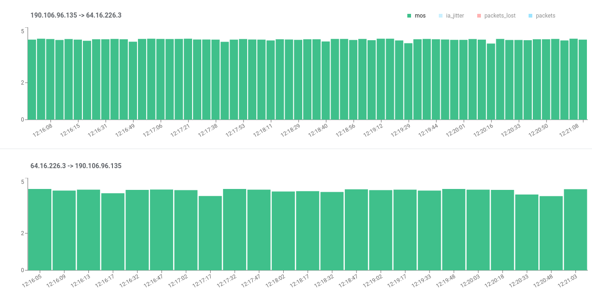
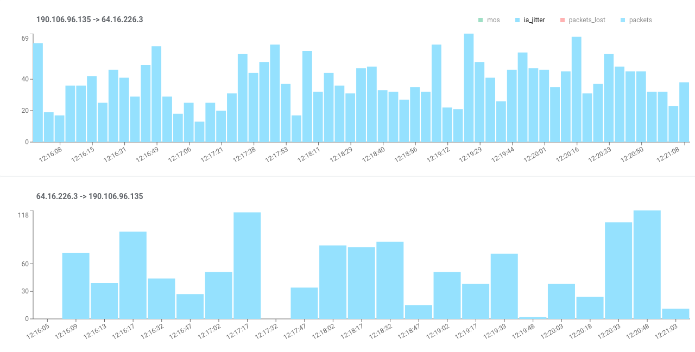

# Telnyx Debugging Tools

This article will detail the debugging section of the Mission Control Portal and it's features including the SIP Call… See Telnyx guidance and requirements.

The Debugging section of your Telnyx portal account will contain several tools you will use for the purpose of debugging SIP calls and call control flows.

## **Guide to the Debugging Tools**

The Debugging section can be found on the left-hand list of portal modules. Once you have entered the Debugging section there will be 6 headers, Sip Call Flow Tool, Prog. Voice Call Flow Tool, Web Dialer, Detail Record Search, Webhook Deliveries and Call Recordings.

## **[Sip Call Flow Tool](https://portal.telnyx.com/#/debugging/sip-call-flow-tool)**

Using the Sip call flow tool is straightforward. You can specify a date range that extends back 3 days maximum, and the calling and/or destination numbers.
​
Additional filters include:

* Billed duration - which can filter out calls with a billed duration greater than, equal to, or less than the value you specify.
* Direction - which let's you filter out inbound or outbound calls.
* Tags - which lets you filter by calls from/to numbers that have a specific tag.
* Result code - which lets you filter based on the SIP response code received for the calls.

More info on SIP response codes can found [here](https://support.telnyx.com/en/articles/4304898-sip-trunking-methods-requests-responses).

Below is a screenshot of an example call flow found using the Call Flow Tool.

## [Prog. Voice Call Flow Tool](https://portal.telnyx.com/#/debugging/call-control-texml-and-fax)

The Programmatic Voice Call Flow Tool is much simpler, and can be used to view Call Control, TeXML or Fax API flows provided you can supply the Call Session ID of the call in question.

By clicking on the example that appears once you hit Search, you can open up the Call Inspector which illustrates the flow of the call. Below is a screenshot of an example flow found using the Prog. Voice Call Flow Tool. There is also a clickable drop-down beside each call event that will open up it's associated webhook.

## **[Web Dialer](https://portal.telnyx.com/#/voice/web-dialer)**

The Web Dialer is a powerful debugging tool that will allow you to make test calls without needing to setup a softphone or PBX system. This is useful if you are having issues with calls and want to eliminate your PBX or softphone client as a potential source of the issue. In order to use the web dialer, you simply need a Credentials Connection, a [DID number](https://telnyx.com/resources/sip-did) assigned to that connection and then you can assign a Caller ID name value if you wish to test that also. Once these pre-requisites are met you can make test calls straight from the web interface.

You can also receive incoming calls from the Web dialer – this is useful for testing inbound failures.
​

To receive an inbound call, simply dial the DID number assigned to the SIP Connection that you have entered in the steps above.

​

### Call State: done (CALL\_REJECTED)

If you come across this websocket response, make sure to check out the specific call rejection within the message. You can see a list of error responses and their resolutions [here](https://support.telnyx.com/en/articles/4409457-telnyx-sip-response-codes).

## **Webhook Deliveries**

This tool shows a history of webhooks sent over a customer's account. You can either search by webhook delivery id, or filter according to time, status and webhook name (eg. “call.initiated”). To view webhook deliveries or logs for your voice application:

1. Log in to the Telnyx portal.
2. Select the **Debugging** tab. Here, you can view webhook deliveries and troubleshoot any issues related to webhook functionality.

You can use this tool to assist with debugging cases:

* Locate and analyze specific webhooks using their webhook ID
* Verify the delivery of a webhook
* Verify the contents of a webhook
* Analyze all webhooks sent in a certain timeframe or containing a certain text string (e.g., `call.initiated`) to find anomalies
* Analyze all webhooks with "failed" status
* View logs alongside conversation transcripts and insights to gain a comprehensive understanding of webhook activity.

The Message content, and metadata is also included in the webhook delivery tool:

## Tips for Troubleshooting

* Ensure that your endpoint is correctly configured to receive webhook payloads.
* Use the filtering options to quickly identify and analyze failed webhook deliveries.
* Inspect the payload contents to verify that the data sent matches your expectations.
* Check for any anomalies or errors in the logs that could indicate issues with your webhook setup.

## **QoS (Quality of Service) Reports**

​**NOTE:** the customer must have RTCP Capture enabled on their SIP Connection settings.

This feature provides customers with a visual representation of the Quality of Service (QoS) of any given call on a timeline with two separate graphics, one for each of the RTP media streams that are established for each call.

The new report feature is available in the Mission Control Portal through the SIP Call Flow Tool. Simply search for your call, click the blue "Call Data Debugging" button to the right of the sample and click the "QoS" tab. Reports are based on RTCP reports that are sent between SIP devices and Telnyx.

See picture for reference:

When a call is established media starts flowing over two RTP streams, one in each direction. Periodically, each side also sends [RTCP reports](https://en.wikipedia.org/wiki/RTP_Control_Protocol) to report transmission and reception statistics during the interval. Each report includes the number of packets sent (packets), the accumulated packets that were expected but never received (packets\_lost), the jitter perceived from the received packets (ia\_jitter), and more.

## RTP streams and RCTP reports between Telnyx and the user

The QoS report feature uses the data on these RTCP reports to display 4 different quality metrics on a timeline for each RTP stream. Let’s take a look at what these metrics mean, and how it is displayed in the report:

## **MOS (Mean Opinion Score)**

* Our QoS report shows MOS stats based only on network metrics, any other audio issues won't be captured by it. The scale goes from 1 (Bad) to 4.5 (Excellent)
  ​

*Mean Opinion Score*

## **IA JITTER**

* “IA\_jitter” represents the value of [Interarrival Jitter](https://en.wikipedia.org/wiki/Jitter), as measured by the reporter.

*IA Jitter*

## **Packets Lost**

* “Packets Lost” represents the accumulated number of RTP packets perceived as lost by the reporter.
  ​
  ​

  

*Packets Lost*

## Packets

* “Packets” represents the accumulated number of RTP packets that were sent by the reporter

*Packets*

---

Related Articles

[Audio and Codecs](https://support.telnyx.com/en/articles/3192298-audio-and-codecs)[My Numbers Page](https://support.telnyx.com/en/articles/4349113-my-numbers-page)[SIP Connection: Settings](https://support.telnyx.com/en/articles/4351104-sip-connection-settings)[Configuring Call Control/TeXML Applications - Voice API](https://support.telnyx.com/en/articles/4374050-configuring-call-control-texml-applications-voice-api)[BYOC: Telnyx & Genesys](https://support.telnyx.com/en/articles/8268122-byoc-telnyx-genesys)

Did this answer your question?

😞😐😃
