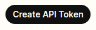
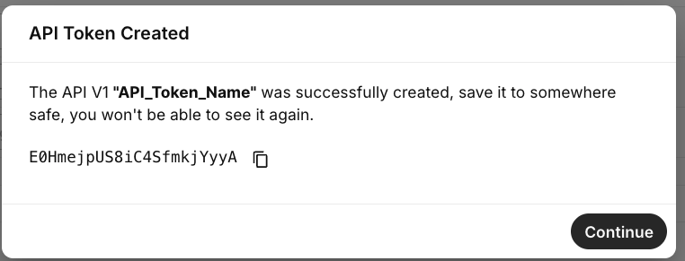

# API Keys and How to Use Them

In this article we will explain API keys and how to use them with both API v2 and API v1. See Telnyx guidance and requirements.

To use Telnyx v2 API endpoints, you will need an API key. For our API v1 endpoints, you will need an API Token.

This article will explain how to get your API Key for API v2 or API Token for API v1.

Telnyx uses API Keys or Tokens to authenticate API requests from our customers.

## **Step by Step guide API v2 Key**

* Log in to <https://portal.telnyx.com/>
* Click on the Account Settings option in the Account Icon on the top-right corner.
* Then click [API Keys](https://portal.telnyx.com/#/api-keys).

Click Create API Key on the top right hand corner to create an API v2 Key.

This key is what you will use as the bearer token in your API requests.

* You will then be provided with your API v2 Key to copy.

  + **NOTE**: The API Key will only be visible at the time of creation, so ensure it is securely stored in your application's environment variables.

* If you lose it, you can always go back to this section again to get it or create a new one.
* You have the option to set an Expiration date for your key, or temporarily disable any given API Key by just toggling the option.
* You can also associate up to 10 tags per API Key.

Coming soon:

* Adding search by tag functionality in the Mission Control Portal
* Adding developer documentation to access managed API Keys through an API endpoint.

## **Step by Step guide API v1 Token**

* Log in to <https://portal.telnyx.com/>
* Click on the Account Settings dropdown section on the left-hand side.
* Then click [API Keys](https://portal.telnyx.com/#/api-keys).
* Inside this page, click the "[API V1 Tokens](https://portal.telnyx.com/#/app/api-tokens)" button on the top right-hand side.

* Click Create API Token.

* We will ask you to give it a name, you can name it whatever you want.
* You will see a section on the right-hand side where you can click Copy Token.
* If you lose it you can always go back to this section again to get it or create a new one.

  + **NOTE**: The API Token will only be visible at the time of creation, so ensure it is securely stored in your application's environment variables.

In your API request, please include two headers called:

* **x-api-user**: <your account email>
* **x-api-token**:<your account token> when making the API V1 request.

You can find more details on API v1 Tokens in our developer's docs [here](https://developers.telnyx.com/api) and our API v2 Key [here](https://developers.telnyx.com/api)

---

Related Articles

[MMS Sending and Receiving](https://support.telnyx.com/en/articles/3102823-mms-sending-and-receiving)[Textable Setup Guide](https://support.telnyx.com/en/articles/3685327-textable-setup-guide)[How to Leverage Webhooks](https://support.telnyx.com/en/articles/4334722-how-to-leverage-webhooks)[Update Webhook Sign Key Guide](https://support.telnyx.com/en/articles/8370064-update-webhook-sign-key-guide)[Bot-to-Bot Support API: Ask Telnyx Knowledge Agent](https://support.telnyx.com/en/articles/15455646-bot-to-bot-support-api-ask-telnyx-knowledge-agent)

Did this answer your question?

😞😐😃
