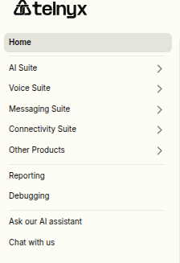
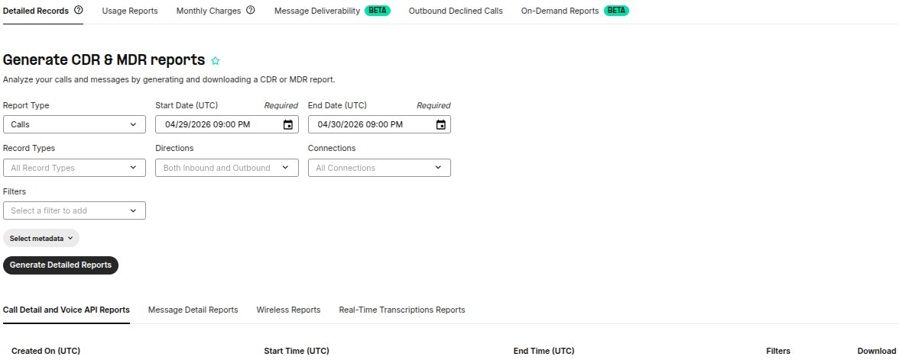
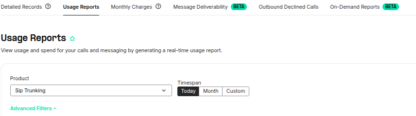
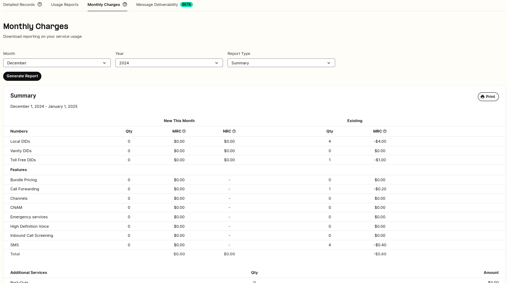
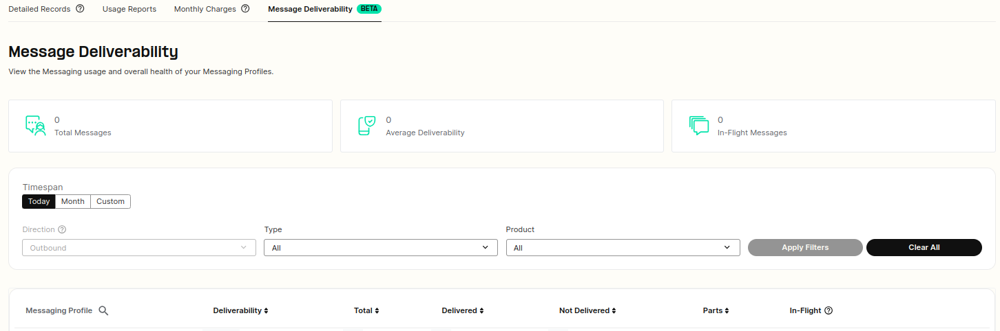
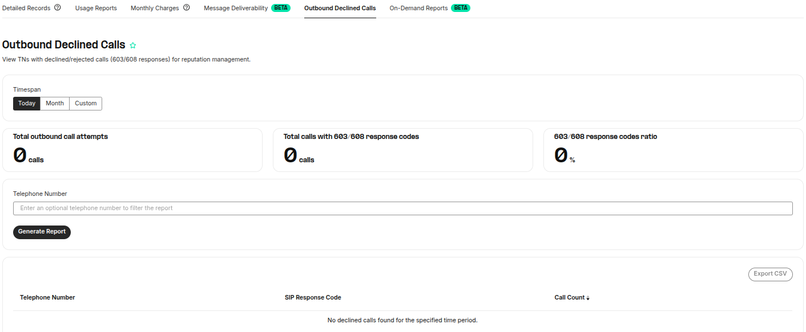
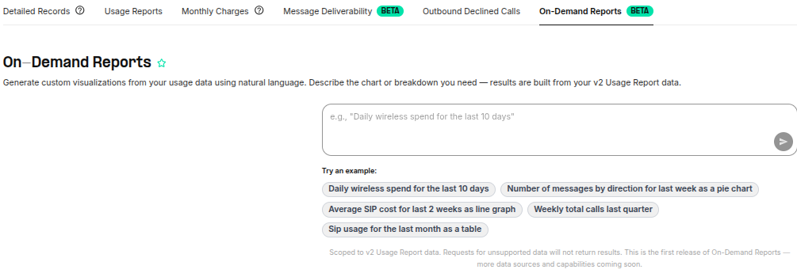

# Reporting: Overview

In this article, I will describe the Reporting Feature on your Telnyx customer portal and what you can do there. See Telnyx guidance and requirements.

## **How to find the Reporting section**

* Log in to <https://portal.telnyx.com/>
* On the left-hand side of the page click Reporting

  

* Inside this section, you have 6 options:

  - Detail Records

  - Usage Reports

  - Monthly Charges

  - Message Deliverability

  - Outbound Declined Calls

  -On-Demand Reports

  **Detail Records**

* Calls, Messaging, Voice API (Call Control), Fax API & Wireless usage, Real time transcription, Webrtc Detail Requests.
* You can find more details on how to use this feature here.

## **Usage Reports**

* This is where you can generate and download detailed usage reports on your Calls, Messaging, Telco Data & Real Time Transcription.
* You can break down the call usage report by call direction, product, country, and/or connection.
* You can find more details on how to use this feature [here](https://support.telnyx.com/en/articles/4425016-reporting-usage-reports).

## **Monthly Charges**

* This where you can generate a Monthly Report of your charges.
* You can also choose to break down the charges by Number.

## **Message Deliverability**

* This is where you can view the Messaging usage and overall health of your Messaging Profiles.
* The traffic can be filtered for specific use case and can be searched based on:

  - Direction (Inbound, Outbound)

  - Type (SMS, MMS)

  - Product (Toll Free, Short Code, Long Code, Alphanumeric)

  

## **Outbound Declined Calls**

* View TNs with declined/rejected calls (603/608 responses) for reputation management.

## **On-Demand Reports**

* On-Demand Reports in the Portal — natural language querying for usage data, now live in the Mission Control Portal under Reporting.

  Describe the chart or breakdown you need in plain English, and the system generates it from your v2 Usage Report data. Paired with the ability to save your query/visualization and re-run it later for your selected relative timespan.

  Example queries:

  • "Daily wireless spend for the last 10 days"

  • "Number of messages by direction as a pie chart"

  • "Weekly total calls in February"

---

Related Articles

[How to Download Reports at Telnyx](https://support.telnyx.com/en/articles/1130708-how-to-download-reports-at-telnyx)[Telnyx Dashboards](https://support.telnyx.com/en/articles/4307059-telnyx-dashboards)[Your Number Lookup Guide](https://support.telnyx.com/en/articles/4366901-your-number-lookup-guide)[Reporting: Detail Requests](https://support.telnyx.com/en/articles/4424926-reporting-detail-requests)[Surcharge for High Abandoned Call Rates](https://support.telnyx.com/en/articles/12805746-surcharge-for-high-abandoned-call-rates)

Did this answer your question?

😞😐😃
