# Telnyx Dashboards

Here you will find an overview of Telnyx dashboards and how you can use them. See Telnyx guidance and requirements.

## Telnyx Dashboard: Real-Time Voice and SMS Analytics

Telnyx Dashboard is a feature on the portal that provides some key insights about your Voice Calls & SMS trend over a period of time. These trends can help the customer determine, the overall performance of their call/SMS services.

You can access the dashboard by clicking the Dashboard icon on the top right corner once you are logged in. (link - <https://portal.telnyx.com/#/reports/dashboard>)

The dashboard icon takes you to the below page where you can find more insights through charts. Please note the calling information only represents **conversational** calls. High volume short duration calling is not captured at this time.

## **Guide to Telnyx Dashboards**

The dashboard provides a comprehensive overview of:

* Voice: **Number of Calls**
* SMS: **Number of Messages**
* Voice: **Connection Rate**
* Voice: **Max Concurrent Calls**
* Voice: **Outbound Peak Calls Per Second (CPS)**
* Voice: **Peak Inbound Concurrent Channel**
* **Abandoned Calls Percentage**
* Messaging: **Usage and Spend per Country**

The dashboard also captures live data for:

• **Active Calls - Inbound & Outbound**

• **Numbers Ported - In Queue & Ported Successfully**

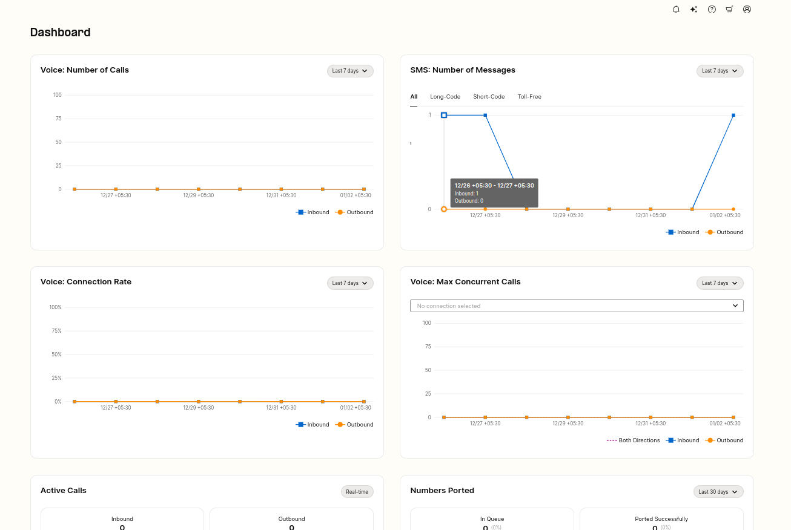

These charts can dynamically be adjusted based on the selected time frame. The portal offers charts for **24 hrs, 7 days, or 30 days** data projection which can be select from the drop-down option on the respective charts.

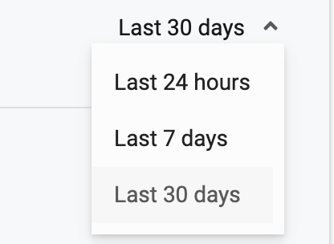

## **Voice: Number of Calls**

This chart showcases the number of calls (inbound & outbound) over the selected time frame.

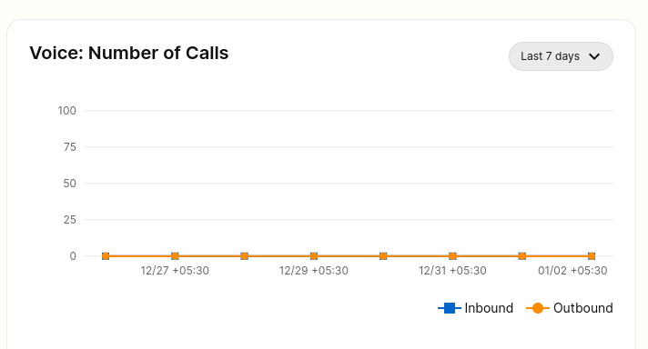

## **Voice: Connection Rate**

This chart showcases the percentage of calls (Inbound & outbound) that were connected out of all attempted calls.

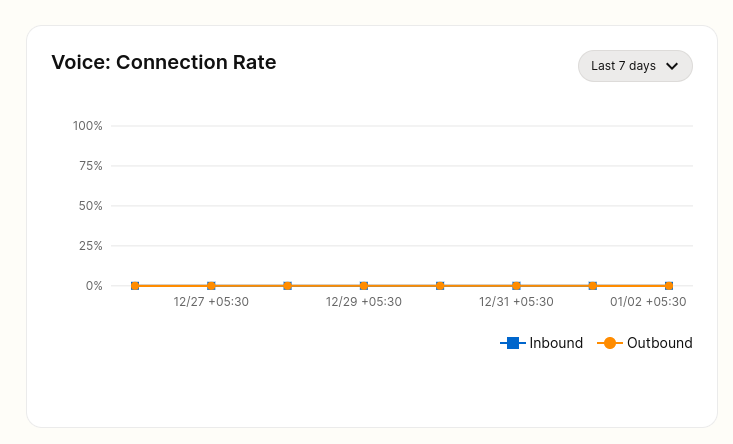

## **Voice: Max Concurrent Calls**

This chart showcases the total number as well as individual inbound & outbound concurrent calls that were made form the account.

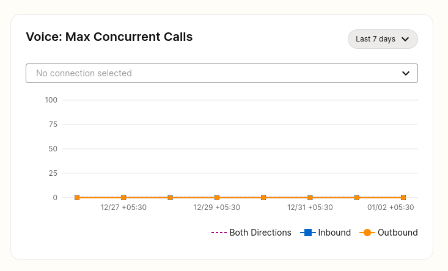

## **SMS: Number of Messages**

This chart shows the total number of Inbound and Outbound SMS that were received or sent from the account.

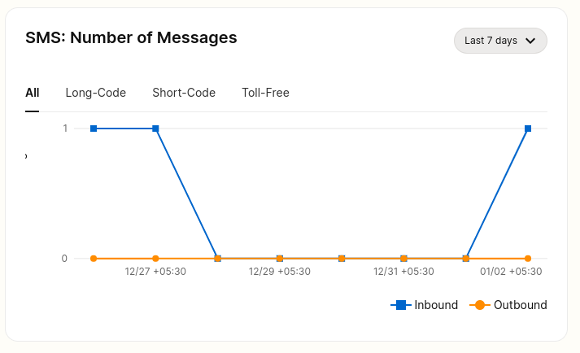

This chart also allows filtering the type of SMS (**All, Long-Code, Short-Code, Toll-Free)** statistics on the portal.

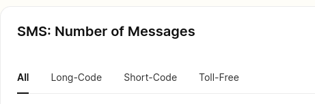

## **Active Calls: Inbound & Outbound**

This section on the dashboard showcases an active number of Inbound and outbound calls in real time. The statistics in this section are updated every few seconds.

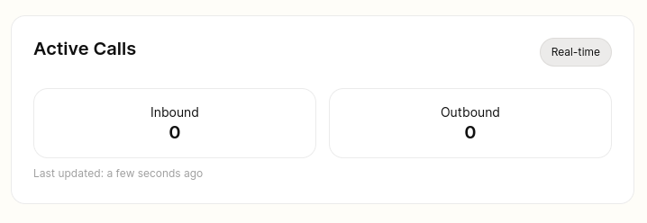

##

## **Numbers Ported: In Queue & Ported Successfully**

**In Queue -** This tells us about the numbers that entered the porting queue in the selected time period, and that are currently in the queue

**Ported Successfully -** This tells us about the numbers that entered the porting queue in the selected time period, and that were ported-in successfully.

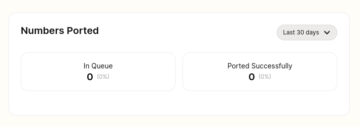

## Outbound Peak Calls Per Second (CPS)

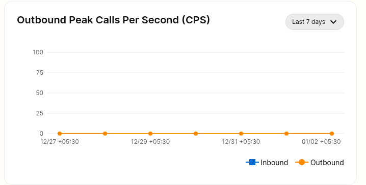

This chart displays the peak number of outbound calls per second over the last 30 days. This applies to SIP Trunking services only.

## Peak Inbound Concurrent Channels Abandoned Calls Percentage

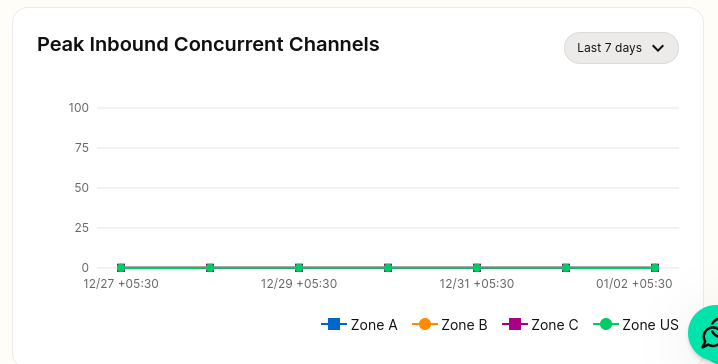

This graph illustrates the peak number of concurrent inbound channels for different zones (Zone A, Zone B, Zone C, Zone US) over the last 30 days.

## Abandoned Calls Percentage

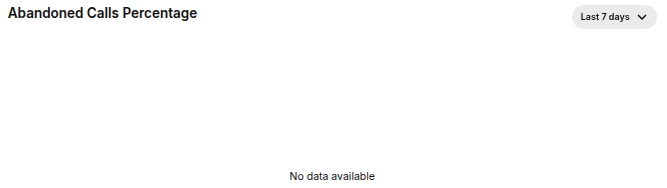

[The Portal](https://portal.telnyx.com/#/reports/dashboard), now features an **at-a-glance view of abandoned traffic percentages**, allowing you to pinpoint problematic trends and take immediate corrective action.

## Messaging: Usage and Spend per Country

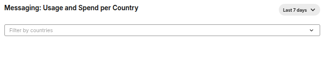

We have updated the [Messaging Dashboard](https://portal.telnyx.com/#/messaging/reports/dashboard) to display usage and spend by country. Countries can be toggled by clicking their respective key in the chart legend.

---

Related Articles

[FreePBX Trunk Settings With Telnyx](https://support.telnyx.com/en/articles/1130620-freepbx-trunk-settings-with-telnyx)[What is Telnyx?](https://support.telnyx.com/en/articles/1130637-what-is-telnyx)[How to Download Reports at Telnyx](https://support.telnyx.com/en/articles/1130708-how-to-download-reports-at-telnyx)[Telnyx SIP Response Codes](https://support.telnyx.com/en/articles/4409457-telnyx-sip-response-codes)[Telnyx + Vapi Integration](https://support.telnyx.com/en/articles/12538402-telnyx-vapi-integration)

Did this answer your question?

😞😐😃
