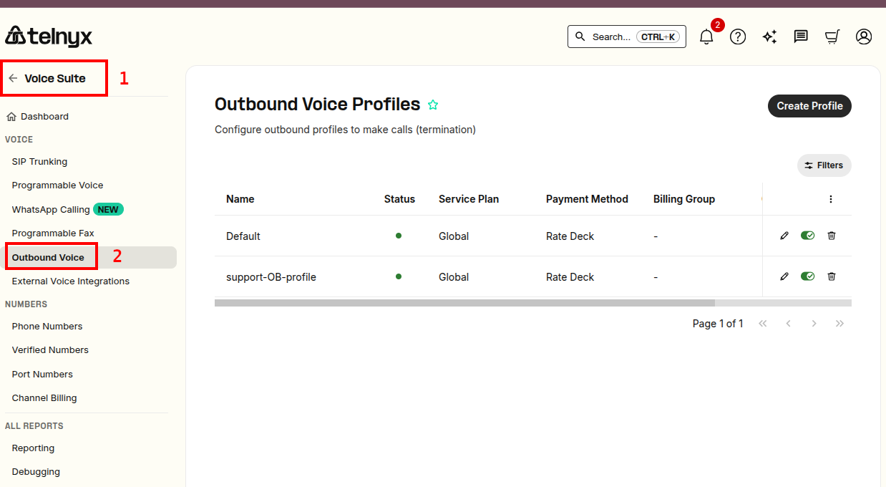
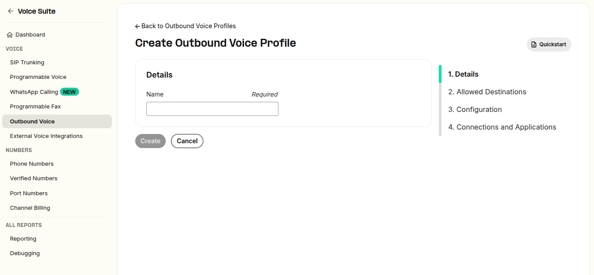
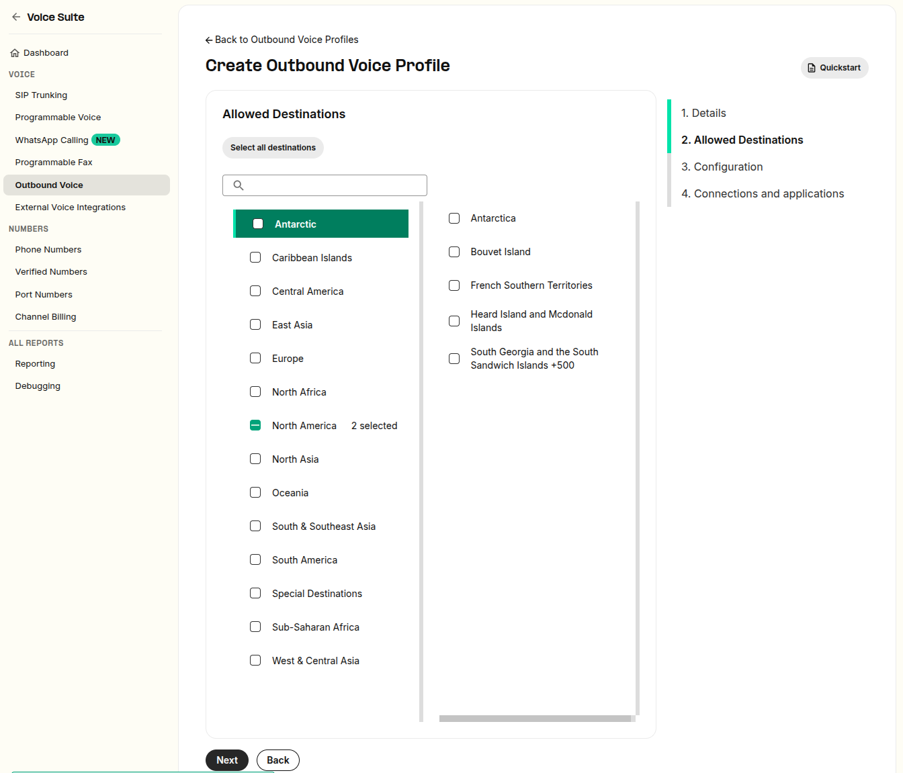
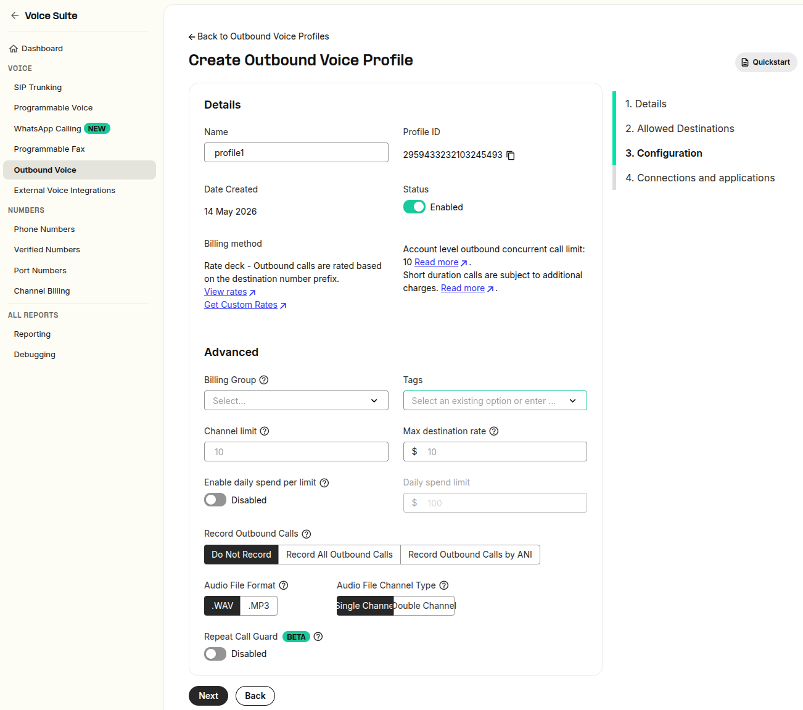
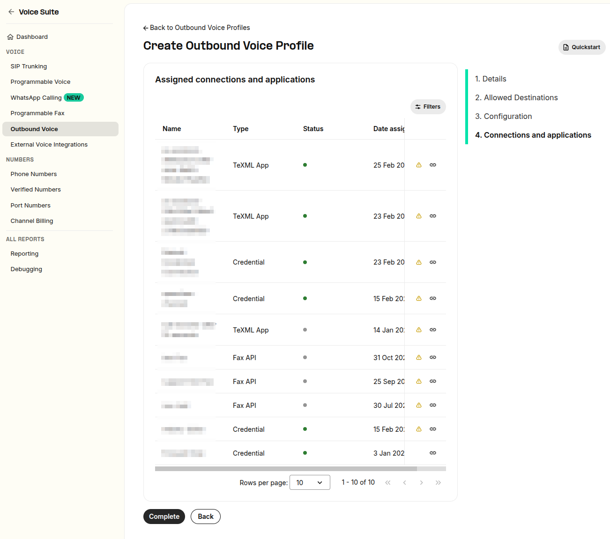
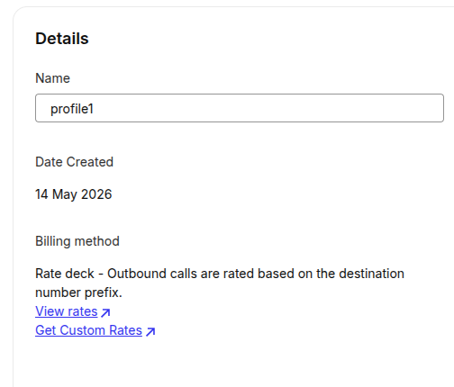
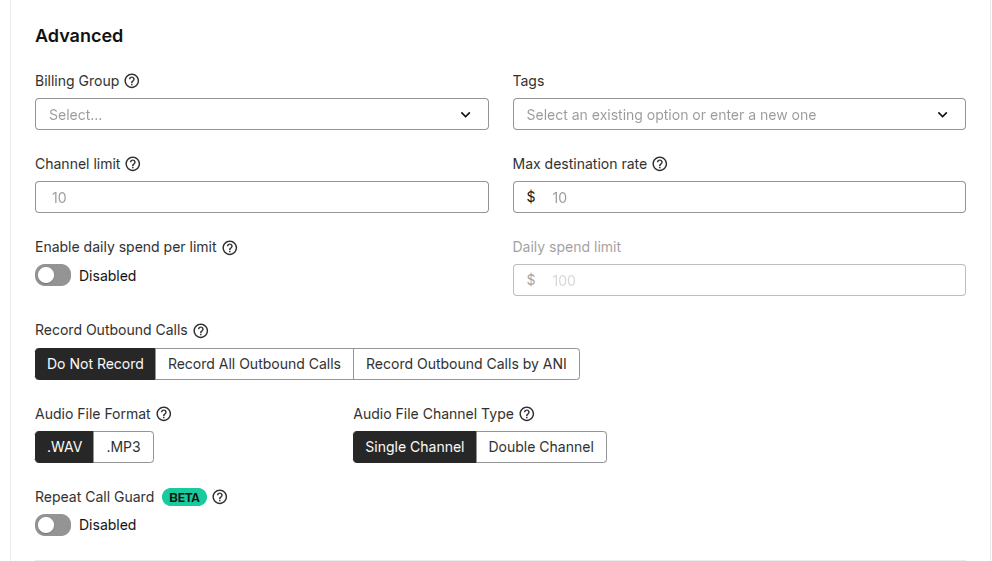

More About Outbound Voice Profiles | Telnyx Help Center

[Skip to main content](#main-content)

# More About Outbound Voice Profiles

This article will explain how to set up an outbound voice profile and the different service plans and billing options available

Written by Dillin

May 14, 2026

Table of contents

# What is an Outbound Voice Profile?

The Outbound Voice Profile section of your Telnyx portal account is where you will manage the Service Plans, Billing Methods, and Traffic Types for your outbound voice traffic. You can also view your Account Level Outbound Concurrent Call Limit at the top right of the page.

Setting up and Outbound Voice Profile

The [Outbound Voice Profiles](https://portal.telnyx.com/#/app/outbound-profiles) section can be found on the left-hand list of portal modules in between the Sip Connections and Wireless sections. If it is your first time setting up then you will be greeted with a blank section and a prompt to add a new profile.

## **Outbound Profile Information**

You will be first required to enter a name and then the profile will be created, initially, you will only see the name you have entered and the Profile ID, which is a unique string of numbers which can be used to identify the voice profile for API calls, CDR reports etc. From this section, you can also apply a "tag" to the profile for tracking, billing and reporting purposes.

This screen-shots show you how to create an outbound voice profile

​

## **International Allowed Destinations**

In this section, you will choose the international destinations you would like to allow calls to be allowed to terminate to. There are 255 destinations broken down into 10 regions. You can choose to add an entire region into your whitelisted destinations or you can pick and choose individual countries to move over. Please note, many destinations will require Level 2 verification before they can be activated. More info on verification can be found [here](https://support.telnyx.com/en/articles/1130595-account-verification)

The screen-shot below shows how to whitelist all European and North American countries

## **Associated Connections and Applications**

Under this section, you can view the connections or applications which you have assigned to the profile. If you have not assigned any yet, you may add them using the "Add connections/apps to profile". From there you will see a list of your Connections and Call Control/TexML applications(denoted by "APP" next to the entry), simply tick the box next to the desired Connections/Apps and hit "Add Connections/Apps to profile". Please note, FQDN connections cannot be assigned to the profile from here, you will need to assign this from the Connection's outbound settings in the SIP Connections section of the portal.

## **Billing Method**

At this time, the only billing method available is the "Rate Deck" option, which means Outbound calls are rated based on the destination number prefix. From this section, you may also download and view our rate deck and request custom rates.

## **Advanced Settings**

The first option available to us under Advanced Settings is **Assign a Billing Group** where you can select your billing groups from a drop-down menu. Billing Groups allow you to manage your customer sub-accounts, making it easy to categorise usage reports and end-of-month invoice records. More info on billing groups available [here](https://support.telnyx.com/en/articles/4280500-billing-setup-billing-groups)

Below that we have 3 options: **Channel Limit, Max Destination Rate** and **Enable Daily Spend Limit Per Connection**

**Channel Limit:** Allows you to set a limit for outbound Concurrent Channels (1 call amounts to 1 channel). For example, if you set this 10, and then you have 10 outbound calls running at the same time, if you tried to make another call (meaning 11 concurrent calls) it will be rejected.

**Max Destination Rate:** Maximum rate (price per minute) for a Destination to be allowed when making outbound calls. For example, if you set the rate limit to $0.5 and then attempt to call a destination whose per-minute rate is greater than 50 cents the call will be rejected.

​**Enable Daily Spend Limit Per Connection:** Define the maximum amount of money that can be spent on outbound calls per day for each connection associated with this outbound profile. A day will reset at 00:00:00 UTC. Once spending on a connection has exceeded the specific threshold, outbound calls will be blocked on the connection and an email notification will be delivered to the account owner.

The final options under Advanced settings pertain to our **Call Recording** feature.

## **Record Outbound Calls**

This feature can Enable Call Recording for all outbound calls or only those outbound calls with a specific ANI (or from number). Then, there are some variables to choose from. You can choose between WAV and MP3 audio formats and you can choose between Single Channel (mono file with both, caller and callee on the same track) and Double Channel (stereo file with caller on one track and callee on the other track).

And the final thing you need to do is ensure that you hit that save button at the bottom of the page!

## Termination Endpoint

There is another Connection with the same IP address already assigned to an Outbound Voice Profile. Connections should be unique so that they can be properly identified. Connections can share the same IP address as long as they have a unique combination with either a Tech Prefix or a Token. The IP address port is not used for authentication purposes so it doesn't make a Connection unique.

You may encounter this error when attempting to associate a SIP Connection with an Outbound Voice Profile. It's possible that other customers may be using IP authentication that share the same IP address as the one your SIP Connection has.

This is very much so applicable in cases where customers use BYOC (Bring Your Own Carrier) where that carrier has a fixed IP address. In such cases, you are required to **uniquely identify** your SIP Connection in order for our system to know that the calls are coming from your system and not other customers that may be sharing the same IP address.

To solve this, you can specify an expert IP authentication method in the basic settings of your SIP Connection. The easiest method you can use is the "tech prefix" which you can read more about [here](https://support.telnyx.com/en/articles/2602782-ip-authentication-with-tech-prefix). However, the best way is to use a token, where you are required to include **X-Telnyx-Token** as a header in your SIP INVITE with the token generated on your SIP Connection. You can read more about that [here](https://support.telnyx.com/en/articles/4860170-ip-authentication-with-x-telnyx-token) as well.

---

Related Articles

[Distinguish your outbound profiles & DIDs](https://support.telnyx.com/en/articles/1130721-distinguish-your-outbound-profiles-dids)[SIP Connection: Types](https://support.telnyx.com/en/articles/4245868-sip-connection-types)[SIP Connection: Inbound & Outbound Settings](https://support.telnyx.com/en/articles/4404448-sip-connection-inbound-outbound-settings)[Telnyx SIP Response Codes](https://support.telnyx.com/en/articles/4409457-telnyx-sip-response-codes)[Troubleshooting Call Completion](https://support.telnyx.com/en/articles/5025298-troubleshooting-call-completion)

Did this answer your question?

😞😐😃

Table of contents
