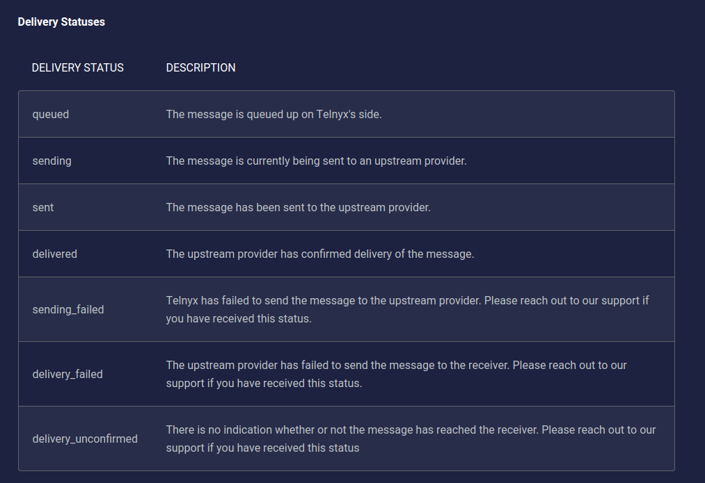
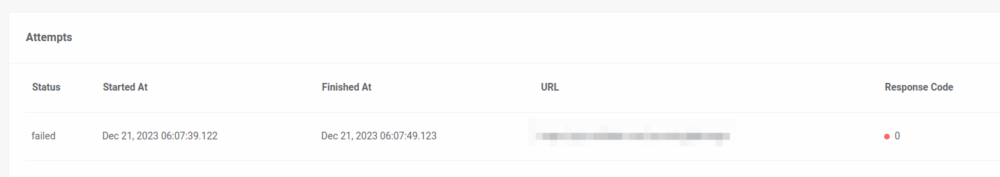
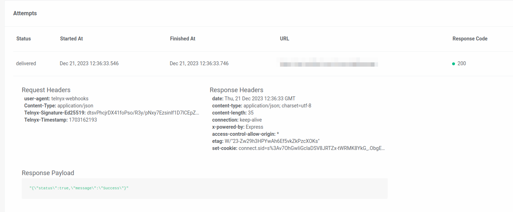

How to Leverage Webhooks | Telnyx Help Center

[Skip to main content](#main-content)

# How to Leverage Webhooks

This article explains what webhooks are and how to leverage them with Telnyx.

Written by Dillin

June 6, 2024

Table of contents

A webhook (also called a web callback or HTTP push API) is a way for an app to provide other applications with real-time information. A webhook delivers data to other applications as it happens, meaning you get data immediately.

You can choose to be notified about events that Telnyx sends to you by configuring webhook urls in your SIP Connection or Applications (voice, fax or messaging).

**NOTE:** Webhooks will be sent from the IP range of the region where your calls are anchored. Read more about our [anchorsite](https://support.telnyx.com/en/articles/5271423-guide-to-sip-anchorsite-settings) feature which is a setting available on your SIP Connections and Voice Applications to help you control which region your calls can be anchored.

# **Whitelist (Webhooks)**

If you use an ACL or Firewall on your network, make sure you whitelist our network IP assignments per region click [here](https://support.telnyx.com/en/articles/1130687-whitelisting-telnyx-ip-addresses#h_5a35a3a298)!

​

## **Requirements (Webhooks)**

For this mechanism to work, you’ll need a publicly accessible HTTP server that can receive our webhook requests at one or more specified URLs. We highly recommend using [HTTPS](https://https.cio.gov/everything/) (instead of HTTP).

[This tutorial](https://developers.telnyx.com/docs/messaging/messages/receive-message) walks through setting up a basic application for receiving webhooks.

##

## **Hierarchy of URLs**

If webhooks are provided in the [request body](https://developers.telnyx.com/api/messaging/send-message), we will use those, otherwise if the profile has webhooks, we’ll use those. If neither has webhooks, we won’t attempt a webhook delivery.

## **Delivery Status Updates**

The Telnyx Messaging Services will attempt to notify you about each [status](https://developers.telnyx.com/docs/messaging/messages/message-detail-records) update based on the hierarchy of URLs above.

## **Delivery Status Payload**

Here is an example of a webhook event where a delivery receipt is returned to the sender after sending a message through a Telnyx long code to a T-Mobile long code:

```
{  
   "data":{  
      "event_type":"message.finalized",  
      "id":"4ee8c3a6-4995-4309-a3c6-38e3db9ea4be",  
      "occurred_at":"2019-12-09T21:32:14.148+00:00",  
      "payload":{  
         "completed_at":"2019-12-09T21:32:14.148+00:00",  
         "cost":null,  
         "direction":"outbound",  
         "encoding":"GSM-7",  
         "errors":[  
         ],  
         "from":{  
            "carrier":"T-Mobile USA",  
            "line_type":"Wireless",  
            "phone_number":"+13125000000",  
            "status":"webhook_delivered"  
         },  
         "id":"ac012cbf-5e09-46af-a69a-7c0e2d90993c",  
         "media":[  
         ],  
         "messaging_profile_id":"83d2343b-553f-4c5f-b8c8-fd27004f94bf",  
         "organization_id":"9d76d591-1b7d-405d-8c64-1320ee070245",  
         "parts":1,  
         "received_at":"2019-12-09T21:32:13.552+00:00",  
         "record_type":"message",  
         "sent_at":"2019-12-09T21:32:13.596+00:00",  
         "tags":[  
         ],  
         "text":"Hello there!",  
         "to":[  
            {  
               "carrier":"T-MOBILE USA, INC.",  
               "line_type":"Wireless",  
               "phone_number":"+13125000000",  
               "status":"delivered"  
            }  
         ],  
         "type":"SMS",  
         "valid_until":"2019-12-09T22:32:13.552+00:00",  
         "webhook_failover_url":"",  
         "webhook_url":"http://webhook.site/af3a92e7-e150-442c-9fe6-61658ce26b1a"  
      },  
      "record_type":"event"  
   },  
   "meta":{  
      "attempt":1,  
      "delivered_to":"http://webhook.site/af3a92e7-e150-442c-9fe6-61658ce26b1a"  
   }  
}
```

## **Delivery Statuses (Webhooks)**



## **Delivery Status Payload**

Telnyx gives you the option of using webhooks to notify you of new inbound messages to your SMS-capable long code and toll-free phone numbers. This feature is enabled by configuring the incoming webhooks on the associated [messaging profile](https://developers.telnyx.com/api/messaging/list-messaging-profiles)

**Note:** *Regardless of whether you have configured webhook delivery, records of your received messages are still available in your reports, accessible in the Mission Control Portal or using the [Reports](https://developers.telnyx.com/api/v1/mission-control/add-cdr-request) API endpoint.*

## **Incoming Message Payload**

Here is an example of a webhook event where a Telnyx Long Code receives a text message from a T-Mobile long code:

```
{  
   "data":{  
      "event_type":"message.received",  
      "id":"b301ed3f-1490-491f-995f-6e64e69674d4",  
      "occurred_at":"2019-12-09T20:16:07.588+00:00",  
      "payload":{  
         "completed_at":null,  
         "cost":null,  
         "direction":"inbound",  
         "encoding":"GSM-7",  
         "errors":[  
         ],  
         "from":{  
            "carrier":"T-Mobile USA",  
            "line_type":"long_code",  
            "phone_number":"+1312500000",  
            "status":"webhook_delivered"  
         },  
         "id":"84cca175-9755-4859-b67f-4730d7f58aa3",  
         "media":[  
         ],  
         "messaging_profile_id":"740572b6-099c-44a1-89b9-6c92163bc68d",  
         "organization_id":"47a530f8-4362-4526-829b-bcee17fd9f7a",  
         "parts":1,  
         "received_at":"2019-12-09T20:16:07.503+00:00",  
         "record_type":"message",  
         "sent_at":null,  
         "tags":[  
         ],  
         "text":"Hello from Telnyx!",  
         "to":[  
            {  
               "carrier":"Telnyx",  
               "line_type":"Wireless",  
               "phone_number":"+1773005000",  
               "status":"webhook_delivered"  
            }  
         ],  
         "type":"SMS",  
         "valid_until":null,  
         "webhook_failover_url":null,  
         "webhook_url":"http://webhook.site/04bbd2e3-09b5-4c9e-95de-a1debeb9e675"  
      },  
      "record_type":"event"  
   },  
   "meta":{  
      "attempt":1,  
      "delivered_to":"http://webhook.site/04bbd2e3-09b5-4c9e-95de-a1debeb9e675"  
   }  
}
```

​**Note:** *MMS media links will be available for 30 days after message receipt. After 30 days the link will expire and the media will no longer be available through Telnyx.*

## **Responding to a Webhook**

To acknowledge receipt of a webhook, your endpoint should return a `2xx` HTTP status code. Any other information returned in the request headers or request body is ignored. All response codes outside this range, including `3xx` codes, will indicate to Telnyx that you did not receive the webhook. URL redirection or a "Not Modified" response will be treated as a failure.

## **Retries (Webhooks)**

Webhooks will be retried to each of the supplied URLs if your application does not respond in 2000 milliseconds. This is typically seen when the webhook url endpoint does not return a response, Telnyx will timeout the original request and attempt to retry one more time. You can determine when a timeout occurs, by reviewing the [Debugging / Webhook section](https://portal.telnyx.com/#/app/debugging/webhook?enableAlerts=true) as you will see a **response code of 0**, like in the picture below.



If your primary webhook url goes down, be sure to specify a failover url as a back up so Telnyx can send webhook events to the failover url in the event there is an issue with the primary url.

You can click into the status to view the request and response headers as well as the response payload which might help indicate further issues. In the example below, we see a successful 200 response.



## **Best Practices (Webhooks)**

If your webhook script performs complex logic or makes network calls, it's possible the script would timeout before Telnyx sees its complete execution. For that reason, you may want to have your webhook endpoint immediately acknowledge receipt by returning a `2xx` HTTP status code, and then perform the rest of its duties.

Webhook endpoints may occasionally receive the same event more than once. We advise you to guard against duplicated event receipts by making your event processing idempotent. One way of doing this is logging the events you've processed, and then not processing already-logged events. Additionally, we recommend verifying webhook signatures to confirm that received events are being sent from Telnyx.

Telnyx signs the webhook events it sends to clients so that the authenticity of the request can be verified. Webhook signing in API V2 uses public key encryption. Telnyx stores a public-private key pair and uses the private key to sign the payload.

The public key is available to you so that you can verify the request.

The public key can be viewed in the [Mission Control Portal](https://portal.telnyx.com/#/app/account/public-key) under account settings in the left hand navigation bar > Keys & Credentials > Public Key sub tab.

The signature for the payload is calculated by building a string that is the combination of the timestamp of when the request was initiated, the pipe `|` character and the JSON payload. The signature is then `Base64` encoded.

```
Base64.encode64("#{timestamp}|#{payload}")
```

The signature (`Base64` encoded) and the timestamp (in Unix format) are assigned to the request headers `telnyx-signature-ed25519` and `telnyx-timestamp` respectively.

You can then use cryptographic libraries in your language of choice to verify the signature using the public key. For examples, please see:

* [telnyx-python](https://github.com/team-telnyx/telnyx-python/blob/master/telnyx/webhook.py)
* [telnyx-ruby](https://github.com/team-telnyx/telnyx-ruby/blob/master/lib/telnyx/webhook.rb)
* [telnyx-node](https://github.com/team-telnyx/telnyx-node/blob/master/lib/Webhooks.js)

---

Related Articles

[Notification Settings](https://support.telnyx.com/en/articles/4277896-notification-settings)[Setting Up Telnyx Voicemail](https://support.telnyx.com/en/articles/5989560-setting-up-telnyx-voicemail)[Verified Numbers](https://support.telnyx.com/en/articles/6988813-verified-numbers)[Update Webhook Sign Key Guide](https://support.telnyx.com/en/articles/8370064-update-webhook-sign-key-guide)[[BETA] How to Verify Phone Numbers Using DTMF (Press 1 to Verify)](https://support.telnyx.com/en/articles/13854980-beta-how-to-verify-phone-numbers-using-dtmf-press-1-to-verify)

Did this answer your question?

😞😐😃

Table of contents
