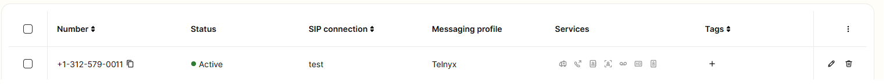
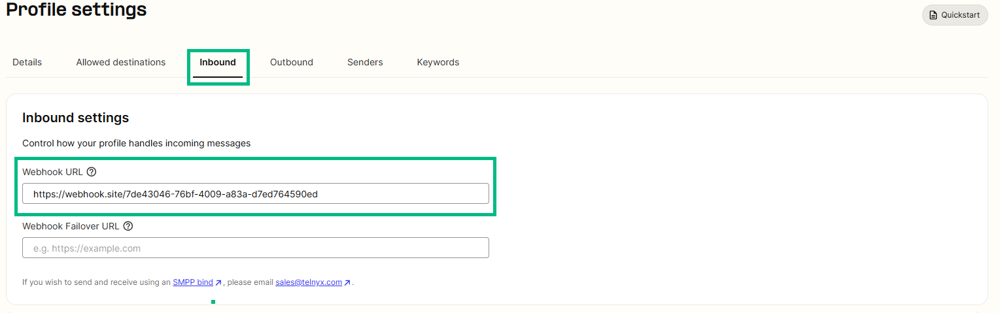
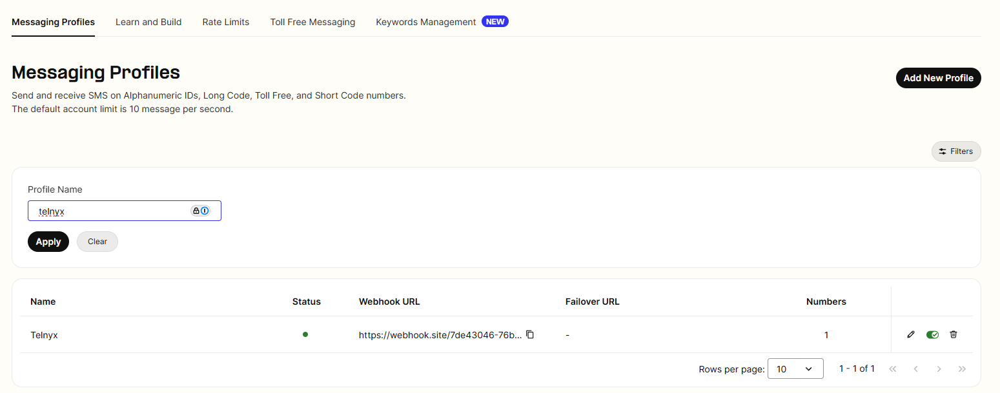
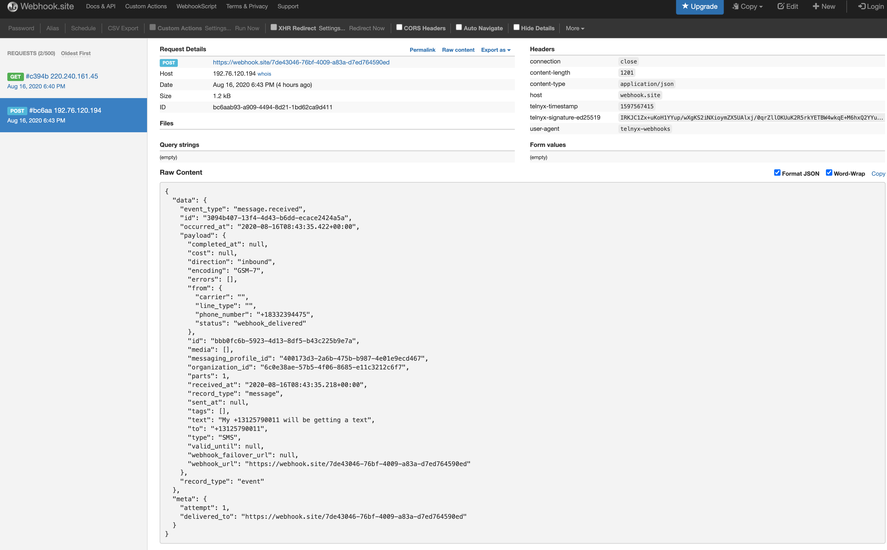

# Receiving SMS on your Telnyx number

Begin your journey with Telnyx: Learn how to sign up and set up a Mission Control account effectively. See Telnyx guidance and requirements.

## **Prerequisites for Receiving SMS**

Make sure you've configured your account, such as purchasing a number, creating a messaging profile, and associating that messaging profile with that number.

​

## **Receiving SMS on Telnyx**

First of all, there is no provision on the Telnyx portal where you can receive the SMS.

In order to receive SMS on your Telnyx purchased number, you need to attach a webhook to the number's respective messaging profile.

You can find more details about Webhook in the below section of this article.

So let's take this example DID which is connected to a **Telnyx** messaging profile.

Now, in the messaging profile section, you need to attach a webhook, as highlighted in the green box. To do this, go to **Messaging > Programmable Messaging**, select the messaging profile, and then select **Inbound**.

Webhook can be customized and has to be set up by the customer, however, for this demo, we have generated a webhook from this website <https://webhook.site/>

Once the webhook is saved in the messaging profile, the content of your incoming SMS to Telnyx number can be seen in the webhook.

The below image shows SMS was sent to the Telnyx number i.e. +13125790011 with all the other details.

## **Video demo showing how to receive SMS on your Telnyx Number**

Kudos! now you know how to receive SMS on your Telnyx number.

Learn how to [receive SMS on your Telnyx number](https://developers.telnyx.com/docs/messaging/messages/receive-message).

More details: What are webhook?

<https://support.telnyx.com/en/articles/4334722-how-to-leverage-webhooks>

And for specific error codes here: <https://developers.telnyx.com/api/errors>

---

Related Articles

[Forwarding SMS to Your Mobile Number](https://support.telnyx.com/en/articles/3231942-forwarding-sms-to-your-mobile-number)[Telnyx Verify: 2FA made easy](https://support.telnyx.com/en/articles/5701653-telnyx-verify-2fa-made-easy)[Setting Up Telnyx Voicemail](https://support.telnyx.com/en/articles/5989560-setting-up-telnyx-voicemail)[Messaging in Mission Control](https://support.telnyx.com/en/articles/8219294-messaging-in-mission-control)[Group Messaging - Bulk Sending MMS](https://support.telnyx.com/en/articles/8255134-group-messaging-bulk-sending-mms)

Did this answer your question?

😞😐😃
