# My Numbers Page

This article explains the Numbers page & settings in the Mission Control Portal. See Telnyx guidance and requirements.

## **My Numbers Page**

The purpose of this article is to provide an overview of the [My Numbers Page](https://portal.telnyx.com/#/numbers/my-numbers) found in the Telnyx Portal along with a brief description of all the options available:

* List your procured numbers
* Number Filters to help search and find specific numbers
* Bulk Edit Numbers to make bulk changes
* Number Settings to give information about and enable features for your numbers
* Enabling Emergency Services also known as e911
* Export / Download a csv file with a list of your numbers

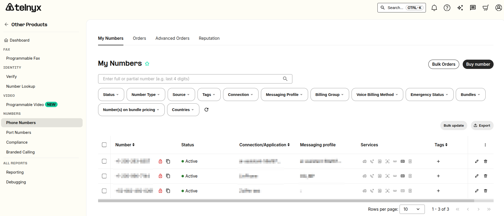

On this page, you will see all of your procured numbers. They will show up in the order that you have purchased them by default. You can also sort your numbers by order date, phone number, connection, and billing method.

**Note:** You can have up to 100 numbers per page as well by clicking drop-down menu beside the 'showing results' section

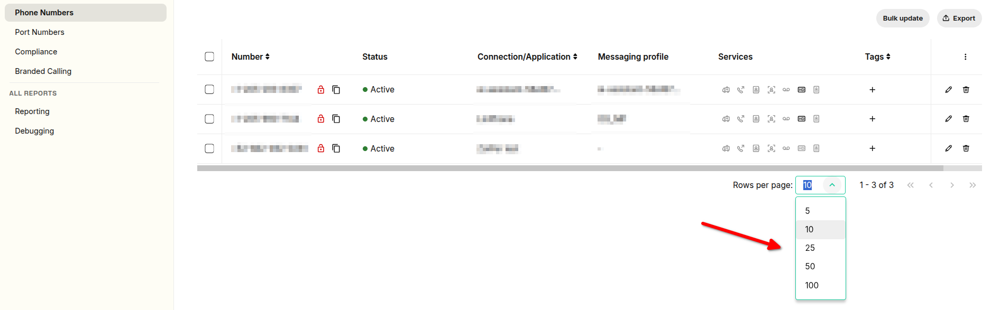

More specific filtering can be set by the filters found below.

## **Number Filters**

These are the filters you can apply to your number list:

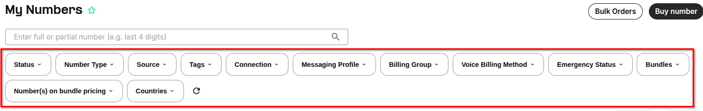

Here you have some of them explained so that you get the idea:

1. **Connection or Application:** This is by which connection SIP connection you have established, which numbers you have set to Forward only, or by which Call Control application you have them set to.
2. **Number (Partial or Full):** Input any quantity of digits and it will filter by the ones entered.
3. **Status:** This is based on the procurement status of the number. Among these are if they are pending purchase, port status, and if they are emergency only.
4. **Billing group:** This allows you to filter by the billing group you have assigned to the number to assist with reports and invoicing.
5. **Voice Billing Method:** Normal billing by minutes or the channel billing method.
6. **Tag:** Custom tags that you can add per number. You can set these to filter your numbers by name, organization, or however, you want to filter them out.

### **Export and Download a CSV list of your phone numbers**

When exporting your numbers as a CSV, you can choose to export all of them, or include any filters you have applied to the exported file. Once the export file is ready, it will automatically download through your browser.

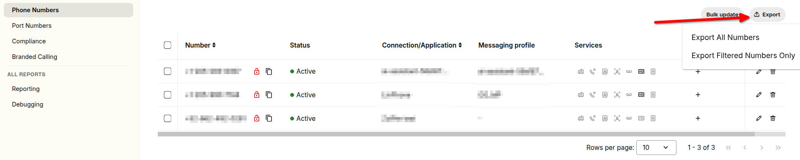

## **Bulk Edit Numbers**

If you want to update multiple numbers at once, you can utilize the bulk edit feature on this page.

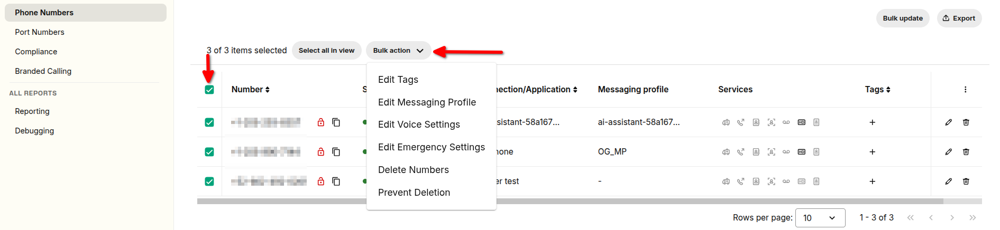

Simply select the numbers you would like to update, then click on Bulk Actions drop-down menu. From here you can select from several number settings you want to edit in bulk.

These include messaging profile, tags, voice settings, emergency settings, or an option to delete multiple numbers. To restore deleted numbers read more in this article

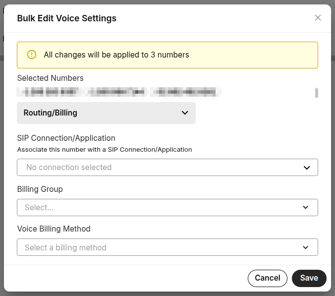

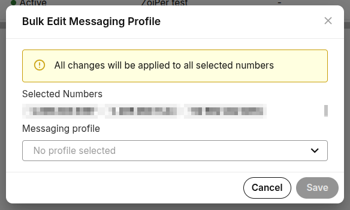

**Note:** You can edit up to 100 numbers at a time. If you wish to edit more, it can be done sequentially .

## **Services**

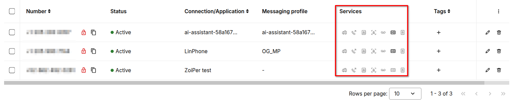

Each number has its own services that you can configure by clicking on the pencil icon on the right.

We will go over these section by section.

## Settings

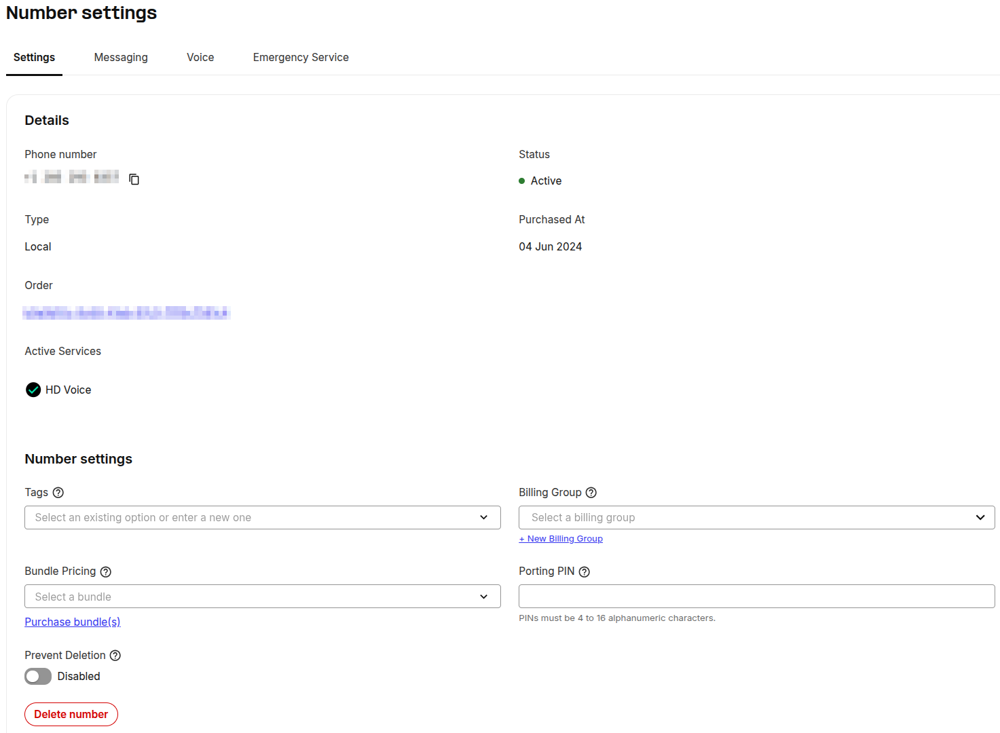

**General:** This tab displays some general information about the number, including status, purchase date, and Active Services.

**Number Management:** From here you can set tags. Tagging is key to a multi-tenant environment and allows you to easily download call detail record reports from your [reporting section](https://portal.telnyx.com/#/reporting/detailed-records).

**Porting:** You can set a PIN that is used to verify porting request which prevents your number from being ported away without your consent

**Delete Number:** You can use this option to delete the selected number from your account.

## Messaging

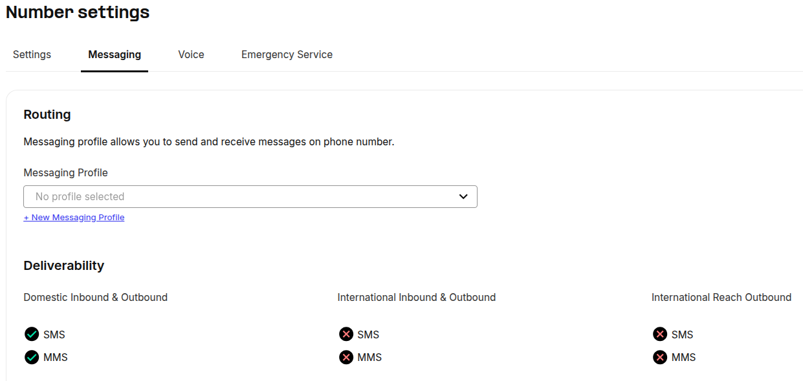

**Routing:** You can assign which Messaging Profile is to be assigned to the selected number

**Deliverability:** This outlines if the number is capable of sending or receiving SMS/MMS domestically and internationally.

## Voice Settings

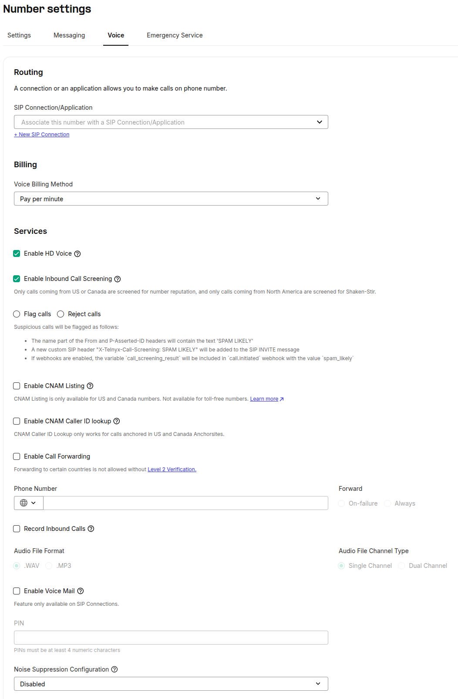

## **Routing**

You can assign which SIP Connection/Voice Application is to be assigned to the selected number.

## **Billing**

You can create/select a billing group to assign to this number, and set the Voice Billing Method. It can set this to either Pay Per Minute or Channel Billing. Channel billing information can be found [here](https://support.telnyx.com/en/articles/1130678-channel-billing-and-how-to-use-it).

## **Services**

### **HD Voice**

HD Voice allows the use of wideband audio codecs (when supported) to enhance the quality of PSTN calls. More details [here.](https://support.telnyx.com/en/articles/8394071-hd-voice-number-feature)

### **Call Screening**

This feature allows rejecting or flagging suspicious calls from PSTN. Calls are considered suspicious when the originating number has bad reputation or when the Shaken-Stir attestation level is either invalid or C.

### **CNAM**

You can enable and set **CNAM Listings** and **Caller ID Name** here**.** More information on the differences can be found [here](https://support.telnyx.com/en/articles/1130720-caller-id-outbound-vs-cnam).

### **Call Forwarding**

This section allows you to configure the number forward for this individual number. After entering a number, you can set the forward to either *Always* or *On-Failure*. Always makes incoming calls forward to the number entered whenever you would call this number. On-Failure sets it to do so only when the number can not be reached.

### **Inbound Call Recording**

Setup the settings to be able to store recordings of the calls you receive using this number. You can set it to use either WAV or MP3 file systems as well as configure if it’s Single Channel or Dual Channel. Recordings will be made available [here](https://portal.telnyx.com/#/call-recordings).

### **VoiceMail**

This section allows you to enable Voicemail services which forwards inbound calls to a voicemail box if the call is rejected or missed. Here you can configure your PIN, and the email you want to receive VM notifications to. More info on Voicemail [here](https://support.telnyx.com/en/articles/5989560-setting-up-telnyx-voicemail).

### **Noise Suppression**

This feature enhances call clarity by intelligently filtering out background noise, ensuring crystal-clear communication. Enabling Noise Suppression at the connection level affects all numbers associated with that connection, superseding any specific settings for individual numbers. This affects both inbound and outbound media streams, ensuring clarity from any direction, with the reference point consistently being the Telnyx client, regardless of the direction of the call's direction.

## **Advanced**

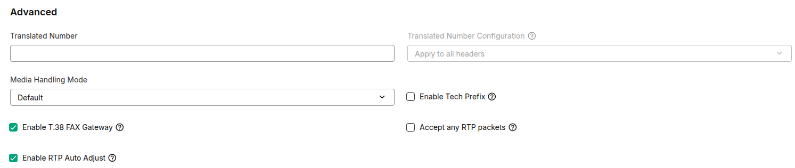

### Translated Number

Lets you set up custom number translations in the SIP headers, ideal for ATA's that require a different value in the INVITE/TO header in the SIP INVITE for inbound calls.

### Media Handling

Telnyx will automatically detect your media IP address by monitoring the RTP packets received during the first seconds after media establishment on the media IP address: port pair and adjust it automatically if it differs from the pair announced by you during call establishment. This can be disabled by unselecting **Enable RTP Auto Adjust**.

The same behaviour can be extended to the whole duration of the call by selecting the option **Accept any RTP packets**.

### Enable Tech Prefix

You can enable the number to have a **Tech Prefix** to differentiate between other incoming numbers. This setting only works with IP/FQDN-based SIP Connections and will not apply to numbers associated with a SIP credentials-based Connection.

​**Example:**

SIP Connection A: IP Authentication with tech prefix 8888.
SIP Connection B: IP Authentication with tech prefix 1234.
​
If SIP Connection A dials a number associated with SIP Connection B, where B has the tech prefix feature enabled on the number, the incoming call will be prefixed with 1234+number.

When the feature is disabled on the number, the tech prefix associated with SIP Connection B will not be included in the SIP INVITE.

**Note:** If you have **translated number** enabled with a value of 4444 and you also have a **tech prefix** enabled, the resulting SIP INVITE would look like 1234+4444+number.

## **Emergency Services**

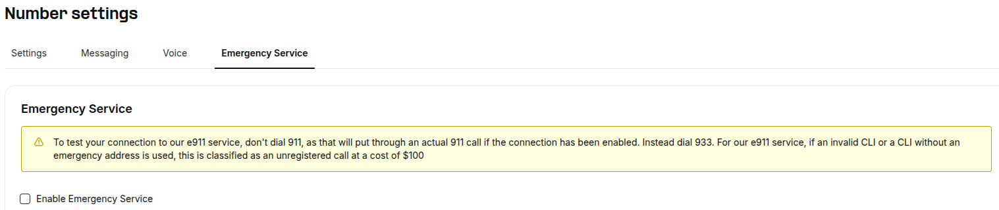

Here you can set up emergency services use. This will incur a monthly fee for the number. Once enabled, you can add an address to have it set up for E911 services. When dialing 911 from this number, the local PSAP will be able to see the caller's ID and the address you associated with the DID.

## **Notes**

* If you dial [911](https://support.telnyx.com/en/articles/1130709-how-do-i-test-e911-service) without having emergency services enabled on your DIDs, you will incur a $100 fee per call that is made. Please ensure that the caller ID is sent out in +E.164 format.
* If your account balance remains negative for more than 30 days you will receive an email to indicate that your account has been abolished.

  + Your phone numbers will be removed from your account and they will enter a hold period of 2 weeks. During this time you will be able to buy your numbers again using the "Search and Buy Numbers" section of the portal. Only your account will be able to find and buy them back. Note that adding balance would not be enough to get your numbers back you also need to search for them and buy them back.
  + After that 2 week period, those resources enter an ageing state which lasts another 2 weeks. After said ageing state the numbers are then released and anyone can buy them.
  + Please reach out to our numbering team ([numbering@telnyx.com](mailto:numbering@telnyx.com)) if you would like to retain the phone numbers from your account.
  + Please also consider enabling [low balance notifications](https://support.telnyx.com/en/articles/4277896-notification-settings) as a reminder to top up your accounts balance to keep it positive.

---

Related Articles

[IP Authentication with Tech Prefix](https://support.telnyx.com/en/articles/2602782-ip-authentication-with-tech-prefix)[Bulk Edit Numbers - Voice Settings](https://support.telnyx.com/en/articles/2807846-bulk-edit-numbers-voice-settings)[SIP Connection: Types](https://support.telnyx.com/en/articles/4245868-sip-connection-types)[More About Outbound Voice Profiles](https://support.telnyx.com/en/articles/4320411-more-about-outbound-voice-profiles)[SIP Connection: Settings](https://support.telnyx.com/en/articles/4351104-sip-connection-settings)

Did this answer your question?

😞😐😃
