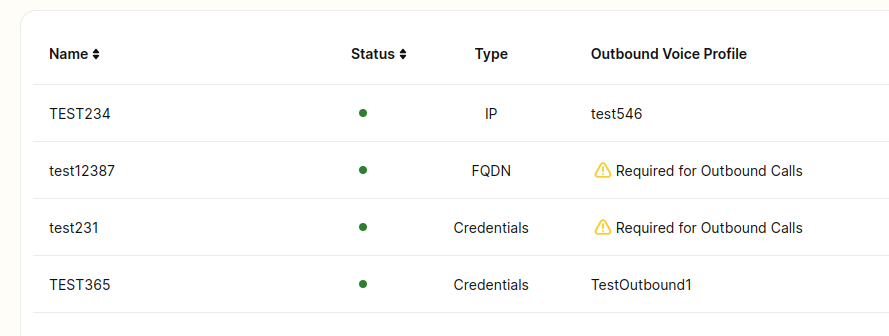
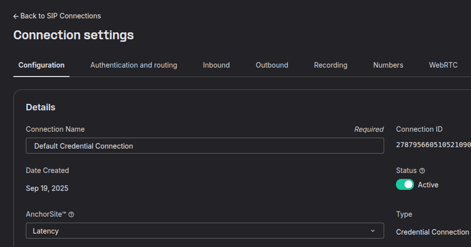
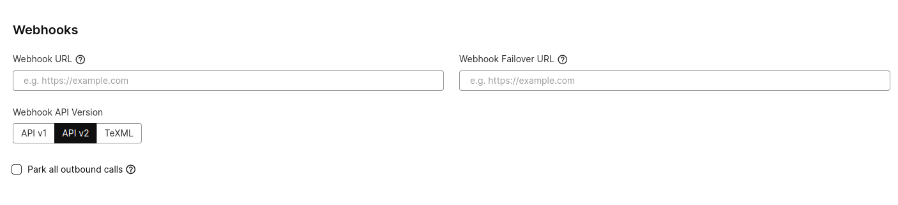
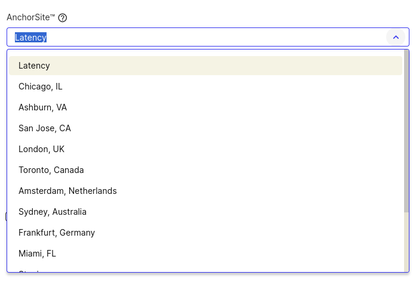
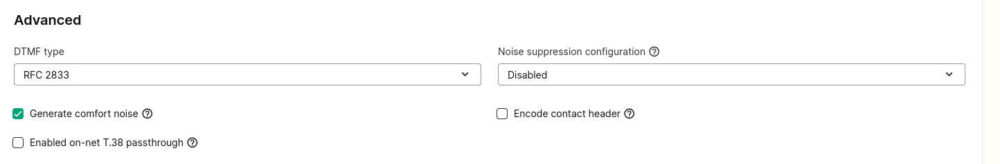
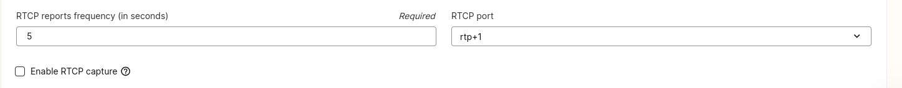

# SIP Connection: Settings

This article explains the SIP Connection settings in the Mission Control Portal. See Telnyx guidance and requirements.

## Overview of SIP Connections

To access the settings of a connection, click the small edit icon on the far right of the desired connection at the [SIP Trunking section](https://portal.telnyx.com/#/voice/connections) under the Voice Suite in the Mission Control Portal.

If you are looking for a detailed overview of the inbound/outbound SIP Connection settings, please review this [article](https://support.telnyx.com/en/articles/4404448-sip-connection-inbound-outbound-settings) for more information.

As seen below, you can distinguish your SIP Connections by giving them unique names. Each time you create a SIP Connection, it will have a universally unique identifier - this is mainly used for interacting with our API programmatically.

The basic settings have **five** different category's, each of which are described in detail below:

* Authentication & Routing Configuration
* Webhooks
* AnchorSite®
* Advanced Settings
* RTCP Settings

## Authentication & Routing Configuration

We offer three different authentication types to register your switch to ours. Deciding on what registration type to use depends on your use case. Please have a read of our **[SIP Connection Types](https://support.telnyx.com/en/articles/4245868-sip-connection-types)** article for more information on this section.

If you are interested in the advanced authentication methods to further secure your traffic, we offer 3 options for IP Auth SIP Connections.

* [Tech Prefix](https://support.telnyx.com/en/articles/2602782-ip-authentication-with-tech-prefix):

  + A 4 digits prefix that needs to be appended to the destination number.
* [Token](https://support.telnyx.com/en/articles/4860170-ip-authentication-with-x-telnyx-token):

  + A string that must be sent in a custom SIP header **<X-Telnyx-Token>** on the SIP INVITE message.
* P Charge Info:

  + A telephone number associated with this connection must be sent in the **P-Charge-Info** SIP header on the SIP INVITE message.

## Webhooks

The webhook settings allow you to send all connection events to a webhook of your choice. If our system fails to receive a 200 response when attempting to deliver the webhook event to your **Webhook URL**, it will send then attempt to send the event to your **Failover URL.**

There are 5 different events that can be sent:

* Call Initiated
* Call Answered
* Call Bridged
* Call Hangup
* [Call Voicemail Completed](https://support.telnyx.com/en/articles/5989560-setting-up-telnyx-voicemail)

**NOTE**

You will need to make sure that you use a **[voice api application](https://support.telnyx.com/en/articles/4374050-configuring-call-control-texml-applications-voice-api)** to control the calls programmatically.

This typical misconception occurs, where customers have a SIP Connection associated with a number that has a webhook url set at the SIP Connection. They receive an inbound call and then attempt to issue the answer command with the call control id from the webhook events.

You will receive an API error "**Can not issue an answer command on an outbound call.**". While the error is misleading, and actively being addressed, the real issue is that commands can only be triggered with our Voice API when a voice api application is associated with the numbers receiving the calls.

Some customers, though, set the webhook url on the SIP Connection because it's a public endpoint that is integrated with their PBX in which they have functions in their PBX which respond over SIP.

There is another typical use case where you would want to set a webhook url on your SIP Connection and relies on the park outbound calls feature below.

**Important:** When setting a webhook url, it treats the call type as programmable and not SIP trunking. This is because we are delivering programmable webhook events of the call state. There is a limitation with this setup if you were just using it for notification purposes and not to actually programmatically control the call.

* The audio of your calls may be anchored in a media server (anchorsite) further away than you intended because that region does not support programmable voice services yet. Example: Australia. In such circumstances, we recommend removing the webhook url from the SIP Connection settings in order to avoid this behaviour.

## Park Outbound Calls

The **Park Outbound Calls** feature provides a simple mechanism for users to “park” their outbound calls instead of connecting them to their destination. The call then awaits further orders from its connected voice api application. In the meantime, Telnyx will have generated a **SIP 180 Ringing** message to instruct the client to generate local ringback.

**Please be careful enabling this setting** if you are not using a voice api application to control the calls.

Parked calls provide ring-back to the caller, waiting for a command via the **Telnyx Voice API** to define the call action. Typical commands include answer, play audio, bridge to another call, and transfer to another number. You can learn more about Voice API commands in our **[Developer Docs](https://developers.telnyx.com/api-reference/call-commands/dial)**.

The typical use case for enabling this feature on a SIP Connection with a webhook url is where you have:

1. A voice api application that shares the same webhook url as the SIP Connection.
2. Where the SIP Connection is using credentials as the authentication type

   1. Where the callers are typically using a WebRTC client to register with our WebRTC gateway (rtc.telnyx.com) using the credentials of the SIP Connection.
   2. Where the callers of the WebRTC client make outbound calls from the SIP Connection.
   3. Where the events are posted to the webhook url of the SIP Connection.

      1. Which is essentially your voice api application backend webhook url.
      2. That then knows to issue a dial command to the number the caller wants to connect with while the caller is in a parked state.
      3. And when that leg of the call is answered, the backend application can issue a bridge command via our API with the callers unique call control id in order to unpark the caller and connect them with their destination.

Lastly, there are currently 3 webhook API Versions you can specify:

* **API V1**

  + This API is no longer recommended and less maintained as we move towards a richer feature set with it's V2 equivalent.
* **API V2**

  + This is to receive callback webhook events from our [Voice API](https://developers.telnyx.com/api-reference/call-commands/dial), is recommended and maintained.
  + The callback content-type will be sent as JSON payloads over HTTP.
* **TeXML**

  + When you set park outbound calls with [TeXML](https://developers.telnyx.com/docs/voice/programmable-voice/texml-fundamentals) as the API Version and make an outbound call, Telnyx will create a parked leg for your call and fetch the XML instructions that live on the webhook url you have specified so that TeXML takes over handling your calls.
  + The callback content-type will be sent as **form-data** over HTTP.
    ​

## AnchorSite®

The **AnchorSite®** settings allows the user to select the media server in which their calls are anchored. In most cases, the closer the server is to the user geographically, the better the latency. This setting defaults to **Latency** if not modified.

When the [AnchorSite®](https://support.telnyx.com/en/articles/5271423-guide-to-sip-anchorsite-settings) is set to Latency, we will proactively monitor the latency from your endpoints to our points of presence (PoP) to determine where your media should be anchored in order to ensure your packets get off the internet as fast as possible.
​
Please note, there are limitations to selecting latency depending on the authentication type of your SIP Connection, whereby your calls may be anchored on a media server further away if we are unable to identify the latency between our media servers and the IP's associated with the SIP Connection, through ICMP requests from our network. Please make sure you whitelist our [media IP addresses](https://sip.telnyx.com/#media) on your firewall as these will be used to check latency.

For credential based SIP Connections, please make sure to include the SIP Connections **username** in the contact header in your **first** SIP INVITE. This will allow our SIP Proxy to identify the settings associated with your SIP Connection and ensure the anchorsite selected is chosen. Again, if the username is not included in the first SIP INVITE attempt, there is no way for us to identify your SIP Connection in order to guarantee **AnchorSite®**.

## Advanced Settings

### Encode Contact Header

This setting will encode the SIP contact header sent by Telnyx to avoid issues with NAT and ALG scenarios.

### DTMF Types

The [DTMF](https://telnyx.com/products/sip-trunks) Type setting allows the user to specify the type of DTMF to be used on the call. There are three different options:

* RFC 2833
* Inband
* SIP Info

#### RFC 2833 (Recommended)

The standards-based mechanism used to send DTMF digits in-band (RTP) that is supported by many vendors in the industry.

#### Inband

Sending of information within the same band or channel used for data such as voice or video. This option is the most prone to issues.

#### SIP Info

Used by SIP network elements to transmit digits out-of-band as telephone-events in a reliable manner independent of the media stream.

### Enable On-Net T.38 Passthrough

Enable on-net T.38 if you prefer the sender and receiver negotiating T.38 directly. If this is disabled, Telnyx will be able to use T.38 on just one leg of the call depending on each leg's settings.

### Enable Comfort Noise for Call on Hold

When this option is checked, Telnyx will generate comfort noise when you place a call on hold. If this option is unchecked, you will need to generate comfort noise or on-hold music to avoid RTP timeouts.

## RTCP Settings

### RTCP Settings (Real-time Control Protocol)

RTP is used to transmit media between endpoints. As the media traverses the endpoints, RTCP packets are generated periodically by both the caller and the called party. However, unlike RTP, they don’t contain media. Instead, RTCP packets are used to report statistics about the ongoing call. Telnyx provides the ability to use either **RTCP+1** or **RTCP mux** at the connection level. Checking the "RTCP Capture and Storage" option will enable the feature.

### Report Frequency

The report frequency specifies the interval in seconds between sending RTCP packets back to the users media IP, while the call is in progress.

### RTCP Port

This setting defaults to **RTCP+1**. The other option, **RTCP mux**, is multiplexing both the RTP and RTCP through a single UDP port. One of the reasons why RTCP mux is used is for simplifying NAT traversal since only a single port is used for media and control messages.

---

Related Articles

[SIP Connection: Number Formats](https://support.telnyx.com/en/articles/1130706-sip-connection-number-formats)[SIP Connection: Types](https://support.telnyx.com/en/articles/4245868-sip-connection-types)[Telnyx Debugging Tools](https://support.telnyx.com/en/articles/4304872-telnyx-debugging-tools)[Configuring Call Control/TeXML Applications - Voice API](https://support.telnyx.com/en/articles/4374050-configuring-call-control-texml-applications-voice-api)[Guide to SIP AnchorSite® Settings](https://support.telnyx.com/en/articles/5271423-guide-to-sip-anchorsite-settings)

Did this answer your question?

😞😐😃
