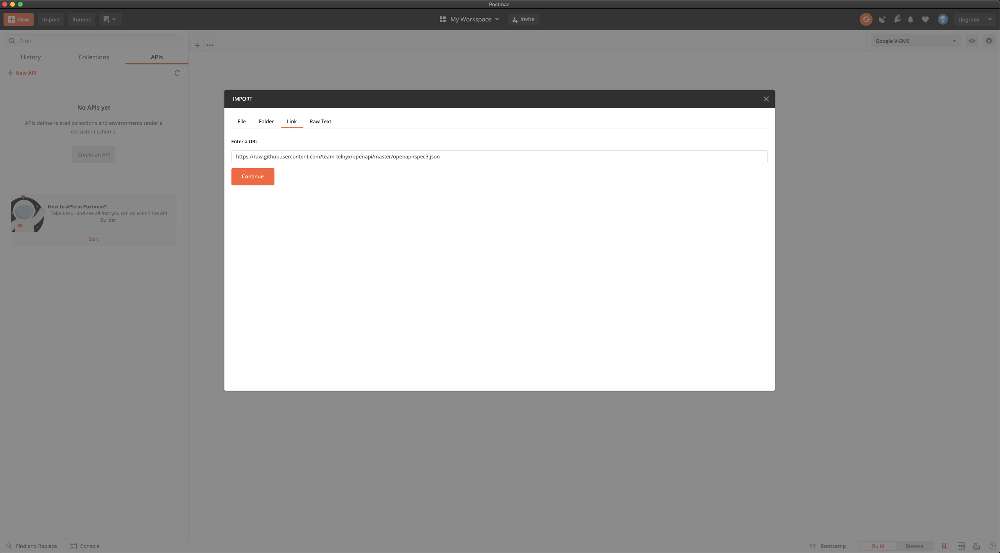
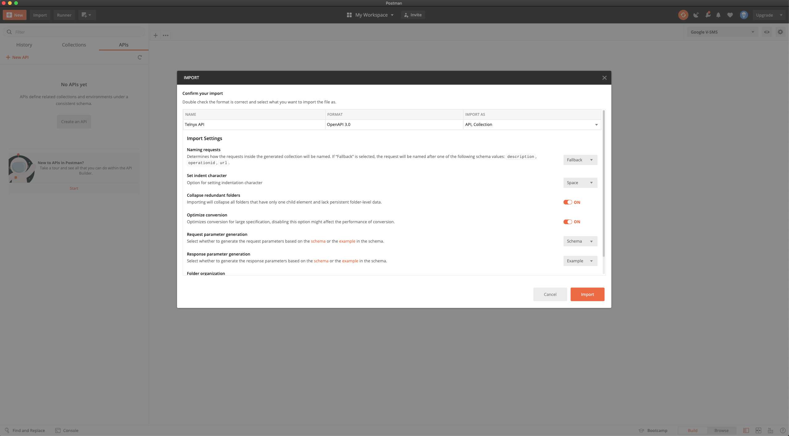
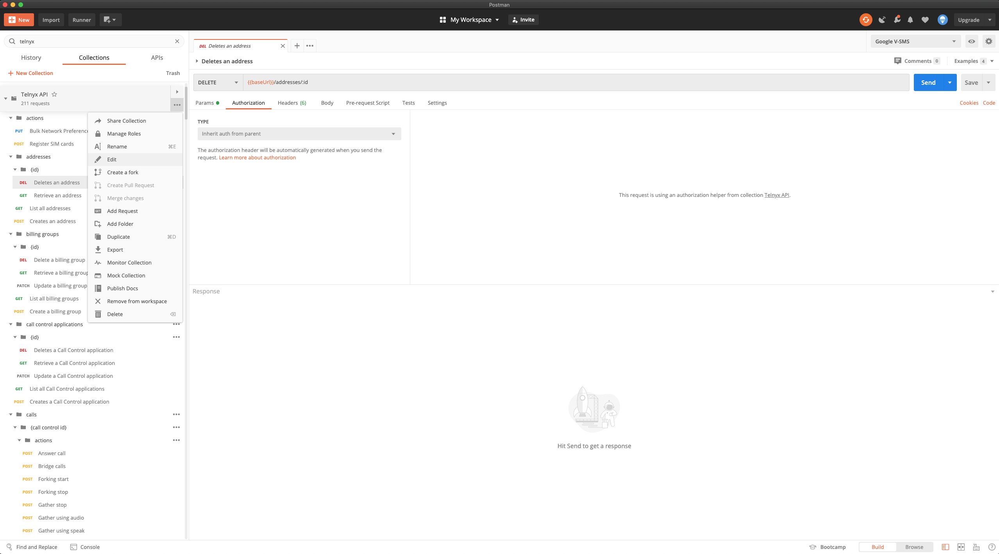

Creating Postman Collection from OpenAPI | Telnyx Help Center

[Skip to main content](#main-content)

# Creating Postman Collection from OpenAPI

Getting all of Telnyx API V2 on Postman only takes a few short steps, start using the API right away!

Written by Dillin

November 8, 2023

Table of contents

# **Step-by-step Guide to Creating a Postman Collection**

We all love Postman. How can you get all of Telnyx API v2 in a few clicks?

## Postman Collection Walkthrough

**Step 1**: Navigate to <https://github.com/team-telnyx/openapi/tree/master/openapi>

**Step 2**: From Postman, import the JSON via the raw link in Github or downloaded file. I am using the raw link below.

Use the default settings

**Step 3**: Add your API token to the collection

**Step 4**: Use the API!

---

Related Articles

[Telnyx Verify: 2FA made easy](https://support.telnyx.com/en/articles/5701653-telnyx-verify-2fa-made-easy)[Certificate Error: api.telnyx.com](https://support.telnyx.com/en/articles/7984783-certificate-error-api-telnyx-com)[Bulk Messaging with Sheets](https://support.telnyx.com/en/articles/8268223-bulk-messaging-with-sheets)[Update Webhook Sign Key Guide](https://support.telnyx.com/en/articles/8370064-update-webhook-sign-key-guide)[How to Verify Phone Numbers behind an IVR](https://support.telnyx.com/en/articles/12386088-how-to-verify-phone-numbers-behind-an-ivr)

Did this answer your question?

😞😐😃

Table of contents
