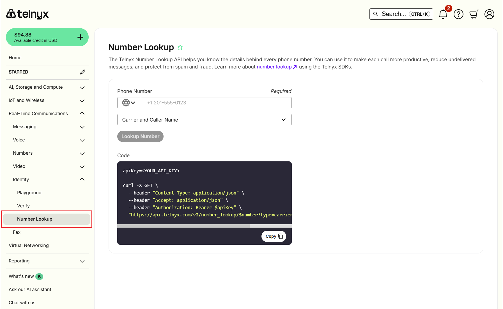

# Your Number Lookup Guide

This guide covers how to use the Number Lookup tool in the Telnyx Mission Control Portal to retrieve carrier details… See Telnyx guidance and requirements.

## **Overview**

The Telnyx Number Lookup API helps you know the details behind every phone number. You can use it to make each call more productive, reduce undelivered messages, and protect from spam and fraud.

---

## **Prerequisites**

Before using Number Lookup, ensure you have:

1. **A Telnyx account** - Sign up at [telnyx.com/sign-up](https://telnyx.com/sign-up)
2. **A positive account balance** - Number Lookup requires funds in your account
3. **API Key** (for API access) - Generate from [API Keys](https://portal.telnyx.com/#/app/api-keys) in Mission Control

**Note:** Number Lookup will not be available if your account balance is negative.

---

## **Using Number Lookup in the Portal**

1. **Sign in** to the [Telnyx portal](https://portal.telnyx.com/)
   ​
2. Navigate to <https://portal.telnyx.com/#/lookup>
   ​
3. Enter the phone number and select a **Lookup Type**:
   ​

   * **None:** Basic info (LRN only).
   * **Carrier:** Adds carrier details.
   * **Caller Name:** Adds CNAM.
   * **Both:** Returns all available data.
     ​
4. Click **Lookup Number**.
   ​

   

---

## **Video Walk-through for Number Lookup**

---

## **Lookup Types and Pricing**

|  |  |
| --- | --- |
| **Service** | **Cost** |
| Local Routing Number (LRN) | $0.0015 per query |
| MCC/MNC (Carrier Codes) | $0.0025 per query (mobile only) |
| CNAM (Caller ID Name) | $0.003 per query |
| Inbound CNAM | $0.40 per number/month |
| Outbound CNAM Listing | Free |

##

## **Examples**

* **Landline** with Carrier + Caller Name: $0.0015 + $0.003 = **$0.0045**
* **Mobile** with Carrier + Caller Name: $0.0015 + $0.0025 + $0.003 = **$0.007**

View your rates at [Telco Pricing](https://portal.telnyx.com/#/pricing/telco). For volume discounts, [contact sales](https://telnyx.com/contact-us).

---

## **API Access & Documentation**

* **Quickstart Guide:** [Number Lookup Quickstart](https://developers.telnyx.com/docs/identity/number-lookup/quickstart)
* **Full Reference:** [Number Lookup API Reference](https://www.google.com/search?q=https://developers.telnyx.com/api-reference/identity/number-lookup)

---

## **Reviewing Your Usage**

* **Invoice:** Charges appear at the start of each month
* **Usage Reports:** Go to **[Reporting > Usage Reports](https://portal.telnyx.com/#/reporting/usage-reports)** and select a date range

**Note:** Reports are not real-time. Today's lookups appear tomorrow.

---

## **Important Notes**

**LRN Data Access**

* To view full LRN data, go to **[Account Settings > Profile](https://portal.telnyx.com/#/account/general)** and enable **Permitted NPAC User** (allow ~15 mins to apply).

**Limitations**

* **Access:** Restricted to Organization Owners only (no sub-accounts).
* **US Toll-Free:** Resporg ID is not returned.

---

## **Troubleshooting**

|  |  |  |
| --- | --- | --- |
| **Error** | **Cause** | **Solution** |
| Number Lookup unavailable | Zero/negative balance | [Add funds](https://portal.telnyx.com/#/app/billing/add-credit) |
| LRN data incomplete | NPAC User not enabled | Enable in Account Settings |
| 401 Unauthorized | Invalid API key | Verify key and header format |
| Sub-user access denied | Owner-only feature | Use org owner credentials |
