# Search and Buy Numbers

This article describes the process of obtaining phone numbers through Telnyx. See Telnyx guidance and requirements.

This article describes how to search and buy numbers in the Telnyx Mission Control Portal, leveraging different search mechanisms, adding numbers to the cart and reviewing your orders after purchase.

---

### **Configuration**

The [My Numbers](https://portal.telnyx.com/#/numbers/my-numbers) Section of Mission Control houses all of the phone numbers you've purchased or ported to Telnyx.
​

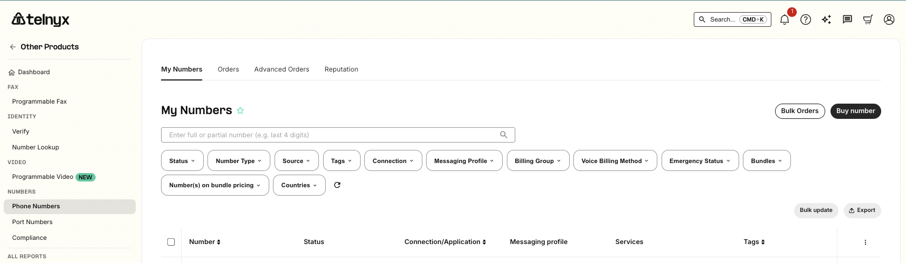

You can access Search & Buy Numbers by clicking on the **Buy Number** at the top right of that page, or you can click on the **Search Numbers** button below:

---

## **Searching, Purchasing & Ordering Phone Numbers (DIDs)**

### **Number Search**

On the Search & Buy Numbers page, you will be provided with 5 search types:

* Country (Required)
* Features
* Type
* Search By
* Area Code

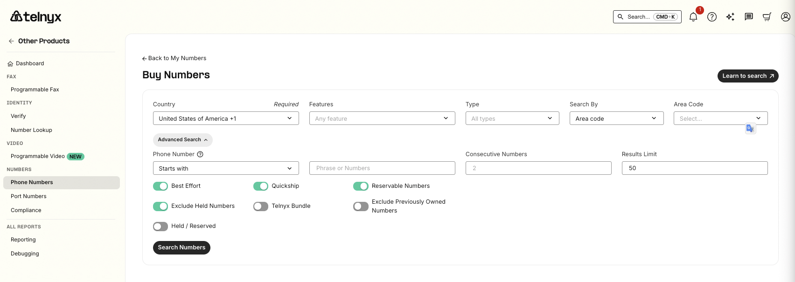

### Country:

Choose the country in the dropdown in which you want to find a phone number. This is the only required field when searching for a phone number.

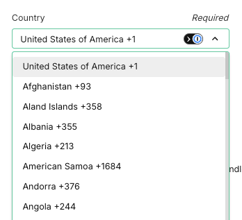

### Features:

Choose one or multiple features to ensure that the number you'll be purchasing is aligned with your use case:
​

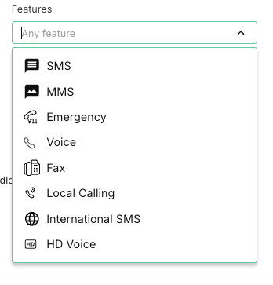

## Number Type:

Choose the number type you're looking to purchase:
​

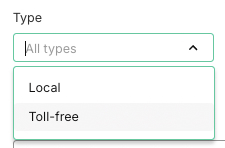

### **Local Numbers:**

Choosing Local Numbers enables you to search by Area Code, City/Region or State/Province:

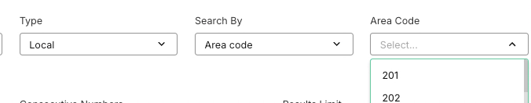

#### **Search by Area Code:**

Searching by area code allows you to search via the Area Code dropdown or to directly type in the area code that you're looking for.

#### **Search by City/Region**

Searchingby City or Region enables you to type in the City, Region or Rate Center that you're looking for. While typing, the portal will autogenerate options for you to choose from:

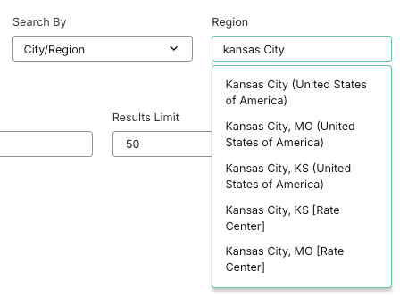

#### **Search by State/Province:**

Searchingby State/Province allows you to search for the state or province you are interested in (US only for now). You can choose from the dropdown or type the state you're interested in:

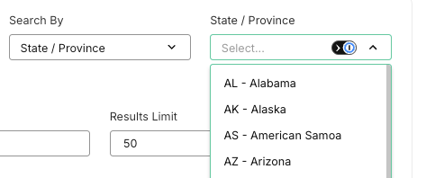

---

### **Toll-Free Numbers**

Choose a country of your choice, choose Toll-free as the Type, and specify patterns that the toll-free numbers should contain under the **Advanced Search** feature:

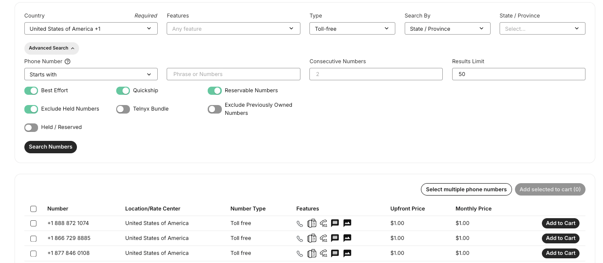

### **Advanced Search**

You can use the Advanced Search feature for both the Toll-free and Local number types. This feature enables you to:

* Search for vanity numbers or specific digits within a phone number
* Specify how many **Consecutive Numbers** you'd like (555-7345, 555-7346, 555-7347...)
* Specify your **Results limit** (currently at 100 results max)
* Toggle **Best Effort** searches, so we can return numbers in a rate center or area code close to the one you've chosen - should we not be able to find any that meet your criteria
* Enable **Quickship** to return a list of toll-free numbers that have their voice/fax capabilities instantly provisioned, so you can start to receive inbound calls immediately
* Toggle **Reservable Numbers** to take advantage of numbers you'd like to reserve for future purchase. With the Telnyx Number Reservations service, you can reserve numbers for 30 minutes. You can also extend your reservations for another half hour, all without purchasing a single number. Now you can hold on to Telnyx numbers for free while deciding which ones you would like to order.
* **Exclude Held Numbers** providing you the ability to return searches for numbers that have not been previously owned. By default, if you've recently deleted a number and searched for a similar number, Telnyx will return the deleted number as a result. We hold deleted numbers on your account for up to [15 days](https://telnyx.com/release-notes/reassigned-numbers-database) before they're vetted and released back into the general inventory. If you don't want to retrieve recently deleted numbers, please enable "***Exclude held numbers***".
* **Telnyx Bundles** search instead for a bundle that contains numbers, features and minutes included. Our search results will exclude premium NPA TNs.

---

## **Number Ordering**

Happy with your search results? Click on the Add to Cart button to add your phone number/s to your cart for purchase"

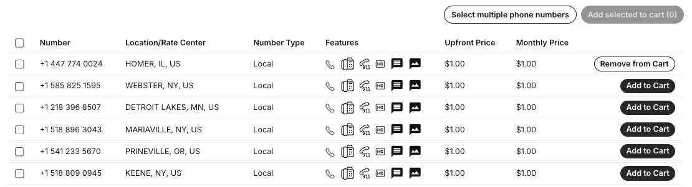

When you're ready to purchase the numbers, scroll up and click on your **cart** in the top right-hand corner of the page:

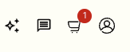

---

### **Cart**

Your number orders are accessible via your cart, showing the numbers you've chosen to purchase. You're able to empty your cart or individually delete a phone number by clicking on the trash icon associated with the number. You are also able to select a Connection or Messaging Profile you'd like these numbers to be assigned to automatically once the order is processed.

We show you the **Upfront Cost** (one-time activation) and **Monthly Cost** (recurring) for each number.

On the right, you'll see your **Order Summary** with the order total and the button to **Place Order**. The order total will be deducted from your balance.

Orders are **final,** and we do not provide refunds if you purchased a number by mistake. Please make sure to review the order summary completely before proceeding.

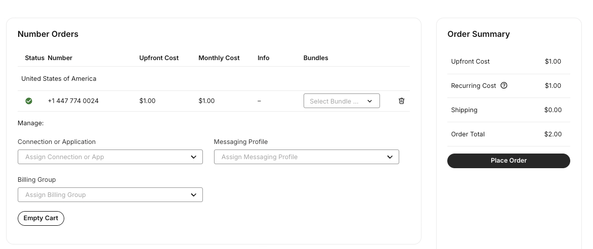

We recommend only ordering up to **50 numbers** at a time through the cart. Orders over this amount may result in purchase failures (which you are not charged for) or Connections/Messaging Profiles not being assigned correctly. We're continuously working on improving the scale of our ordering and assignment system. If you'd like to bulk order more than 50 phone numbers, please contact our sales team.

---

### Orders

After you've placed your order, you will be brought to the [Orders Page](https://portal.telnyx.com/#/numbers/orders). Each order you've ever processed through our system will be listed here. You'll see the order date and time, along with the quantity of numbers purchased per order. Additionally, you can click the order ID or "details" to re-check your order and verify what numbers were purchased.

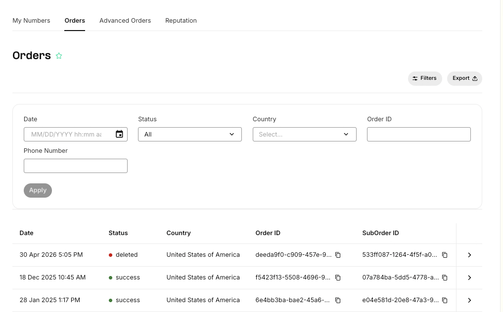

---

### How do I delete a number?

Visit the [My Numbers Page](https://portal.telnyx.com/#/app/numbers/my-numbers) and use the search filters to filter for the number you want to delete. Find the number you'd like to delete and click on the trash icon on the right. Once a number is deleted, monthly recurring charges will no longer apply.

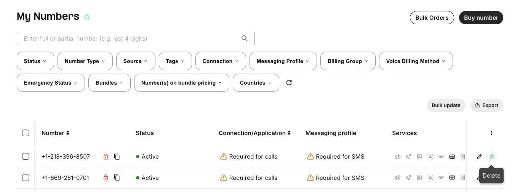

---

### **How do I restore or repurchase my deleted numbers?**

You have **15 days** to repurchase numbers you may have accidentally deleted. Numbers deleted will reincur charges, and resubmission of documentation will be required if they're international numbers. A prorated monthly recurring charge will be applied depending on your repurchase date.

To restore the deleted numbers back to your account, use our **Advanced Search** on our [Search & Buy Numbers Page](https://portal.telnyx.com/#/app/numbers/search-numbers):

* Specify the **Country**
* Search by **Area Code**
* Under the **Advanced Search** feature, set **Phone Number** to **Contains**
* Input the number you're looking to purchase
* Click **Search Numbers**

You may have to wait a couple of minutes after deleting the number for the number to return as a search result. If you're unable to see the deleted numbers in the search results, and it's been less than 15 days since you deleted the number, please email [numbering@telnyx.com](mailto:numbering@telnyx.com) so they can help verify and assist with the number restoration.

For bulk deletes of numbers, please consider using our [API](https://developers.telnyx.com/api-reference/phone-number-configurations/delete-a-phone-number) or follow this [article](https://support.telnyx.com/en/articles/2819236-bulk-edit-numbers-delete-numbers).

---

### International Requirements

When ordering numbers outside of North America, you may be prompted to provide more information to comply with local regulatory requirements by a set deadline. You can find a list of requirements for each country **[here](https://support.telnyx.com/en/collections/1511606-international-did-requirements).**
​

Numbers that require further documentation will be displayed with a warning note on your portal.

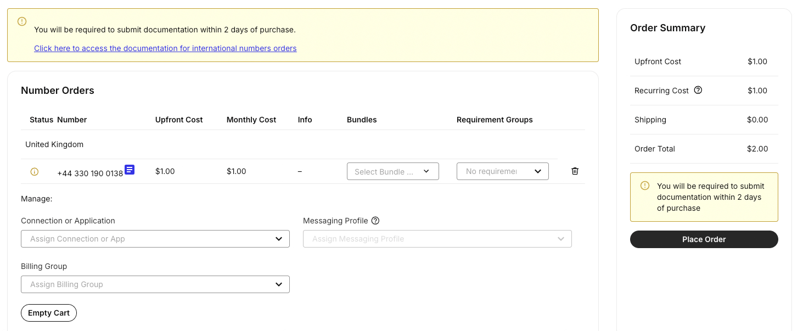

Once purchased, head over to the [Orders Page](https://portal.telnyx.com/#/numbers/orders) and click on the phone number you've purchased with the Pending status.

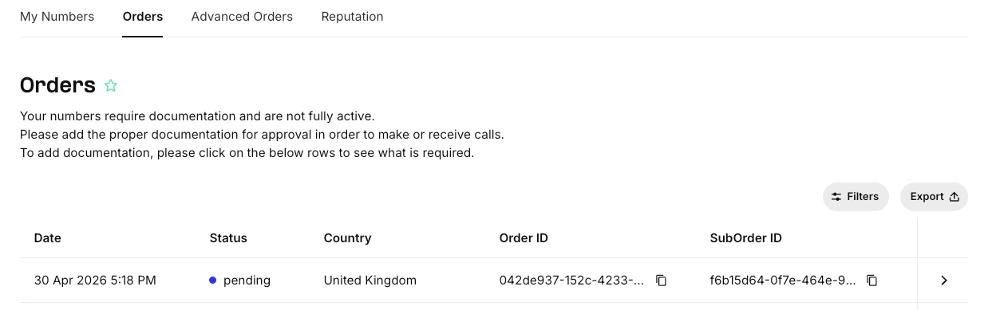

Clicking on that phone number takes you to the **Orders Requirement** page specific to that number where you can add the required documentation. Requirements can generally include, but are not limited to :

* Contact Information
* Address matching the phone number purchased
* Proof of identification
* Company registration certificate
* Business Use Case
* Company Website

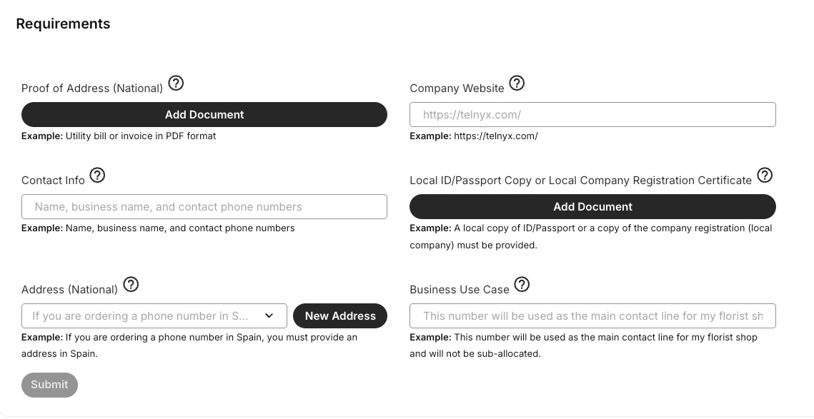

You may also start a conversation with our numbering team for any inquiries about documentation requirements for the phone number you purchased using the **Communications** functionality on the same page:

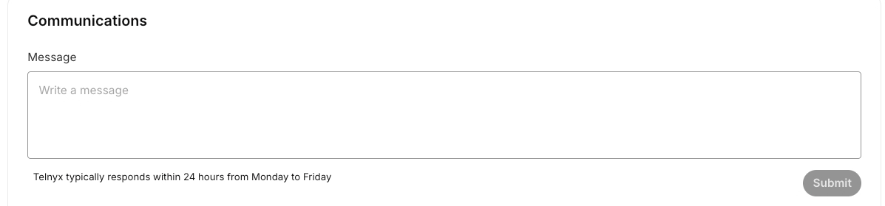

**Please note: Any number without proper documentation uploaded may not be activated, and inbound call capabilities may not work as expected.**
​

### **Additional Guides to Searching, Purchasing & Ordering DIDs**

* For more information on our porting section, please see this [collection](https://support.telnyx.com/en/collections/133126-porting-articles-and-guides).

---

###

---

Related Articles

[Global Number Types](https://support.telnyx.com/en/articles/1458084-global-number-types)[Verified Numbers](https://support.telnyx.com/en/articles/6988813-verified-numbers)[International Number Requirements Tool](https://support.telnyx.com/en/articles/7003167-international-number-requirements-tool)[SMS for Ported In Phone Numbers](https://support.telnyx.com/en/articles/7183887-sms-for-ported-in-phone-numbers)[US / CA Toll Free Number Porting](https://support.telnyx.com/en/articles/8673249-us-ca-toll-free-number-porting)

Did this answer your question?

😞😐😃
