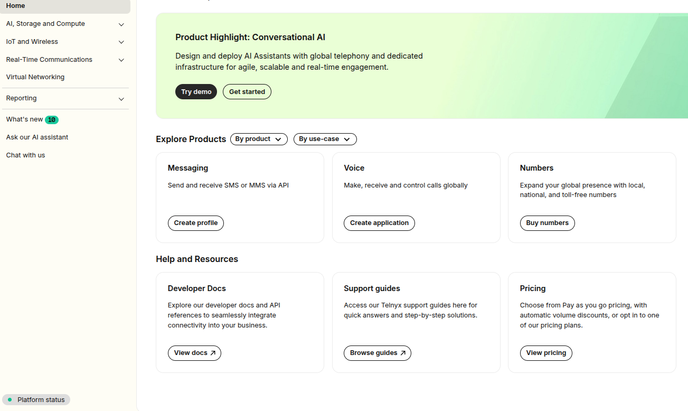

Resources on Your Account | Telnyx Help Center

[Skip to main content](#main-content)

# Resources on Your Account

Quick links for other useful resources for your Telnyx Mission Control Account.

Written by Dillin

January 30, 2026

Table of contents

This article describe other useful resources which can be accessed from your Telnyx Mission Control Portal account.

# **Useful Mission Control Resources**

Available on the bottom left hand side of your account, you will see 4 useful resources that you can quickly access.

* 

  Support - [https://support.telnyx.com/](https://support.telnyx.com/en/) - Where you can access our knowledge base.  
  ​
* API Docs - <https://developers.telnyx.com/>- Our developer documentation for our API's and SDK's.  
  ​
* Release Notes - <https://telnyx.com/release-notes> - For all the latest news on our recently and historically releases features.   
  ​
* System Status - <https://status.telnyx.com/> - Subscribe to keep up to date for any incidents.

Another useful resource is our [resource center](https://telnyx.com/resources) where you can find industry discussed topics along with tutorials and demo's of our products in use.

---

Related Articles

[E911 Setup Guide](https://support.telnyx.com/en/articles/1130683-e911-setup-guide)[Prevent Telnyx Account Fraud](https://support.telnyx.com/en/articles/3610162-prevent-telnyx-account-fraud)[Receiving SMS on your Telnyx number](https://support.telnyx.com/en/articles/4348981-receiving-sms-on-your-telnyx-number)[Your Number Lookup Guide](https://support.telnyx.com/en/articles/4366901-your-number-lookup-guide)[Telnyx Verify: 2FA made easy](https://support.telnyx.com/en/articles/5701653-telnyx-verify-2fa-made-easy)

Did this answer your question?

😞😐😃

Table of contents
