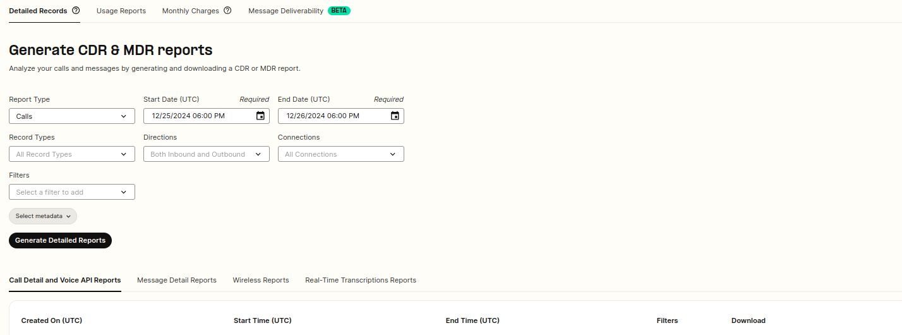
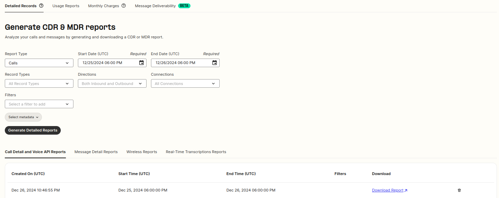

# Reporting: Detail Requests

This article will showcase the detail requests section in greater detail. See Telnyx guidance and requirements.

In this article, I will describe the Reporting Feature on your Telnyx customer portal and what you can do there.

## **Video Walk-through for Reporting Requests**

Coming soon! This walk-through will demonstrate the usage of our Reporting tools.

## **Step by Step Guide to Detail Requests**

The reporting/detail requests section can be found [here](https://portal.telnyx.com/#/reporting/detailed-records). Once on this page you can tweak the various filters and variables available for detail requests inn order to look for specific details.

**Report Type:** This option defines the Telnyx product you are running the report for. The options available are:

1. Calls
2. Messaging
3. Call Control
4. Fax API
5. Wireless
6. WebRTC
7. Real-Time Transcriptions.

The kind of information returned and reporting options will be different based on the report type.

**Filters**: This dropdown allows us to add some additional filters to the report, your options are **CLD,** which allows you to filter by destination number, **CLI,** which allows you to filter by calling number, **TAG,** which allows you to filter by the TAG(s) you have applied to DIDs/Voice profiles and **Billing Groups** which allows you to filter by the billing group assigned to DIDs/Voice profiles.

**Start/End Time:** These two options will be used to define the time range you would like your report to cover. You should first specify a start date and time as this is required, the end date will automatically be set to the current time but can be overridden to a specific time.

**Record Types:** This defines the types of records available in the final report. Your options are **Complete, Incomplete, Errors** or **All**

**Call/Message Type:** This option defines the type of message or calls you would like returned in the report, you can choose between only showing **Outbound calls or inbound calls** or you can choose to include **Both**

**Connections/Messaging Profiles:** From here you can choose to only display calls/messages that were associated with a connection(s)/profile(s) or you can choose to include all connections/profiles

**Metadata:** From here, you can customise the different headers that will be returned in the report, in total there are 35 different data headers available, by default all are included.

Once all options are customised to your needs, you can hit **Generate Detailed Report** and your report will start generating. You can see the status of the report under **Download Report**. If there is a download link then it is available, if it states "expired" then the report download link has expired, however, this can be regenerated from the refresh icon to the right of the report. You can also see additional details about the report, such as the time the report was created, the time range for the report itself, and any Filters can be viewed if they were included.

---

Related Articles

[Reporting: Usage Reports](https://support.telnyx.com/en/articles/4425016-reporting-usage-reports)[Reporting: Monthly Charges](https://support.telnyx.com/en/articles/4425088-reporting-monthly-charges)[Message Deliverability Dashboard](https://support.telnyx.com/en/articles/6969802-message-deliverability-dashboard)[BYOC: Telnyx & Genesys](https://support.telnyx.com/en/articles/8268122-byoc-telnyx-genesys)[Configure Repeat Call Guard on Outbound Voice Profiles (BETA)](https://support.telnyx.com/en/articles/12580667-configure-repeat-call-guard-on-outbound-voice-profiles-beta)

Did this answer your question?

😞😐😃
