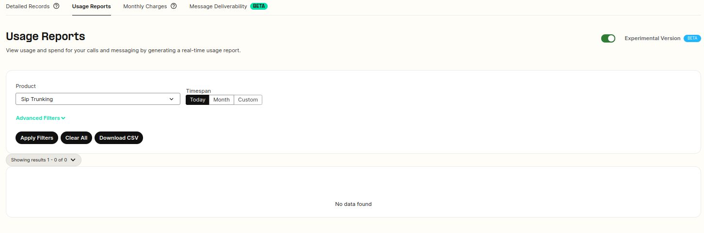
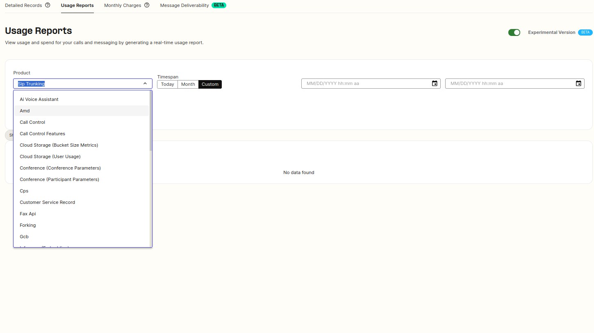
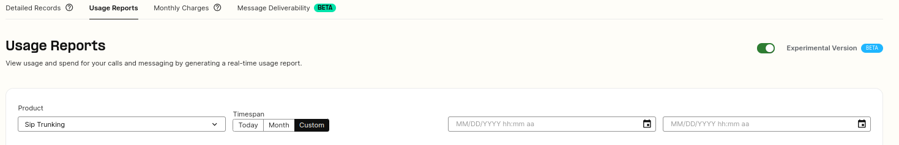
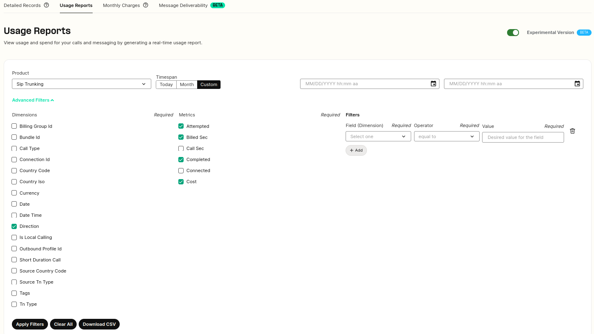

Reporting: Usage Reports | Telnyx Help Center

[Skip to main content](#main-content)

# Reporting: Usage Reports

This article will showcase the usage reports section in greater detail.

Written by Dillin

December 26, 2024

Table of contents

In this article, I will describe the Usage Reports Feature on your Telnyx customer portal and what you can do there.

# **Video Walk-through to Usage Reports**

Coming soon! This walk-through will demonstrate the usage of our Reporting tools.

## **Step by Step Guide to Usage Reports**

The Reporting > Usage Reports section can be found [here](https://portal.telnyx.com/#/app/reporting/usage-reports). Once on this page, you will be faced with the following table, from here you can tweak the various filters and variables available for detail requests

**Product:** This option defines the Telnyx product you are running the report for, your options span from AI Voice Assistant, Call Control, Media Storage to Sip Trunking covering all products available. The kind of information returned and reporting options will be different based on the report type.

**Note**: Messaging usage is calculated **per message part**. In your detail request report, the csv will contain one row for the message and a column to indicate how many message parts were associated with that message.

**Timespan:** These three options will be used to define the time range you would like your report to cover. Choosing the Custom option You are able specify a start date and time as this is required. Choosing the Month option you can specify what month you would like to generate your report for.

**Advanced Filters:** Here you can choose to aggregate your report with more specification setting your Dimensions, Metrics and Filters.

---

Related Articles

[Reporting: Detail Requests](https://support.telnyx.com/en/articles/4424926-reporting-detail-requests)[Reporting: Monthly Charges](https://support.telnyx.com/en/articles/4425088-reporting-monthly-charges)[Grandstream UCM6xxx: SIP Trunks](https://support.telnyx.com/en/articles/5748258-grandstream-ucm6xxx-sip-trunks)[Message Deliverability Dashboard](https://support.telnyx.com/en/articles/6969802-message-deliverability-dashboard)[BYOC: Telnyx & Genesys](https://support.telnyx.com/en/articles/8268122-byoc-telnyx-genesys)

Did this answer your question?

😞😐😃

Table of contents
