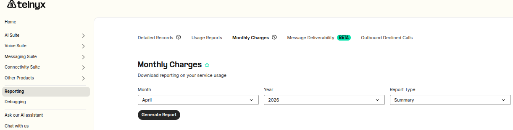
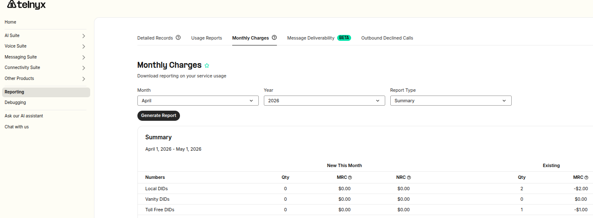
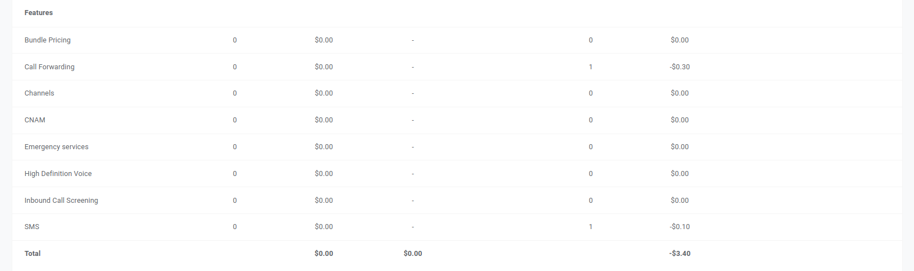
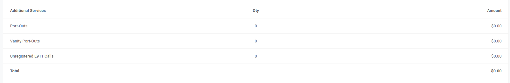
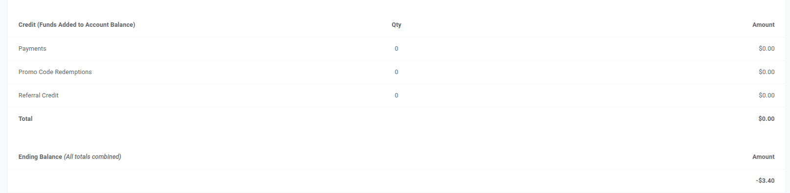

# Reporting: Monthly Charges

This article will showcase the Monthly Charges section in greater… See Telnyx guidance and requirements.

In this article, I will describe the Monthly Charges Feature on your Telnyx customer portal and what you can do there.

## **Video Walk-through for Reporting tools**

Coming soon! This walk-through will demonstrate the usage of our Reporting tools.

## **Guide to Billing Cycle - Monthly Recurring Charges**

The billing cycle for monthly recurring charges (MRC) occurs at the start of each new month and the charges you see, examples below, will have been deducted from your account balance.

[Monthly Charges Report](https://portal.telnyx.com/#/app/reporting/monthly-charges)

The reporting/usage reports section can be found [here](https://portal.telnyx.com/#/app/reporting/monthly-charges).

Once on this page, you can specify the month and year you want to review monthly charges for and either a ***summary*** of those charges or an individual ***breakdown by number***.

Breakdown by number will show only charges and features that pertain to DIDs such as the Monthly Recurring Charge (MRC) or the MRC charge for CNAM.

Clicking the generate report button will display a table with key pieces of information.

* **Numbers**
* **Features**
* **Additional Services**
* **Credit (Funds Added to Account Balance)**
* **Ledger Adjustments**
* **Ending Balance (All totals combined)**

---

## What are the different number types I can expect to be charged for?

* **Local DIDs**

  + Local DIDs are numbers that can be identified by an area code in a specific region, such as a city or state. These numbers can help businesses engage with customers in specific areas. They are part of the Direct Inward Dialing (DID) service that enables businesses to receive inbound calls without extensions or operators. More details can be found [here](https://telnyx.com/products/phone-numbers).
* **Vanity DIDs**

  + Vanity DIDs are special types of numbers that are chosen for their memorability. For example, a business might choose a vanity number that spells out their business name or a related keyword. These numbers are often used for marketing purposes, as they are easier for customers to remember, and typically incur a higher MRC than a local DID.
* **Toll Free DIDs**

  + Toll-Free DIDs are numbers that can be dialed from anywhere, but generally in-country, without the caller incurring long-distance charges. These numbers are often used by businesses to encourage customers to call them. Telnyx is an independent RespOrg, which means it maintains toll-free number registration in the SMS/800 registry, services toll-free numbers and their connections with carriers, and updates toll-free routing tables. Telnyx offers the most resilient toll-free service in the industry because it maintains redundant connections with each toll-free carrier. More details can be found [here](https://telnyx.com/resources/your-premier-toll-free-provider).

---

## What are the different features on numbers that I can expect to be charged for?

We've listed each of the features below, as our offering grows, you may see more features become available. Click into each option to be brought to their dedicated support articles where you can learn more.

* [Bundle Pricing](https://support.telnyx.com/en/articles/8340760-bundles-bundle-pricing)
* [Channels](https://support.telnyx.com/en/articles/8428806-global-channel-billing)
* [CNAM](https://support.telnyx.com/en/articles/1130720-caller-id-outbound-vs-cnam)
* [Emergency services](https://support.telnyx.com/en/articles/4349113-my-numbers-page#h_fe33759b83)
* [High Definition Voice](https://support.telnyx.com/en/articles/8394071-hd-voice-number-feature)
* [Inbound Call Screening](https://support.telnyx.com/en/articles/8037040-inbound-call-screening)
* [SMS](https://support.telnyx.com/en/articles/8219294-messaging-in-mission-control)

---

## What are the different Additional Services that I can expect to be charged for?

* [Port-Outs](https://support.telnyx.com/en/articles/2906030-port-out-tracking)
* [Vanity Port-Outs](https://support.telnyx.com/en/articles/2906030-port-out-tracking)
* [Unregistered E911 Calls](https://support.telnyx.com/en/articles/4349113-my-numbers-page#h_fe33759b83)

## Credit (Funds Added to Account Balance)

* Payments

  + This refers to the count of payments you made in any given month and the total of those payments.
* Promo Code Redemptions

  + Promo codes may be redeemable from time to time, if you have redeemed any promo codes they will show up here.
* Referral Credit

  + Subject to availability, Telnyx may offer referral credit, and any referrals will show up here.
* Ledger Adjustments

  + In cases where Telnyx has overcharged you for your services and issued you a refund towards your account balance, you will see a ledger adjustment entry.

The ending balance will denote a value based on all totals combined from each section.

---

Related Articles

[Set up Inbound Caller ID Name (incoming)](https://support.telnyx.com/en/articles/1130656-set-up-inbound-caller-id-name-incoming)[Your Number Lookup Guide](https://support.telnyx.com/en/articles/4366901-your-number-lookup-guide)[Reporting: Detail Requests](https://support.telnyx.com/en/articles/4424926-reporting-detail-requests)[Reporting: Usage Reports](https://support.telnyx.com/en/articles/4425016-reporting-usage-reports)[10DLC Fees and Charges](https://support.telnyx.com/en/articles/5634625-10dlc-fees-and-charges)

Did this answer your question?

😞😐😃
