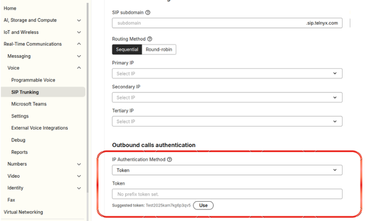

# Ip Authentication with X-Telnyx-Token

In this article we will explain IP authentication with X-Telnyx-Token and when to use them. See Telnyx guidance and requirements.

The token setting can be found under the settings tab of your [SIP Connections](https://portal.telnyx.com/#/voice/connections) Authentication & Routing Configuration section.

## Why incorporate an X-Telnyx-Token?

In situations where you are managing numerous clients through a unified IP phone system, Telnyx enables the creation of multiple IP connections that operate under a single IP to manage client traffic effectively.

Introducing a Token to your configuration demands that your SIP INVITES carry the specified Token within a custom header named <**X-Telnyx-Token**>.

It is critical to ensure that these INVITES are sent from an IP address that is associated with the connection for which the Token has been configured, to maintain the integrity of the traffic routing and identification.

## **What is an X-Telnyx-Token?**

An X-Telnyx-Token is a string of characters configured to use as the Token in the expert settings of your IP authentication connection.

When you select the Token option, the portal will have a suggestion for the token to use. This suggestion is randomly generated using the connection's name.

For instance this is a suggestion for a connection named Chicago: **Chicagoqwhowg6ze2d7o**

You can instead use a custom string, if you'd prefer, but it must:

* Contain only alphanumeric characters and dashes ("-")
* Be between 12 and 48 characters
* Be globally unique

---

Related Articles

[IP Authentication with Tech Prefix](https://support.telnyx.com/en/articles/2602782-ip-authentication-with-tech-prefix)[FreePBX V15: IP Trunk - PJSIP](https://support.telnyx.com/en/articles/5619595-freepbx-v15-ip-trunk-pjsip)[Fanvil H5: Hotel IP](https://support.telnyx.com/en/articles/6203401-fanvil-h5-hotel-ip)[Fanvil X-Series: IP Phone](https://support.telnyx.com/en/articles/6209971-fanvil-x-series-ip-phone)[Configure Token Authentication Header (X-Telnyx-Token) in FreePBX](https://support.telnyx.com/en/articles/12580952-configure-token-authentication-header-x-telnyx-token-in-freepbx)

Did this answer your question?

😞😐😃
