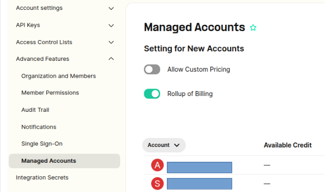
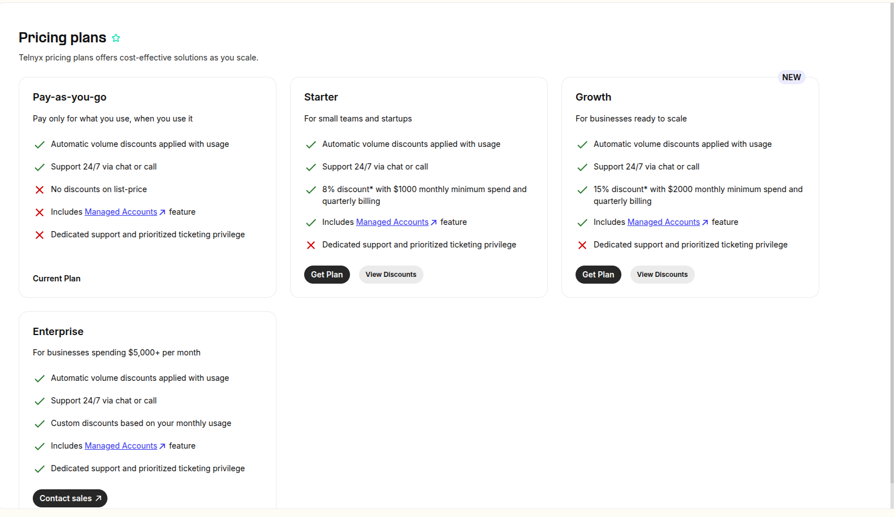
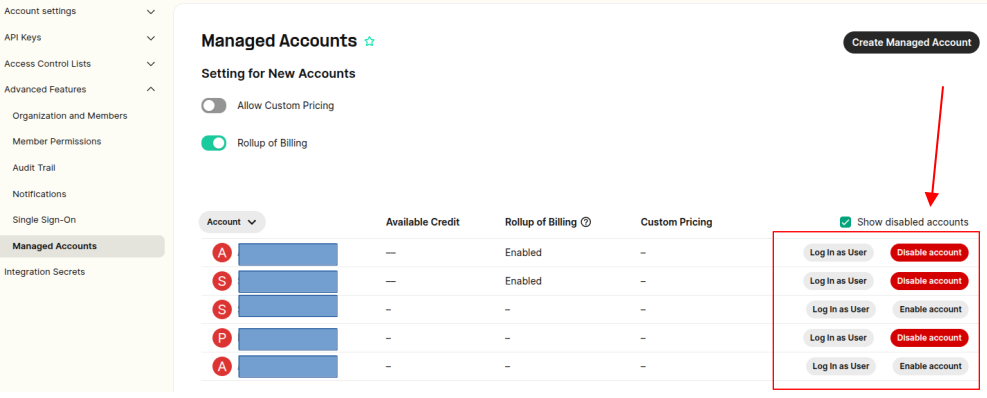

Managed Accounts | Telnyx Help Center

[Skip to main content](#main-content)

# Managed Accounts

In this article we will explain managed (sub) accounts and how you can begin taking advantage of this feature.

Written by Dillin

February 26, 2026

Table of contents

Managing multiple organizations through the Mission Control Portal and Telnyx API just got a lot easier. We're thrilled to introduce [Managed Accounts](https://portal.telnyx.com/#/advanced-features/managed-accounts) as a limited-release feature, enabling qualifying users to create sub-accounts with advanced management features.

​

# What is a Managed Account?

A Managed Account is a sub-account created from within an existing Mission Control Portal account (which we call a **manager** account). Manager accounts have advanced control over pricing, reporting, administration, and billing functionalities of Managed Accounts:  
​

## Pricing and Reporting:

* Managed Accounts inherit pricing from their manager accounts. If your organization has a [committed use agreement](https://telnyx.com/contact-us) for lower rates, your Managed Accounts will have those rates automatically.
* Pricing is hidden from Managed Accounts. Only the manager accounts that administer Managed Accounts are able to view pricing.
* Managed Accounts can generate reports on their own usage, without viewing their pricing.

## Administration:

* Manager accounts can log into any one of their Managed Accounts via the portal to view that Managed Account's usage and balance, and configure that Managed Account's settings.
* Manager accounts can also create an API key associated with a Managed Account, and control the Managed Account via the [Telnyx API](https://developers.telnyx.com/api-reference/managed-accounts/lists-accounts-managed-by-the-current-user).

## Billing:

* Managed Accounts have their own account balances, payment methods, and invoices.
* **NOTE**: Most providers and banks implement mechanisms to prevent carding attacks i.e where multiple cards are used to frequently top up managed accounts on a daily basis. This means that payment attempts can be blocked for a period of time.
* These payment patterns are often construed as suspicious and as such we recommend leveraging "Rollup Billing" by using your own personal card now and again instead of using your own card regularly to top up individual management accounts.
* Should you not wish to leverage "Rollup Billing" and instead use your own cards to top up individual managed account balances, we recommend avoiding multiple top ups with the same card every day. Instead, please consider topping up each balanced account with a sufficient larger balance that lasts longer, to avoid potential situations where multiple payment attempts from the same card may become temporarily blocked.

## What can I do with Managed Accounts?

Managed Accounts are an intuitive way of administering multiple accounts and users from one unified interface. [Managed Service Providers](https://telnyx.com/use-cases/managed-service-providers) can use Managed Accounts to easily manage each of their individual customers while allowing them the freedom to log into their Managed Account and configure their communications.

## How can I get started with Managed Accounts?

Managed Accounts is included with our **commit plans**—**Starter** and **Growth**—as well as **Enterprise**. It is **not** available on **Pay-as-you-go**.

**Choose the plan that fits your spend:**

* **Starter**: includes Managed Accounts with a **$1,000 monthly minimum spend** and **quarterly billing** (8% discount shown in the portal).
* **Growth**: includes Managed Accounts with a **$2,000 monthly minimum spend** and **quarterly billing** (15% discount shown in the portal).
* **Enterprise**: designed for **$5,000+/month**, includes Managed Accounts **plus** *dedicated support and prioritized ticketing*.

**How to enable it:**

1. In the Telnyx Portal, go to **[Pricing plans](https://portal.telnyx.com/#/pricing/plans)**.
2. Click **Get Plan** on **Starter** or **Growth** to start a self-serve commit, or click **Contact sales** for **Enterprise**.
3. After your plan is active, Managed Accounts will be available for your organization. If you don’t see the Managed Accounts option where expected, reach out to Support/Sales and they can help confirm activation.

## How can I create a Managed Account?

Once the feature is enabled on your account, Managed Accounts can be created using [this API request](https://developers.telnyx.com/api-reference/managed-accounts/create-a-new-managed-account) (API v2 only), or from within the portal under the [Managed Accounts Section](https://portal.telnyx.com/#/advanced-features/managed-accounts). When an account is created using the API, you can specify a custom email address and password for that account to log-in with. If an account is created using the portal, a temporary email address will be provided, and that user will not be able to log-in until a password change is made from the [General](https://portal.telnyx.com/#/account/general) settings of the account.

## How can I enable/disable a Managed Account?

Managed Accounts can be enabled/disabled using the API v2. [This request](https://developers.telnyx.com/api-reference/managed-accounts/enables-a-managed-account) enables an account, and [this request](https://developers.telnyx.com/api-reference/managed-accounts/disables-a-managed-account) disables an account.

Or you can enable and disable them from the mission control portal.

## Managed Account Settings

Allow Custom Pricing: Enabling this setting will mean that the managed account will not inherit any pricing from your manager account and can have its own independent pricing. You will need to contact your Telnyx customer success representative once the new account is created to have the desired pricing set for the account.

Rollup Billing: If set, the records of spend for this managed account will be written for the manager account. This value can`t be changed after the account is created.

## How can I change the email of a Managed Account?

The email for a managed account can be changed in the portal, under the [General](https://portal.telnyx.com/#/account/general) settings. This can be changed by the account manager, or user of the account.

To learn more about Managed Accounts, jump over to our [Developer Center](https://developers.telnyx.com/api-reference/managed-accounts/lists-accounts-managed-by-the-current-user).

---

## Managed Accounts vs. Multiple Environments

We've noticed some confusion between the concept of **Managed Accounts** and the desire to **separate production and staging environments** under a single organization or user.

## Managed Accounts Are for Managing Customers

Managed Accounts are intended for **businesses that manage multiple customer accounts**. Think of it like being a **service provider** who sets up and oversees communications for clients:

* Each Managed Account is its **own independent Telnyx organization** with its own balance, API keys, usage, and settings.
* The **Manager Account** can oversee, administer, and bill each Managed Account.
* This structure is ideal for **resellers**, **MSPs**, and **multi-tenant platforms**.

If you're running a SaaS platform or white-labeling Telnyx services, this is the right solution for managing many downstream users or tenants.

## If You're Trying to Separate Production and Staging Environments

If your goal is to have **two environments (like production and staging)** for **your own internal use**, **Managed Accounts is not the correct tool**.

Unfortunately:

* A single Telnyx account **cannot belong to more than one organization**.
* You **cannot split one organization** into multiple environments internally.

Instead, the current workaround is:

* **Create two entirely separate Telnyx accounts**, each with its own email address.

  + One for production
  + One for staging or development
* Each account will have a distinct organization, set of resources, and API keys.
* This allows for full separation of environments, but **you must manage each login and billing independently**.

---

## **Notes**

* Manager accounts, by default, can only have a maximum limit of 1000 managed sub accounts.

  + If your use case requires a higher limit, please reach out to [support@telnyx.com](mailto:support@telnyx.com) with this request.
* Unfortunately, we do not support the migration of existing Telnyx user accounts under a manager account.

  + If an existing Telnyx user account would like to be placed under a manager account, they will need to reach out to [support@telnyx.com](mailto:support@telnyx.com) to have their account cancelled and email removed.
  + This means that any existing configurations will be lost as we can not transfer them.  
    ​

---

Related Articles

[E911 Setup Guide](https://support.telnyx.com/en/articles/1130683-e911-setup-guide)[Get Started with Organizations](https://support.telnyx.com/en/articles/1189141-get-started-with-organizations)[SIM Data Limits & Notifications](https://support.telnyx.com/en/articles/3403998-sim-data-limits-notifications)[Prevent Telnyx Account Fraud](https://support.telnyx.com/en/articles/3610162-prevent-telnyx-account-fraud)[Invoice Overview](https://support.telnyx.com/en/articles/6987563-invoice-overview)

Did this answer your question?

😞😐😃

Table of contents
