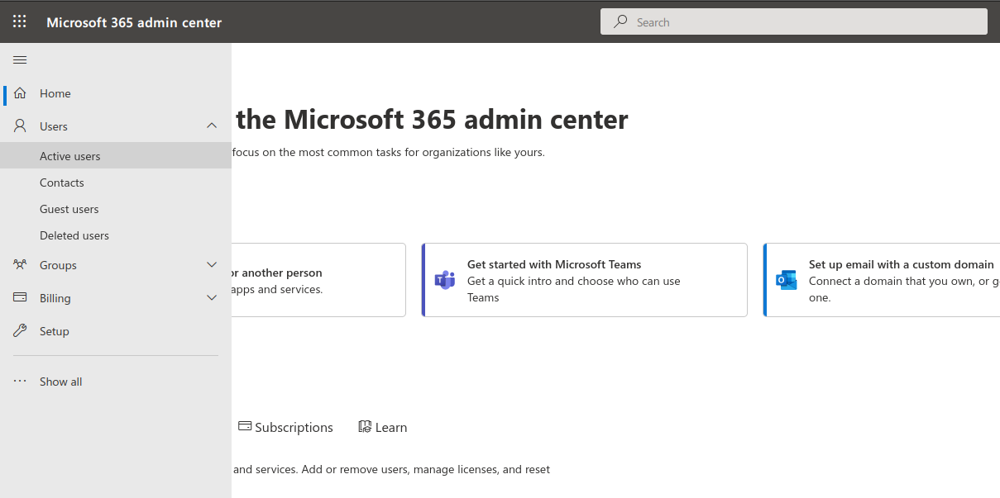
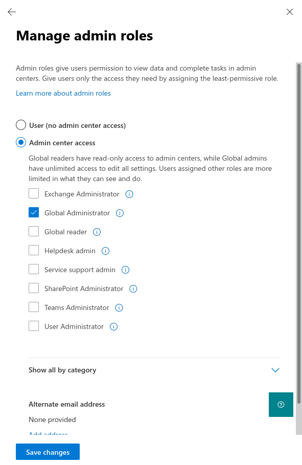
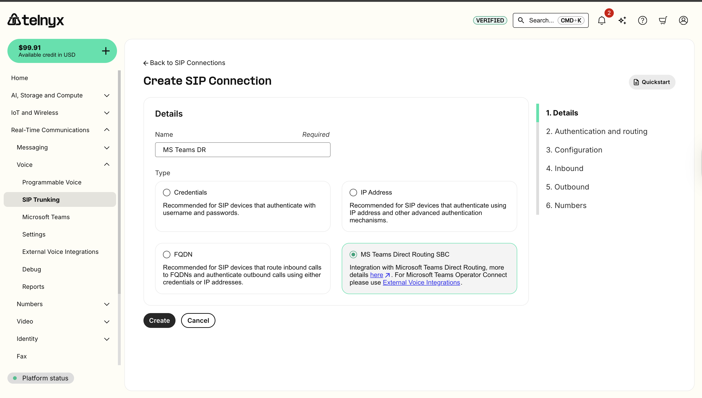
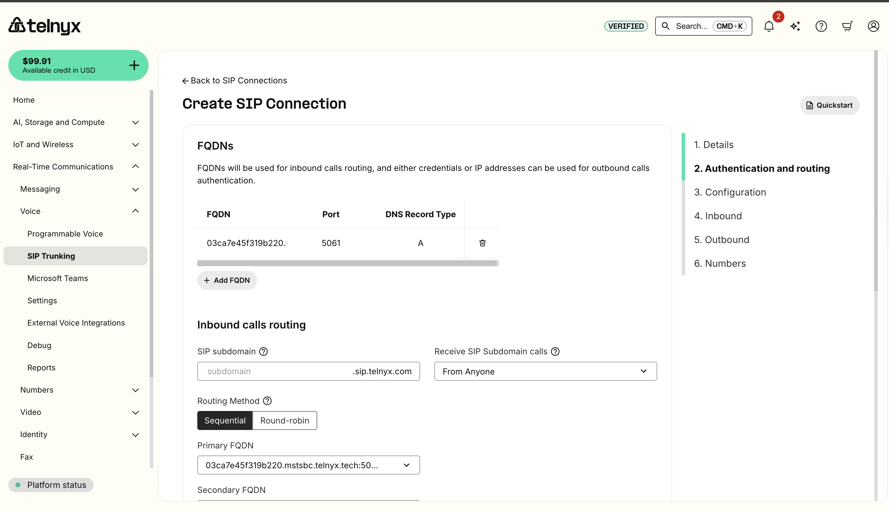
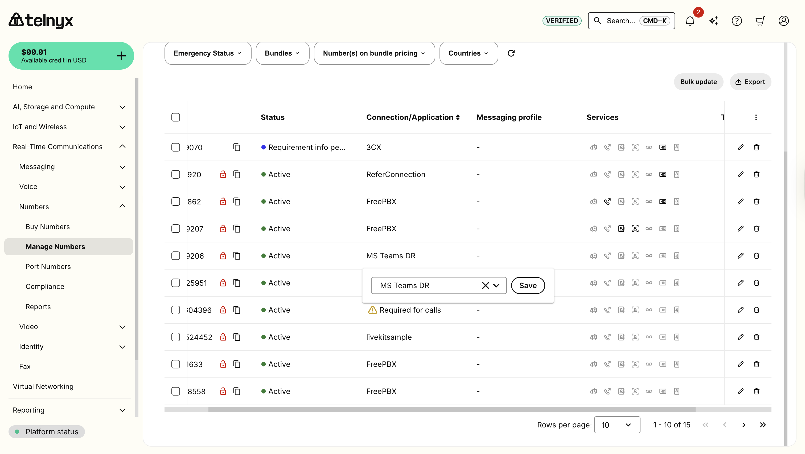
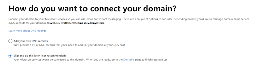
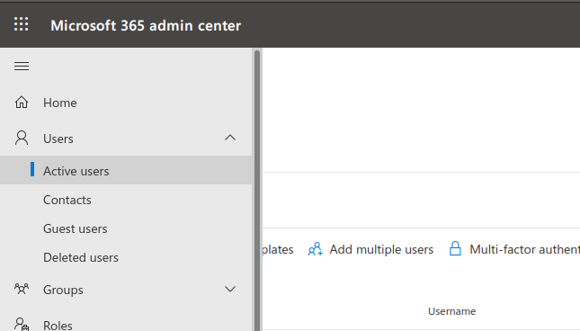
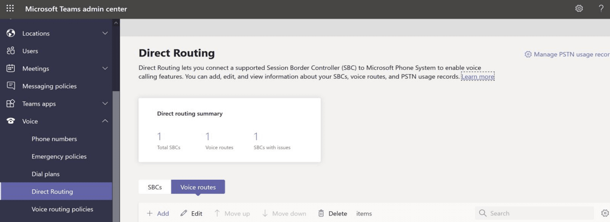

Configuring Telnyx with Microsoft Teams Direct Routing | Telnyx Help Center

[Skip to main content](#main-content)

# Configuring Telnyx with Microsoft Teams Direct Routing

Unlock seamless integration: Set up Microsoft Teams Direct Routing with Telnyx. Dive in now!

C

Written by Customer Success

February 20, 2026

Table of contents

[Jump to Instructions](#h_73f0b860c1)

[Direct Routing](https://learn.microsoft.com/en-us/microsoftteams/direct-routing-plan) with [Microsoft Teams](https://www.microsoft.com/en-us/microsoft-teams/group-chat-software) allows businesses to connect external phone lines to Microsoft Teams and use Teams as an office phone system instead of a legacy PBX system. This means you can maintain your existing [SIP trunks](https://telnyx.com/products/sip-trunks) and PSTN connectivity -- retaining control over your numbers and realizing cost savings over the MS Teams Calling Plans.

This article will guide you on how to use Telnyx as a PSTN provider for Microsoft Teams Direct Routing. Once set up is complete, Telnyx customers will be able to use numbers purchased from Telnyx to send and receive calls via the PSTN from the same Teams account.

Additional resources:

* [Microsoft Teams Direct Routing documentation](https://learn.microsoft.com/en-us/microsoftteams/direct-routing-plan)
* [Microsoft support](https://support.microsoft.com/en-US)

---

# Instructions for configuring Telnyx with Microsoft Teams Direct Routing

|  |
| --- |
| ***Note:*** *This integration is carried out via the [Telnyx MS Teams SBC](https://telnyx.com/resources/integrated-sbc-direct-routing), which interconnects Microsoft Teams with the Telnyx telephony platform. Telnyx SBC uses the base domain mstsbc.telnyx.tech, and Telnyx customers will be able to interconnect using a subdomain of mstsbc.telnyx.tech and a token for authentication.* |

In this activity you will:

1. [Add a SIP connection in Telnyx](#h_f21691d342)
2. [Assign a number to the Telnyx SBC Connection](#h_ddd7742f7e)
3. [Add your SIP Connection to your Outbound Voice Profile](#h_ddd7742f7e)
4. [Add a subdomain to the customer tenant in Microsoft](#h_ac2ea5e081)
5. [Activate the subdomain](#h_1c9c29c5f4)
6. [Add the Telnyx SBC in Direct Routing](#h_70157d551b)
7. [Create voice routes](#h_a2f1949f03)
8. [Enroll the SBC](#h_8a68f47b55)
9. [Add the PTSN usage records](#h_2db33bd935)
10. [Configure voice routing policies and apply dial plan](#h_6f3d53fce8)
11. [Assign dial plan and voice routing policies](#h_a6bb824e85)
12. [Assign Telnyx DID to on-premises PSTN connectivity](#h_9aa246fcc1)
13. [Make some test calls with Microsoft Teams](#h_dea56744cd)

## **Pre-requisites**

* You'll need a Telnyx account with a purchased number. Learn how to set up your account [here](https://support.telnyx.com/en/articles/1176636-get-started-with-a-mission-control-account).
* Assign a **Microsoft Teams E5** license to each user who will be making and receiving calls to the PSTN
* Make sure you can sign in to the Microsoft 365 admin center as a Global Administrator.

  + To validate the role you have, please sign in to the Microsoft 365 admin center (<https://portal.office.com>) and go to **Users → Active Users**. Click your user and under **Account → Roles** click **Manage roles.** Verify that you have a Global Administrator role applied to your account.

    

    
* Procure a Microsoft license. You can find different license options in the table below. You'll need one of these base plans and an add-on if necessary:

|  |  |
| --- | --- |
| **BASE PLAN** | **ADD ON REQUIRED FOR DIRECT ROUTING** |
| Microsoft Business Basic / Standard / Premium | Microsoft 365 Business Voice without Calling Plan |
| Microsoft Office 365 Enterprise E1 / E3 / F3 / A1 / A3 | Phone System |
| Microsoft Office 365 Enterprise E5 | No add on required |

## 1. Add a SIP connection in Telnyx

Once you have set up your Telnyx account, you will have to set up a new connection for the Telnyx SBC on the [SIP Connections page](https://portal.telnyx.com/#/app/connections).

1. Click on the **Create SIP Connection** button and choose a name for your connection. You should see options that will allow you to choose a SIP Connection Type on the next page. For this connection, we must choose **MS Teams Direct Routing SBC.**

   
2. You will want to take note of the auto-generated subdomain that appears as it will be needed at different stages of the setup.
3. Click **Next** and follow the guide to set up your **Authentication and Routing** details on the following page, followed by your **Configuration** details.

   

   
4. Scroll down and Click **Next**.

[Back to Top](#h_73f0b860c1)

## 2. Set up Inbound and Outbound details

Now, you will set up **Inbound** and **Outbound** details for the SIP Connection. You will also be able to assign it an Outbound Voice Profile.

For the Inbound settings, there are a variety of options you may configure to your preference and for the Outbound settings, it is critical to keep in mind the details of the Outbound profile being assigned. You can see these from the Voice>Settings> Outbound profiles page.


Click **Next.**

[Back to Top](#h_73f0b860c1)

## 3. Assign a number to the Telnyx SBC Connection

You are now required to assign a Number to the MS Teams connection you just created.

1. If you have not done so already as part of your [pre-requisite activities](#h_bb9a5a60b7), you'll need to purchase a number from Telnyx.
2. Once you have a number, navigate to the Numbers section and assign the number to your connection.


Alternatively, navigate to the Numbers page in the Telnyx Mission Control Portal and assign your MS Teams connection to the desired DID, as shown below.



Click **Complete.**

[Back to Top](#h_73f0b860c1)

## **4.** Add a subdomain to the customer tenant in Microsoft

Now that your Mission Control Portal is set up and ready to go, you’ll need to add a subdomain in the Microsoft admin portal before setting up Direct Routing in Microsoft Teams.

In order to do this, you'll need to make sure you have a Microsoft License and are signed into your Microsoft 365 Admin Center as a global administrator, as outlined in your [pre-requisite activities](#h_bb9a5a60b7). Once you have the correct licensure and account privileges, you can continue here.

1. Perform a search for *Domains* within the Microsoft 365 admin center search bar at the top of your screen.
2. Click the **Add Domain** option at the top left and add the auto generated subdomain that corresponds to the SIP Connection we created in [Section 1](#h_f21691d342).

   
3. Click **Use This Domain** and verify the domain on the following page. Select the **Add a TXT record instead** option**.**

   
4. Click **Next** and take note of the TXT value displayed.

   
5. Navigate back to your MS Teams SBC SIP Connection settings in your Telnyx Mission Control Portal.
6. Navigate to the **Domain Validation** header in the top right corner of the window and paste the TXT Value from MS Teams into the **TXT Value** text box.   
   ​  
   ​***Note:*** *The TXT Name and TLL fields should match the fields shown in the MS 365 admin center, hence why they cannot be edited.*  
   ​*Also, Any user who tries to set the `txt_name` on a MS DR connection to `*.mstsbc.telnyx.tech` will get an error that says*

   ```
   txt_name should not include the '.mstsbc.telnyx.tech' suffix. Use only the identifier portion (e.g. '1234abc' instead of '1234abc.mstsbc.telnyx.tech')
   ```

   
7. Click **Save All Changes**.
8. Once you have saved your changes, navigate back to Microsoft 365 admin center and click on the **Verify** button at the bottom.
9. On the next page, select **More Options**.
10. Select **Skip and do this later** and click **Next**.

    
11. After this you will be prompted that setup has been complete.

    

[Back to Top](#h_73f0b860c1)

## 5. Activate the subdomain

After you have registered a domain name, you’ll need to activate it by adding at least one user and assigning the domain that matches the subdomain that was automatically generated when the SIP Connection was created in [Section 1](#h_f21691d342).

1. From Microsoft 365 Admin Center, navigate to **Users → Active Users → Add a user**.

   
2. Next, fill in the User details:

   1. **Domain:** Select the Telnyx subdomain (i.e. *yyyy.mstsbc.telnyx.tech*)
   2. Assign E5 license under "Product Licenses".
3. Click **Add.**   
   ​  
   ​***Note*** *that you can remove the E5 license from this user once you're able to add this domain to Direct Routing.*

   

[Back to Top](#h_73f0b860c1)

## 6. Add the Telnyx SBC in Direct Routing

Next, we'll need to set up the Telnyx SBC subdomain in the Microsoft Teams admin center. To do this, you’ll have to have a Microsoft Teams E5 license assigned to each user who will be making and receiving calls to the PSTN. Keep in mind that the changes on the MS Teams admin portal may take up to 24 hours to take effect.

1. In the left tab of the Microsoft Teams admin center, navigate to **Voice → Direct Routing**.
2. Click the **SBCs** tab.

   
3. Click **Add** and enter the subdomain that was automatically generated in your SIP Connection from [Section 4](#h_ac2ea5e081).
4. Provide the following information:

   1. **Enabled:** Toggle on
   2. **SIP Signaling port:** *5061*
   3. **Send SIP options:** Toggle on
   4. **Forward P-Asserted-Identity (PAI) header:** Toggle on if you would like anonymous calls to connect.

      
5. Click **Save**.
6. Upon successful settings changes, your connection should resemble the example below:

   

[Back to Top](#h_73f0b860c1)

## 7. Create voice routes

Now you’ll need to create a pass-through voice route.

1. In the left-hand navigation of you 365 admin portal, navigate to **Voice → Direct Routing**.
2. When on the Directing Routing page, select the **Voice routes** tab.
3. Click **Add,** and enter a name and description for your voice route.
4. Set the priority and specify the dialed number pattern as per Telnyx's number plan.  
   ​  
   ​**For US numbers:**

   1. prepend:*1*; match pattern: *NXXNXXXXXX*
   2. prepend: blank; match pattern: *1NXXNXXXXXX*

   **For International numbers:**

   1. prepend: Country Dialing prefix; match pattern: *NXXNXXXXXX*
   2. prepend: blank; match pattern: (Country Dialing prefix)*NXXNXXXXXX*

   

[Back to Top](#h_73f0b860c1)

## 8. Enroll the SBC

In this section, we will enroll the SBC with the voice route.

1. From the **Direct Routing** page, navigate to **SBCs enrolled**.
2. Click **Add SBCs**.
3. Select the SBCs you want to enroll.
4. Click **Apply**.

[Back to Top](#h_73f0b860c1)

## 9. Add the PTSN usage records

In this section, you will add Public Switched Telephone Network (PSTN) usage records, which specify a class of call (such as internal, local, or long distance) that can be made by a user or group of users in an organization.

1. From your Microsoft 365 admin portal, use the left-hand navigation to navigate to **Voice → Direct Routing** and find the **PSTN usage records** section.
2. Click **Add PSTN usage**.
3. Select the PSTN records you want to add.

   

   ​***Note:*** *This example includes “^(.\*)$”, which allows you to dial any destination. We recommend using a different pattern if you want to include restrictions.*  
   ​
4. Click **Apply**.
5. From the left-hand navigation, under **Voice**, click **Voice Routing Policies.**
6. In the **PSTN usage records** section, click **Add PSTN** usage.
7. Select *Telnyx*.

   
8. Click **Save**.

[Back to Top](#h_73f0b860c1)

## 10. Configure voice routing policies

1. From the left-hand navigation of the 365 admin portal, under **Voice**, click **Voice Routing Policies.**
2. Click **Add**.
3. Type **TELNYX** as the name and add a description.

   

[Back to Top](#h_73f0b860c1)

## 11. Assign Dialplan and Voice routing policies

1. From the left-hand navigation of the 365 admin portal, click **Users**.
2. Click the **Policies** tab.
3. Select **Edit** and assign the following:

   1. **Dial Plan:** *Telnyx*
   2. **Voice Routing Policy:** *Telnyx*

      
4. Click **Apply**.

[Back to Top](#h_73f0b860c1)

## 12. Assign Telnyx DID to on-premises PSTN connectivity

Finally, provision a user with an on-premises phone number. You need to go to [admin.teams.microsoft.com](http://admin.teams.microsoft.com/) > **Manage** **Users . Click on the intended user**


Under Account ,   
- Enable the toggle `Enterprise Voice`  
- Click on `Assign a primary phone number`


A New prompt will open to the side. Add the phone number and click on Apply.


[Back to Top](#h_73f0b860c1)

## **13. Make some test calls with Microsoft Teams**

Your setup for Microsoft Teams Direct Routing should now be complete. The last step is to make both inbound & outbound test calls from Microsoft Teams to verify the service has been set up correctly.

1. Call a PSTN number from the Microsoft Teams client. You'll want to confirm that the call connects through Telnyx and that there is two-way audio.
2. Call a Telnyx DID that is assigned to both your new Microsoft Teams SIP Connection and one of your Microsoft Teams users from the PSTN (i.e. a cell phone). Confirm that the call is received in Microsoft Teams and that two-way audio is functioning correctly.
3. Check the CDRs from the **Reporting** section of your [Telnyx Mission Control Portal](https://portal.telnyx.com/) to validate that both calls went through correctly.

If you encounter any issues during these tests, please contact us at [support@telnyx.com](mailto:support@telnyx.com) with a note of the number dialled and the date/time. We'll do our best to help you resolve the issue.  
​  
This concludes your set up of Microsoft Teams Direct Routing with Telnyx.

Happy Calling!

[Back to Top](#h_73f0b860c1)

---

## Additional Resources

Review our [getting started with guide](https://support.telnyx.com/en/articles/1176636-get-started-with-a-mission-control-account) to make sure your Telnyx Mission Control Portal account is setup correctly!

Additionally, check out:

* [Microsoft Teams Direct Routing documentation](https://learn.microsoft.com/en-us/microsoftteams/direct-routing-plan)
* [Microsoft support](https://support.microsoft.com/en-US)

---

Related Articles

[Skype: Set up Skype for Biz SIP Trunk](https://support.telnyx.com/en/articles/1130698-skype-set-up-skype-for-biz-sip-trunk)[MS Teams: Call2Teams & Telnyx](https://support.telnyx.com/en/articles/6133589-ms-teams-call2teams-telnyx)[TLS & SIP Warnings for Teams](https://support.telnyx.com/en/articles/7048813-tls-sip-warnings-for-teams)[Operator Connect Guide - Microsoft Teams](https://support.telnyx.com/en/articles/7260976-operator-connect-guide-microsoft-teams)[How to Configure a SIP Trunk](https://support.telnyx.com/en/articles/8096455-how-to-configure-a-sip-trunk)

Did this answer your question?

😞😐😃

Table of contents
