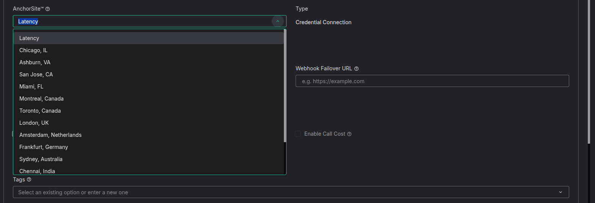

# Guide to SIP AnchorSite® Settings

This article explains the AnchorSite® setting in your SIP Connection settings and how it works. See Telnyx guidance and requirements.

The **AnchorSite®** setting allows you to select the media server which Telnyx will then use to route your call's media packets. This can be found in the settings of your connections/applications: <https://portal.telnyx.com/#/voice/connections>

---

## **Fail-over**

---

No matter which **AnchorSite®** option you choose, latency or a specific site, should an issue arise Telnyx will always be able to re-route calls to the next closest **AnchorSite®**.

## **Latency**

---

When the **Latency** **AnchorSite®** setting is selected Telnyx will choose the optimal Point of Presence (PoP) to route your call to ensure your media packets get off the internet as fast as possible. In order to determine this Telnyx will regularly and proactively ping your Connection or Device using ICMP ping messages to calculate round trip timings from all Telnyx available sites.

The site with the lowest latency will be chosen as the **AnchorSite®** where your media will be anchored. In this way Telnyx can always ensure you have the best possible and lowest possible latency for your calls audio!

## **Selecting the AnchorSite® Yourself**

---

If you would prefer not to receive pings from Telnyx and manually anchor your calls in the PoP you feel is best for your calls, then you can! Simply select one of the available PoPs and your calls will be routed through there instead. In this way you have full control of where your calls will be routed. We recommend utilising this option especially your media IP address is not located in the same area as the signalling as we determine latency between our sites and that of your signalling IP address.

Please note, there are limitations to selecting the **AnchorSite®** yourself if you do not whitelist all Telnyx media IP addresses. In the rare event of unplanned maintenance or in the rarer event of an outage at the selected **AnchorSite®,** media traffic will be re-routed through the next closest available site to ensure all calls are established and remain connected without interruptions.

**Latency** is the **default** setting for AnchorSite® when SIP Connections are created.

---

## **Special Notes**

There are limitations to selecting **latency** depending on your SIP Connection's authentication type.

With regard to **IP based or FQDN based authentication** type SIP connections, if we are unable to determine the round trip times to your IP addresses, and identify the latency between our media servers and your IP addresses, your calls may be anchored on a media server further away than is optimal. Please make sure you whitelist our [media IP addresses](https://sip.telnyx.com/#media) on your firewall as these will be used to check latency.

For **credential based** SIP Connections, please make sure to include the SIP Connection's **username** in the contact header in your **first** SIP INVITE. This allows our SIP Proxy to identify the settings associated with your SIP Connection and ensure the **AnchorSite®** selected is chosen. If the username is not included in the **first** SIP INVITE attempt, there will be no way for us to identify the optimal media server through which to route your calls. Alternatively, if you are unable to modify the contact header you could include a new header in the first SIP INVITE like:

**X-Telnyx-Username: <username>**

For **applications**, the IP address associated with your webhook url will be used to determine which of our sites has the lowest latency reaching you.

---

Related Articles

[SIP URI Calling](https://support.telnyx.com/en/articles/2925713-sip-uri-calling)[SIP Connection: Types](https://support.telnyx.com/en/articles/4245868-sip-connection-types)[SIP Connection: Settings](https://support.telnyx.com/en/articles/4351104-sip-connection-settings)[How to Configure a SIP Trunk](https://support.telnyx.com/en/articles/8096455-how-to-configure-a-sip-trunk)[Whitelisting Telnyx Media IP Addresses](https://support.telnyx.com/en/articles/10007243-whitelisting-telnyx-media-ip-addresses)

Did this answer your question?

😞😐😃
