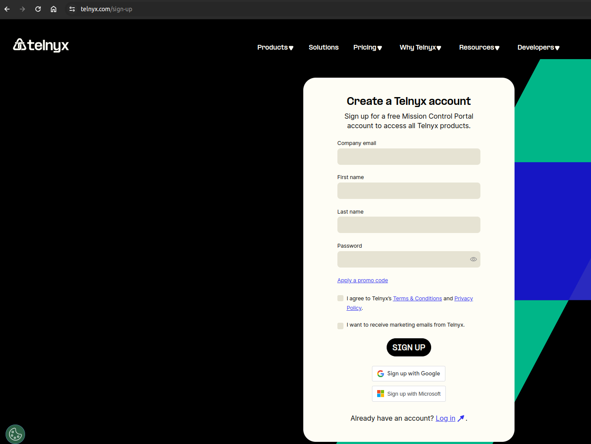
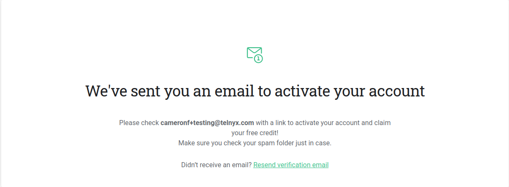
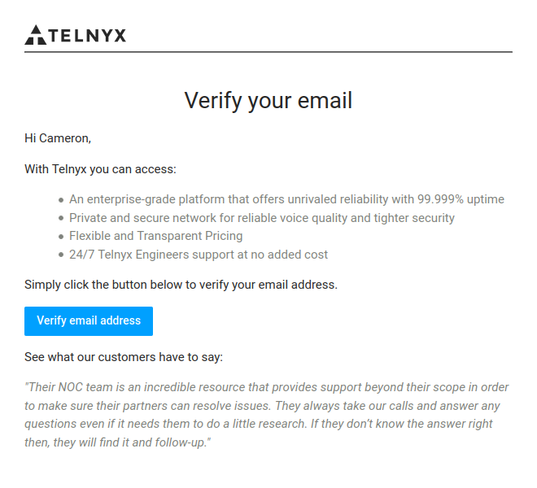
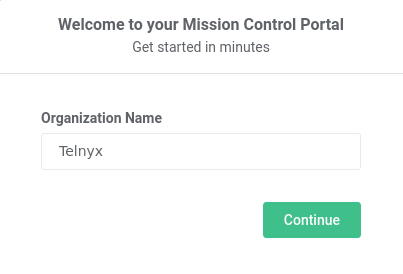
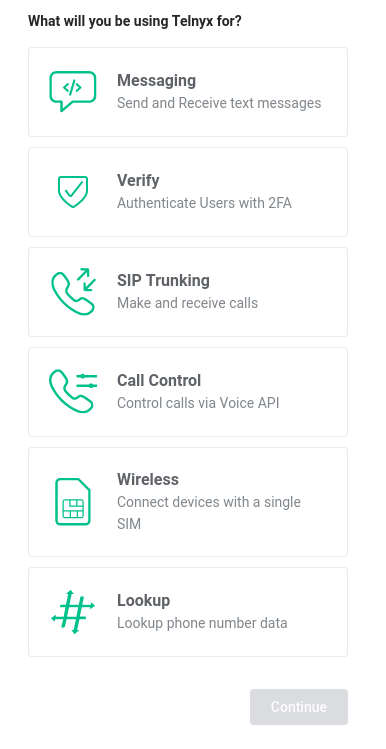
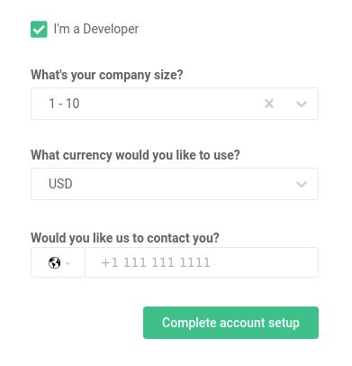
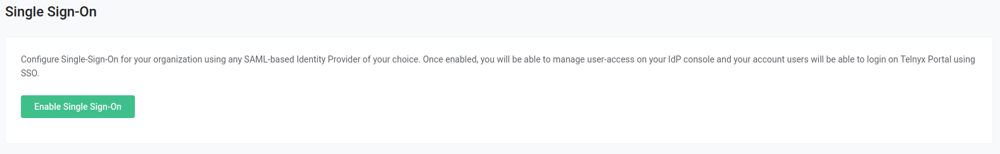
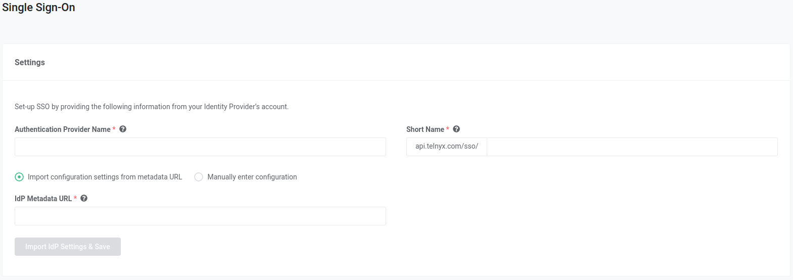
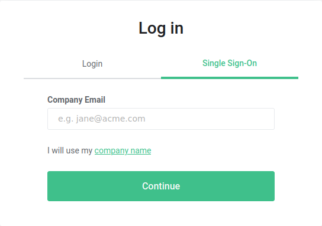

# How to Sign Up for a Telnyx account

This article will explain the steps to create your own Telnyx Portal… See Telnyx guidance and requirements.

In this article, we will go over how you can create a Telnyx Mission Control Portal account, as well as some of our rules regarding allowed methods of sign-up. If at any point you encounter an issue during sign-up, feel free to contact us at [support@telnyx.com](mailto:support@telnyx.com) or through our live-chat and we will do our best to help.
​

---

## **Signing up for an account**

Welcome to our platform! We are delighted to have you join our community. Our mission is to provide you with the best service possible, ensuring a safe, secure, and enjoyable experience every step of the way.

## Account Details

The landing page for signing up can be found [here](https://telnyx.com/sign-up). Users have two different options for account creation:

1. You can use Single Sign On with Gmail & Microsoft using the provided buttons.
2. Or you can directly sign up using the form.

Enter your email address, full name and desired password into the provided text boxes. From time to time, Telnyx may introduce promotional credits. If you possess a promo code and wish to use it, you can click on the link below the password field. You may also use the provided check-box to opt in/out of receiving emails from Telnyx. Click the **Create Account** button.

**Note:** It is mandatory for users to have a business email address to create or sign up for a new account as certain free email providers are disallowed for signing up for the account.

## Know Your Customer

As part of our commitment to creating a trustworthy environment for all our users, we have integrated a Know Your Customer (KYC) procedure into our sign-up process. You may be prompted to follow an identity check before your account can be created. We understand the importance of protecting your data and ensuring its accuracy, which is why we have decided to introduce this additional step.

While this process adds an extra step to our sign-up, it helps us create a safe space for everyone. It aids us in preventing identity theft, financial fraud, money laundering, and other forms of misuse. This way, we can ensure the integrity and security of our platform and provide you with a better, safer user experience.

## Email Verification

Once you have confirmed your details, your provided email address will be sent an email that is used to activate your account.

Simply navigate to the inbox of your provided email address and open the "Verify Your Account" email. If you do not see the email, make sure to check your spam folder. If it is still not present, you can re-send it by clicking on the green **Resend verification email** link.

Click the blue **Verify email address** button.

Once your email is verified, you may be required to submit **phone verification** as well through receiving a one time pass-code.

Once the one time pass-code is submitted you will have verified your phone number and have access to your account.

## **Use Case**

After activating your account, you will be prompted to fill in some information about your use case. This will help optimise the sign-up flow and will direct you to the relevant tools we provide. Begin by providing your organization's name in the pop-up field.

Click **Continue** to proceed. A list of some of the features Telnyx offers will be displayed. Please choose all the relevant options for your use case and click **Continue.**

The menu will expand further to show the option to specify **I'm a Developer** along withadditional details such as your company size and preferred contact number.

## **Currency Limitation**

* New users, from the 18th of October 2022, who sign up for our services will no longer be able to choose currencies outside of USD.
* If you are an existing account with more than one month of spend and want to change your account currency, we are unable to change your accounts currency.
  ​

Once your information has been entered, click **Complete account setup.**
​
Congratulations, you have completed your account set-up! Depending on what features you chose, you will be redirected to the relevant introductory tools.
​
​**SMS Use Cases** will be redirected to our [Learn & Build](https://portal.telnyx.com/#/app/messaging/learn-and-build) section. This gives an easy to understand introduction to sending your first SMS with Telnyx, including purchasing a number and creating a messaging profile.

**[SIP Trunking](https://telnyx.com/products/sip-trunks) Use Cases** receive a number (purchased using their free sign-up credit), a SIP Connection and an Outbound Voice Profile. The Outbound Voice Profile will be assigned to the SIP Connection, and the Connection will be assigned to the number.

---

## **Single-Sign-On**

We're excited to announce that Telnyx users can now make use of our Single-Sign-On feature. Business accounts can now take advantage of the security and streamlined efficiency. Organizations can now leverage one of several SAML providers including **[Auth0](https://support.telnyx.com/en/articles/5355953-auth0-sso-integration-with-telnyx)**, **[Microsoft Azure Active Directory](https://support.telnyx.com/en/articles/5355800-azure-ad-saml-identity-setup)**, **[Okta](https://support.telnyx.com/en/articles/5335562-okta-saml-identity-setup)**, **[Google GSuite](https://support.telnyx.com/en/articles/5361846-gsuite-sso-integration-with-telnyx)**, **[OneLogin](https://support.telnyx.com/en/articles/5316578-onelogin-saml-identity-setup)** and **[LastPass](https://support.telnyx.com/en/articles/5341506-lastpass-saml-identity-setup)** to seamlessly provision Telnyx accounts for their organization members.

To begin using SSO, Telnyx users will first have to create an Organization within their portal. Details of how to do this can be found in this [article](https://support.telnyx.com/en/articles/1189141-get-started-with-organizations).

### Portal Configuration Steps

From your Telnyx Portal homepage, navigate to My Account → Single Sign-On and click **Enable Single Sign-On.**

Enter the relevant details from your SAML provider into the fields provided on the next page. Once filled in click **Import IdP Settings & Save.**

After saving, you can scroll down to the bottom of the page and take note of the values for **Assertion Consumer Service URL, Service Provider Entity ID**, and
​**Name Identifier Format**. These will have to be provided within your SAML app in order to set up correctly.

Once you've provided the details from your Telnyx Portal to your provider, you can click the "Enable Single Sign-On" box. Click **Save Changes.**

Your chosen settings are now in effect! This will send all users in your organization an email informing them that SSO is now enabled. Your users will still be able to login using username/password for the next 72 hours. After that, they will be required to use SSO.

## **Log in**

To log in with your newly saved Single Sign-On service, navigate to the [sign-in](https://portal.telnyx.com/#/login/sign-in) page and click on the Single Sign-On tab to the right.

Enter your relevant login details and voila, you're in!

## **Does Telnyx provide trial credit?**

Telnyx may provide free trial credit from time to time for certain products, however at this moment in time there are no promotions that provide free trial credit.

## **NOTES**

* If the login button is disabled, please verify that your browser is not blocking google scripts for recaptcha verification.
* If you try to sign into your account and you receive the error "You cannot sign in as your identity verification was rejected" please send an email to [support@telnyx.com](mailto:support@telnyx.com) so they can assist you.

---

Related Articles

[Configuring Grandstream GXP16XX with Telnyx](https://support.telnyx.com/en/articles/1130660-configuring-grandstream-gxp16xx-with-telnyx)[Configuring Linphone with Telnyx](https://support.telnyx.com/en/articles/1130674-configuring-linphone-with-telnyx)[What is DTMF? and how to configure it on Telnyx](https://support.telnyx.com/en/articles/1130710-what-is-dtmf-and-how-to-configure-it-on-telnyx)[Megaport Configuration with TELNYX](https://support.telnyx.com/en/articles/2964210-megaport-configuration-with-telnyx)[Auth0 SSO Integration With Telnyx](https://support.telnyx.com/en/articles/5355953-auth0-sso-integration-with-telnyx)

Did this answer your question?

😞😐😃
