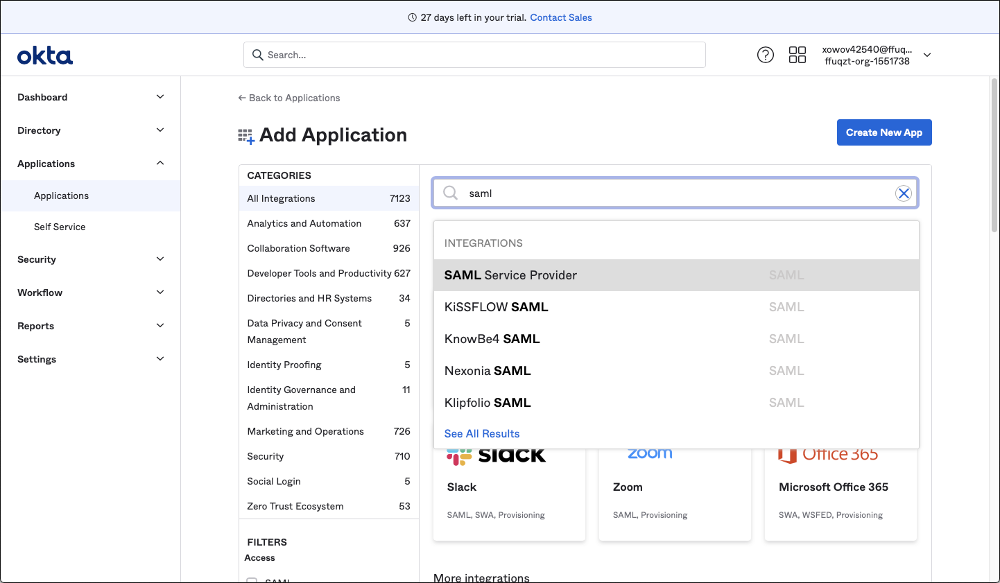
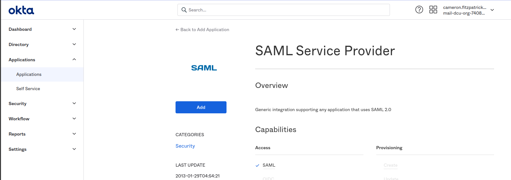
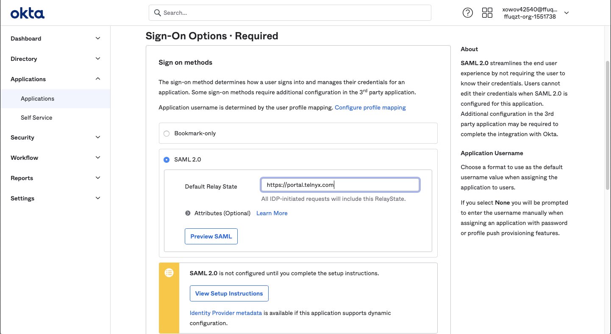
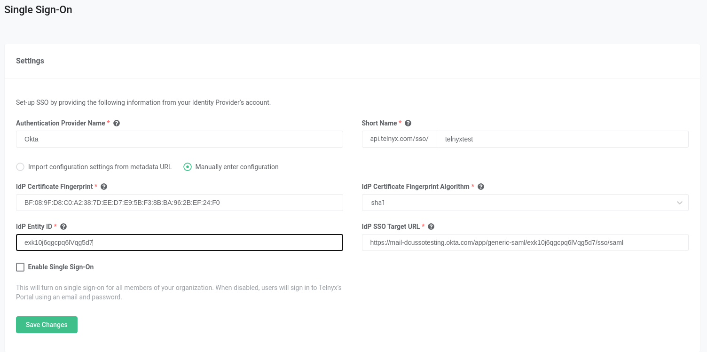
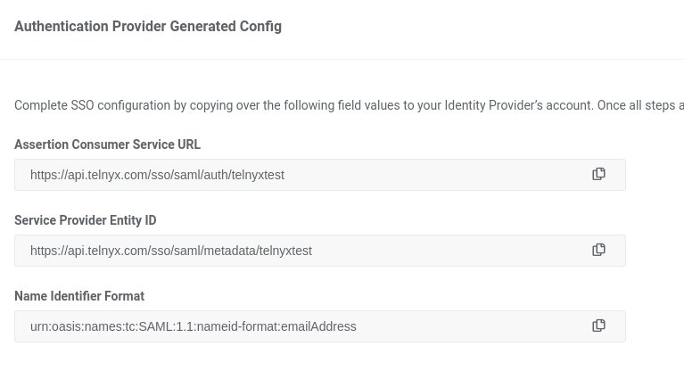

# Okta: SAML Identity Setup

Learn how to set up Okta SAML to utilize Telnyx Portal Single Sign-on capabilities. See Telnyx guidance and requirements.

C

[Okta offers implementation of Security Assertion Markup Language (SAML) for your network](https://www.okta.com/topic/SAML/). [SAML](https://en.wikipedia.org/wiki/SAML_2.0) is the most-used security language that has come to define the relationship between identity providers and service providers. An open-source XML tool, SAML is an absolute must for anyone needing reliable access to secure domains, as it eliminates the need for passwords and uses digital signatures instead. With SAML, there’s reduced risk of phishing and identity theft for service providers since they don’t have to store log-in credentials for individuals, making damaging data.

In this article, we will outline setting up Okta as a SAML Identity Provider so that we can utilize Telnyx's Single Sign-On feature. The Okta platform is an identity management system that uses single sign-on (SSO) and a cloud directory that helps companies manage and secure user authentication into applications. It is one of the many SAML providers that Telnyx supports for our SSO feature.

Additional resources:

* [Okta documentation for adding a SAML Identity provider](https://help.okta.com/en-us/content/topics/security/idp-add-saml.htm)
* [General Okta end-user documentation](https://help.okta.com/eu/en-us/Content/Topics/end-user/end-user-home.htm?cshid=csh-user-home)
* Okta: FAQ
* [Okta discussion forums](https://support.okta.com/help/s/group/CollaborationGroup/Recent?language=en_US)
* [Okta help and support](https://support.okta.com/help/s/?language=en_US)
* [Okta developer portal](https://developer.okta.com/)

---

## Instructions for setting up Okta SAML Identity Provider with your Telnyx account

In this activity you will:

1. Create an SSO app on Okta
2. [Obtain organization configuration details from Telnyx](#h_bbc55a110e)
3. [Add your Telnyx Organization details to your Okta SSO app](#h_b420610043)

**Pre-requisites:**

* Ensure that your [Telnyx Mission Command Portal is configured properly](https://support.telnyx.com/en/articles/1176636-get-started-with-a-mission-control-account)
* RECOMMENDED: [Enable TLS to encrypt your traffic](https://support.telnyx.com/en/articles/1130711-does-telnyx-encrypt-communication)
* Create an Organization in the [Organization](https://portal.telnyx.com/#/app/advanced-features/organizations) section of the Telnyx Mission Control Portal and make sure you record the **Assertion Consumer Service URL**

## 1. Create an SSO app on Okta

In this section, you will create an SSO app on Okta that you'll use to configure SSO authentication through Telnyx.

1. Log into your Okta Admin panel.
2. Click on **Applications** in the left-hand navigation and click the blue **Browse App Catalog** button.

   
3. Use the App Integration search bar to search for *SAML* and choose **SAML Service Provider** from the search results.

   
4. On the next screen, click on the blue **Add** button.

   
5. On the **Add SAML Service Provider** page, change the **Application Label** to whatever name you desire.

   
6. Click **Next**.
7. On the **Sign-On Options** page, select **SAML 2.0** (This may be selected already).
8. Set the **Default Relay State** to “[https://portal.telnyx.com](https://portal.telnyx.com/)”.
9. Click the blue **View Setup Instructions** button and retrieve your **Identity Provider Entity Id** on the opened tab. Take note of this, because you'll need it soon. This will be used to create our Identity Provider Metadata link.

   This link should resemble this format: *<https://<okta-org>.okta.com/app/<okta-idp-id>/sso/saml/metadata>*

   You can also find this link by copying the link for "Identity Provider metadata".
   ​

   

[Back to Top](#h_e2a191b7a7)

## 2. Obtain Organization configuration details from Telnyx

In this section, you'll log into your Telnyx portal and get the necessary configuration details to finish setting up your Okta SSO app.

1. Log into your Telnyx Mission Control Portal.
2. If you did not complete this step as part of your [pre-requisite activities](#h_1c8c71363e), navigate to your [Organization](https://portal.telnyx.com/#/advanced-features/members) section of the Telnyx Mission Control Portal to create an Organization.
3. Once created, navigate to the [Single Sign-On](https://portal.telnyx.com/#/advanced-features/single-sign-on) section of the portal and click the green **Enable Single Sign-On** button.

   
4. You will be presented with the following fields:

   1. **Authentication Provider name** and **Short Name:** Enter the values that make sense for you here.
      ​
      ​***Please note*** *that the Short Name will be part of the SSO URLs.*
      ​
   2. **IdP Metadata URL:** Paste the Identity Provider Entity ID you obtained in step 9 of [section 1](#h_79f972431a).
5. Click **Import IdP Settings & Save.**
   ​
   ​**NOTE:** After saving, the ***IdP Entity ID*** field will be set to "not found" (this is an error on the Okta file), so we have to fill it manually. Take the **IdP Metadata URL** and extract the ***<okta-idp-id>*** from it, and paste it in this field.

   
6. Click **Save Changes.**
7. Scroll down to the **Authentication Provider Generated Config** section and take note of the values for the following, as you'll need them soon:

   1. **Assertion Consumer Service URL**
   2. **Service Provider Entity ID**

      

[Back to Top](#h_e2a191b7a7)

## 3. Add your Telnyx Organization details to your Okta SSO app

In this final section, you'll return to Okta and provide the information you obtained from Telnyx in step 7 of [section 2](#h_bbc55a110e).

1. Head back to your Okta Admin page and fill in the **Advanced Sign-On** settings and **Credential** details.
2. Use the values generated for **Assertion Consumer Service URL** and **Service Provider Entity ID** on the Telnyx Mission Control Portal (step 7, [section 2](#h_bbc55a110e)) and paste into the corresponding fields.
3. In the **Application username format** field select *Email*.

   
4. Click **Save**.
5. Once you are ready to enable the configs, return to your Telnyx Mission Control Portal and select **Enable Single Sign-On**.

   
6. Click **Save Changes**.

Your chosen settings are now in effect! This will send all users in your organization an email informing them that SSO is now enabled. Your users will still be able to log in using username/password for the next 72 hours. After that, they will be required to use SSO.

[Back to Top](#h_e2a191b7a7)

---

## Troubleshooting

**Q. I'm experiencing difficulty with this configuration!**

A. If you experience technical difficulties while attempting to set up your Okta SSO with Telnyx, it's possible your provider is experiencing outages/maintenance. You can check the status of Okta's features at <https://status.okta.com/>.
​

[Back to Top](#h_e2a191b7a7)

---

## Additional Resources

Review our [getting started guide](https://support.telnyx.com/en/articles/1176636-get-started-with-a-mission-control-account) to make sure your Telnyx Mission Control Portal account is set up correctly!

Additionally, check out:

* [Okta documentation for adding a SAML Identity provider](https://help.okta.com/en-us/Content/Topics/Security/idp-add-saml.htm)
* [General Okta end-user documentation](https://help.okta.com/eu/en-us/Content/Topics/end-user/end-user-home.htm?cshid=csh-user-home)
* Okta: FAQ
* [Okta discussion forums](https://support.okta.com/help/s/group/CollaborationGroup/Recent?language=en_US)
* [Okta help and support](https://support.okta.com/help/s/?language=en_US)
* [Okta developer portal](https://developer.okta.com/)

---

Related Articles

[OneLogin: SAML Identity Setup](https://support.telnyx.com/en/articles/5316578-onelogin-saml-identity-setup)[LastPass: SAML Identity Setup](https://support.telnyx.com/en/articles/5341506-lastpass-saml-identity-setup)[Azure AD: SAML Identity Setup](https://support.telnyx.com/en/articles/5355800-azure-ad-saml-identity-setup)[Auth0 SSO Integration With Telnyx](https://support.telnyx.com/en/articles/5355953-auth0-sso-integration-with-telnyx)[GSuite SSO Integration With Telnyx](https://support.telnyx.com/en/articles/5361846-gsuite-sso-integration-with-telnyx)

Did this answer your question?

😞😐😃
