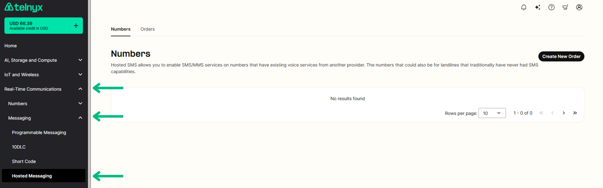
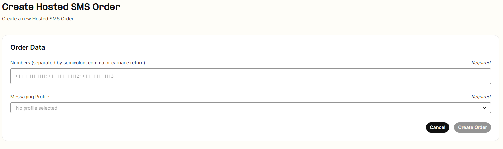
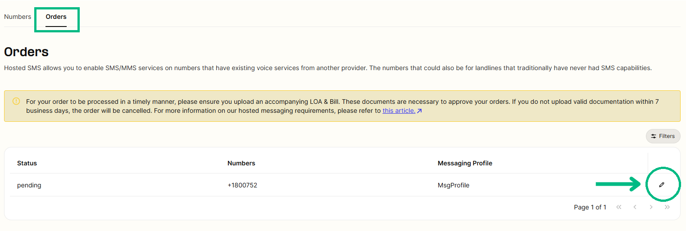

# Hosted SMS Messaging Process

Learn how Telnyx streamlines hosted messaging transfers. See Telnyx guidance and requirements Learn more about Hosted SMS Messaging Process with Telnyx.

## **What is hosted sms messaging?**

Hosted sms messaging allows a customer to port and enable messaging with Telnyx for a number, while leaving the voice portion of a number with the current voice provider.

This can only be done with the expressed consent of the authorized end user of the number. A Letter of Authorization ([LOA](https://portal.telnyx.com/downloads/other/Telnyx-LOA.pdf)) and invoice from the current messaging provider will be required to submit a hosted messaging request with Telnyx.

[Blank SMS LOA](https://drive.google.com/file/d/1yxrQSkEIFA5dPzlmRJAtB7QN3iYDzh0z/view)

## **How can I submit an order?**

Your account must be [Level 2 Verified](https://support.telnyx.com/en/articles/1130595-account-verification) to successfully submit and activate hosted messaging orders.

Once you are in the portal click on the "Real-Time Communications" dropdown on the left hand side navigation bar and click on Messaging and then [Hosted Messaging](https://portal.telnyx.com/#/app/messaging-hosted-sms/numbers) to submit an order to transfer only the messaging portion of a number to be with Telnyx.

### **Create New Order**

From there you will click on the “Create new order” on the top right hand side. At the next page you will need to provide the numbers that you will be adding for hosted messaging as well as your messaging profile that you will be assigning them to. You can put in up to 200 numbers at a time.

Once you create the order you will then need to upload an LOA signed and dated by the End User within the last 30 calendar days as well as an invoice that matches this information.

### **Upload Documents to Order**

You do this by going to messaging>hosted sms>[orders](https://portal.telnyx.com/#/messaging-hosted-sms/numbers) you click the "pencil" to edit the order and it gives you the option to upload the LOA and bill.

Your order will be in a pending state until the documents are uploaded, however if they are not uploaded in a timely manner your order may be considered failed.

### Notes

* If no LOA or invoice is provided and the information does not match then the request will be **rejected**.
* Files should be pdf.

  + Max size 5MB.
  + Uploads should be two files, LOA and Bill file.
  + File's name can't have special characters(#, $, %, &, @, etc).
* Once submitted the order will be processed within 24-48 hours business working hours.
* Telnyx accepts hosted messaging request submissions 24/7/365 through the portal. However, requests will only be processed Monday through Friday from 9am-5pm CT

  + We observe the following holidays:

    - New Year's Day
    - Memorial Day
    - Independence Day
    - Labor Day
    - Thanksgiving Day
    - Day after Thanksgiving
    - Christmas Eve Day
    - Christmas Day
* You will be able see the status of your order as you wait for completion as shown below:

Once the order is complete you can view your inventory of hosted messaging numbers via the API.

* \*\*Hosted messaging can be done on Bandwidth numbers, but it requires manual intervention by you or Bandwidth’s reseller. Right now in the industry, messaging providers are allowed to put a block on their numbers and Bandwidth is one such carrier. Once you submit the hosted messaging order please reach out to support so we can proactively reach out to Bandwidth to have them release the messaging for the numbers. If you or the EU’s direct provider is Bandwidth please reach out to them as well to release the messaging for the numbers to help speed up the process.

## **Common questions:**

### Can I port just the messaging capability for a number?

* Yes, this is exactly what our hosted messaging product caters for. You port the messaging services from your current carrier, if they support it, to Telnyx but the voice line stays with the current carrier.

### **What are instances where I cannot host messaging with Telnyx?**

* If voice and messaging currently live with a wireless provider. Voice would need to be ported to a non-wireless provider and then hosted messaging could be transferred to Telnyx. This includes numbers that are with Google Voice.

  + \*\*Zoom Phone DOES allow hosted messaging away from their network
* Hosted messaging is only for local numbers in the US and Canada. International numbers are not available for hosted messaging.
* We do not currently cater for hosted messaging transfers from one Telnyx account to another.

### **Can I use a Toll Free number for Hosted Messaging with Telnyx?**

* Yes, hosted messaging is supported for Toll Free numbers. However, hosting Toll Free numbers for messaging will take up to a minimum of 72 hours to gain the messaging portion of the number from the losing provider.

### **What if I already have voice with Telnyx for a number and wish to have messaging?**

* This would not be a hosted messaging request. Hosted messaging requests are only for when just the messaging will be with Telnyx. You can add a messaging profile to a TN you already have with Telnyx for voice to port the messaging as well.

### **What if I have hosted messaging with Telnyx, but wish to port the messaging to a new provider? What should I do?**

* If you have hosted messaging and you wish to have messaging leave Telnyx please put in a request with the gaining provider and reach out to Telnyx support to let them know that you will be moving the hosted messaging to another provider so we can make sure it is released.

  + If the number is on a **Telnyx LRN** you will not be able to port messaging for a TN to a new provider. You can only port messaging for a number if hosted messaging is with Telnyx and the voice portion is already with a different provider other than Telnyx.

### **Are there any carriers we are unable to port hosted messaging from?**

* The only issues that arise when transferring hosted messaging is if a provider has a block on their numbers. Hosted messaging is normally an automated process where as soon as our team approves the request the number is transferred to our messaging network. If a provider has a block on their numbers the automated request does not go through and manual intervention is required. The following providers are the ones that we know have a block on their numbers for messaging: **Bandwidth**, **Aerialink**, and **Callfire**.

  + If you or your customer know that one of these providers is the underlying provider for messaging please have the direct customer for these providers reach out to them to approve the release of messaging after you put in the request with us. Telnyx is able to reach out as well, but these providers usually require approval from the direct customer they have on file for the number(s).

## **Resources**

* <https://telnyx.com/release-notes/hosted-sms>
* <https://developers.telnyx.com/docs/messaging/messages/hosted-sms>
* <https://telnyx.com/resources/hosted-sms-how-to-guide>
* <https://portal.telnyx.com/#/pricing/messaging>

---

Related Articles

[Porting away from Twilio](https://support.telnyx.com/en/articles/3947850-porting-away-from-twilio)[Telnyx Messaging Error Codes](https://support.telnyx.com/en/articles/6505121-telnyx-messaging-error-codes)[Verified Numbers FAQ](https://support.telnyx.com/en/articles/6790265-verified-numbers-faq)[SMS for Ported In Phone Numbers](https://support.telnyx.com/en/articles/7183887-sms-for-ported-in-phone-numbers)[US / CA Toll Free Number Porting](https://support.telnyx.com/en/articles/8673249-us-ca-toll-free-number-porting)

Did this answer your question?

😞😐😃
