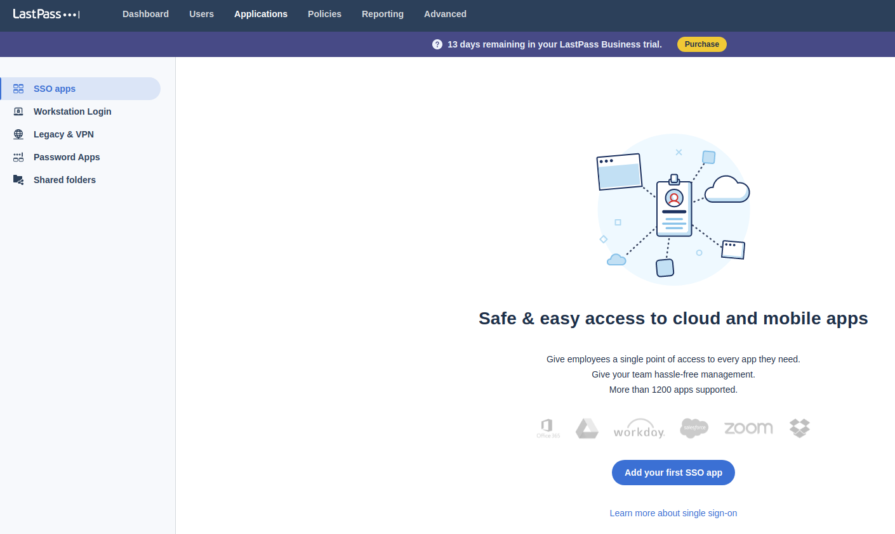
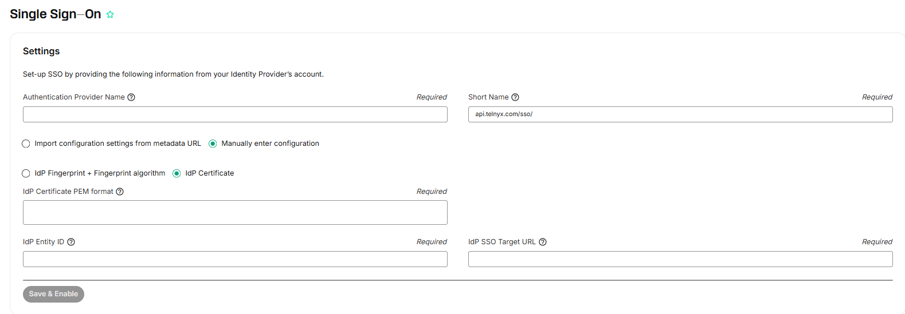
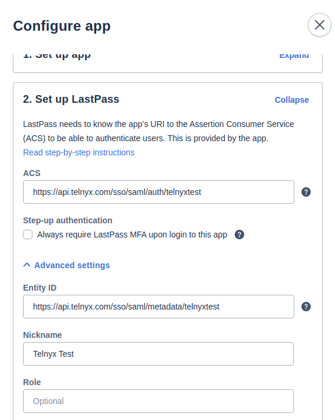

LastPass: SAML Identity Setup | Telnyx Help Center

[Skip to main content](#main-content)

# LastPass: SAML Identity Setup

Learn how to set up LastPass SAML to utilize Telnyx Portal Single Sign-on capabilities.

C

Written by Customer Success

April 8, 2026

Table of contents

[Jump to Instructions](#h_1f8824a8bd)

The [LastPass SSO solution](https://www.lastpass.com/solutions/integrations/saml) leverages [SAML 2.0](https://en.wikipedia.org/wiki/SAML_2.0) to provide the best performance in endpoint security solution for a wide range of business needs. Because of its functionality, versatility, reliability, and scalability, SAML is an ideal option for service providers and identity providers alike.

[LastPass](https://www.lastpass.com/) provides a true SSO experience for end users, allowing them to access key apps without having to enter a unique password, thus delivering a more efficient authentication flow and enhanced productivity.

In this article we will outline setting up LastPass as a SAML Identity Provider so that we can utilize Telnyx's Single Sign-On feature. LastPass is a password manager that stores encrypted passwords online. It is one of the many SAML providers that Telnyx supports for our SSO feature.

Additional resources:

* [LastPass support and documentation](https://support.lastpass.com/s/?language=en_US)
* [LastPass download](https://lastpass.com/misc_download2.php)

---

# Instructions for setting up LastPass SAML Identity Provider with Telnyx

In this activity you will:

1. [Create an SSO app on LastPass](#h_e123c707ca)
2. [Obtain organization configuration details from Telnyx](#h_75d9933a8d)
3. [Add your Telnyx Organization details to your LastPass SSO app](#h_3f0d3ce868)

**Pre-requisites:**

* Ensure that your [Telnyx Mission Command Portal is configured properly](https://support.telnyx.com/en/articles/1176636-get-started-with-a-mission-control-account)
* RECOMMENDED: [Enable TLS to encrypt your traffic](https://support.telnyx.com/en/articles/1130711-does-telnyx-encrypt-communication)
* Create an Organization in the [Organization](https://portal.telnyx.com/#/app/advanced-features/organizations) section of your Telnyx Mission Control Portal

## 1. Create an SSO app on LastPass

In this section, you will create an SSO app on LastPass that you'll use to configure SSO authentication through Telnyx.

1. Log into your [LastPass admin portal.](https://admin.lastpass.com/dashboard)
2. From the left-hand navigation, click **Applications →SSO** **Apps**.
3. Click **Add your first SSO App.**

   
4. On the pop-up screen, click on **Add unlisted app.** You'll be prompted to choose a name for your app.
5. On the **Configure App** page, make sure you're on the **Set up App** tab, then click **Expand**. You'll see information that will look similar to the screenshot below. Make note of this. You'll need it soon.

   

[Back to Top](#h_1f8824a8bd)

## 2. Obtain Organization configuration details from Telnyx

In this section, you'll log into your Telnyx portal and get the necessary configuration details to finish setting up your LastPass SSO app.

1. Log into your Telnyx Mission Control Portal.
2. If you did not complete this step as part of your [pre-requisite activities](#h_f5e38c1afb), navigate to your [Organization](https://portal.telnyx.com/#/app/advanced-features/organizations) section of the Telnyx Mission Control Portal to create an Organization.
3. Once created, navigate to the [Single Sign-On](https://portal.telnyx.com/#/app/advanced-features/single-sign-on) section of the portal and click the green **Enable Single Sign-On** button.

   
4. You will be presented with the following fields:

   1. **Authentication Provider name** and **Short Name:** Enter the values that make sense for you here.  
      ​  
      ​***Please note*** *that the Short Name will be part of the SSO URLs.*
   2. **Manually enter configuration:** Select this
   3. **IdP Certificate Fingerprint**: Provide the value from the **Certificate Fingerprint:(SHA256)** field you copied from LastPass in [section 1](#h_e123c707ca).
   4. **IdP Certificate Fingerprint Algorithm**: select *sha256***.**
   5. **IdP Entity ID**: Provide the value from the **Entity ID** field you copied from LastPass in [section 1](#h_e123c707ca).
   6. **IdP SSO Target URL:** Provide the value from the **SSO Endpoint** field you copied from LastPass in [section 1](#h_e123c707ca).

      
5. Click **Save Changes.**
6. Scroll down to the **Authentication Provider Generated Config** section and take note of the following values, as you'll need them soon:

   1. **Assertion Consumer Service URL**
   2. **Service Provider Entity ID**

      

[Back to Top](#h_1f8824a8bd)

## 3. Add your Telnyx Organization details to your LastPass SSO app

In this final section, you'll return to LastPass and provide the information you obtained from Telnyx in step 6 of [section 2](#h_75d9933a8d).

1. Log into your [LastPass admin portal.](https://admin.lastpass.com/dashboard)
2. Open the **Set up LastPass** tab and click **Expand**.
3. Click on the **Advanced Settings** dropdown and provide the following information:

   1. **ACS:** Provide the value from the **Assertion Consumer Service URL** field you copied from Telnyx in step 6 of [section 2](#h_75d9933a8d).
   2. **Entity ID:** Provide the value from the **Service Provider Entity ID** field you copied from Telnyx in step 6 of [section 2](#h_75d9933a8d).
   3. **Identifier:** Select *Email*.
   4. **SAML signature method:** *SHA256*
   5. **Sign Response:** Enable this

      

      
4. When your configuration is complete, click **Save & Assign to users.**
5. On the next page, click on **Assign users, groups and roles.**

   
6. Select all appropriate users you would like to assign this app to using the check boxes beside their email IDs.

   
7. When all users are selected, click **Assign.**
8. Once you are ready to enable the configs, on the Telnyx Mission Control Portal, click on **Enable Single Sign-On.**

   
9. **Click Save Changes**.

Your chosen settings are now in effect! This will send all users in your organization an email informing them that SSO is now enabled. Your users will still be able to login using username/password for the next 72 hours. After that, they will be required to use SSO.  
​

[Back to Top](#h_1f8824a8bd)

---

## Troubleshooting

**Q. I'm experiencing difficulty with this configuration!**

A. If you experience technical difficulties while attempting to set up your LastPass SSO with Telnyx, its possible your provider is experiencing outages/maintenance. You can check the status of LastPass features at <https://status.lastpass.com/>.  
​

[Back to Top](#h_1f8824a8bd)

---

## Additional Resources

Review our [getting started with guide](https://support.telnyx.com/en/articles/1176636-get-started-with-a-mission-control-account) to make sure your Telnyx Mission Control Portal account is setup correctly!

Additionally, check out:

* [LastPass support and documentation](https://support.lastpass.com/s/?language=en_US)
* [LastPass download](https://lastpass.com/misc_download2.php)

---

Related Articles

[OneLogin: SAML Identity Setup](https://support.telnyx.com/en/articles/5316578-onelogin-saml-identity-setup)[Okta: SAML Identity Setup](https://support.telnyx.com/en/articles/5335562-okta-saml-identity-setup)[Azure AD: SAML Identity Setup](https://support.telnyx.com/en/articles/5355800-azure-ad-saml-identity-setup)[Auth0 SSO Integration With Telnyx](https://support.telnyx.com/en/articles/5355953-auth0-sso-integration-with-telnyx)[GSuite SSO Integration With Telnyx](https://support.telnyx.com/en/articles/5361846-gsuite-sso-integration-with-telnyx)

Did this answer your question?

😞😐😃

Table of contents
