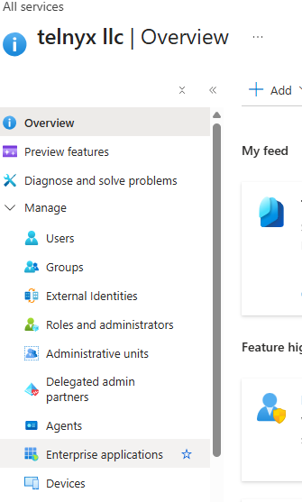
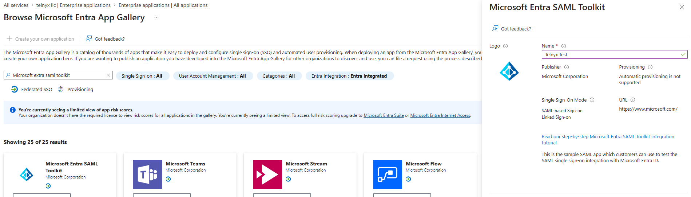
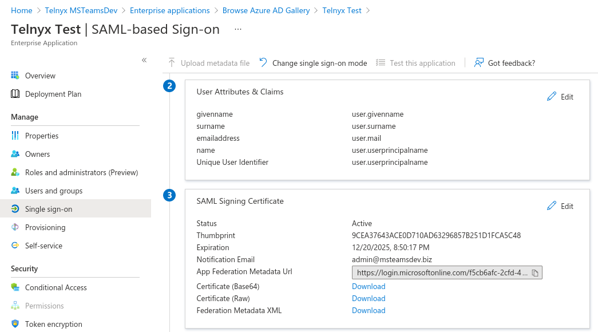
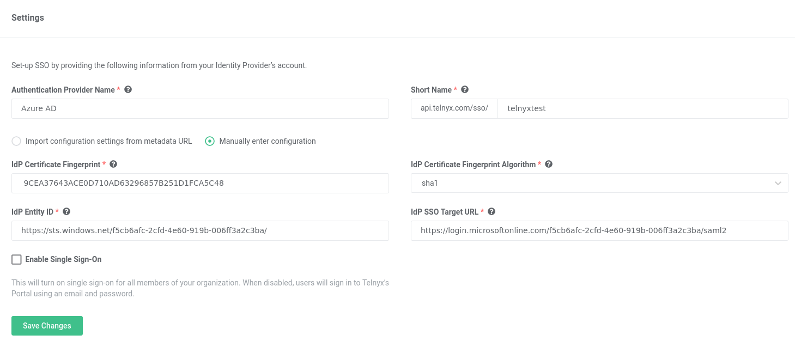

# Azure AD: SAML Identity Setup

Learn how to set up Microsoft Azure Active Directory SAML to utilize Telnyx Portal Single Sign-on capabilities. See Telnyx guidance and requirements.

C

[Jump to Instructions](#h_5862e24a4f)

The [Azure Active Directory (Azure AD)](https://azure.microsoft.com/en-us/services/active-directory/#overview) enterprise identity service provides single sign-on and multi-factor authentication to help protect your users from 99.9 percent of cybersecurity attacks.

In this article we will outline setting up Microsoft Azure AD as a SAML Identity Provider so that we can utilize Telnyx's Single Sign-On feature. The Microsoft Azure AD platform is Microsoft's enterprise cloud-based identity and access management (IAM) solution. It is one of the many SAML providers that Telnyx supports for our SSO feature.

Additional resources:

* [Active Directory documentation](https://learn.microsoft.com/en-us/entra/fundamentals/whatis)
* [Microsoft support](https://support.microsoft.com/en-US)

---

## Instructions for configuring Azure Active Directory to work as a SAML Identity Provider for Telnyx

In this activity you will:

1. [Create and configure a SAML toolkit application on Microsoft Azure](#h_c722084032)
2. [Configure some additional settings on the Telnyx side](#h_deef98f57b)
3. [Complete the setup in Azure](#h_464e7183af)
4. [Enable your SSO configuration on Telnyx](#h_0fdc3234e3)

**Pre-requisites:**

* Ensure that your [Telnyx Mission Command Portal is configured properly](https://support.telnyx.com/en/articles/1176636-get-started-with-a-mission-control-account)
* RECOMMENDED: [Enable TLS to encrypt your traffic](https://support.telnyx.com/en/articles/1130711-does-telnyx-encrypt-communication)
* Create an Organization in the [Organization](https://portal.telnyx.com/#/advanced-features/members) section of the Telnyx Mission Control Portal

## 1. Create and configure a SAML toolkit application on Microsoft Azure

In this section, you will create a SAML toolkit application within Azure

1. Log into your [Microsoft Azure Admin Portal](https://portal.azure.com/#home).
2. From the left-had navigation, click on **Microsoft Entra ID.**

   
3. You will be redirected to the Active Directory page Overview. Click on **Enterprise Applications** in the left-hand navigation.

   
4. Click on the **New Application** option in the top left of the following page.
5. On the **Browse Microsoft Entra App Gallery** menu search for **Microsoft Extra SAML toolkit**.
6. Click on the result to create the app.
7. Fill in a name of your choice into the field within the pop-out.

   
8. Click the blue **Create** button at the bottom of the pop-out.
9. On the new application page, find the **Getting Started** section and click on the **Set up single sign on** card.

   
10. You will be presented with various options on the next page, select the **SAML** card to proceed to the configuration section.
11. From here, copy the **App Federation Metadata URL** and the **Thumbprint** from card 3.

    

[Back to Top](#h_5862e24a4f)

## 2. Configure some additional settings on the Telnyx side

In this section, we will configure Telnyx to use the Active Directory app we created in [section 1](#h_c722084032).

1. If you have not yet created an Organization as part of your [pre-requisite activities](#h_7fefd7ee47), navigate to your [Organization](https://portal.telnyx.com/#/advanced-features/members) section of the Telnyx Mission Control Portal and create an Organization.
2. Once created, navigate to the **[Single Sign-On](https://portal.telnyx.com/#/advanced-features/single-sign-on)** section of the portal and click the green **Enable Single Sign-On** button.

   
3. You will be presented with the following fields:

   1. **Authentication Provider Name** and **Short Name**: Provide values that make sense to you. ***Note*** *that the Short Name will be part of the SSO URLs.*
   2. **IdP Metadata URL**: Paste the **App Federation Metadata URL** we copied from the MS Azure Admin in step 11 of [section 1](#h_c722084032).

      
4. Click on **Import IdP Settings & Save.**
5. Once saved, your authentication provider settings should automatically fill in with exception of the **IdP Certificate Fingerprint.**

   1. Replace the "not found" within this field with the **Thumbprint** we copied from the Azure Admin portal in step 11 of [section 1](#h_c722084032).

      
   2. Click **Save Changes.**
6. After saving, scroll down to the bottom of the page and take note of the values for:

   1. **Assertion Consumer Service URL**
   2. **Service Provider Entity ID**
   3. **Name Identifier Format**.

      

[Back to Top](#h_5862e24a4f)

## 3. Complete the setup in Azure

Now that you've gotten what you need from the Telnyx side, head back to Azure to complete the setup.

1. Navigate back to the Azure AD portal, and click the **Edit** option in the top right corner of card 1 (**Basic SAML Configuration**).
2. Remove the default value for **Identifier (Entity ID)** (something like *[https://samltookit.azurewebsites.net](https://samltoolkit.azurewebsites.net/)*) by clicking the trash icon.
3. Find the **Identifier (Entity ID)** field. Paste the value generated for **Service Provider Entity ID** that you obtained in step 6 of [section 2](#h_deef98f57b) into this field.
4. Find the **Reply URL (Assertion Consumer Service URL)** field. Paste the value generated for **Assertion Consumer Service URL** that you obtained in step 6 of [section 2](#h_deef98f57b) into this field.
5. Find the **Sign on URL** field. Paste *<https://api.telnyx.com/sso/saml/login/YOUR_SHORT_NAME>* that you obtained in step 3 of [section 2](#h_deef98f57b) into this field.
6. Find the **Relay State** field, fill in the following URL: *<https://portal.telnyx.com/>*

   
7. Click **Save** to finalize your configuration settings.

[Back to Top](#h_5862e24a4f)

## 4. Enable your SSO configuration on Telnyx

And now, for the drum roll! Let's enable your SSO configuration and get things up and running!

1. Navigate back to y Telnyx Mission Control Portal and check the **Enable Single Sign-On** box.

   
2. Click **Save Changes.**

Your chosen settings are now in effect! This will send all users in your organization an email informing them that SSO is now enabled. Your users will still be able to login using username/password for the next 72 hours. After that, they will be required to use SSO.
​

[Back to Top](#h_5862e24a4f)

---

## Troubleshooting

**Q. I'm experiencing difficulty with this configuration!**

A. If you experience technical difficulties while attempting to set up your MS Azure AD SSO with Telnyx, its possible your provider is experiencing outages/maintenance. You can check the status of Auth0's features at [https://status.azure.com/en-us/status](https://azure.status.microsoft/en-us/status).
​

[Back to Top](#h_5862e24a4f)

---

## Additional Resources

Review our [getting started with guide](https://support.telnyx.com/en/articles/1176636-get-started-with-a-mission-control-account) to make sure your Telnyx Mission Control Portal account is setup correctly!

Additionally, check out:

* [Active Directory documentation](https://learn.microsoft.com/en-us/entra/fundamentals/whatis)
* [Microsoft support](https://support.microsoft.com/en-US)

---

---

Related Articles

[OneLogin: SAML Identity Setup](https://support.telnyx.com/en/articles/5316578-onelogin-saml-identity-setup)[Okta: SAML Identity Setup](https://support.telnyx.com/en/articles/5335562-okta-saml-identity-setup)[LastPass: SAML Identity Setup](https://support.telnyx.com/en/articles/5341506-lastpass-saml-identity-setup)[Auth0 SSO Integration With Telnyx](https://support.telnyx.com/en/articles/5355953-auth0-sso-integration-with-telnyx)[GSuite SSO Integration With Telnyx](https://support.telnyx.com/en/articles/5361846-gsuite-sso-integration-with-telnyx)

Did this answer your question?

😞😐😃
