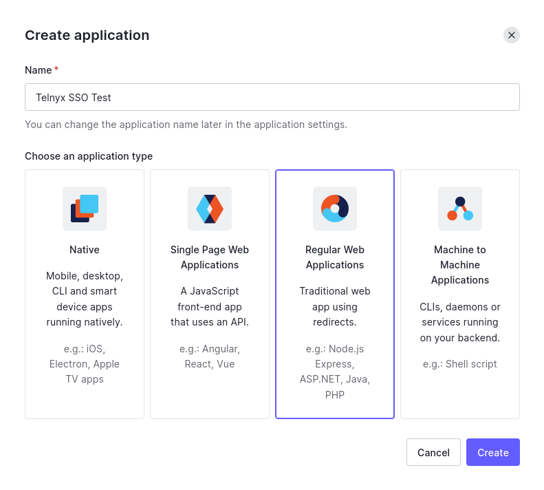
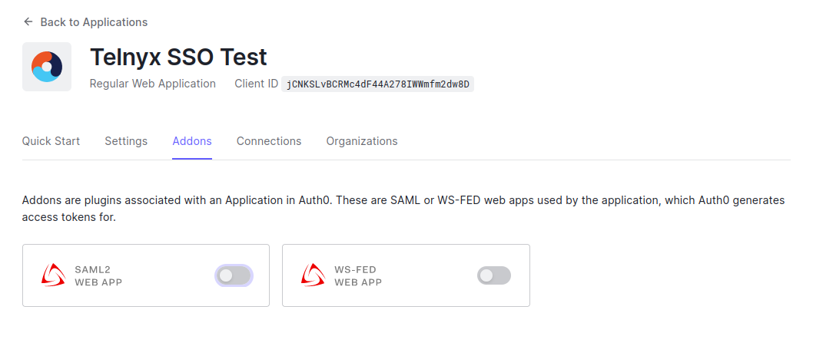
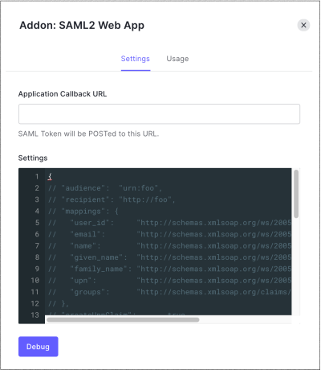
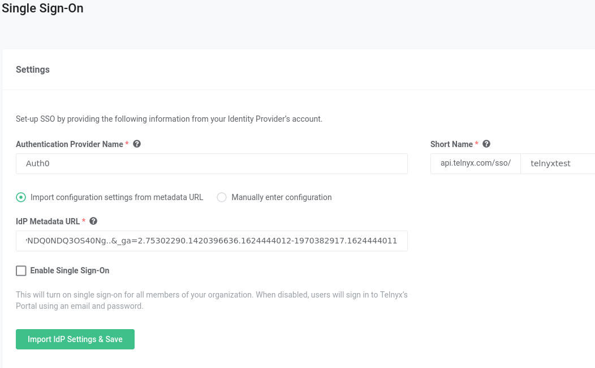
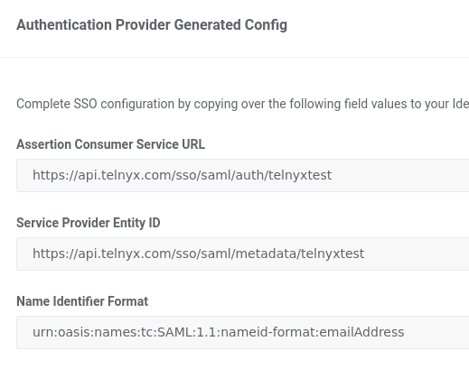
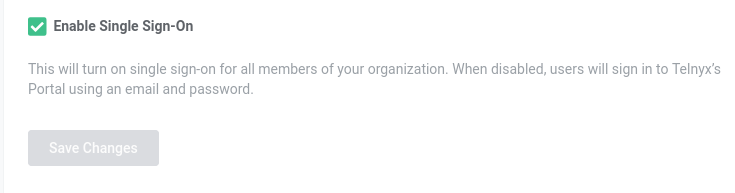

# Auth0 SSO Integration With Telnyx

Learn how to set up Auth0 SAML to utilize Telnyx Portal Single Sign-on capabilities. See Telnyx guidance and requirements.

C


[Jump to Instructions](#h_4270017da8)

[Auth0](https://auth0.com/) is a flexible, drop-in SaaS solution to add authentication and authorization services to your applications, allowing you to avoid the cost, time, and risk of building your own solution to authenticate and authorize users.

Auth0 offers different levels of subscription including Free, Developer, and Developer Pro. Each subscription has different capabilities and options. Its solution works with iOS, Android, and Windows Phone 8 platforms.

In this article we will outline setting up Auth0 as a SAML Identity Provider so that we can utilize Telnyx's Single Sign-On feature.

Additional resources:

* [Auth0-as-SAML-provider documentation](https://auth0.com/docs/authenticate/single-sign-on/outbound-single-sign-on/configure-auth0-saml-identity-provider)
* [Auth0 APIs](https://auth0.com/docs/api)
* [Auth0 SDK libraries](https://auth0.com/docs/libraries)
* [Auth0 community forums](https://community.auth0.com/?_ga=2.33767585.1227262971.1641493950-34452118.1641493950&_gl=1*1hn20b2*rollup_ga*MzQ0NTIxMTguMTY0MTQ5Mzk1MA..*rollup_ga_F1G3E656YZ*MTY0MTQ5Mzk1MC4xLjEuMTY0MTQ5NDMxMS41Ng..)
* [Auth0 support](https://support.auth0.com/?_ga=2.33767585.1227262971.1641493950-34452118.1641493950&_gl=1*pe7jda*rollup_ga*MzQ0NTIxMTguMTY0MTQ5Mzk1MA..*rollup_ga_F1G3E656YZ*MTY0MTQ5Mzk1MC4xLjEuMTY0MTQ5NDMyNi40MQ..)

---

## Instructions for setting up Auth0 to work with Telnyx's SSO feature

In this activity you will:

1. [Create the web application in Auth0](#h_4677c755e8)
2. [Configure SAML SSO for Telnyx](#h_a032250029)

**Pre-requisites:**

* Ensure that your [Telnyx Mission Command Portal is configured properly](https://support.telnyx.com/en/articles/1176636-get-started-with-a-mission-control-account)
* RECOMMENDED: [Enable TLS to encrypt your traffic](https://support.telnyx.com/en/articles/1130711-does-telnyx-encrypt-communication)
* Create an Organization in the [Organization](https://portal.telnyx.com/#/app/advanced-features/organizations) section of the Telnyx Mission Control Portal and make sure you record the **Assertion Consumer Service URL**

**Video Walkthrough**

Setting up your Telnyx SIP portal account so you can make and receive calls:

|  |
| --- |
| ***Note:*** *Video walkthrough for Auth0/Telnyx configuration coming soon. Check back as we update our docs.* |

## 1. Create the web application in Auth0

In this section, you will create and configure a SAML web app in Auth0.

1. Log into to your Auth0 admin dashboard.
2. In the left-hand navigation, click on **Applications,** then **Applications** in the submenu that expands**.** Click on the purple **+ Create Application** button on the top-right of the page.

   
3. On the next page, enter the desired name of your choice and select the **Regular Web Applications** option from the list.

   
4. Click **Create.**
5. Scroll to the bottom of the **Settings** tab and click **Advanced Settings**.
6. Select the **Certificates** tab and click **Download Certificates** and choose **`PEM`** format. The certificate will be downloaded to a file called `YOUR_TENANT.pem`. Save this file; you will need to upload it when you configure the service provider.
7. Select the **Endpoints** tab and locate **SAML Protocol URL.** Copy and save it. You will need it later.

   
8. Scroll to the top and select the **Addons** tab.
9. Enable the **SAML2 Web App** toggle.

   
10. On the **Settings** tab, enter the **Application Callback URL** from the service provider (or application) to which the SAML assertions should be sent after Auth0 has authenticated the user. This is the Assertion Consumer Service (ACS) URL.

    
11. Scroll to the bottom of the tab and click **Enable**.

[Back to Top](#h_4270017da8)

## 2. Configure SAML SSO for Telnyx

1. Go to the SAML Addon "**Usage"** tab to view the information that you need to configure the service provider application. A pop up window will appear displaying some of the parameters for your SAML app.
2. Locate "**Identity Provider Metadata"** link and click "**Download"** to download the metadata file. You'll need to provide this file to Telnyx so we know how to send SAML-based authentication requests to Auth0.


### Organization Section

1. Next, navigate to your [Organization](https://portal.telnyx.com/#/app/advanced-features/organizations) section of the Telnyx Mission Control Portal and create an Organization if you have not already.
2. Once created, navigate to the [Single Sign-On](https://portal.telnyx.com/#/app/advanced-features/single-sign-on) section of the portal and click the green **Enable Single Sign-On** button.

   
3. You will be presented with the following fields. Provide the following information:

   1. **Authentication Provider Name** and **Short Name:** These are your choice. Choose names that make sense for you. ***Please note*** *that the Short Name will be part of the SSO URLs.*
   2. **IdP Metadata URL**: Paste the link you copied from the previous page.

      
4. Click on "**Import IdP Settings & Save".**
5. Scroll down to the "**Authentication Provider Generated Config"** section and take note of the values for:

   1. **Assertion Consumer Service URL**
   2. **Service Provider Entity ID**
   3. **Name Identifier Format**.

      
6. Navigate back to the Auth0 Admin portal and click on the "**Settings"** tab.
7. Use the value generated for "**Assertion Consumer Service URL"** on the Telnyx Mission Control Portal and paste it in the field "**Application Callback URL"**.

   
8. In the "**Settings"** field below Application Callback URL, you are required to enter a JSON of your Telnyx Portal config settings we received above. To create this JSON, use these values for the fields:

   1. **Audience**: use the Service Provider Entity ID.
   2. **Recipient:** use the Assertion Consumer Service URL
   3. **nameIdentifierFormat:** use the Name Identifier Format
9. All the other fields can be copied from the example below.

   

   ```
   {"audience": "https://apidev.telnyx.com/sso/saml/metadata/SHORTNAME", "recipient": "https://apidev.telnyx.com/sso/saml/auth/SHORTNAME", "signResponse": true, "nameIdentifierFormat": "urn:oasis:names:tc:SAML:1.1:nameid-format:emailAddress", "nameIdentifierProbes": [ "http://schemas.xmlsoap.org/ws/2005/05/identity/claims/emailaddress" ], "authnContextClassRef": "urn:oasis:names:tc:SAML:2.0:ac:classes:unspecified"}
   ```
10. Once all the values have been entered, scroll down to the bottom and click "**Enable"**.
11. When you are ready to enable the configs, on the Telnyx Mission Control Portal, click on "**Enable Single Sign-On"**, then "**Save Changes"**.

    

Your chosen settings are now in effect! This will send all users in your organization an email informing them that SSO is now enabled. Your users will still be able to login using username/password for the next 72 hours. After that, they will be required to use SSO.

[Back to Top](#h_4270017da8)

---

## Troubleshooting

**Q. I'm experiencing difficulty with this configuration!**

A. If you experience technical difficulties while attempting to set up your Auth0 SSO with Telnyx, its possible your provider is experiencing outages/maintenance. You can check the status of Auth0's features at <https://status.auth0.com/>.

[Back to Top](#h_4270017da8)

---

## Additional Resources

Review our [getting started with guide](https://support.telnyx.com/en/articles/1176636-get-started-with-a-mission-control-account) to make sure your Telnyx Mission Control Portal account is setup correctly!

Additionally, check out:

* [Auth0-as-SAML-provider documentation](https://auth0.com/docs/authenticate/single-sign-on/outbound-single-sign-on/configure-auth0-saml-identity-provider)
* [Auth0 APIs](https://auth0.com/docs/api)
* [Auth0 SDK libraries](https://auth0.com/docs/libraries)
* [Auth0 community forums](https://community.auth0.com/?_ga=2.33767585.1227262971.1641493950-34452118.1641493950&_gl=1*1hn20b2*rollup_ga*MzQ0NTIxMTguMTY0MTQ5Mzk1MA..*rollup_ga_F1G3E656YZ*MTY0MTQ5Mzk1MC4xLjEuMTY0MTQ5NDMxMS41Ng..)
* [Auth0 support](https://support.auth0.com/?_ga=2.33767585.1227262971.1641493950-34452118.1641493950&_gl=1*pe7jda*rollup_ga*MzQ0NTIxMTguMTY0MTQ5Mzk1MA..*rollup_ga_F1G3E656YZ*MTY0MTQ5Mzk1MC4xLjEuMTY0MTQ5NDMyNi40MQ..)

---

---

Related Articles

[OneLogin: SAML Identity Setup](https://support.telnyx.com/en/articles/5316578-onelogin-saml-identity-setup)[Okta: SAML Identity Setup](https://support.telnyx.com/en/articles/5335562-okta-saml-identity-setup)[LastPass: SAML Identity Setup](https://support.telnyx.com/en/articles/5341506-lastpass-saml-identity-setup)[Azure AD: SAML Identity Setup](https://support.telnyx.com/en/articles/5355800-azure-ad-saml-identity-setup)[GSuite SSO Integration With Telnyx](https://support.telnyx.com/en/articles/5361846-gsuite-sso-integration-with-telnyx)

Did this answer your question?

😞😐😃
