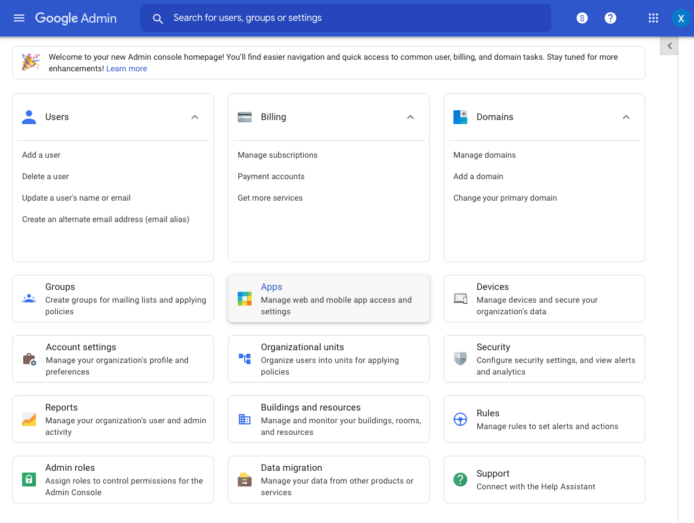
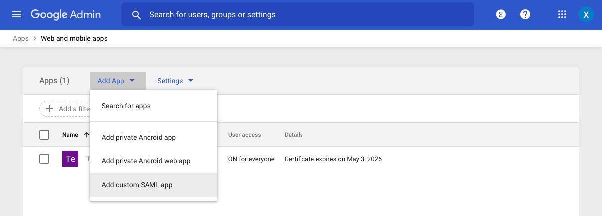
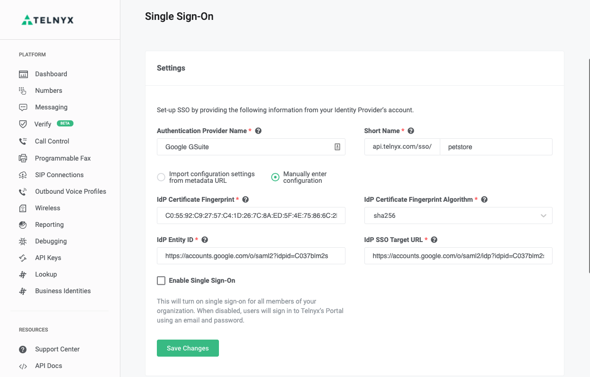

GSuite SSO Integration With Telnyx | Telnyx Help Center

[Skip to main content](#main-content)

# GSuite SSO Integration With Telnyx

Learn how to set up Auth0 as a SAML Identity Provider so that we can utilize Telnyx's Single Sign-On feature.

C

Written by Customer Success

May 20, 2026

Table of contents

[Jump to Instructions](#h_8bdd96afc4)

[GSuite](https://workspace.google.com/) is a collection of business, productivity, collaboration, and education software developed and powered by Google.It is one of the many SAML providers that Telnyx supports for use with its SSO feature. Now learn how to set up Auth0 as a SAML Identity Provider so that we can utilize Telnyx's Single Sign-On feature.

Additional resources:

* [GSuite FAQ](https://workspace.google.com/faq/)
* [GSuite support](https://workspace.google.com/support/)
* [GSuite troubleshooting](https://workspace.google.com/support/#google-workspace-trouble-shooting)
* [GSuite admin help community](https://support.google.com/a/community?hl=en)
* [GSuite learning center (Documentation)](https://support.google.com/a/users/?hl=en#topic=9917952)

|  |
| --- |
| ***Note:*** *If you experience technical difficulties while attempting to set up your GSuite SSO with Telnyx, its possible your provider is experiencing outages/maintenance. You can always [check the status of GSuite's features](https://www.google.com/appsstatus/dashboard/#hl=en&v=status).* |

---

# Instructions for setting up Google GSuite SAML Identity Provider with Telnyx

In this activity you will:

1. [Add a SAML app to GSuite](#h_0f4cffeea0)
2. [Enable SSO for your organization](#h_fdd6d61754)
3. [Configure Telnyx as your SSO provider](#h_a3a3a03459)
4. [Enable your SSO configuration on your Telnyx account](#h_7da55f3b64)

**Pre-requisites:**

* Ensure that your [Telnyx Mission Command Portal is configured properly](https://support.telnyx.com/en/articles/1176636-get-started-with-a-mission-control-account)
* (OPTIONAL) You can [configure an Organization in your Telnyx Mission Control Portal](https://portal.telnyx.com/#/app/account/organizations) before beginning. Otherwise, you'll have to do this during this activity.

**Video Walkthrough**

Setting up your Telnyx SIP portal account so you can make and receive calls:

|  |
| --- |
| ***Note:*** *Video walkthrough for GSuite/Telnyx configuration coming soon. Check back as we update our docs.* |

## 1. Add a SAML app to GSuite

In this activity,

1. Open Google GSuite admin portal, log in, and click on the **Apps** icon as shown below.

   
2. On the next page click on the **Web and mobile apps** tile.

   
3. You will be brought to the Web & Mobile apps page where you can click the **Add Apps** drop down menu and select **Add custom SAML app.**

   
4. On the next page, fill in an app name of your choice and click **Continue.**

   
5. In the step 2 section of the Google Identity Provider details page, make note of the values for SSO URL, Entity ID and SHA-256 fingerprint.

   

[Back to Top](#h_8bdd96afc4)

## 2. Enable SSO for your organization

1. Log into your Telnyx Mission Control Portal and navigate to your [Organization](https://portal.telnyx.com/#/advanced-features/members) section where you will create an Organization if you have not already.
2. Now navigate to the **[Single Sign-On](https://portal.telnyx.com/#/advanced-features/single-sign-on)** section of the portal and click the green **Enable Single Sign-On** button.

   
3. Provide the following information:

   1. **Authentication Provider Name:** Provide a value of your choice
   2. **Short Name** Provide a value of your choice, but note that the **Short Name** will be part of the SSO URLs.
   3. **Manually enter configuration:** Select this
   4. **IdP Certificate Fingerprint**: Enter the SHA-256 fingerprint that you copied from GSuite.
   5. **IdP Certificate Fingerprint Algorithm**: Select *sha256*.
   6. **IdP Entity ID:** Enter the Entity ID that you copied from GSuite.
   7. **IdP SSO Target URL:** Enter the SSO URL that you copied from GSuite.

      
4. Click **Save Changes**.
5. Scroll down to the **Authentication Provider Generated Config** section and take note of the values for:

   1. **Assertion Consumer Service URL**
   2. **Service Provider Entity ID**
   3. **Name Identifier Format**

      
6. Return to GSuite and click **Continue**.

[Back to Top](#h_8bdd96afc4)

## 3. Configure Telnyx as the SSO Provider

In this step, you'll configure Telnyx to act as your SSO provider

1. On the **Service Provider Details** page, provide the following information:

   1. **ACS URL:** Use the value generated for **Assertion Consumer Service URL** on the Telnyx Mission Control Portal
   2. **Entity ID:** Use the value generated for **Service Provider Entity ID** on the Telnyx Mission Control Portal
   3. **Start URL:** Fill in the following URL: <https://portal.telnyx.com>
   4. **Name ID format**: select *EMAIL*.
   5. **Name ID:** Select *Basic Information > Primary email*.

      
2. Click **Continue** at the bottom of the page. On the next page, click **Finish**.

[Back to Top](#h_8bdd96afc4)

## 4. Enable your SSO configuration on your Telnyx account

In this section, you'll enable your SSO configuration on your Telnyx Mission Control Portal.

1. Log back into your Telnyx Mission Control Portal.
2. Check the **Enable Single-Sign-On** box.
3. Click **Save Changes**.

   

Your chosen settings are now in effect! This will send all users in your organization an email informing them that SSO is now enabled. Your users will still be able to login using username/password for the next 72 hours. After that, they will be required to use SSO.

---

## Additional Resources

Review our [getting started with guide](https://support.telnyx.com/en/articles/1176636-get-started-with-a-mission-control-account) to make sure your Telnyx Mission Control Portal account is setup correctly!

Additionally, check out:

* [GSuite FAQ](https://workspace.google.com/faq/)
* [GSuite support](https://workspace.google.com/support/)
* [GSuite troubleshooting](https://workspace.google.com/support/#google-workspace-trouble-shooting)
* [GSuite admin help community](https://support.google.com/a/community?hl=en)
* [GSuite learning center (Documentation)](https://support.google.com/a/users/?hl=en#topic=9917952)

---

---

Related Articles

[OneLogin: SAML Identity Setup](https://support.telnyx.com/en/articles/5316578-onelogin-saml-identity-setup)[Okta: SAML Identity Setup](https://support.telnyx.com/en/articles/5335562-okta-saml-identity-setup)[LastPass: SAML Identity Setup](https://support.telnyx.com/en/articles/5341506-lastpass-saml-identity-setup)[Azure AD: SAML Identity Setup](https://support.telnyx.com/en/articles/5355800-azure-ad-saml-identity-setup)[Auth0 SSO Integration With Telnyx](https://support.telnyx.com/en/articles/5355953-auth0-sso-integration-with-telnyx)

Did this answer your question?

😞😐😃

Table of contents
