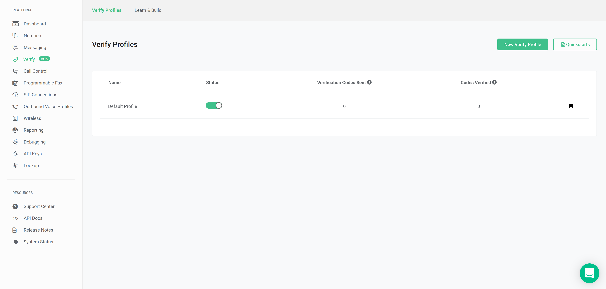
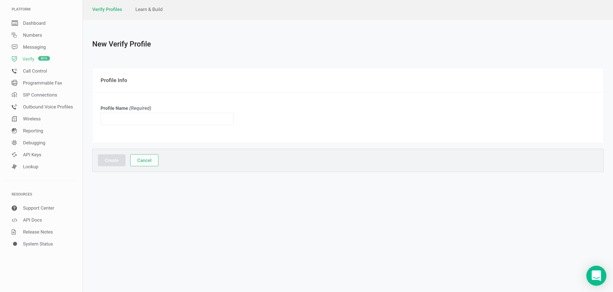
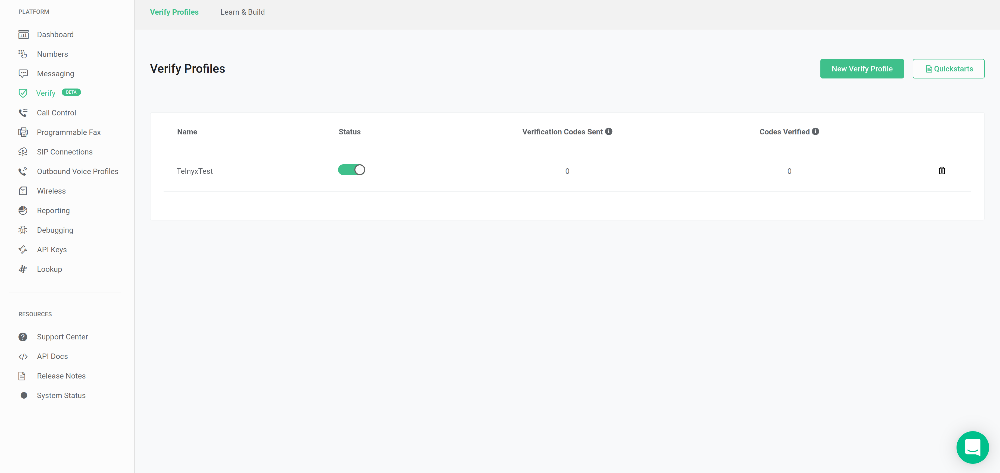
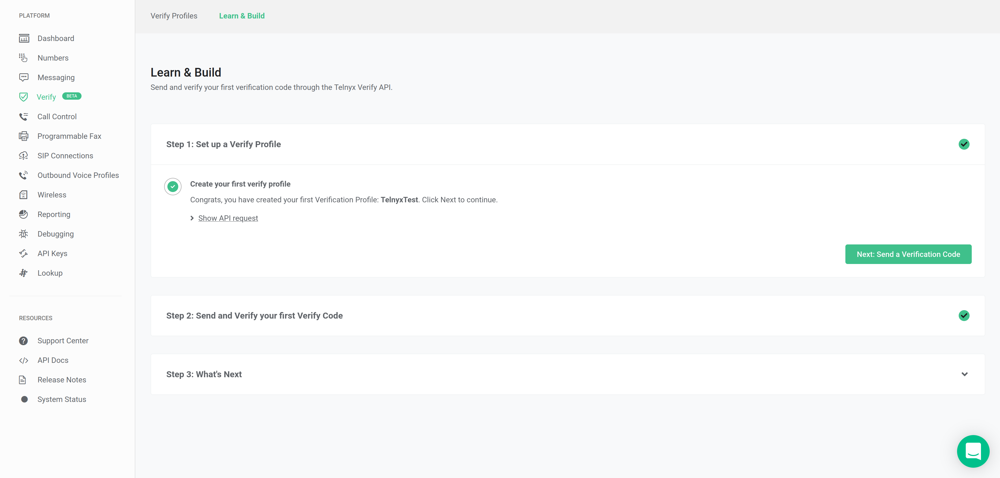
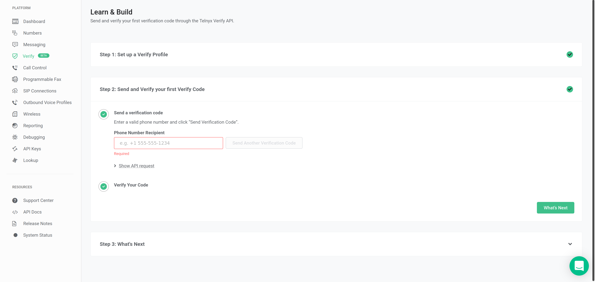
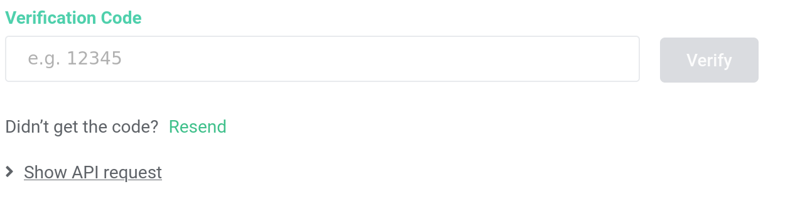

Introducing the Verify API | Telnyx Help Center

[Skip to main content](#main-content)

# Introducing the Verify API

This article will explain how to set up Verify API to utilize within the Telnyx Portal.

Written by Telnyx Engineering

June 6, 2024

Table of contents

Verify API has reduced all of the unnecessary steps for sending 2FA codes to devices, making it easier than ever to secure login requests, confirm account changes, and authenticate devices.

It takes just two steps in our [portal](https://portal.telnyx.com/#/app/verify/profiles) to set up a 2FA profile with Telnyx Verify API.

* Step 1: Create a 2FA profile that contains the configurations for sending out two factor authentication codes.
* Step 2: Create a 2FA verification using the 2FA profile ID and the end user’s phone number.

To get started, you can access our in-depth [documentation](https://developers.telnyx.com/docs/identity/verify/quickstart) here. SDK updates on Python, Ruby, Node, PHP, Java, and .NET coming soon.

---

# **Creating Verify Profile**

To begin, navigate to your Telnyx admin portal and click on the **Verify** Icon as shown below.

On the page click on **New Verify Profile** icon**.**

Enter your **Profile Name** and click **Create.** You have now made a **Verify Profile.**

## **Creating Verify API**

To begin, navigate to your Telnyx admin portal and click on the **Verify** Icon as shown below.

Now enter the tab at the top of the page, **Learn & Build** to configure the **Verify API**.

Check Step 1 to verify that the Verification Profile you have chosen is the correct profile. For example purposes we have chosen **TelnyxTest** as our Verification Profile. Once you have chosen your desired Verification Profile click **Next: Send a Verification Code** to proceed to Step 2.

You will be presented with the following field:

* Fill in the **Phone Number Receipt** with the phone number you desire.

Once completed click on the icon **Send Verification Code** to send a verification to the desired phone number.

Now enter the received Verification Code into the following field and hit **Verify**. You have now sent and verified your first verification through Telnyx Verify API!

A detailed workflow including [expected API webhook responses is shown here](https://developers.telnyx.com/docs/identity/verify/quickstart).

## **Other general information relating to this API.**

**Verify API now offers Voice and Flash Call as channels for sending 2FA codes**

The new features supported are:

* Delivering a verification code through voice call
* Delivering a verification code through flash call
* Delivering a verification code specific to the PSD2 use case
* Specifying the language for a verification code delivered through voice call or SMS

With these new features, we introduced some changes to the verification API while doing our best to maintain backward compatibility. Users who have already integrated with the API should read the release notes carefully and make the appropriate planning to accommodate the changes.

---

Related Articles

[How to Sign Up for a Telnyx account](https://support.telnyx.com/en/articles/5295540-how-to-sign-up-for-a-telnyx-account)[Telnyx Verify: 2FA made easy](https://support.telnyx.com/en/articles/5701653-telnyx-verify-2fa-made-easy)[Verified Numbers FAQ](https://support.telnyx.com/en/articles/6790265-verified-numbers-faq)[Verified Numbers](https://support.telnyx.com/en/articles/6988813-verified-numbers)[How to Verify Phone Numbers behind an IVR](https://support.telnyx.com/en/articles/12386088-how-to-verify-phone-numbers-behind-an-ivr)

Did this answer your question?

😞😐😃

Table of contents
