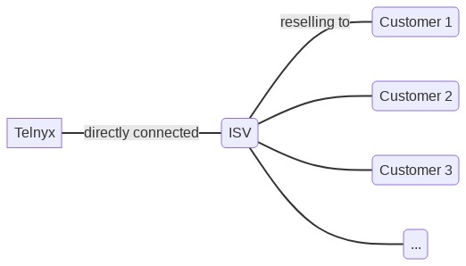

# ISVs & 10DLC

We break down how to know if you're classed as an ISV or a direct brand customer, See Telnyx guidance and requirements.

## **Independent Service Vendors (ISVs) and 10DLC**

## What is an ISV? Does my business constitute an ISV?

An **Independent Service Vendor (ISV)** is a type of business that sells products and services to other end users who are also businesses. If your end-users are a separate business entity, you are in fact an ISV.

For example, a SaaS product that sells messaging services to doctor’s offices is considered an ISV. A business that specializes in [SMS marketing](https://telnyx.com/resources/what-is-sms-marketing) for other businesses is also considered an ISV. The relationship between Telnyx, an ISV, and that ISV's customers can be represented as shown in the diagram:

## How do ISVs register for 10DLC?

If your business is an ISV, for every end-user you’re reselling to, you will need to create a separate **brand**.

After creating the brand, you will need to create campaigns so that you can assign campaign IDs to the phone numbers. It is critical that you do not share the phone numbers across multiple brands. By doing so, you will violate the terms of usage for 10DLC and potentially will get fined and blocked until the traffic is compliant.

Once you create your campaign, assign the campaign ID to a set of phone numbers. You can assign a maximum number of 49 phone numbers without requiring special permission from T-Mobile, obtained by completing their [form [PDF]](https://assets.ctfassets.net/taysl255dolk/7jAkNNeHEqfeNMF3PnukdG/603e4f4177ac79bd239fcdb87e41f900/TMUS-10DLC-Number-Pool-Request_v2.0.numbers).

In general, 10DLC campaigns for ISVs should resemble the structure shown in the diagram. Note the separation of traffic between end-users Company 1 and Company 2.

## What if I’m sharing traffic among my numbers?

To be 10DLC compliant, every number needs to be associated with a campaign, and each campaign can only be associated with one brand. This means that no two brands can be on the same number. If you are currently sharing numbers across brands, unless you have a special arrangement with the mobile network operators, you will need to update your messaging architecture such that only one brand is using any given number to send messages. **Mobile network operators will not approve ISVs for special consideration in this case.**

We recommend that you take an iterative approach to migrate this architecture end-user by end-user:

1. Create a new Messaging Profile
2. Buy or use a dedicated Phone Number for this Messaging Profile
3. Create a 10DLC Brand for the end-user.
4. Create a 10DLC Campaign.
5. Assign the 10DLC Campaign to the Phone Number

Now in your messaging application's backend code, add logic such that the end-user you’re working on starts using the Messaging Profile and Phone Number created above.

## What are my alternatives to creating brands and campaigns for each end-user?

If you'd like to keep using long-code numbers to send [A2P messages](https://telnyx.com/resources/what-is-a2p-messaging), your options are limited to the following:

1. Using one brand and one campaign across end-users, with an approved Number Pooling agreement with T-Mobile.

   1. Unless your business is a franchise, this is unlikely to be approved by T-Mobile.
2. Using one brand and one campaign across end-users, without explicit approval from mobile network operators.

   1. **This will likely result in your business receiving fines from mobile network operators, and will likely lead to mobile network operators blocking your traffic.**
3. Use [Number Lookup](https://support.telnyx.com/en/articles/4366901-your-number-lookup-guide) tools to identify and exclude T-Mobile numbers from receiving messages as part of your customers' campaigns.

**Toll-free numbers** can also be used to send A2P messages, and are not subject to 10DLC requirements. There is, however, an approval process for sending messages via Toll-free numbers as detailed in our [knowledge base](https://support.telnyx.com/en/articles/5353868-toll-free-messaging), and similar restrictions apply to using the same number across multiple end-users.

More detailed information on carrier fines can be found in our [FAQ](https://support.telnyx.com/en/articles/3679260-frequently-asked-questions-about-10dlc#h_d7a8953798).

---

Related Articles

[Frequently asked questions about 10DLC](https://support.telnyx.com/en/articles/3679260-frequently-asked-questions-about-10dlc)[Telnyx & 10DLC Compliance](https://support.telnyx.com/en/articles/5664840-telnyx-10dlc-compliance)[Register for 10DLC Messaging](https://support.telnyx.com/en/articles/6325731-register-for-10dlc-messaging)[Telnyx 10DLC Compliance Directory](https://support.telnyx.com/en/articles/6417677-telnyx-10dlc-compliance-directory)[10DLC Mock Brands and Campaigns](https://support.telnyx.com/en/articles/12812898-10dlc-mock-brands-and-campaigns)

Did this answer your question?

😞😐😃
