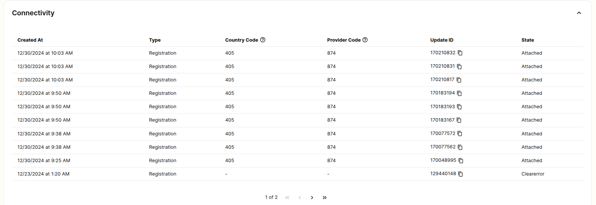

# SIM Connectivity Logs

Master the art of troubleshooting your SIM with Telnyx's guide to connectivity logs. See Telnyx guidance and requirements.

## **Connectivity Logs**

Connectivity logs can be viewed both via the Portal and API. Logs can be viewed in the Portal by drilling down into your SIM card.

There are two types of connectivity logs, `registration` and `data` logs. When SIMs attach to a network they will first authenticate with the Telnyx mobile core. Once they have been authenticated they will create a data session to run traffic. The country code (also known as an MCC) represents the country in which the SIM is connecting and the provider code (also known as the MNC) uniquely identifies the network to which the SIM is attempting to connect to. The mapping of these codes to operators can be viewed [here](https://en.wikipedia.org/wiki/Mobile_country_code).

## Troubleshooting SIM Connectivity Using Logs

There are a few patterns that may emerge in these logs that will help you troubleshoot your connectivity:

1. **No logs at all:** If there are no connectivity logs around the time that you are connecting your SIM card then the signaling from your attach attempt has not made it to the Telnyx core. If we are not seeing any signaling from your SIM there is likely a downstream issue. Please reach out to our support team and we can assist you in investigating further.
2. **Many registration attempts in succession:** If you see a lot of registration attempts in succession without a data log then it is likely that your SIM is not authenticating with the Telnyx mobile core. The 2 most common issues in this scenario are that data roaming has not been enabled on the device or the APN is not correctly set to `data00.telnyx`
3. **No logs of type data:** If there are no logs of type data then the data session is not getting created for your SIM. The issue here, similar to the above, is typically related to enabling roaming or the APN configuration. If the data session is continually not getting created please reach out to the Telnyx support team.
4. **Error logs:** If you are not seeing any logs in your connectivity logs for a SIM then the signaling is likely not making it to our mobile core. This could mean a few things. Your SIM may be trying to connect to an operator which Telnyx does not have access to, you may not have roaming enabled, or your SIM may not be in an enabled state. On most devices, a network scan can be utilized to find a network that Telnyx has access to - you can manually select the network from the scan. If you do not have roaming enabled you must enable that setting and can then reboot your device. And finally, check your SIM in the Mission Control portal. It may have been disabled due to reaching a data limit or due to a balance issue - when you run out of balance in the portal your SIMs may move to the disabled state.

---

Related Articles

[How to set up a Telnyx SIM Card](https://support.telnyx.com/en/articles/3269600-how-to-set-up-a-telnyx-sim-card)[SIM Setup and Configuration](https://support.telnyx.com/en/articles/4298710-sim-setup-and-configuration)[Using Telnyx SIM with Ubiquiti UniFi LTE Pro](https://support.telnyx.com/en/articles/10164784-using-telnyx-sim-with-ubiquiti-unifi-lte-pro)[Using Telnyx SIM with InRouter300 Series Cellular Routers](https://support.telnyx.com/en/articles/10511105-using-telnyx-sim-with-inrouter300-series-cellular-routers)

Did this answer your question?

😞😐😃
